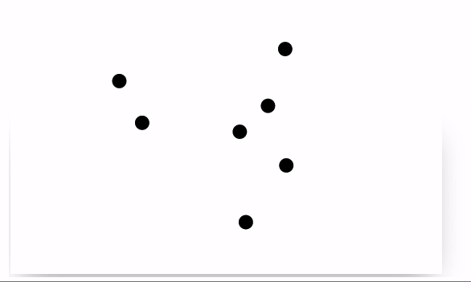
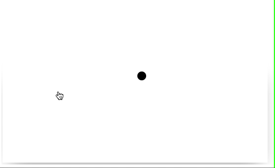

import Component from '@site/src/components/wljs-notebook-react/includes';
import Notebook from '@site/src/components/wljs-notebook-react';

<Component></Component>





Here we will try to recreate a simple example of the interactive plot, where bouncing dots are created using mouse clicks on an empty canvas.
<!--truncate-->

## Mathematica's version

Originally it was designed for Wolfram Mathematica by Wolfram Research group. Let us have a look at the original core first

```mathematica
Framed@DynamicModule[{points = {}, vel = {}}, 
  EventHandler[
  
   Graphics[{PointSize[0.1], 
	   Point[Dynamic[{vel, points} = animate[vel, points]; points]]}
	, PlotRange -> {{-1, 1}, {-1, 1}}], 
   
   "MouseDown" :> ({points, vel} = 
      addPoint[MousePosition["Graphics"], points, vel])
  ]
]
```

It uses `DynamicModule` to localize dynamic variables and a set of two functions `animate` to recalculate new positions and `addPoint`.

[Download Notebook](Balls.nb)

## WLJS Frontend version

To recreate this using WLJS Frontend we need to change the way how dynamics is processed. Firstly, we need an event-listener object to get the place where a user clicked

```mathematica
Graphics[{
	RGBColor[1,1,1],
	EventHandler[Rectangle[{-10,10},{10,-10}], {"click"->addPoint}],
	RGBColor[0,0,0], PointSize[0.1],
	Point[points // Hold]
}]
```

Here it creates a white rectangle in the background to add event-listener for clicks. And a global variable `points` is bounded to `Point` expression using `Hold`.

:::danger
`EventHandler` expression does not fully correspond to the one used in Wolfram Mathematica
:::

:::info
Dynamic binding is possible only using global variables.
:::

Then, we need an function, that adds dots to an array

```mathematica
points = {{0,0}};
vel = {RandomReal[{-1,1}]};

addPoint[xy_] := (points = Append[points, xy]; vel = Append[vel, RandomReal[{-1,1},2]]);
```

Now it should add new dots, when we click on a canvas




One thing is missing - animation. One need to update `points` symbol with a new positions and etc. The corresponding function will be

```mathematica
points = {{0,0}};
vel = {RandomReal[{-1,1}]};

addPoint[xy_] := (points = Append[points, xy]; vel = Append[vel, RandomReal[{-1,1},2]]);

animate[i_] := points = MapIndexed[(If[Max[#1//Abs] > 1.2, vel[[#2//First]] = - vel[[#2//First]]]; #1 + 0.1 vel[[#2//First]])&, points];
```

Instead of using timers, one can assign the an event handler to the transition animation, which is provided by [wljs-graphics-d3](https://github.com/JerryI/wljs-graphics-d3) library. 
:::info
IO operations between the frontend and a server cannot run at full speed giving 60FPS, therefore the data is interpolated using the time-constant provided by the option to the `Graphics` expression called `"TransitionDuration"`.
:::

To capture the transitions we need a `MiddlewareHandler`

```mathematica
Point[MiddlewareHandler[points//Hold, "end"->animate, "Threshold"->0.2]]
```

It stands in between the drawing function and an updatable symbol. Threshold value specifies when the event `animate` will be fired, i.e. `1` means after the transition and anything less means, that it will be fired a bit early. It is used to compensate the latency of the network making the animation smoother. 

Here the full code

<Notebook code="H4sIAAG2r2QAA81ZaW8bRxL9KwMGWDtY9rDvw04MJNpcgLxYOMF+WEow+hppshRJcChLWsP/fV/PkJSow5ETx45sWH1Ud1e/qnpdNZ5OpyMhQjBRJpJ0o4k0jSNOKUkkd1xo34ic0mg8Hf2w8svTNnalfdh26/L7X4t2vv65/V8ejWnNjjHy3Zs8X5fpPM+rncj1Gjqmx0Xu1fkMi0ZP4qyN/31SWl573UjKifFSEBmNJ44mS3ITpGE0RtaYJ6Pj8oP1ToQopPCEGpuITAzSPHoSlDI2Mk2tl59C6ybmkExwhDYqE2kdI6HJnDRNCMpZxjQT11qL6KKhIZAcA7SWhpIgHdZJ5q0OMrJoHtL6jo6vclz7+UnRaCtF2Li/z9Bj6D+gtjOGG8skQNMRajeWBJ0ZEamxUjYJELqi9r1o3QfOcD8mBG0CTSRSxgjME4lt0BKcNqIRQmjDHrrfqx++PVjMFrga67f82Fc22oascyAxCFw5cE1CsIxwx5okvFNJ8M2Vod7VYX6TZ7jch0JgBfZpsiGU4h/pU4SJG0okU8ppqRm3+jEQbK71USFATNmQnCI2Wg/z5ATzBHgsl1q7YH0T/AaCa1Vwt99E4cfFDBwxWpZ+d+3tTWx8xCE80BIbCsdprggTvDhfSjrHP+INjw5S0EGTo4CtVYRb6mhxbyoJAldJbZLzOXzEe8dguJbMECGkBZMJSqxRnjSG5ewSFVbRj+4CdMx6bTdOQMvQQ26g4fNKNmBaAZ7PnBMnrCGIVAomjQlW+ohw0MaHaKMjwgs8MDJk4iPVJKUsoYcFNo8ihT8LDidM9llYEIOHm0ZYytuGw09E0DzkDBb/iHAwa0UOeLS8pghCYyngsI4kBwKW/NFR8WfBwWwGPShFMlcgMLgH8cI4Am0Fj05xEPmHwPGyTWmWL/wq3xu7t0GCBnmeek245xYZQEMa6hG2zgmCV50Trhu89TzHqBC2Ny7xy+kqd6fYEKO0dlvEtZSOUyQHSjIQcUZ6YbUqiDulkxSaU/E5EUc4qqATMrAIZ0AqAL4IHEmC9kHR4F3iH4T4Dtv7ob+F+A3AgzFSOCtJKDBLB5V8Sop4mhubVPLJFMH3A140MBmJAMOrh9cGPtTERILxeBMzEiBtYdPkPyfilnlpuXZENRqexZE9BhARsdKUdM4mzX9fyH8o4siQqIkgYCEZkhKmDXFZGsDeeG6MNiIj6X0Qcb7Beze78vOuXbeL+S9Xy9yfcNjOs1/hMveK/eN85ctviMqSwkAINlY2xkzwWCEPt86RwBIeyyZb523K4fNGi1SUUp4pMcaDPzWHbyXkF7ZUCywEJBwA5xPYjokkjUCZYqkqWQUyPeTwmqCWytQoh9C1n9h2DW1M8shxkNLiKWsEbKcMI4p7pqNimAqf03bZOM+8iiSpkhH6IIhLSEV54TlrBLVRfhLbNdZbZlB5cYcaTBoPoHKAIj5n5OgGKcsntR2kpqPvV4v5+rt5Olhlv84HeYb6Y/Tkqw6gQ7SKM991Xx+NIibIBSy4zKuqKWtwKzJfpHw0qqpufTXLkFosfWzXV88q9vxo9OJoXuHnq9S+2W2zXiyutymrSZfX63Z+0iEfKQd215sX2a7q/yWr9uR0jZNiP7fOqV370B/Z+FkHHV6Uo6rhxO3P3ZMxsNNrTzKcr9c3bhvW81vaLWf+CuevgXSZ78Xfq8/dQ/qDujcn1Zs2X3y7uIQwrWjFNP5iK79qPTmFS+V5UXd1XpBt2tmsoH++WuGY3jcxenk2mxc1T9fr5bPJ5OLior4Q9WJ1MuGgqQnOKKpt7pJW/uQ1hl6//rlYKf0Enb/1XSbZu/PZr4RW1xLt+T9fLRos3hr0ok3rU5hTLS+fV6e5WGHbi0WZZ9XqJPinSo0rJcaVNOOK1uLLa+vfC8LSr0+rhO1fyorxGumo/beoFceHiwNZ8ZoLS3mlakVRu1asVtJwUekiaCzmhZWKHTJWa4tRq4VQB9hHGFWZukSSLduWrq2VsJxXg6yrmdBaHW53YqLWqJAPdifJWipuK2glaqN5aQzq/QcX+mpS9H7IsAX1+zxrMvjK4J83fm656gSuuSdzNB/G8PsPBdAjnbQcckv9Dw+fR0fHewINud/D0dOenVS9S2IpU9hncMltr1tFNCcXs187UgirK0aZYMe6D4nJ++zze0gB0Vou8yeQAkcYyIdIYavQX4gf7B4/9L0/yg/bI9bl/WoWq7NnVRf9LD/lNS0bDASia8qNkAh0UIaRB7rmhkm77fekwRD6ti7Dpa+RZrNCDEyCChjeVUtFJWvLBZcH6EsOeVlrJMKgBFordKTT1G073DIOwikdUVvFVC/Wbw8WA8uArbQo7QMHZrHGbcaRaqi+DfJxhY1Q15Y1RjrKwUoU36gKzzmt7SGvHTWgrs30AcfvosR2Oa+VwnfofmuQnWC0qAO9sI4J04+DOvGtqazZqLnp7+6w628uWGtuXEFjc/saxZlkW3QOVS0cVwXNHr1CnL0uBV1nBCgbXElvor9nnd9i0d8k0ftI8waHbQlzQ6ZH8/LnDpVtwnPLovCktrgSPhMbJIiZOBZQh3p8ovZRa3w1p55GPAvU7DPTLWWW+7nS0iNqSsZ7zcfXQ1VxX3RObtHioxUhhLTz5TlSogLo+4h7tvApr8gMmWF1o01apK796nuI/3T1QZqkPGvP9un1duvaNJvE8kWf6H7TdYvY9knpzby33dSpjzh+P9ft2pOS3SLlvlwu8K2Z8WZfoFB1L9Cjtz+X/BofotEYUvfq6+rtWxQB7949P5rjs3zpv/LztDh7lf1s+rZ8AH93XCaP5nhi+qpgenn1+rh69nX1dLfHN/CxeZoO/XF1eXX8vBp228ygM67ubDxGtg+Wm/t5e4a8fNoO++62femXP81Tvsxp+vSnZvrSX06/YJPJN6E7rl4gbvm4nDKdfsEnk+/bVbc+PsYqcmcQ2nzBqr+DldmduS//Nt4ceNzfclvATYtN3w6G3VZM0039Noz2NdyPuNMsr6a7+q1crdRt78Zvh4Lt3fEY+4z6Uu1oRF5sYcT4rd035dgwuivJpn1FtnGxwQDXNdn2+OEGk0mpyyA7Aub9WQOwZWRXZpXxvs4qO747mveTe1VWkThC0VnKrKPR/vy2vCoyqK/2nSuetn0Zt2vdnAQxAK/B9zbNm9PzfDlMDo29lav8ZljXN/anFsvufVE2pBWQ6Nlnv7ZMbVcqnkFh5Dxn7Wq1uFVYdmvgNwQTgN78f+P/AcKkhTDdHQAA" name="expo-4312f">expo-4312f</Notebook>

Links
- [Download Notebook](Balls.wl)

Thanks for reading! See you next time
