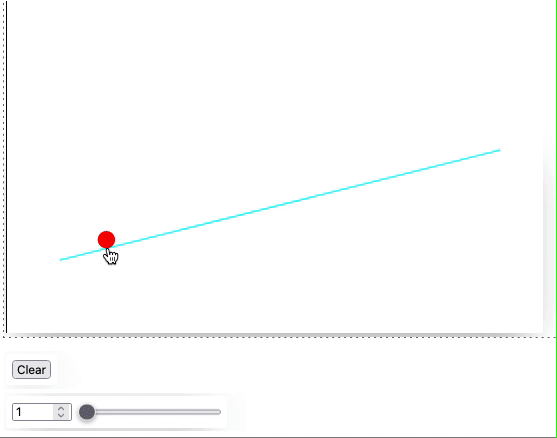

import Component from '@site/src/components/wljs-notebook-react/includes';
import Notebook from '@site/src/components/wljs-notebook-react';

<Component></Component>





Here we will try to recreate a simple example of the interactive curves fitting based on `Fit` function provided by Wolfram Mathematica.
<!--truncate-->

## WLJS Frontend version

For the demonstration one can input the data points by clicking on an empty canvas

```mathematica
RGBColor[1,1,1],
  EventHandler[Rectangle[{-10,10}, {10,-10}], {"click"->Function[xy, 
    points = Append[points, xy]; 
    fit = lineFit[points]
]}],
...
```

An event listener is attached to the rectangle at the background. Each time user clicks on it, it will append a new point to the array and recalculate fitter curve using defined `lineFit` function.

To draw our points and fitted curve, we need one line of a code

```mathematica
PointSize[0.1],
  Red, Point[points//Hold], Cyan, Line[fit//Hold]
```

Then, let us define the fitting function

```mathematica
fit = {};
points = {};
order = 1;

lineFit[points_] := With[{o = Table[CM6Superscript[x, i], {i, 0, order}]},
  With[{f = Fit[points, o, x]}, 
    Table[{x, f}, {x, -1,1, 0.025}]
  ]
]
```

Basically,  it is done. However one can make it more interesting if we consider a control slider for changing the order of a curve as well as a clear button

*in a new cell*
```mathematica
Function[data, points = {}; fit = {};] // InputButton["Clear"]
Function[data, order = data; fit = lineFit[points]] // InputRange[1, 5, 1]
```

:::info
A shortcut to assign a `handler` function to an event-object 
```mathematica
handler // EventObject[...]
```
is an equivalent of
```mathematica
EventHandler[EventObject[...], handler]
```
:::

Here the full code

<Notebook code="H4sIAHIRsWQAA+1ba28bNxb9KwPvh3QBccz3I2kDNEZfQLoo0kUXWNkIOCTHnlYeCdI4ttfIf9/DGUm23MRVkjpOWtmJNeRcXl5eXh7eMxyNx+O9YJzVzipScVMRyTkjlTKJCOYr5oLxydV7o/Hed3M/O2nCIl8/bxZd/nzx3bOD6WQ63xux/HuEqm9epbbL91ObUA+ZFDrfHk/SdUPC6IjRLD2UUUTVUa54cZYF9x6FSRN+e5SvqNSVr4UnifKaSCYjcYprGBlo0MzSyodHe0PjG+bQUd/BT9Om7U39fjqJUDfL5cVtcZgzWP+8aXs7l9J100H0hl0/TabdC4zmxmCuB7VSsS7lH9TEirtQJU84oxhBHoZ3SRPmI9dG2OQ8OntAD1eiooxjypOP2cOSeJpQrJwQzHCdTPq0PZxSJWsjNKmd4UR6XhGrFSMo2Si9EZzrh/SwjMEmrwSpKaVE1tETy+sK5sY6Jmu0i/HT9jCrRM2iDsTYqIgMFB4WAoHMWUi6ti46/5AeNobXMlpOausFkUIL4qiFw7lUNU2URs+WHu7d+XPzP2igZW/NJ+pzVQH4qkAJVwpRk6iEz40ikVFMQGAWNQ/qc+aE5IICj70hMnqLqNYOQF1LzEUKlKvPzedcxSoZLYk2HrthcIq42qEYtOQ6UFrXD7obKukDAJkTpjJWRxuI80biqhJJeCZD0J+bz6VgNTZFThJChkjJsMMzH0hQhjqKJVDXDxrn3HFOYwqEa4GYsP3uYrHZ1CZUSD+Yk/xz87lh3lIjMqJQxBHXNXGaGyI017aKRmpXPaTPA7fI9GoPg1RCzoR16K2xxNTKewv488x/bj7HUKgPlmEPRbDLvJG6SjkSkA3WQekYDXtQPBfWK18ZoioBPKeqJjZVCkWaADSmNq7+3HzOqKlChXyLK+MQ59ijXBUSQUIeaq2Ctr7PDJ+ddd20/aVJ570nl7557qs06X1zMEl+jsHfuNn7v78Za5ZUCJhJ43J65wLxSPOJNSZSpnhtKpEd1wdBJVmqPSUVVhmRrqbEC4G8RXDJDUtVLUVvQh7pyp7l5I0U/os32yCcMVoERmg0WNAyZBCtLZJhzZ2thdDRrWxI0jmvYyJBIvykpjkdBfljTNuQJLR4+8FOSZaK6A38YVWOdrAKxzFQZOTYYSWQ0/XZQW7tFKPUaIilAJMlws9RWBW00HW02ltG38cptpZVBm9iLfiMTL4GbQT9Mo4zJE/UiThMDJqP976dT9vumzYezJPv0kGaTLKOLxdYVs20LcLELxZfHe4F3CDnWKOzNC/q3Ca1kbTTmA73imLRXU4SpKYzH5ru8nHBnhzuPT1sC/x8GZtXazXddHqtJrcmi9R1TXu8IL7vcHGtPMsuiv4vmTfHJx16Cv29LsWm81XfZe0nC9jwNHdVDD2ufn7fMyrWdm1IVv2kr4Wrrr1l3WziL9F/dznLnQ7id9rz+076jhavjotXmMtn0wsI04IWTOMfVPl548lJE2Nqs7nzs+zZuplMsvfP5nN004MHai9OJ20286TrZo/398/Pz8tzUU7nx/scVGsffWTTlmOJc3/8ElUvX/6cZyn+AJuf+UUiybuzya+EFtcSzdm/XkxrNF5N6HkTuxNMp5pdPClOUp6FVSlkYx4X8+PKf6HUqFBiVEgzKmgp/nk9+290wsx3J0WE+h9lwXgpjbW/iFJxLMUDWfCSC0t5oUpFtYR3SiUNF4XOgsbivrBSseeMldqi1moh1AH0gCYUppSaQWhZtKUSlvNikHUlE1qr5ytNTJSaKXWw7kmWUnFbwCpRYmXmi8G8/2JAX+5nu982sdnrb4qs/SFWhvi88XMrVPcRmhsyh+1Qh88PWkBbBmnu5Jb57758tl4ddyw0H+PbV09zelz0IYmmTEHPEJKr0mIecLl/Pvl1QTJgLfKk7ENj2S+J/bvm531AAas1D+YeQIFjGci3gcLKoAYdLW9+QlBhN6CiL30oVKy66Oa+XdTT+enjYhH8JH3BS5oVDFiiS8qR3GPNAz2MPNAlUgtpV+UeP7DXo5yrc1lrQE7GCCaBCoyWHNt3IUuLLVseoAyKADQotcFvgbJCQTpN3aqAhJ0De3JBlFYx1Yv16gFoABwAlxb5+sABZKxxy3pBreqvgUMuA5PiMB2oIx3lACiKp3cZ8pzW9jkvHTVAseXtA47PbMSqOS/xrAR4llUD9wSj2RzYhXZMmL4eKKrAb67NXJbXY1iXlwMswYxc9sZy9KUxYKkr7zxXpXBcZW/23ssY2tuSveuMAHoDNulN72/Mzh8B6h/i6Zvw8wacrbBziauHbf79HaotV+oKUBFJTQ4lH1NK0SFtc9ojf04GPKzSWAbGUx6MwNP3jbC9ZcxsM22aeayaTG+uofm6quhF1qs4L7DjW2C5tU2EkKadnSFRyr69C84nU+ibkwnYR3HjmjRxknHqtjv79ifzd7Ikpklzugm6t6+uZ2mZbj5FAjve+3qxmIbG54qbKXiDp8X42Kb7zfR80Ry3fdOTS7j3DNRvQYRPIj/fvyGWYbwX6324eS/6DswbF+VpPGz/UXzb9FtAAbR9lRaHbbrwp7PJLYXhpJkMNi+vbt5EBKwS9tXlzdvQONwcLjZaztOroV1/sXlrOlvc5cMhziCRt5INovkoNouc5A72Yps7bebz6S2is+jAEQYfIVBWROYtFGKV0Szn+l0WxfSswxT0e/hda8IonRzOEQj34FgSDwOJBUCC0klnbQAJBAcmZNC2sSjWwbylimUwrxFlwJMtonUb/R8WrcPo3hKuf4lY7ef87cF66ue/xek5JN87VHdsd8d2d2x3x3Z3bPfTZbufED7sKO6O4n7mFDfWlgWNM3RqOViUx0EIDgnw8lAyLFK4y9DqT6O4d+Xw2xjycXjtlpbcF6/dpvv747U4eCy+Kq5ePzlshxPLVWk6hxNRQI6L8MrOBJ8YDzIvj4rHXxX/abqT8dUUMv/OEzw++FH/fIZQW4R5M+vGF6OiORoVVw3AcFT06l4fvR5lTw0ta7S81gmRUXEBgaUvB51X0FKjLn/mk84MrHjR5vVRFsIf/DtsV0fI46tcuzpsHS/PjnNdf0j2vW8RDfPx+uR4fDWcGGf9w1nx62wwQjufEh/ukaffnrX9PI4vLld2rb30NZZVG9fWX1wePVmKDD7ddNlgMPTnz/WB8rg/T+6tTnE01C8b7O/no2HYc3Dp21GRz4vHULysPmxh9PqMmDy9wlBGLA+k/3x99JdheX/KI4kdz9vxvB3P2/G8Hc/b8bwdz9vxvL8Bz4ucVywoUieOrwioSpLK4U3qSkVXK+0wWZtL+N543haGfCSet50l98bztuj+/njemsnkmtE1iwHXW/IVXB0V+/vFD1nL8DLk+HCvf+vxcA+E45aGFT/MpZWKW5TnWl3PUkDICiAn23GTj3xciq/VOC1xXp5qjrNIyiOxNd6BZyYwfF0PsBzzA467jku3VPHex6Xb6L/H49LV1HxzkcJZn+Yg9Ld5cRgrYxfNHzeaI6ssZXjxg5kaXwXSFq9PO7y9L/Lr7TaJwKn+g2jeUsV7R/M2+j92NG/z1vnfNJqPjv4PALXM/xs+AAA=" name="hydraulics-3ae3e">hydraulics-3ae3e</Notebook>

Links
- [Download Notebook](CurvesFit.wl)

Thanks for reading! See you next time
