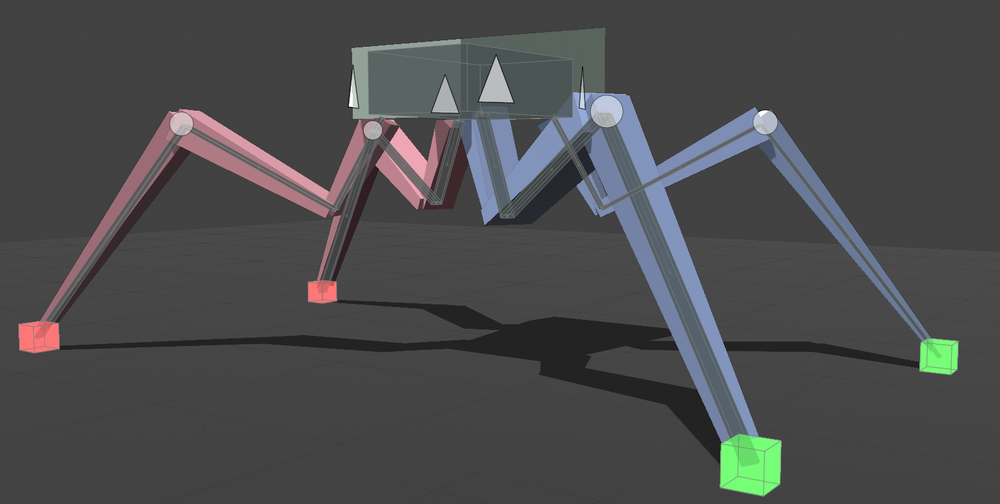
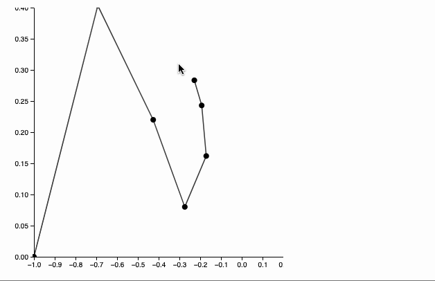

# Simples example of the Planar Inverse Kinematics

<!--truncate-->

import { WLJSHTML, WLJSEditor, WLJSStore } from "@site/src/components/wljs-reactcells";

<WLJSHTML>{`%3Csmall%3Esrc.%20%5BFOUNDRY%5D%28https%3A%2F%2Flearn.foundry.com%2Fmodo%2Fcontent%2Fhelp%2Fpages%2Fanimation%2Fmodifiers%2Fplanar_ik.html%29%3C%2Fsmall%3E`}</WLJSHTML>

<WLJSStore json={require('./attachments/0c14ab53-e20b-4724-a7bc-e401a1483a87.txt').default} notebook={require('./attachments/notebook-0c1.wln').default}/>

*the actual implemntation is not well-optimized for Wolfram Language, but serves a good purpose for the demonstration*

Define a bunch of points connect them into a segmented line with fixed length

<WLJSEditor display={"codemirror"} nid={"0c14ab53-e20b-4724-a7bc-e401a1483a87"} id={"49eed1a8-06d8-466e-8f04-099a7c9b6ce8"} type={"Input"} opts={{"Hidden":false,"init":false}} >{`chain%20%3D%20Table%5BExp%5B-%CF%95%5D%7B-Cos%5B%CF%95%5D%2C%20Sin%5B%CF%95%5D%7D%2C%20%7B%CF%95%2C%200%2C%20%CF%80%20-%20%CF%80%2F7%2C%20%CF%80%2F7.0%7D%5D%3B%0AGraphics%5B%7B%0A%20%20%20%20Line%5Bchain%20%2F%2F%20Offload%5D%2C%20Black%2C%20%0A%20%20%20%20PointSize%5B0.04%5D%2C%20Point%5Bchain%20%2F%2F%20Offload%5D%2C%20Red%2C%0A%20%20%20%20EventHandler%5BGraphics%60Canvas%5B%5D%2C%20%7B%0A%20%20%20%20%20%20%22mousemove%22%20-%3E%20handler%0A%20%20%20%20%7D%5D%0A%20%20%7D%2C%0A%20%20Axes-%3ETrue%2C%20PlotRange-%3E%7B%7B-1%2C0.2%7D%2C%20%7B0%2C0.4%7D%7D%2C%20ImageSize-%3E400%0A%5D`}</WLJSEditor>

*Dynamics is not available on this page. Download this notebook and run it*

## FABRIK Solver
Original paper published in 2011

<WLJSHTML>{`%3Ciframe%20class%3D%22rounded-md%20border-0%20mt-4%22%20style%3D%22width%3A600px%3B%20height%3A400px%22%20src%3D%22http%3A%2F%2Fwww.andreasaristidou.com%2Fpublications%2Fpapers%2FFABRIK.pdf%22%3E%3C%2Fiframe%3E`}</WLJSHTML>

For the demonstration purposes, we implemented this in the simples possible way.

<WLJSEditor display={"codemirror"} nid={"0c14ab53-e20b-4724-a7bc-e401a1483a87"} id={"7cdbf8d7-ea3d-4c53-9d4e-1094283dd4e7"} type={"Input"} opts={{"InitGroup":true}} >{`handler%20%3D%20Function%5Btarget%2C%0A%20%20Module%5B%7Bbuffer%20%3D%20chain%2C%20origin%20%3D%20%7B-1%2C0%7D%2C%20prev%20%3D%20chain%2C%20lengths%20%3D%20Norm%20%2F%40%20%28chain%20%2F%2F%20Reverse%20%2F%2F%20Differences%29%20%2F%2F%20Reverse%7D%2C%0A%20%20%20%20buffer%20%3D%20Table%5BWith%5B%7Bp%20%3D%20chain%5B%5B-i%5D%5D%7D%2C%0A%20%20%20%20%20%20If%5Bi%20%3D%3D%3D%201%2C%0A%20%20%20%20%20%20%20%20prev%20%3D%20target%3B%0A%20%20%20%20%20%20%20%20target%0A%20%20%20%20%20%20%2C%0A%20%20%20%20%0A%20%20%20%20%20%20%20%20prev%20%3D%20prev%20-%20Normalize%5B%28prev%20-%20p%29%5D%20lengths%5B%5B1-i%5D%5D%3B%0A%20%20%20%20%20%20%20%20prev%20%0A%20%20%20%20%20%20%5D%0A%20%20%20%20%5D%20%20%20%0A%20%20%20%20%2C%20%7Bi%2C%20chain%20%2F%2F%20Length%7D%5D%20%2F%2F%20Reverse%3B%0A%0A%20%20%20%20buffer%20%3D%20Table%5BWith%5B%7Bp%20%3D%20buffer%5B%5Bi%5D%5D%7D%2C%0A%20%20%20%20%20%20If%5Bi%20%3D%3D%3D%201%2C%0A%20%20%20%20%20%20%20%20prev%20%3D%20origin%3B%0A%20%20%20%20%20%20%20%20origin%0A%20%20%20%20%20%20%2C%0A%20%20%20%20%0A%20%20%20%20%20%20%20%20prev%20%3D%20prev%20-%20Normalize%5B%28prev%20-%20p%29%5D%20lengths%5B%5Bi-1%5D%5D%3B%0A%20%20%20%20%20%20%20%20prev%20%0A%20%20%20%20%20%20%5D%0A%20%20%20%20%5D%0A%20%20%20%20%2C%20%7Bi%2C%20chain%20%2F%2F%20Length%7D%5D%3B%0A%0A%20%20%20%20chain%20%3D%20buffer%3B%0A%20%20%20%5D%0A%5D%3B`}</WLJSEditor>