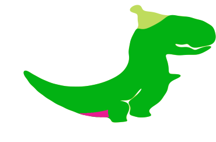

# Image tracing and animation

The notebook focuses on tracing and animating the contours of GIF images using WLJS Notebook.

Firstly, import as a usual file

```mathematica @
imgs = (*BB[*)(* Drag and drop your gif here *)(*,*)(*"1:eJxTTMoPSmNhYGAo5gcSAUX5ZZkpqSn+BSWZ+XnFaYwgCS4g4Zyfm5uaV+KUXxEMUqxsbm6exgSSBPGCSnNSg9mAjOCSosy8dLBYSFFpKpoKkDkeqYkpEFXBILO1sCgJSczMQVYCAOFrJEU="*)(*]BB*);
```

Now in `imgs` we have a sequence of images. In our case this is a dinosaur 


*the source is unknown, sorry*

<!--truncate-->

To trace all contours we adapt a method from @anderstood on StackExchange

A custom function `trace[ii_]` is defined to process each image frame. 

```mathematica
trace[ii_] :=
Module[{img, pts, z, m, n, cn, f, g}, 
  img = ii;
  img = Binarize[img~ColorConvert~"Grayscale"~ImageResize~500~Blur~3];
  pts = DeleteDuplicates@Cases[Normal@ListContourPlot[Reverse@ImageData[img], 
       Contours -> {0.5}], _Line, -1][[1, 1]];

  z = pts[[All, 1]] + I*pts[[All, 2]];
  m = 50;
  n = Length@z;
  cn = 1/n*Table[Sum[z[[k]]*Exp[-I*i*k*2 Pi/n], {k, 1, n}], {i, -m, m}];
{f[t_], g[t_]} = {Re@#, Im@#} &@
    Sum[cn[[i + m + 1]]*Exp[I*i*t], {i, -m, m}] // ComplexExpand;
  Function[t, {f[t], g[t]}]
]
```

In a nutshell it does:

- Binarizes and processes the image.
- Extracts contour points using the data from `ListContourPlot` (kinda a hack 😃).
- Performs Fourier analysis to create a smooth curve representation.
- Returns a parameterized function of the contour.

## Frame processing

Then we need to process each frame like that

```mathematica
frames = Map[With[{f = trace[#]}, 
  Table[f[p], {p,0,2Pi,0.01}]
]&, imgs];
```
*it might take a while*

The processed frames are animated with a slider as follows

```mathematica
currentFrame = frames // First;

EventHandler[InputRange[1,Length[imgs], 1, 1], Function[v, 
	currentFrame = frames[[v]]
]]

Graphics[Line[currentFrame // Offload]]
```


However we can go further and analyze each color plotting a separate curve for it.

## Color separation
To find dominant colors use can follows this approach

```mathematica
img = imgs // First;

(* Convert Image Data to a List of Colors *)
colors = ImageData[ImageResize[img, 200], "Byte"];
colorsList = Flatten[colors, 1];

(* Cluster Colors Using KMeans *)
clusters = FindClusters[colorsList, 4, Method -> "KMeans"];

(* Extract and Visualize Dominant Colors *)
dominantColors = Map[Mean, clusters];
dominantColors = Select[dominantColors, Norm[#[[;;3]]]>10 &];
dominantColorsRGB = RGBColor /@ (dominantColors / 255)
```

as a result we have

```mathematica @
{(*VB[*)(RGBColor[{116204/126735, 124/1207, 72346/126735, 42004/42245}])(*,*)(*"1:eJxTTMoPSmNkYGAoZgESHvk5KRCeGJAIcndyzs/JLwouTyxJzghJzS3ISSxJhchzIMmnscD0+2QWlxTZKJU89Qx/a1/0ZMq5uOM+u+yLOvoO8ca4PLIv6jo5T9Hl4nt7AA1hJUk="*)(*]VB*),(*VB[*)(RGBColor[{1339/159154, 277964/397885, 35905/477462, 2365267/2387310}])(*,*)(*"1:eJxTTMoPSmNkYGAoZgESHvk5KRCeGJAIcndyzs/JLwouTyxJzghJzS3ISSxJhchzIMmnscD0+2QWlxT5pez1+GrVaF9kfnJb/beoZ/ZFE7K2LfZ02GxftJy9VDVmy3t7AA3lJL8="*)(*]VB*),(*VB[*)(RGBColor[{19736/26295, 128738/149005, 163801/447015, 443111/447015}])(*,*)(*"1:eJxTTMoPSmNkYGAoZgESHvk5KRCeGJAIcndyzs/JLwouTyxJzghJzS3ISSxJhchzIMmnscD0+2QWlxSFXeRLmsHywr6Is/vVmkNLX9sX/V+y9fOi4uv2RYeX1veU7HhvDwAkIidz"*)(*]VB*)}
```

On the next step we will convolve those colors with an image

```mathematica
Clamp[val_List, max_] := Clamp[val//First, max]
Clamp[val_, max_] := If[val > 0.5, 1, 0] max 

colorSeparate[img_, colors_] := Table[Map[
  Map[
    Function[pixel, 
      Clamp[i[[;;3]] . pixel[[;;3]] / 255.0, 1]
    ]
  , #]&
, img // ImageData] // Image, {i, colors}]
```

```mathematica
ImageResize[#, 100] &/@ colorSeparate[img, dominantColors] 
```


### Animating each color channel separately
Firstly we will apply curve extracting on each channel of the frame

```mathematica
framesColored = Table[Map[With[{f = trace[#]}, 
  Table[f[p], {p,0,2Pi,0.01}]
]&, colorSeparate[frame, dominantColors] ], {frame, imgs}];
```

```mathematica
currentFrameColored = framesColored // First;

EventHandler[InputRange[1,Length[imgs], 1, 1], Function[v, currentFrameColored = framesColored[[v]]]]

Graphics[
  Table[
    With[{i=i},
      {dominantColorsRGB[[i]], Polygon[currentFrameColored[[i]] // Offload]}
    ]
  , {i, Length[dominantColorsRGB]}] // Reverse
]
```

Here we use `Polygon` instead of `Line` to get filling for each closed curve. An algorithm did not work well for all colors and we effectively have only two instead of 3



Try it on your images!

[__Image tracing.wln__](./Image%20tracing.wln)

