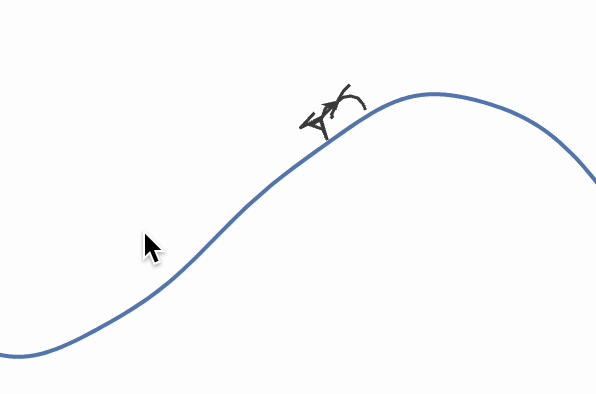
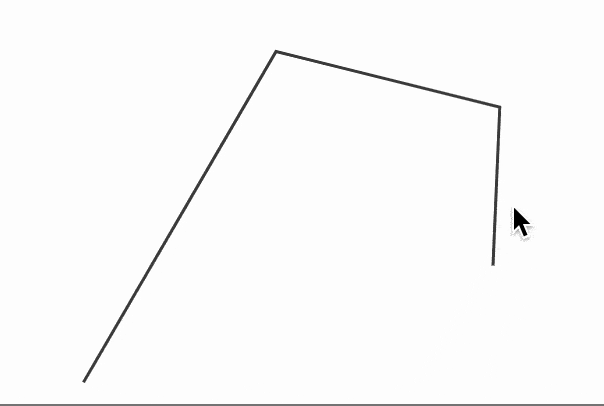

# Procedural spider animation



I have been always amazed by a fascinating procedural animation using in some games like *Rain World*. The key feature there is that you define sort of a target points for a model and a clever algorithm figures out the way how each bone or "leg" will move to achieve the goal. This is a common problem of kinematics. Let's start with the simplest approach

<!--truncate-->
## Cycloid
If we roll a ball over a plane surface with attached marker at the side it will produce a well-known curve

```mathematica
ParametricPlot[{x - Sin[x], 1 - Cos[x]}, {x,0,6Pi}]
```

<Wl>{`ParametricPlot[{x - Sin[x], 1 - Cos[x]}, {x,0,6Pi}]`}</Wl>

Imagine it it were legs, which would follow multiple cycloids with a little offset. But firstly, we should get rid of a plane ground and turn it into something more interesting

```mathematica @
land[x_] := 5.0 + (*FB[*)((Sin[x])(*,*)/(*,*)(10.0))(*]FB*) + Cos[(*FB[*)((x)(*,*)/(*,*)(10.0))(*]FB*)] x + (*FB[*)(((*SpB[*)Power[x(*|*),(*|*)2](*]SpB*))(*,*)/(*,*)(100.0))(*]FB*)

ParametricPlot[{x, land[x]}, {x,-20,80}]
```

<Wl>{`ParametricPlot[{x, 5.0 + (*FB[*)((Sin[x])(*,*)/(*,*)(10.0))(*]FB*) + Cos[(*FB[*)((x)(*,*)/(*,*)(10.0))(*]FB*)] x + (*FB[*)(((*SpB[*)Power[x(*|*),(*|*)2](*]SpB*))(*,*)/(*,*)(100.0))(*]FB*)}, {x,-20,80}]`}</Wl>

To project cycloid onto `land` curve, we could not find anything better, that to offset `y` axis

```mathematica @
ParametricPlot[
  With[{b = land[x]}, {
    {x, b},
    {(*FB[*)(((4x - Sin[4x]))(*,*)/(*,*)(4))(*]FB*), b + 1 - Cos[4x]}
  }
] // Evaluate, {x,-20,80}]
```

<Wl>{`ListLinePlot[Table[With[{b = 5.0 + ((Sin[x])/(10.0)) + Cos[((x)/(10.0))] x + ((Power[x,2])/(100.0))}, {{x, b},{(((4x - Sin[4x]))/(4)), b + 1 - Cos[4x]}}] , {x,-20,80, 0.2}]//Transpose]`}</Wl>

*try to zoom in with a mouse*

## FABRIK Inverse Kinematics
Legs of a spider are not straight lines, and consists of small segments needed to be animated separately. For this case there is a nice heuristic algorithm [FABRIK](http://www.andreasaristidou.com/FABRIK.html).

I do not claim that my implementation is most optimized, but it does solve a problem

```mathematica
ClearAll[cached];
cached[expr_] := cached[expr] = expr;
SetAttributes[cached, HoldAll]

SetAttributes[fabrik, HoldFirst]

fabrik[chain_, target_, origin_] := Module[{
	buffer, prev, 
	lengths = cached[Norm /@ (chain // Reverse // Differences) // Reverse]
},
  buffer = Table[With[{p = chain[[-i]]},
    If[i === 1,
      prev = target;
      target
    ,
    
      prev = prev - Normalize[(prev - p)] lengths[[1-i]];
      prev 
    ]
  ], {i, chain // Length}] // Reverse;

  chain = Table[With[{p = buffer[[i]]},
    If[i === 1,
      prev = origin;
      origin
    ,
    
      prev = prev - Normalize[(prev - p)] lengths[[i-1]];
      prev 
    ]
  ], {i, chain // Length}];
]
```

Let us see how it works in the following example

```mathematica
chain = {{0,0}, {0.5,1}, {1,1}, {1,0.5}};

EventHandler[Graphics[{
  Line[chain // Offload]
}], {"mousemove" -> Function[xy,
    fabrik[chain, xy, {0,0}]
]}]
```



The next idea will be to assign the target position of each leg to a cycloid.

## Modelling legs
We can isolate our a leg into a independent component, hence it would be easier to combine them together

```mathematica @
leg[event_String, target_, origin_] := Module[{
  (*BB[*)(* initial leg segments *)(*,*)(*"1:eJxTTMoPSmNhYGAo5gcSAUX5ZZkpqSn+BSWZ+XnFaYwgCS4g4Zyfm5uaV+KUXxEMUqxsbm6exgSSBPGCSnNSg9mAjOCSosy8dLBYSFFpKpoKkDkeqYkpEFXBILO1sCgJSczMQVYCAOFrJEU="*)(*]BB*)
  chain = Table[k(target - origin) + origin, {k, -0.6, 1.6, 0.4}]
},
  (*BB[*)(* subscribe to an update *)(*,*)(*"1:eJxTTMoPSmNhYGAo5gcSAUX5ZZkpqSn+BSWZ+XnFaYwgCS4g4Zyfm5uaV+KUXxEMUqxsbm6exgSSBPGCSnNSg9mAjOCSosy8dLBYSFFpKpoKkDkeqYkpEFXBILO1sCgJSczMQVYCAOFrJEU="*)(*]BB*)
  With[{cloned = EventClone[event]},    
    EventHandler[cloned, Function[Null,
      fabrik[chain, target, origin]
    ]];
  ];

  Offload[chain]
]

SetAttributes[leg, HoldRest];
```

here the first argument specifies an `EventObject` identifier, that will be called later on to update all legs segments in the animation loop.

Now we can combine multiple legs, which target's variables will follows cycloids with small offsets as follows

```mathematica @
getTarget[xoffset_, x_] := With[{b = land[x + xoffset]}, 
  {
    (*FB[*)(((4(x + xoffset) - Sin[4(x + xoffset)]))(*,*)/(*,*)(4))(*]FB*), 
    b + 1 - Cos[4(x + xoffset)]
  }
]
```

```mathematica @
Module[{t = 4.0 (*BB[*)(*x-position of a spider*)(*,*)(*"1:eJxTTMoPSmNhYGAo5gcSAUX5ZZkpqSn+BSWZ+XnFaYwgCS4g4Zyfm5uaV+KUXxEMUqxsbm6exgSSBPGCSnNSg9mAjOCSosy8dLBYSFFpKpoKkDkeqYkpEFXBILO1sCgJSczMQVYCAOFrJEU="*)(*]BB*), ev = CreateUUID[]},
 {
  Graphics[{
    Line[leg[ev, {t,1 + land[t]}, getTarget[-0.5, t]]], 
    Line[leg[ev, {t,1 + land[t]}, getTarget[+0.25, t]]],
    Line[leg[ev, {t,1 + land[t]}, getTarget[0, t]]],    
    Line[leg[ev, {t,1 + land[t]}, getTarget[-0.25, t]]], 
    Line[leg[ev, {t,1 + land[t]}, getTarget[+0.5, t]]],    
    
    (*BB[*)(* ground curve *)(*,*)(*"1:eJxTTMoPSmNhYGAo5gcSAUX5ZZkpqSn+BSWZ+XnFaYwgCS4g4Zyfm5uaV+KUXxEMUqxsbm6exgSSBPGCSnNSg9mAjOCSosy8dLBYSFFpKpoKkDkeqYkpEFXBILO1sCgJSczMQVYCAOFrJEU="*)(*]BB*)
    Plot[land[x], {x,0,20}]//First 
  }],

  EventHandler[InputRange[0,10, 0.1], Function[value, t = value; EventFire[ev, Null]]]
 } // Row 
]
```


## Adding controls
Slides are boring. Using `EventHandler` we can capture arrow keys and animate accordingly. However, to animate continuously we can set a timer and remove it once the target position of a spider has been reached

```mathematica @
Module[{
  t = 4.0, 
  ev = CreateUUID[], 
  target = 4.0, task = Null, 
  wake, sleep, view = {0,0}, 
  win = CurrentWindow[]
},

  (*BB[*)(* using linear interpolation animate to the target*)(*,*)(*"1:eJxTTMoPSmNhYGAo5gcSAUX5ZZkpqSn+BSWZ+XnFaYwgCS4g4Zyfm5uaV+KUXxEMUqxsbm6exgSSBPGCSnNSg9mAjOCSosy8dLBYSFFpKpoKkDkeqYkpEFXBILO1sCgJSczMQVYCAOFrJEU="*)(*]BB*)
  wake := If[task === Null, task = SetInterval[
    t = t + 0.1 (target - t);
    EventFire[ev, Null];
    
    If[Abs[t - target] < 0.01, sleep];
  , 30]];

  sleep := With[{},
    TaskRemove[task];
    task = Null;
  ];

  (*BB[*)(* animate the camera by view of the canvas *)(*,*)(*"1:eJxTTMoPSmNhYGAo5gcSAUX5ZZkpqSn+BSWZ+XnFaYwgCS4g4Zyfm5uaV+KUXxEMUqxsbm6exgSSBPGCSnNSg9mAjOCSosy8dLBYSFFpKpoKkDkeqYkpEFXBILO1sCgJSczMQVYCAOFrJEU="*)(*]BB*)
  camera := With[{center = (*FB[*)(({30,20})(*,*)/(*,*)(2))(*]FB*) + view, spider = {t, land[t]}},
    If[Norm[center - spider] > 10, 
      view = (center - spider)/2;
      FrontSubmit[ZoomAt[1, -view], MetaMarker["marked"], "Window"->win];
    ];
  ];

 
  Graphics[{
    Line[leg[ev, {t,1.5 + land[t]}, getTarget[-2 0.5, t]]], 
    Line[leg[ev, {t,1.5 + land[t]}, getTarget[+2 0.25, t]]],
    Line[leg[ev, {t,1.5 + land[t]}, getTarget[0, t]]],    
    Line[leg[ev, {t,1.5 + land[t]}, getTarget[-2 0.25, t]]], 
    Line[leg[ev, {t,1.5 + land[t]}, getTarget[+2 0.5, t]]],    

    Plot[land[x], {x,-20,80}]//First,

    MetaMarker["marked"],

    EventHandler[Null, {
      "capturekeydown" -> Function[value, 
        Switch[value,
          "ArrowRight",
            target = target + 1;
            camera;
            wake;
          ,  
          "ArrowLeft",
            target = target - 1;
            camera;
            wake;
          ,
          _,
            Null
        ];
        EventFire[ev, Null]
      ]
    }]
  }, PlotRange->{{0, 30}, {0, 20}}, ImagePadding->None]
]
```

Here we also animate the view of the canvas and pan it to keep our spider in the center of the screen. To achieve that we mark the graphics with `MetaMarker` and then execute in its context `ZoomAt` function, which affects the state of an existing `Graphics` container.

*The result*


*focus on a canvas with your mouse and control the spider using arrow keys*

Notebook is available by the link below

 [__Spider.wln__](./Spider.wln)

