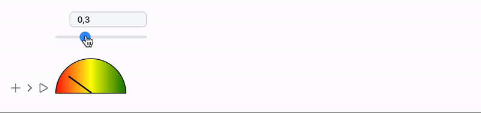

# Dynamic gauge 

Today we will implement a simple gauge using Javascript and HTML and then integrate it to Wolfram Language.


<!--truncate-->

## Javascript
Using AI assistant, one can directly ask

> write a gauge in Javascript

With some minor modifications we end up with the following code

```js
.js

core.gauge = async (args, env) => {
  
  // Create a gauge meter element
  const gauge = document.createElement('div');
  gauge.style.width = '100px'; // half the original width
  gauge.style.height = '50px'; // half the original height
  gauge.style.border = '1px solid #000';
  gauge.style.borderRadius = '50px 50px 0 0'; // adjusted for smaller size
  gauge.style.position = 'relative';
  gauge.style.background = 'linear-gradient(to right, red 0%, yellow 50%, green 100%)';

  // Create a needle for the gauge
  const needle = document.createElement('div');
  needle.style.width = '2px';
  needle.style.height = '40px'; // made the needle longer for better visibility
  needle.style.background = '#000';
  needle.style.position = 'absolute';
  needle.style.bottom = '0';
  needle.style.left = '50%';
  needle.style.transformOrigin = 'bottom';

  // Function to set the needle position based on input value
  function setNeedlePosition(value) {
    // Ensure value is between 0 and 1
    value = Math.max(0, Math.min(1, value));
    // Convert value to angle
    const angle = value * 180 - 90; // -90 to 90 degrees
    needle.style.transform = `rotate(${angle}deg)`;
  }

  // Set initial needle position
  const pos = await interpretate(args[0], env);
  setNeedlePosition(pos); // Middle position
  

  gauge.appendChild(needle);

  env.element.appendChild(gauge);
  env.local.update = setNeedlePosition;
}

core.gauge.update = async (args, env) => {
  const val = await interpretate(args[0], env);
  env.local.update(val);
}

core.gauge.destroy = () => {
  console.log('Nothing to do');
}

core.gause.virtual = true
```

It already includes all dynamic methods such as `update` and `destroy` used to update the meter, once the data has been changed.

To test is we can write

```mathematica
gauge[0.3] // CreateFrontEndObject
```

## Dynamics
We have already implemented `update` method, then we can directly hook it up to a slider

```mathematica
gvalue = 0.1;
EventHandler[InputRange[0, 1, 0.1, 0.1], (gvalue = #) &]

gauge[gvalue // Offload] // CreateFrontEndObject
```



## Cleaning up
We don't have to create FrontEndObject manually each time, it is can be done using `StandardForm` and `MakeBoxes`. There is a few way on how to implement it.

### The simplest way
One can force Wolfram Kernel to execute output expression on WLJS Interpreter via

```mathematica title="change 1"
gauge /: MakeBoxes[g_gauge, StandardForm] := With[{
  o = CreateFrontEndObject[g]
},
  MakeBoxes[o, StandardForm]
]
```

then we can freely do now

```mathematica title="change 2"
gvalue = 0.1;
EventHandler[InputRange[0, 1, 0.1, 0.1], (gvalue = #) &]

gauge[gvalue // Offload]
```

:::warning
This makes expression not copyable from notebook to notebook, what you will see under the symbol is something like this

```mathematica
(*VB[*)(FrontEndRef["35fa850e-5bfd-48ab-84b2-dc815f5f2666"])(*,*)(*"1:eJxTTMoPSmNkYGAoZgESHvk5KRCeEJBwK8rPK3HNS3GtSE0uLUlMykkNVgEKG5umJVqYGqTqmialpeiaWCQm6VqYJBnppiRbGJqmmaYZmZmZAQCMcRXe"*)(*]VB*)
```

See [Treating as a decoration](#Treating%20as%20a%20decoration) on how to fix this
:::

### Treating as a decoration
We can preserve the original symbol by just decorating it using `ViewBox`

```mathematica title="change 1"
gauge /: MakeBoxes[g_gauge, StandardForm] := With[{

},
  ViewBox[g, g]
]
```


Now it is the same as it was before

```mathematica title="change 2"
gvalue = 0.1;
EventHandler[InputRange[0, 1, 0.1, 0.1], (gvalue = #) &]

gauge[gvalue // Offload]
```

But if you try to copy it, you will see

```mathematica
(*VB[*)(gauge[Offload[gvalue]])(*,*)(*"1:eJxTTMoPSmNkYGAoZgESHvk5KRAeP5BwK8rPK3HNSwnLLCopTcyBSLACifTE0vRUCJcdSPinpeXkJ6YUs4GkyhJzSlMBOCoUGw=="*)(*]VB*)
```

*The original expression is preserved!*

