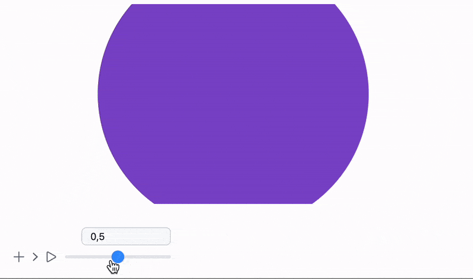
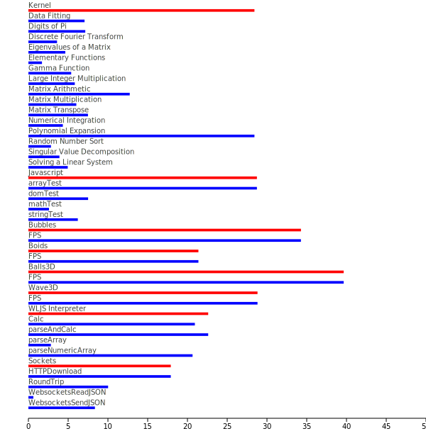

This is going to be our first dev-log post here 🦄

<!--truncate-->
## State and stateless
Let me give you an example

```mathematica
{RGBColor[1,0,0], Disk[{0,0}, 1]}
```

What you do see here? 

<Wl>{`Graphics[{RGBColor[1,0,0], Disk[{0,0}, 1]}]`}</Wl>

A __stateless__ `RGBColor` symbol modifies the local scope of a `List` substituting a new color value read later by `Disk`. Is the last one is also stateless? No

The beauty and simplicity of dynamics implemented in WLJS Interpreter 

```mathematica
{RGBColor[1,0,0], Disk[{0,0}, Offload[radius]]}
```

is that each instance of a `Disk` has its own state - DOM element, a couple of properties such as position, radius, color, opacity and etc. It is important to note, that `radius` here is also an instance with its own state, determined by a symbol `radius` defined on Wolfram Kernel. Two nested instances can see each other form a couple. When a child changes, a parent is reevaluated with a new data

```mathematica
radius = 1.0;
Graphics[{RGBColor[1,0,0], Disk[{0,0}, Offload[radius]]}]

EventHandler[InputRange[0,1,0.1], Function[value, radius = value]]
```

__What about color?..__

### Virtual containers
The name is a bit weird, however, the idea is that if an interpreter sees an attribute of a symbol

```js
g2d.Disk = async (args, env) => {
//... normal evaluation
}

g2d.Disk.update = async () => {
//... when child mutates
}

// highlight-next-line
g2d.Disk.virtual = true 
```

It alters the interpretation and creates a sort of container for this symbol to be evaluated inside it. This container has a local memory, identity and can see other such containers.

We can do in the same way and add this attribute to `RGBColor`

```js
g2d.RGBColor.virtual = true
```

Then the construction 

```mathematica
{RGBColor[color // Offload], Disk[{0,0}, 1]}
```

Will work for sure. However, now we coupled the following symbols

1. `RGBColor`
	1. `color`

How to bind `Disk` to `RGBColor` instance, which cannot be directly seen?

### New update methods and coupling schemes
What we can do is to provide sort of a reference to `env` variable to a list of potentially coupled objects, i.e.

```js
g2d.RGBColor = async () => {
	//... create references list
	const refs = [];
	env.exposed.colorRefs = refs;
}

g2d.RGBColor.update = async () => {
	//... execute one by one using new data
	env.exposed.colorRefs.forEach((instance) => {
		instance.execute({method: 'updateColor', color: newColor});
	})
}

g2d.RGBColor.virtual = true;
```

This scheme will update all connected instances. To connect we need to add a couple of line to `Disk` and other primitives

```js
g2d.Disk = async () => {
	//...
	// highlight-start
	if (env.colorRefs) {
		//append this instance to a list of references
		env.colorRefs.push(env.root);
	}
	// highlight-end
}

g2d.Disk.update = async () => {}
	//... regular update method
	//for nested expressions
}

// highlight-start
g2d.Disk.updateColor = (args, env) => {
	//new method just for updating color!
	env.local.object.attr('fill', env.color);
}
// highlight-end
```

Here we also defined a additional method for updating just a color of a primitive. The same can be done for `Opacity` as well.

Of course by turning `RGBColor` from stateless function into a sort of object comes with a additional overhead for an interpreter and memory. However later on we will check it on our performance tests.

## Examples
This opens up more possibilities for dynamics. In principle, this was the last thing, which was missing for a long time for a complete dynamic evaluating in WLJS Notebook.

Let us see it on a simple example

```mathematica
color = {1,0,0};
Graphics[{RGBColor[color // Offload], Disk[{0,0}, 1]}]

EventHandler[InputJoystick[], Function[xy,
	color = Normalize[{xy[[1]], xy[[2]], 0.5}] // Abs;
]]
```


Or using `Opacity` and blending between two `Disk`s

```mathematica
opacity = 0.5;
Graphics[{Opacity[Offload[opacity]], Red, Disk[{0,0}, 1], Blue, Opacity[Offload[1.0 - opacity]], Disk[{0,0}, 1]}]

EventHandler[InputRange[0,1,0.1], Function[value,
	opacity = value;
]]
```


Or even cooler - combining it with a traditional dynamics as well

```mathematica
opacity = 0.5;
Graphics[{Opacity[Offload[opacity]], Red, Disk[{0,0}, Offload[1-opacity]], Blue, Opacity[Offload[1.0 - opacity]], Disk[{0,0}, Offload[opacity]]}, ImagePadding->None]

EventHandler[InputRange[0,1,0.1], Function[value,
	opacity = value;
]]
```


## Benchmarking
I have created a complete suite of tests to check the performance of the system as a whole and by certain sections, i.e.

- Wolfram Kernel
- WLJS Interpreter
- HTTP and WebSockets
- 2D/3D dynamic graphics
- Stress test with many dynamic objects

It provides stats in the end as well as comparison to others results (if you shared)


*more is better, all bars a normalized*

You can download this notebook by the link down below
[__Benchmark__](./Archive.zip)

According to multiple tests __this new feature does not actually impacts the performance that much__

<Wl>{`Graphics[{{{Text["Mac OS X ARM (64-bit)",{-15.5,-155.}],Text["2.3.7mod-again",{41.1213619850795429039,-155}],Null,(*VB[*)(RGBColor[0.368417, 0.506779, 0.709798])(*,*)(*"1:eJxTTMoPSmNkYGAoZgESHvk5KRCeGJAIcndyzs/JLwouTyxJzghJzS3ISSxJTWMGyXMgyRcVTJv0VGXKdfsiw2kvp3eYP7AvOt4yw3vVtmf2AKMBH1E="*)(*]VB*),Text["Balls3D",{0,-153.5}],Rectangle[{0,-155.},{40.1213619850795429039,-154.}]},{Text["Mac OS X ARM (64-bit)",{-15.5,-291.}],Text["2.3.7mod-again",{28.5596828143449073232,-291}],Null,(*VB[*)(RGBColor[0.880722, 0.611041, 0.142051])(*,*)(*"1:eJxTTMoPSmNkYGAoZgESHvk5KRCeGJAIcndyzs/JLwouTyxJzghJzS3ISSxJTWMGyXMgyRf5HIl+fl/vjX3Rv+oPt5b2PrYv2jxrnfouvUP2ALwBIFo="*)(*]VB*),Text["Boids",{0,-289.5}],Rectangle[{0,-291.},{27.5596828143449073232,-290}]},{Text["Mac OS X ARM (64-bit)",{-15.5,-427}],Text["2.3.7mod-again",{31.8636091611720548194,-427}],Null,(*VB[*)(RGBColor[0.560181, 0.691569, 0.194885])(*,*)(*"1:eJxTTMoPSmNkYGAoZgESHvk5KRCeGJAIcndyzs/JLwouTyxJzghJzS3ISSxJTWMGyXMgyRcxPIvawvD2oX1R6dq9/qGKz+yLJCfsvff34wl7AJc8HzE="*)(*]VB*),Text["Bubbles",{0,-425.5}],Rectangle[{0,-427.},{30.8636091611720548194,-426.}]},{Text["Mac OS X ARM (64-bit)",{-15.5,-563.}],Text["2.3.7mod-again",{34.44481608018015,-563.}],Null,(*VB[*)(RGBColor[0.922526, 0.385626, 0.209179])(*,*)(*"1:eJxTTMoPSmNkYGAoZgESHvk5KRCeGJAIcndyzs/JLwouTyxJzghJzS3ISSxJTWMGyXMgyRdd2frNLrT1rX3RHf35ayTW3bAv0nBnXJRw7JQ9AKbfHmU="*)(*]VB*),Text["Javascript",{0,-561.5}],Rectangle[{0,-563.},{33.44481608018015,-562.}]},{Text["Mac OS X ARM (64-bit)",{-15.5,-699.}],Text["2.3.7mod-again",{29.08988764044944,-699.}],Null,(*VB[*)(RGBColor[0.528488, 0.470624, 0.701351])(*,*)(*"1:eJxTTMoPSmNkYGAoZgESHvk5KRCeGJAIcndyzs/JLwouTyxJzghJzS3ISSxJTWMGyXMgyRctbepaFf/ygX3Rxzm6Clvk7tkXZXYxLC8vfGYPAKOQHmA="*)(*]VB*),Text["Kernel",{0,-697.5}],Rectangle[{0,-699.},{28.08988764044944,-698.}]},{Text["Mac OS X ARM (64-bit)",{-15.5,-835.}],Text["2.3.7mod-again",{18.78573148316312,-835.}],Null,(*VB[*)(RGBColor[0.772079, 0.431554, 0.102387])(*,*)(*"1:eJxTTMoPSmNkYGAoZgESHvk5KRCeGJAIcndyzs/JLwouTyxJzghJzS3ISSxJTWMGyXMgyRcFbb3Lcn/LC/uiOf6yq6fMu21f9EGy8wKH2S57AKMVHmg="*)(*]VB*),Text["Sockets",{0,-833.5}],Rectangle[{0,-835.},{17.78573148316312,-834.}]},{Text["Mac OS X ARM (64-bit)",{-15.5,-971.}],Text["2.3.7mod-again",{28.4780824131753398995,-971.}],Null,(*VB[*)(RGBColor[0.363898, 0.618501, 0.782349])(*,*)(*"1:eJxTTMoPSmNkYGAoZgESHvk5KRCeGJAIcndyzs/JLwouTyxJzghJzS3ISSxJTWMGyXMgyRdNlna9JuV13b5oXdLH2YdOPbYvWnBX8SgD50t7AJbnHk8="*)(*]VB*),Text["Wave3D",{0,-969.5}],Rectangle[{0,-971.},{27.4780824131753398995,-970.}]},{Text["Mac OS X ARM (64-bit)",{-15.5,-1107.}],Text["2.3.7mod-again",{25.281667388014572,-1107.}],Null,(*VB[*)(RGBColor[1, 0.75, 0])(*,*)(*"1:eJxTTMoPSmNkYGAoZgESHvk5KRCeGJAIcndyzs/JLwouTyxJzghJzS3ISSxJTWMGyXMgyRcxgMEHeyjjBYzBwAAAGBIUhA=="*)(*]VB*),Text["WLJS Interpreter",{0,-1105.5}],Rectangle[{0,-1107.},{24.281667388014572,-1106.}]}},{{Text["Mac OS X ARM (64-bit)",{-15.5,-173.5}],Text["2.3.7mod-again",{39.0516683701718147991,-173.5}],Null,(*VB[*)(RGBColor[0.368417, 0.506779, 0.709798])(*,*)(*"1:eJxTTMoPSmNkYGAoZgESHvk5KRCeGJAIcndyzs/JLwouTyxJzghJzS3ISSxJTWMGyXMgyRcVTJv0VGXKdfsiw2kvp3eYP7AvOt4yw3vVtmf2AKMBH1E="*)(*]VB*),Null,Rectangle[{0,-173.5},{38.0516683701718147991,-172.5}]},{Text["Mac OS X ARM (64-bit)",{-15.5,-309.5}],Text["2.3.7mod-again",{20.2016399027377077984,-309.5}],Null,(*VB[*)(RGBColor[0.880722, 0.611041, 0.142051])(*,*)(*"1:eJxTTMoPSmNkYGAoZgESHvk5KRCeGJAIcndyzs/JLwouTyxJzghJzS3ISSxJTWMGyXMgyRf5HIl+fl/vjX3Rv+oPt5b2PrYv2jxrnfouvUP2ALwBIFo="*)(*]VB*),Null,Rectangle[{0,-309.5},{19.2016399027377077984,-308.5}]},{Text["Mac OS X ARM (64-bit)",{-15.5,-445.5}],Text["2.3.7mod-again",{32.5379750106166660923,-445.5}],Null,(*VB[*)(RGBColor[0.560181, 0.691569, 0.194885])(*,*)(*"1:eJxTTMoPSmNkYGAoZgESHvk5KRCeGJAIcndyzs/JLwouTyxJzghJzS3ISSxJTWMGyXMgyRcxPIvawvD2oX1R6dq9/qGKz+yLJCfsvff34wl7AJc8HzE="*)(*]VB*),Null,Rectangle[{0,-445.5},{31.5379750106166660923,-444.5}]},{Text["Mac OS X ARM (64-bit)",{-15.5,-581.5}],Text["2.3.7mod-again",{34.55704703356123,-581.5}],Null,(*VB[*)(RGBColor[0.922526, 0.385626, 0.209179])(*,*)(*"1:eJxTTMoPSmNkYGAoZgESHvk5KRCeGJAIcndyzs/JLwouTyxJzghJzS3ISSxJTWMGyXMgyRdd2frNLrT1rX3RHf35ayTW3bAv0nBnXJRw7JQ9AKbfHmU="*)(*]VB*),Null,Rectangle[{0,-581.5},{33.55704703356123,-580.5}]},{Text["Mac OS X ARM (64-bit)",{-15.5,-717.5}],Text["2.3.7mod-again",{29.296547821165817,-717.5}],Null,(*VB[*)(RGBColor[0.528488, 0.470624, 0.701351])(*,*)(*"1:eJxTTMoPSmNkYGAoZgESHvk5KRCeGJAIcndyzs/JLwouTyxJzghJzS3ISSxJTWMGyXMgyRctbepaFf/ygX3Rxzm6Clvk7tkXZXYxLC8vfGYPAKOQHmA="*)(*]VB*),Null,Rectangle[{0,-717.5},{28.296547821165817,-716.5}]},{Text["Mac OS X ARM (64-bit)",{-15.5,-853.5}],Text["2.3.7mod-again",{27.909625299046187,-853.5}],Null,(*VB[*)(RGBColor[0.772079, 0.431554, 0.102387])(*,*)(*"1:eJxTTMoPSmNkYGAoZgESHvk5KRCeGJAIcndyzs/JLwouTyxJzghJzS3ISSxJTWMGyXMgyRcFbb3Lcn/LC/uiOf6yq6fMu21f9EGy8wKH2S57AKMVHmg="*)(*]VB*),Null,Rectangle[{0,-853.5},{26.909625299046187,-852.5}]},{Text["Mac OS X ARM (64-bit)",{-15.5,-989.5}],Text["2.3.7mod-again",{29.33503251720164082,-989.5}],Null,(*VB[*)(RGBColor[0.363898, 0.618501, 0.782349])(*,*)(*"1:eJxTTMoPSmNkYGAoZgESHvk5KRCeGJAIcndyzs/JLwouTyxJzghJzS3ISSxJTWMGyXMgyRdNlna9JuV13b5oXdLH2YdOPbYvWnBX8SgD50t7AJbnHk8="*)(*]VB*),Null,Rectangle[{0,-989.5},{28.33503251720164082,-988.5}]},{Text["Mac OS X ARM (64-bit)",{-15.5,-1125.5}],Text["2.3.7mod-again",{25.281667388014572,-1125.5}],Null,(*VB[*)(RGBColor[1, 0.75, 0])(*,*)(*"1:eJxTTMoPSmNkYGAoZgESHvk5KRCeGJAIcndyzs/JLwouTyxJzghJzS3ISSxJTWMGyXMgyRcxgMEHeyjjBYzBwAAAGBIUhA=="*)(*]VB*),Null,Rectangle[{0,-1125.5},{24.281667388014572,-1124.5}]}},{{Text["Mac OS X ARM (64-bit)",{-15.5,-192.}],Text["2.3.7mod-again",{40.8303240615595453281,-192.}],Null,(*VB[*)(RGBColor[0.368417, 0.506779, 0.709798])(*,*)(*"1:eJxTTMoPSmNkYGAoZgESHvk5KRCeGJAIcndyzs/JLwouTyxJzghJzS3ISSxJTWMGyXMgyRcVTJv0VGXKdfsiw2kvp3eYP7AvOt4yw3vVtmf2AKMBH1E="*)(*]VB*),Null,Rectangle[{0,-192.},{39.8303240615595453281,-191.}]},{Text["Mac OS X ARM (64-bit)",{-15.5,-328.}],Text["2.3.7mod-again",{22.6915543344424267071,-328.}],Null,(*VB[*)(RGBColor[0.880722, 0.611041, 0.142051])(*,*)(*"1:eJxTTMoPSmNkYGAoZgESHvk5KRCeGJAIcndyzs/JLwouTyxJzghJzS3ISSxJTWMGyXMgyRf5HIl+fl/vjX3Rv+oPt5b2PrYv2jxrnfouvUP2ALwBIFo="*)(*]VB*),Null,Rectangle[{0,-328.},{21.6915543344424267071,-327.}]},{Text["Mac OS X ARM (64-bit)",{-15.5,-464.}],Text["2.3.7mod-again",{36.6945921190032067295,-464.}],Null,(*VB[*)(RGBColor[0.560181, 0.691569, 0.194885])(*,*)(*"1:eJxTTMoPSmNkYGAoZgESHvk5KRCeGJAIcndyzs/JLwouTyxJzghJzS3ISSxJTWMGyXMgyRcxPIvawvD2oX1R6dq9/qGKz+yLJCfsvff34wl7AJc8HzE="*)(*]VB*),Null,Rectangle[{0,-464.},{35.6945921190032067295,-463.}]},{Text["Mac OS X ARM (64-bit)",{-15.5,-600.}],Text["2.3.7mod-again",{31.487804922371094,-600.}],Null,(*VB[*)(RGBColor[0.922526, 0.385626, 0.209179])(*,*)(*"1:eJxTTMoPSmNkYGAoZgESHvk5KRCeGJAIcndyzs/JLwouTyxJzghJzS3ISSxJTWMGyXMgyRdd2frNLrT1rX3RHf35ayTW3bAv0nBnXJRw7JQ9AKbfHmU="*)(*]VB*),Null,Rectangle[{0,-600.},{30.487804922371094,-599.}]},{Text["Mac OS X ARM (64-bit)",{-15.5,-736.}],Text["2.3.7mod-again",{29.176951253874332,-736.}],Null,(*VB[*)(RGBColor[0.528488, 0.470624, 0.701351])(*,*)(*"1:eJxTTMoPSmNkYGAoZgESHvk5KRCeGJAIcndyzs/JLwouTyxJzghJzS3ISSxJTWMGyXMgyRctbepaFf/ygX3Rxzm6Clvk7tkXZXYxLC8vfGYPAKOQHmA="*)(*]VB*),Null,Rectangle[{0,-736.},{28.176951253874332,-735.}]},{Text["Mac OS X ARM (64-bit)",{-15.5,-872.}],Text["2.3.7mod-again",{27.461659958660547,-872.}],Null,(*VB[*)(RGBColor[0.772079, 0.431554, 0.102387])(*,*)(*"1:eJxTTMoPSmNkYGAoZgESHvk5KRCeGJAIcndyzs/JLwouTyxJzghJzS3ISSxJTWMGyXMgyRcFbb3Lcn/LC/uiOf6yq6fMu21f9EGy8wKH2S57AKMVHmg="*)(*]VB*),Null,Rectangle[{0,-872.},{26.461659958660547,-871.}]},{Text["Mac OS X ARM (64-bit)",{-15.5,-1008.}],Text["2.3.7mod-again",{29.9574995752287149394,-1008.}],Null,(*VB[*)(RGBColor[0.363898, 0.618501, 0.782349])(*,*)(*"1:eJxTTMoPSmNkYGAoZgESHvk5KRCeGJAIcndyzs/JLwouTyxJzghJzS3ISSxJTWMGyXMgyRdNlna9JuV13b5oXdLH2YdOPbYvWnBX8SgD50t7AJbnHk8="*)(*]VB*),Null,Rectangle[{0,-1008.},{28.9574995752287149394,-1007.}]},{Text["Mac OS X ARM (64-bit)",{-15.5,-1144.}],Text["2.3.7mod-again",{29.901734170430736,-1144.}],Null,(*VB[*)(RGBColor[1, 0.75, 0])(*,*)(*"1:eJxTTMoPSmNkYGAoZgESHvk5KRCeGJAIcndyzs/JLwouTyxJzghJzS3ISSxJTWMGyXMgyRcxgMEHeyjjBYzBwAAAGBIUhA=="*)(*]VB*),Null,Rectangle[{0,-1144.},{28.901734170430736,-1143.}]}},{{Text["Mac OS X ARM (64-bit)",{-15.5,-210.5}],Text["2.3.7dynamic-env-mod",{43.1351729166549604647,-210.5}],Null,(*VB[*)(RGBColor[0.368417, 0.506779, 0.709798])(*,*)(*"1:eJxTTMoPSmNkYGAoZgESHvk5KRCeGJAIcndyzs/JLwouTyxJzghJzS3ISSxJTWMGyXMgyRcVTJv0VGXKdfsiw2kvp3eYP7AvOt4yw3vVtmf2AKMBH1E="*)(*]VB*),Null,Rectangle[{0,-210.5},{42.1351729166549604647,-209.5}]},{Text["Mac OS X ARM (64-bit)",{-15.5,-346.5}],Text["2.3.7dynamic-env-mod",{22.1917276116719819325,-346.5}],Null,(*VB[*)(RGBColor[0.880722, 0.611041, 0.142051])(*,*)(*"1:eJxTTMoPSmNkYGAoZgESHvk5KRCeGJAIcndyzs/JLwouTyxJzghJzS3ISSxJTWMGyXMgyRf5HIl+fl/vjX3Rv+oPt5b2PrYv2jxrnfouvUP2ALwBIFo="*)(*]VB*),Null,Rectangle[{0,-346.5},{21.1917276116719819325,-345.5}]},{Text["Mac OS X ARM (64-bit)",{-15.5,-482.5}],Text["2.3.7dynamic-env-mod",{27.7761126705069847621,-482.5}],Null,(*VB[*)(RGBColor[0.560181, 0.691569, 0.194885])(*,*)(*"1:eJxTTMoPSmNkYGAoZgESHvk5KRCeGJAIcndyzs/JLwouTyxJzghJzS3ISSxJTWMGyXMgyRcxPIvawvD2oX1R6dq9/qGKz+yLJCfsvff34wl7AJc8HzE="*)(*]VB*),Null,Rectangle[{0,-482.5},{26.7761126705069847621,-481.5}]},{Text["Mac OS X ARM (64-bit)",{-15.5,-618.5}],Text["2.3.7dynamic-env-mod",{33.467532517797814,-618.5}],Null,(*VB[*)(RGBColor[0.922526, 0.385626, 0.209179])(*,*)(*"1:eJxTTMoPSmNkYGAoZgESHvk5KRCeGJAIcndyzs/JLwouTyxJzghJzS3ISSxJTWMGyXMgyRdd2frNLrT1rX3RHf35ayTW3bAv0nBnXJRw7JQ9AKbfHmU="*)(*]VB*),Null,Rectangle[{0,-618.5},{32.467532517797814,-617.5}]},{Text["Mac OS X ARM (64-bit)",{-15.5,-754.5}],Text["2.3.7dynamic-env-mod",{29.050490883590463,-754.5}],Null,(*VB[*)(RGBColor[0.528488, 0.470624, 0.701351])(*,*)(*"1:eJxTTMoPSmNkYGAoZgESHvk5KRCeGJAIcndyzs/JLwouTyxJzghJzS3ISSxJTWMGyXMgyRctbepaFf/ygX3Rxzm6Clvk7tkXZXYxLC8vfGYPAKOQHmA="*)(*]VB*),Null,Rectangle[{0,-754.5},{28.050490883590463,-753.5}]},{Text["Mac OS X ARM (64-bit)",{-15.5,-890.5}],Text["2.3.7dynamic-env-mod",{28.25081921680832,-890.5}],Null,(*VB[*)(RGBColor[0.772079, 0.431554, 0.102387])(*,*)(*"1:eJxTTMoPSmNkYGAoZgESHvk5KRCeGJAIcndyzs/JLwouTyxJzghJzS3ISSxJTWMGyXMgyRcFbb3Lcn/LC/uiOf6yq6fMu21f9EGy8wKH2S57AKMVHmg="*)(*]VB*),Null,Rectangle[{0,-890.5},{27.25081921680832,-889.5}]},{Text["Mac OS X ARM (64-bit)",{-15.5,-1026.5}],Text["2.3.7dynamic-env-mod",{29.7583125861421421656,-1026.5}],Null,(*VB[*)(RGBColor[0.363898, 0.618501, 0.782349])(*,*)(*"1:eJxTTMoPSmNkYGAoZgESHvk5KRCeGJAIcndyzs/JLwouTyxJzghJzS3ISSxJTWMGyXMgyRdNlna9JuV13b5oXdLH2YdOPbYvWnBX8SgD50t7AJbnHk8="*)(*]VB*),Null,Rectangle[{0,-1026.5},{28.7583125861421421656,-1025.5}]},{Text["Mac OS X ARM (64-bit)",{-15.5,-1162.5}],Text["2.3.7dynamic-env-mod",{23.409800394327608,-1162.5}],Null,(*VB[*)(RGBColor[1, 0.75, 0])(*,*)(*"1:eJxTTMoPSmNkYGAoZgESHvk5KRCeGJAIcndyzs/JLwouTyxJzghJzS3ISSxJTWMGyXMgyRcxgMEHeyjjBYzBwAAAGBIUhA=="*)(*]VB*),Null,Rectangle[{0,-1162.5},{22.409800394327608,-1161.5}]}},{{Text["Mac OS X ARM (64-bit)",{-15.5,-229.}],Text["2.3.7dynamic-env-mod",{40.3746446292874211543,-229.}],Null,(*VB[*)(RGBColor[0.368417, 0.506779, 0.709798])(*,*)(*"1:eJxTTMoPSmNkYGAoZgESHvk5KRCeGJAIcndyzs/JLwouTyxJzghJzS3ISSxJTWMGyXMgyRcVTJv0VGXKdfsiw2kvp3eYP7AvOt4yw3vVtmf2AKMBH1E="*)(*]VB*),Null,Rectangle[{0,-229.},{39.3746446292874211543,-228.}]},{Text["Mac OS X ARM (64-bit)",{-15.5,-365.}],Text["2.3.7dynamic-env-mod",{18.9850479820475683134,-365.}],Null,(*VB[*)(RGBColor[0.880722, 0.611041, 0.142051])(*,*)(*"1:eJxTTMoPSmNkYGAoZgESHvk5KRCeGJAIcndyzs/JLwouTyxJzghJzS3ISSxJTWMGyXMgyRf5HIl+fl/vjX3Rv+oPt5b2PrYv2jxrnfouvUP2ALwBIFo="*)(*]VB*),Null,Rectangle[{0,-365.},{17.9850479820475683134,-364.}]},{Text["Mac OS X ARM (64-bit)",{-15.5,-501.}],Text["2.3.7dynamic-env-mod",{33.2238266423878200206,-501.}],Null,(*VB[*)(RGBColor[0.560181, 0.691569, 0.194885])(*,*)(*"1:eJxTTMoPSmNkYGAoZgESHvk5KRCeGJAIcndyzs/JLwouTyxJzghJzS3ISSxJTWMGyXMgyRcxPIvawvD2oX1R6dq9/qGKz+yLJCfsvff34wl7AJc8HzE="*)(*]VB*),Null,Rectangle[{0,-501.},{32.2238266423878200206,-500.}]},{Text["Mac OS X ARM (64-bit)",{-15.5,-637.}],Text["2.3.7dynamic-env-mod",{29.409090870606505,-637.}],Null,(*VB[*)(RGBColor[0.922526, 0.385626, 0.209179])(*,*)(*"1:eJxTTMoPSmNkYGAoZgESHvk5KRCeGJAIcndyzs/JLwouTyxJzghJzS3ISSxJTWMGyXMgyRdd2frNLrT1rX3RHf35ayTW3bAv0nBnXJRw7JQ9AKbfHmU="*)(*]VB*),Null,Rectangle[{0,-637.},{28.409090870606505,-636.}]},{Text["Mac OS X ARM (64-bit)",{-15.5,-773.}],Text["2.3.7dynamic-env-mod",{29.473804100227788,-773.}],Null,(*VB[*)(RGBColor[0.528488, 0.470624, 0.701351])(*,*)(*"1:eJxTTMoPSmNkYGAoZgESHvk5KRCeGJAIcndyzs/JLwouTyxJzghJzS3ISSxJTWMGyXMgyRctbepaFf/ygX3Rxzm6Clvk7tkXZXYxLC8vfGYPAKOQHmA="*)(*]VB*),Null,Rectangle[{0,-773.},{28.473804100227788,-772.}]},{Text["Mac OS X ARM (64-bit)",{-15.5,-909.}],Text["2.3.7dynamic-env-mod",{18.839009449807445,-909.}],Null,(*VB[*)(RGBColor[0.772079, 0.431554, 0.102387])(*,*)(*"1:eJxTTMoPSmNkYGAoZgESHvk5KRCeGJAIcndyzs/JLwouTyxJzghJzS3ISSxJTWMGyXMgyRcFbb3Lcn/LC/uiOf6yq6fMu21f9EGy8wKH2S57AKMVHmg="*)(*]VB*),Null,Rectangle[{0,-909.},{17.839009449807445,-908.}]},{Text["Mac OS X ARM (64-bit)",{-15.5,-1045.}],Text["2.3.7dynamic-env-mod",{29.5135816411600968948,-1045.}],Null,(*VB[*)(RGBColor[0.363898, 0.618501, 0.782349])(*,*)(*"1:eJxTTMoPSmNkYGAoZgESHvk5KRCeGJAIcndyzs/JLwouTyxJzghJzS3ISSxJTWMGyXMgyRdNlna9JuV13b5oXdLH2YdOPbYvWnBX8SgD50t7AJbnHk8="*)(*]VB*),Null,Rectangle[{0,-1045.},{28.5135816411600968948,-1044.}]},{Text["Mac OS X ARM (64-bit)",{-15.5,-1181.}],Text["2.3.7dynamic-env-mod",{24.174971031286216,-1181.}],Null,(*VB[*)(RGBColor[1, 0.75, 0])(*,*)(*"1:eJxTTMoPSmNkYGAoZgESHvk5KRCeGJAIcndyzs/JLwouTyxJzghJzS3ISSxJTWMGyXMgyRcxgMEHeyjjBYzBwAAAGBIUhA=="*)(*]VB*),Null,Rectangle[{0,-1181.},{23.174971031286216,-1180.}]}},{{Text["Mac OS X ARM (64-bit)",{-15.5,-247.5}],Text["2.3.7dynamic-env-mod",{40.6475793794916107524,-247.5}],{(*VB[*)(RGBColor[1, 0, 0])(*,*)(*"1:eJxTTMoPSmNkYGAoZgESHvk5KRCeGJAIcndyzs/JLwouTyxJzghJzS3ISSxJTWMGyXMgyRcxgMEHeyiDgQHOAAALpBNd"*)(*]VB*),Arrow[{{60.6475793794916107524,-247.5},{54.6475793794916107524,-247.5}}]},(*VB[*)(RGBColor[0.368417, 0.506779, 0.709798])(*,*)(*"1:eJxTTMoPSmNkYGAoZgESHvk5KRCeGJAIcndyzs/JLwouTyxJzghJzS3ISSxJTWMGyXMgyRcVTJv0VGXKdfsiw2kvp3eYP7AvOt4yw3vVtmf2AKMBH1E="*)(*]VB*),Null,Rectangle[{0,-247.5},{39.6475793794916107524,-246.5}]},{Text["Mac OS X ARM (64-bit)",{-15.5,-383.5}],Text["2.3.7dynamic-env-mod",{22.3797035026747845987,-383.5}],{(*VB[*)(RGBColor[1, 0, 0])(*,*)(*"1:eJxTTMoPSmNkYGAoZgESHvk5KRCeGJAIcndyzs/JLwouTyxJzghJzS3ISSxJTWMGyXMgyRcxgMEHeyiDgQHOAAALpBNd"*)(*]VB*),Arrow[{{42.3797035026747845987,-383.5},{36.3797035026747845987,-383.5}}]},(*VB[*)(RGBColor[0.880722, 0.611041, 0.142051])(*,*)(*"1:eJxTTMoPSmNkYGAoZgESHvk5KRCeGJAIcndyzs/JLwouTyxJzghJzS3ISSxJTWMGyXMgyRf5HIl+fl/vjX3Rv+oPt5b2PrYv2jxrnfouvUP2ALwBIFo="*)(*]VB*),Null,Rectangle[{0,-383.5},{21.3797035026747845987,-382.5}]},{Text["Mac OS X ARM (64-bit)",{-15.5,-519.5}],Text["2.3.7dynamic-env-mod",{35.2746198401460182772,-519.5}],{(*VB[*)(RGBColor[1, 0, 0])(*,*)(*"1:eJxTTMoPSmNkYGAoZgESHvk5KRCeGJAIcndyzs/JLwouTyxJzghJzS3ISSxJTWMGyXMgyRcxgMEHeyiDgQHOAAALpBNd"*)(*]VB*),Arrow[{{55.2746198401460182772,-519.5},{49.2746198401460182772,-519.5}}]},(*VB[*)(RGBColor[0.560181, 0.691569, 0.194885])(*,*)(*"1:eJxTTMoPSmNkYGAoZgESHvk5KRCeGJAIcndyzs/JLwouTyxJzghJzS3ISSxJTWMGyXMgyRcxPIvawvD2oX1R6dq9/qGKz+yLJCfsvff34wl7AJc8HzE="*)(*]VB*),Null,Rectangle[{0,-519.5},{34.2746198401460182772,-518.5}]},{Text["Mac OS X ARM (64-bit)",{-15.5,-655.5}],Text["2.3.7dynamic-env-mod",{29.735632223282234,-655.5}],{(*VB[*)(RGBColor[1, 0, 0])(*,*)(*"1:eJxTTMoPSmNkYGAoZgESHvk5KRCeGJAIcndyzs/JLwouTyxJzghJzS3ISSxJTWMGyXMgyRcxgMEHeyiDgQHOAAALpBNd"*)(*]VB*),Arrow[{{49.73563222328224,-655.5},{43.73563222328224,-655.5}}]},(*VB[*)(RGBColor[0.922526, 0.385626, 0.209179])(*,*)(*"1:eJxTTMoPSmNkYGAoZgESHvk5KRCeGJAIcndyzs/JLwouTyxJzghJzS3ISSxJTWMGyXMgyRdd2frNLrT1rX3RHf35ayTW3bAv0nBnXJRw7JQ9AKbfHmU="*)(*]VB*),Null,Rectangle[{0,-655.5},{28.735632223282234,-654.5}]},{Text["Mac OS X ARM (64-bit)",{-15.5,-791.5}],Text["2.3.7dynamic-env-mod",{29.425241614553727,-791.5}],{(*VB[*)(RGBColor[1, 0, 0])(*,*)(*"1:eJxTTMoPSmNkYGAoZgESHvk5KRCeGJAIcndyzs/JLwouTyxJzghJzS3ISSxJTWMGyXMgyRcxgMEHeyiDgQHOAAALpBNd"*)(*]VB*),Arrow[{{49.42524161455373,-791.5},{43.42524161455373,-791.5}}]},(*VB[*)(RGBColor[0.528488, 0.470624, 0.701351])(*,*)(*"1:eJxTTMoPSmNkYGAoZgESHvk5KRCeGJAIcndyzs/JLwouTyxJzghJzS3ISSxJTWMGyXMgyRctbepaFf/ygX3Rxzm6Clvk7tkXZXYxLC8vfGYPAKOQHmA="*)(*]VB*),Null,Rectangle[{0,-791.5},{28.425241614553727,-790.5}]},{Text["Mac OS X ARM (64-bit)",{-15.5,-927.5}],Text["2.3.7dynamic-env-mod",{18.90666034611764,-927.5}],{(*VB[*)(RGBColor[1, 0, 0])(*,*)(*"1:eJxTTMoPSmNkYGAoZgESHvk5KRCeGJAIcndyzs/JLwouTyxJzghJzS3ISSxJTWMGyXMgyRcxgMEHeyiDgQHOAAALpBNd"*)(*]VB*),Arrow[{{38.90666034611764,-927.5},{32.90666034611764,-927.5}}]},(*VB[*)(RGBColor[0.772079, 0.431554, 0.102387])(*,*)(*"1:eJxTTMoPSmNkYGAoZgESHvk5KRCeGJAIcndyzs/JLwouTyxJzghJzS3ISSxJTWMGyXMgyRcFbb3Lcn/LC/uiOf6yq6fMu21f9EGy8wKH2S57AKMVHmg="*)(*]VB*),Null,Rectangle[{0,-927.5},{17.90666034611764,-926.5}]},{Text["Mac OS X ARM (64-bit)",{-15.5,-1063.5}],Text["2.3.7dynamic-env-mod",{29.8111487223813499838,-1063.5}],{(*VB[*)(RGBColor[1, 0, 0])(*,*)(*"1:eJxTTMoPSmNkYGAoZgESHvk5KRCeGJAIcndyzs/JLwouTyxJzghJzS3ISSxJTWMGyXMgyRcxgMEHeyiDgQHOAAALpBNd"*)(*]VB*),Arrow[{{49.8111487223813499838,-1063.5},{43.8111487223813499838,-1063.5}}]},(*VB[*)(RGBColor[0.363898, 0.618501, 0.782349])(*,*)(*"1:eJxTTMoPSmNkYGAoZgESHvk5KRCeGJAIcndyzs/JLwouTyxJzghJzS3ISSxJTWMGyXMgyRdNlna9JuV13b5oXdLH2YdOPbYvWnBX8SgD50t7AJbnHk8="*)(*]VB*),Null,Rectangle[{0,-1063.5},{28.8111487223813499838,-1062.5}]},{Text["Mac OS X ARM (64-bit)",{-15.5,-1199.5}],Text["2.3.7dynamic-env-mod",{23.609088732252804,-1199.5}],{(*VB[*)(RGBColor[1, 0, 0])(*,*)(*"1:eJxTTMoPSmNkYGAoZgESHvk5KRCeGJAIcndyzs/JLwouTyxJzghJzS3ISSxJTWMGyXMgyRcxgMEHeyiDgQHOAAALpBNd"*)(*]VB*),Arrow[{{43.6090887322528,-1199.5},{37.6090887322528,-1199.5}}]},(*VB[*)(RGBColor[1, 0.75, 0])(*,*)(*"1:eJxTTMoPSmNkYGAoZgESHvk5KRCeGJAIcndyzs/JLwouTyxJzghJzS3ISSxJTWMGyXMgyRcxgMEHeyjjBYzBwAAAGBIUhA=="*)(*]VB*),Null,Rectangle[{0,-1199.5},{22.609088732252804,-1198.5}]}}},ImagePadding->20,Controls->False,ImageSize->{600,600}]`}</Wl>

The most impact I expected from a test called *Bubbles*, which involves a lot of creation and destruction of many graphics objects. However, it seems very weak.

See you next time ✨
*Kirill*
