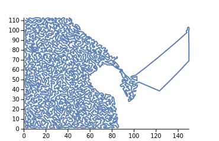
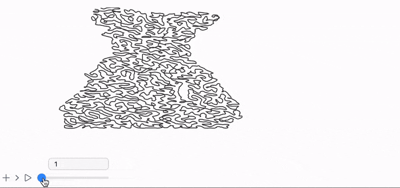
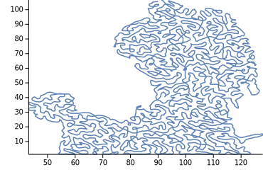

# Bad Apple, but it’s Wolfram Language Plot

[Bad 🍎](https://www.youtube.com/watch?v=FtutLA63Cp8) animation by Anira group originally based on [ZUN](https://en.wikipedia.org/wiki/ZUN_(video_game_developer))'s work for bullet shoot 'em up game _Touhou Project_ is remarkable cultural internet phenomenon often used for testing and demonstrating the features of some old hardware, algorithms, graphics systems  or other esoteric medium. And in general as an of art object -  Bad Apple *shadow animation* is just eye-catching and amazingly crafted piece ✨. Not even mentioning hot pumping 16-bit flavoured tune and a beautiful voice of Nomico (のみこ).

I (me @JerryI) have seen it many times popping up still in 2024, even as a [Fluid Simulation](https://www.youtube.com/watch?v=2Ni13dnAbSA) and have been questioning myself why not anyone to try to implement it lively using some scientific software like Jupyter or Matlab or Wolfram Language and a standard plot function? It could fun
<!--truncate-->
<details>
<summary>Spoiler</summary>

<iframe width="100%" height="315" src="https://www.youtube.com/embed/QOuVV9nTras?si=vKT4GGCdY94ZHDOm" title="YouTube video player" frameborder="0" allow="accelerometer; autoplay; clipboard-write; encrypted-media; gyroscope; picture-in-picture; web-share" referrerpolicy="strict-origin-when-cross-origin" allowfullscreen></iframe>


</details>

Today we will learn how to render this animation in real-time using WLJS Notebook and a single `Line` function.

> Open WLJS Notebook and create a new notebook 📒
## One line to tell a story
What is the most basic thing people try to do, when open Mathematica or WLJS Notebook for the first time? I believe it must be `Plot`

```mathematica
Plot[BesselJ[0, z], {z,0,10}]
```

<Wl>{`Plot[BesselJ[0, z], {z,0,10}]`}</Wl>

The idea would be to transform each frame of a video to a single line path. Similar to a *one line art*. The approach is not new and [was published](https://www.wolfram.com/mathematica/new-in-10/enhanced-graphs-and-networks/continuous-line-drawing.html) by Wolfram Research as a fun example in Mathematica 10. 

### Handling video frames
Firstly, obtain a video file of Bad Apple animation somehow and __directly drop it to any input cell.__ It will upload a file and will provide a reference to it. Modify the tail of expression to explicitly tell Wolfram Kernel to extract video frames

```mathematica @
video = Import[FileNameJoin[{"attachments", "Touhou - Bad Apple.mp4"}], (*BB[*)({"ImageList", All})(*,*)(*"1:eJxTTMoPSmNkYGAoZgESHvk5KRAeB5AILqnMSXXKr0hjgskHleakFnMBGU6JydnpRfmleSlpzDDlQe5Ozvk5+UVFDGDwwR6dwcAAAAHdFiw="*)(*]BB*)];
```

Let us try our methods on 500th frame

```mathematica
video[[500]] // Thumbnail
```


You can __directly copy and paste this image from the output cell__ to a new input cell and wrap some function over it (like on a video at the end of the post). Since in this story I am limited to my markdown editor, for the demonstration purposes I will use a dedicated variable

```mathematica
img = video[[500]] // Thumbnail;
```

It comes handy here that Bad Apple relies on *shadow* animation style, so we can easily convert any image to a grid of `1` and `0`

```mathematica
img = img // ImageAdjust // Binarize
```


Imagine if all dark parts will be filled with one long line path zig-zagging over it. This is somewhat easy to do if we know the positions of all dark pixels

```mathematica
pos = PixelValuePositions[img, 0]
```


Great. Thanks to a giant standard library of Wolfram Language, there is a complete solution for optimizing the path to cover all dark pixels

```mathematica
{length, path} = FindShortestTour[pos];
```

Here we do not need `length`, but only actual `path` which contains indexes of points from `pos` connected in order to form the shortest route though all dark pixels. Let's see how it looks

```mathematica
ListLinePlot[pos[[path]]]
```


It feels a bit too dense for my taste, let's average it a bit

```mathematica
ListLinePlot[MovingAverage[pos[[path]], 5]]
```



This already feels more interesting and has a vibe of *one line art*. 

### Batch processing
Now we need to apply this set of steps to every frame. One can organize it like this

```mathematica
trace[frame_] :=
    Module[{img, pos, path},
        img = ImageAdjust[frame // Thumbnail // Binarize];
        pos = PixelValuePositions[img, 0]//N; (* get numerical *)
        path = FindShortestTour[pos][[2]];
        MovingAverage[pos[[path]], 5]
    ]
```

And to track progress, we can also add a bar

```mathematica title="optional"
progressBar[max_Real | max_Integer] := LeakyModule[{
	progress = 0.,
	bar,
	increment,
	timer = AbsoluteTime[]
},
	bar = CellPrint[ToString[
		Graphics[{
			LightBlue, Rectangle[{-1,-1}, {1,1}],
			Green, Rectangle[{-1,-1}, {Offload[2 progress - 1], 1}]
		}, ImagePadding->None, Controls->False, ImageSize->{400, 30}]
	, StandardForm], "After"->EvaluationCell[]];

	(* throttling *)
	increment[value_Real | value_Integer] := If[AbsoluteTime[] - timer > 0.1,
		timer = AbsoluteTime[];
		progress = value / max // N;
		If[progress >= 0.99, 
			ClearAll[increment];
			Delete[bar];
		];
	];

	increment
]
```

I would not recommend to apply it right on all frames from the video, since an algorithm is extremely easy to implement, but it comes with performance costs. 

We can test it on the 100 frames (skipping black frames from the beginning)

```mathematica
bar = progressBar[100];
frames = MapIndexed[Function[{frame, index},
  bar[index // First];
  trace[frame]
], Take[Drop[video,200], 100]];
```
*It will take a while... Try lower resolution resizing each frame with `ImageResize` function*

On my Mac Air M1 a single frame took `~3` seconds to complete. In the end I left my laptop for next 5 hours and went for a walk in the forest to process an entire Bad Apple video, but you don't have to 😉 the final result is at the end of this post.

An algorithm can definitely be improved in many ways, but for demonstration purposes I will leave it as it is for now. This is __the most naive approach__ to one line stylised images.

## Animation
How to animate this sequence of lines __right in the notebook__? We do not want to cheat and use rasterized images. In Wolfram Mathematica, one can apply a simple `animate` function, however, dynamics in WLJS Notebook built differently: only low-level graphics primitives support dynamic evaluation, i.e.

```mathematica title="cell 1"
currentFrame = frames // First;
Graphics[Line[currentFrame // Offload], TransitionType->None]
```
*it is important to disable any tween-ing function by `TransitionType->None`, otherwise it will try to interpolate between frames, which is not good for our style *

Now if we change `currentFrame` symbol, __a line will be redrawn using new data automatically__. For example one can assign it to a slider

```mathematica title="cell 2"
EventHandler[InputRange[1, Length[frames], 1, 1], Function[index,
	currentFrame = frames[[index]];
]]
```



How to make it animated automatically? There are several ways

### Using timers
The first thing coming to head is just to set a timer instead of a slider

```mathematica
index = 1;
task = SetInterval[
	currentFrame = frames[[index]];
	index++;
	If[index > Length[frames], TaskRemove[task]];
, 1000/30.0];
```

It is suitable for most tasks, however for faster rates it might not keep up with the rest of the system. It also is not synchronized with a window refresh rate defined by a video engine.

### Using browser's repaint cycle
This is almost 1:1 copy of Javascript's `requestAnimationFrame` method. We need to assign an event handler and a special function, that will fire an event to update the frame

```mathematica title="cell 1"
currentFrame = frames // First;

index = 1;
EventHandler["frame", Function[Null,
	currentFrame = frames[[index]];
	index++;
	If[index > Length[frames], index = 1];	
]];

Graphics[{
	Line[currentFrame // Offload],
	AnimationFrameListener[currentFrame // Offload, "Event"->"frame"]
}, TransitionType->None]
```

Here `AnimationFrameListener` checks if `currentFrame` is changing, and then requests an animation from a browser. On the next repaint cycle it will fire `frame` event, which updates `currentFrame` and the cycle repeats.

As a drawback, we cannot really control the speed, since it goes as fast as our system can go peaking at the refresh rate of a browser (60 - 120 FPS depending on the system).

#### How to slow down the animation
We can skip frames to roughly match the frame-rate of a video. For this we need to check the passed time between `frame` event calls and skip the call if needed

```mathematica
currentFrame = frames // First;
time = AbsoluteTime[];

index = 1;
dummy = 1;
EventHandler["frame", Function[Null,
	If[AbsoluteTime[] - time > 1/40.0, (* 40FPS lol *)
		currentFrame = frames[[index]];
		index++;
		If[index > Length[frames], index = 1];
		time = 	AbsoluteTime[];
	,
		dummy = 1; (* just to kick a listener *)
	]
]];

Graphics[{
	Line[currentFrame // Offload],
	AnimationFrameListener[currentFrame // Offload, "Event"->"frame"],
	AnimationFrameListener[dummy // Offload, "Event"->"frame"]
}, TransitionType->None]
```

### Optimizations
To improve the performance, we can apply several tricks
#### NumericArray
Wolfram is a symbolic programming language, therefore even an array of numbers can become a higher-order specie. To explicitly tell a interpreter that there is no other things inside expect real or integer numbers (and will not be) we can wrap each frame into 

```mathematica
frames = NumericArray /@ frames;
```

It will also speed up the frontend.

#### Skip points
Since there is anyway a moving average filter applied, we do not need all points

```mathematica
frames = frames[[All, ;; ;; 2]]; (* take every 2nd *)
```

## Final video
Here is the final result recorded in real-time (except the intro part)

<iframe width="100%" height="315" src="https://www.youtube.com/embed/QOuVV9nTras?si=vKT4GGCdY94ZHDOm" title="YouTube video player" frameborder="0" allow="accelerometer; autoplay; clipboard-write; encrypted-media; gyroscope; picture-in-picture; web-share" referrerpolicy="strict-origin-when-cross-origin" allowfullscreen></iframe>

## Bonus
### Iconic Mathematica's colors and axes
This is 97's set in `ColorData`, which gives this typical blue-ish color of any Wolfram Language plot. We can add it to our `Graphics` symbol as well as typical x- and y-axis

```mathematica
Graphics[{
	ColorData[97][1],
	Line[currentFrame // Offload],
	...
}, Axes->True, TransitionType->None]
```



### Audio
An audio can be extracted from a video file directly and played in the notebook

```mathematica
audio = VideoExtractTracks[
	Import[FileNameJoin[{"attachments", "Touhou - Bad Apple.mp4"}]]
, {"Audio", 1}]
```


A completely different story is how to synchronize it with our animation. We need a stream player and manually feed audio chunks to it.

There is a low-level primitive `PCMPlayer`, which can be used for this purpose. So let us create an audio buffer first and assign it to a player

```mathematica title="cell"
audioBuffer = {};
PCMPlayer[audioBuffer // Offload, "SignedInteger16", SampleRate->44100]
```

Now we need to provide PCM encoded data to it by chunks. Then we have to figure out how it is distributed over our frames

```mathematica
audioData = AudioData[audio, "SignedInteger16"] // First;
chunks = NumericArray /@ Partition[audioData, Round[Length[audioData]/Length[video]] + 1000];
```

Here we added extra `1000` samples to slightly overlap the portions to account the time needed for sending them and processing (just in case). You may increase it you hear some crackling noise. 

Then we drop first 100, since we skipped them in frames

```mathematica
chunks = Drop[chunks, 100];
```

and modify our animation function accordingly. For the simplicity we will go with [Using timer](#Using%20timer)

```mathematica
index = 1;
task = SetInterval[
	currentFrame = frames[[index]];
	audioBuffer = chunks[[index]];
	index++;
	If[index > Length[frames], TaskRemove[task]];
, 1000/30.0];
```

__Full code__ for the animation with sound is available below

```mathematica title="processing"
video = Import[FileNameJoin[{"attachments", "Touhou - Bad Apple.mp4"}], {"ImageList", All}]; 

audio = VideoExtractTracks[Import[FileNameJoin[{"attachments", "Touhou - Bad Apple.mp4"}]], {"Audio", 1}];

trace[frame_] :=
    Module[{img, pos, path},
        img = ImageAdjust[frame // Thumbnail // Binarize];
        pos = PixelValuePositions[img, 0]//N;
        path = FindShortestTour[pos][[2]];
        MovingAverage[pos[[path]], 5]
    ];

(* optional *)
progressBar[max_Real | max_Integer] := LeakyModule[{
	progress = 0.,
	bar,
	increment,
	timer = AbsoluteTime[]
},
	bar = CellPrint[ToString[
		Graphics[{
			LightBlue, Rectangle[{-1,-1}, {1,1}],
			Green, Rectangle[{-1,-1}, {Offload[2 progress - 1], 1}]
		}, ImagePadding->None, Controls->False, ImageSize->{400, 30}]
	, StandardForm], "After"->EvaluationCell[]];

	(* throttling *)
	increment[value_Real | value_Integer] := If[AbsoluteTime[] - timer > 0.1,
		timer = AbsoluteTime[];
		progress = value / max // N;
		If[progress >= 0.99, 
			ClearAll[increment];
			Delete[bar];
		];
	];

	increment
];

bar = progressBar[100];
frames = MapIndexed[Function[{frame, index},
  bar[index // First];
  trace[frame]
], Take[Drop[video,100], 100]];

frames = NumericArray /@ frames;

audioData = AudioData[audio, "SignedInteger16"] // First;
chunks = NumericArray /@ Partition[audioData, Round[Length[audioData]/Length[video]] + 1000];
chunks = Drop[chunks, 100];
```

```mathematica title="animating"
audioBuffer = {};
currentFrame = frames // First;
PCMPlayer[audioBuffer // Offload, "SignedInteger16", SampleRate->44100]

Graphics[{
	RGBColor[0.368417, 0.506779, 0.709798],
	Line[currentFrame // Offload]
}, TransitionType->None, Axes->True]
```

```mathematica title="animating"
index = 1;
task = SetInterval[
	currentFrame = frames[[index]];
	audioBuffer = chunks[[index]];
	index++;
	If[index > Length[frames], TaskRemove[task]];
, 1000/30.0];
```

See you next time 🪄

Cheers,
Kirill


