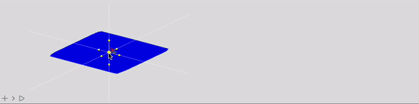
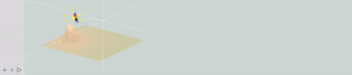

# Triangulation and basics of dynamic polygons
It is quite tricky to make an efficient function for plotting dynamic 3D surfaces, which change with time using a high-level code such as Wolfram Language.

<!--truncate-->

However, graphics library provides a low-level access to a GPU, that operates with vertices and triangles. The last one is our way to go

import { WLJSHTML, WLJSEditor, WLJSStore } from "@site/src/components/wljs-reactcells";

<WLJSStore json={require('./attachments/371da99a-1b43-4af5-8c39-cd604e67fc13.txt').default} notebook={require('./attachments/notebook-371.wln').default}/>

---

### TLDR

Download this notebook to see the result

---

## How to draw fast
There is a special structure for that

<WLJSEditor display={"codemirror"} nid={"371da99a-1b43-4af5-8c39-cd604e67fc13"} id={"a28794d1-0790-4b49-a6fa-02aa7c4d1d50"} type={"Input"} opts={{}} >{`GraphicsComplex%5Bvertices_%2C%20primitives_%2C%20%22VertexColors%22-%3Ecolors_%5D`}</WLJSEditor>

where `vertices` will be send directly to the GPU and can be efficiently updates as well. The only drawback is that the number of points has to be the same

Therfore we need to define the working mesh and triangulate it

## Random point distribution
Putting random numbers on 2D plane is not an optimal way, we need something more sophisticated

<WLJSEditor display={"codemirror"} nid={"371da99a-1b43-4af5-8c39-cd604e67fc13"} id={"746290af-28a7-4f8d-8474-b534928cbb9f"} type={"Input"} opts={{"InitGroup":true}} >{`proc%20%3D%20HardcorePointProcess%5B50%2C%200.9%2C%202%5D%3B%0Areg%20%3D%20Rectangle%5B%7B-10%2C%20-10%7D%2C%20%7B10%2C%2010%7D%5D%3B%0Asamples%20%3D%20RandomPointConfiguration%5Bproc%2C%20reg%5D%5B%22Points%22%5D%3B%0AListPlot%5Bsamples%5D`}</WLJSEditor>

<WLJSEditor display={"codemirror"} nid={"371da99a-1b43-4af5-8c39-cd604e67fc13"} id={"62d9ecf8-3529-4c0a-9588-7bbd354207a7"} type={"Output"} opts={{}} >{`%28%2AVB%5B%2A%29%28FrontEndRef%5B%22694ad5f2-7a1b-47b9-9e11-ce34dd596715%22%5D%29%28%2A%2C%2A%29%28%2A%221%3AeJxTTMoPSmNkYGAoZgESHvk5KRCeEJBwK8rPK3HNS3GtSE0uLUlMykkNVgEKm1maJKaYphnpmicaJumamCdZ6lqmGhrqJqcam6SkmFqamRuaAgCFPRWB%22%2A%29%28%2A%5DVB%2A%29`}</WLJSEditor>

here is models a set of hard-core particles, which has a certain potential that keeps them apart.

## Triangulation
We will use __Delaunay method__ for that with [some post-processing](https://mathematica.stackexchange.com/questions/277/how-to-get-actual-triangles-from-delaunaytriangulation)

<WLJSEditor display={"codemirror"} nid={"371da99a-1b43-4af5-8c39-cd604e67fc13"} id={"b647e772-6b25-4734-8080-17a56da04503"} type={"Input"} opts={{"InitGroup":true}} >{`Needs%5B%22ComputationalGeometry%60%22%5D%3B%0Atriangles2%5Bpoints_%5D%20%3A%3D%20Module%5B%7Btr%2C%20triples%7D%2C%0A%20%20tr%20%3D%20DelaunayTriangulation%5Bpoints%5D%3B%0A%20%20triples%20%3D%20Flatten%5BFunction%5B%7Bv%2C%20list%7D%2C%0A%20%20%20%20%20%20Switch%5BLength%5Blist%5D%2C%0A%20%20%20%20%20%20%20%20%28%2A%20account%20for%20nodes%20with%20connectivity%202%20or%20less%20%2A%29%0A%20%20%20%20%20%20%20%201%2C%20%7B%7D%2C%0A%20%20%20%20%20%20%20%202%2C%20%7BFlatten%5B%7Bv%2C%20list%7D%5D%7D%2C%20%0A%20%20%20%20%20%20%20%20_%2C%20%7Bv%2C%20%23%23%7D%20%26%20%40%40%40%20Partition%5Blist%2C%202%2C%201%2C%20%7B1%2C%201%7D%5D%0A%20%20%20%20%20%20%5D%0A%20%20%20%20%5D%20%40%40%40%20tr%2C%201%5D%3B%0A%20%20Cases%5BGatherBy%5Btriples%2C%20Sort%5D%2C%20a_%20%2F%3B%20Length%5Ba%5D%20%3D%3D%203%20%3A%3E%20a%5B%5B1%5D%5D%5D%5D`}</WLJSEditor>

now apply it to our data

<WLJSEditor display={"codemirror"} nid={"371da99a-1b43-4af5-8c39-cd604e67fc13"} id={"d313eaaf-8fef-47fa-b7c5-9d460072ca76"} type={"Input"} opts={{"InitGroup":true}} >{`triangles%20%3D%20triangles2%5Bsamples%5D%3B%0AListPlot%5Bsamples%2C%20Prolog-%3E%7BEdgeForm%5BBlack%5D%2C%20Yellow%2C%20Opacity%5B0.5%5D%2C%20GraphicsComplex%5Bsamples%2C%20Polygon%5Btriangles%5D%5D%7D%2C%20PlotStyle-%3E%7BRed%2C%20PointSize%5B0.03%5D%7D%5D`}</WLJSEditor>

<WLJSEditor display={"codemirror"} nid={"371da99a-1b43-4af5-8c39-cd604e67fc13"} id={"00d1f178-4d88-4a78-9808-2c2066cef86a"} type={"Output"} opts={{}} >{`%28%2AVB%5B%2A%29%28FrontEndRef%5B%224def7292-250f-4955-9beb-482692c0d671%22%5D%29%28%2A%2C%2A%29%28%2A%221%3AeJxTTMoPSmNkYGAoZgESHvk5KRCeEJBwK8rPK3HNS3GtSE0uLUlMykkNVgEKm6SkppkbWRrpGpkapOmaWJqa6lompSbpmlgYmVkaJRukmJkbAgB%2BuRUk%22%2A%29%28%2A%5DVB%2A%29`}</WLJSEditor>

For the demonstration purpose we kept the number of point very low. However, it can be increased drastically. 

## Sampling our function in 3D
Let us have an example function - a Gaussian distribution. We can sample it using our mesh and then plot it using polygons

<WLJSEditor display={"codemirror"} nid={"371da99a-1b43-4af5-8c39-cd604e67fc13"} id={"a51106cc-7ec2-4b2b-a765-c08c9fdda4f4"} type={"Input"} opts={{"InitGroup":true}} >{`%28%2A%20sample%20function%20%2A%29%0Af%5Bp_%2C%20%7Bx_%2Cy_%2Cz_%7D%5D%20%3A%3D%20z%20Exp%5B-%28%2AFB%5B%2A%29%28%28%28%2ASpB%5B%2A%29Power%5BNorm%5Bp%20-%20%7Bx%2Cy%7D%5D%28%2A%7C%2A%29%2C%28%2A%7C%2A%292%5D%28%2A%5DSpB%2A%29%29%28%2A%2C%2A%29%2F%28%2A%2C%2A%29%282.%29%29%28%2A%5DFB%2A%29%5D%0A%0Aprobe%20%3D%20%7B%23%5B%5B1%5D%5D%2C%20%23%5B%5B2%5D%5D%2C%20f%5B%23%2C%20%7B10%2C%200%2C%200%7D%5D%7D%20%26%2F%40%20samples%20%2F%2F%20Chop%3B%0Acolors%20%3D%20With%5B%7Bmm%20%3D%20MinMax%5Bprobe%5B%5BAll%2C3%5D%5D%5D%7D%2C%0A%20%20%20%20%20%20%28Blend%5B%7B%7Bmm%5B%5B1%5D%5D%2C%20Blue%7D%2C%20%7Bmm%5B%5B2%5D%5D%2C%20Red%7D%7D%2C%20%23%5B%5B3%5D%5D%5D%20%29%26%2F%40%20probe%20%2F.%20%7BRGBColor%20-%3E%20List%7D%20%2F%2F%20Chop%5D%3B`}</WLJSEditor>

Make a static plot

<WLJSEditor display={"codemirror"} nid={"371da99a-1b43-4af5-8c39-cd604e67fc13"} id={"92b3e674-f302-4625-b377-bfd1d07f3bef"} type={"Input"} opts={{}} >{`Graphics3D%5B%7B%0A%20%20GraphicsComplex%5Bprobe%2C%20%7BPolygon%5Btriangles%5D%7D%2C%20%22VertexColors%22-%3Ecolors%5D%0A%7D%5D`}</WLJSEditor>

<WLJSEditor display={"codemirror"} nid={"371da99a-1b43-4af5-8c39-cd604e67fc13"} id={"ffbe3431-fd0d-4613-9b8c-7a38317d579a"} type={"Output"} opts={{}} >{`%28%2AVB%5B%2A%29%28FrontEndRef%5B%2218250678-2582-4554-b34a-6986be55867e%22%5D%29%28%2A%2C%2A%29%28%2A%221%3AeJxTTMoPSmNkYGAoZgESHvk5KRCeEJBwK8rPK3HNS3GtSE0uLUlMykkNVgEKG1oYmRqYmVvoGplaGOmamJqa6CYZmyTqmllamCWlmppamJmnAgBlMhRt%22%2A%29%28%2A%5DVB%2A%29`}</WLJSEditor>

## Dynamic plot
Now we need only to add `Offload` wrappers in order to make our data alive as well as some elements of control to manipulate the data

**evaluate initialization cells, before running this one**

<WLJSEditor display={"codemirror"} nid={"371da99a-1b43-4af5-8c39-cd604e67fc13"} id={"1c6ff7e6-12f6-4c2a-8a35-a2b11a6d59cc"} type={"Input"} opts={{}} >{`Graphics3D%5B%7B%0A%20%20GraphicsComplex%5Bprobe%20%2F%2F%20Offload%2C%20%7BPolygon%5Btriangles%5D%7D%2C%20%22VertexColors%22-%3EOffload%5Bcolors%2C%20%22Static%22-%3ETrue%5D%5D%2C%0A%0A%20%20EventHandler%5BSphere%5B%7B0%2C0%2C0%7D%2C%200.1%5D%2C%20%7B%22transform%22-%3EFunction%5Bdata%2C%20With%5B%7Bpos%20%3D%20data%5B%22position%22%5D%7D%2C%0A%20%20%20%20probe%20%3D%20%7B%23%5B%5B1%5D%5D%2C%20%23%5B%5B2%5D%5D%2C%20f%5B%23%2C%20pos%5D%7D%20%26%2F%40%20samples%20%2F%2F%20Chop%3B%0A%20%20%20%20colors%20%3D%20With%5B%7Bmm%20%3D%20MinMax%5Bprobe%5B%5BAll%2C3%5D%5D%5D%7D%2C%0A%20%20%20%20%20%20%28Blend%5B%7B%7Bmm%5B%5B1%5D%5D%2C%20Blue%7D%2C%20%7Bmm%5B%5B2%5D%5D%2C%20Red%7D%7D%2C%20%23%5B%5B3%5D%5D%5D%20%29%26%2F%40%20probe%20%2F.%20%7BRGBColor%20-%3E%20List%7D%20%2F%2F%20Chop%5D%3B%0A%20%20%5D%5D%7D%5D%0A%7D%5D`}</WLJSEditor>

Or variation with a light-source

<WLJSEditor display={"codemirror"} nid={"371da99a-1b43-4af5-8c39-cd604e67fc13"} id={"ea0ad5fb-0530-43a8-95a1-1ee9fe8fbbc8"} type={"Input"} opts={{}} >{`light%20%3D%20%7B0%2C0%2C0%7D%3B%0AGraphics3D%5B%7B%0A%20%20GraphicsComplex%5Bprobe%20%2F%2F%20Offload%2C%20%7BPolygon%5Btriangles%5D%7D%5D%2C%0A%20%20PointLight%5BRed%2C%20light%20%2F%2F%20Offload%5D%2C%0A%0A%20%20EventHandler%5BSphere%5B%7B0%2C0%2C0%7D%2C%200.1%5D%2C%20%7B%22transform%22-%3EFunction%5Bdata%2C%20With%5B%7Bpos%20%3D%20data%5B%22position%22%5D%7D%2C%0A%20%20%20%20probe%20%3D%20%7B%23%5B%5B1%5D%5D%2C%20%23%5B%5B2%5D%5D%2C%20f%5B%23%2C%20pos%5D%7D%20%26%2F%40%20samples%20%2F%2F%20Chop%3B%0A%20%20%20%20light%20%3D%20pos%3B%0A%20%20%5D%5D%7D%5D%0A%7D%5D`}</WLJSEditor>

