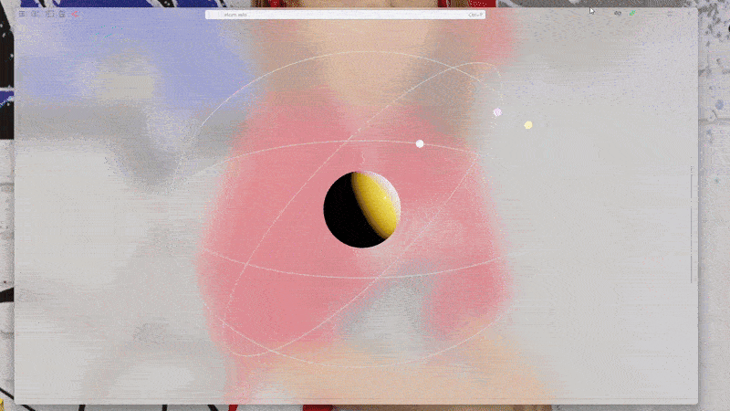

Here is a short code snippet for atom (artistic-vision) animation



<!--truncate-->

```mathematica
path1 = Table[{5 * Sin[t], 5 * Cos[t], 0}, {t, 0.0, 8*Pi, Pi/360.0}]; 
light1 = path1[[1]]; 

path2 = RotationTransform[2Pi/3, {1, 0, 0}] /@ path1; 
light2 = path2[[1]]; 

path3 = RotationTransform[4Pi/3, {1, 0, 1}] /@ path1; 
light3 = path3[[1]];
```

```mathematica
Graphics3D[{  
  {  
    MeshMaterial[MeshPhysicalMaterial[]],   
    Roughness[0.1],   
    Sphere[]  
  },   
  {  
    PointLight[Cyan, Offload @ light1],   
    PointLight[Magenta, Offload @ light2],   
    PointLight[Orange, Offload @ light3]  
  },   
  {  
    Emissive[Cyan, 5], Sphere[Offload @ light1, 0.1],   
    Emissive[Magenta, 5], Sphere[Offload @ light2, 0.1],   
    Emissive[Orange, 5], Sphere[Offload @ light3, 0.1]  
  },   
  {  
    LightBlue, Line[path1],   
    LightRed, Line[path2],   
    LightGreen, Line[path3]  
  }  
},   
  ImageSize -> 1200,   
  PlotRange -> {{-10, 10}, {-10, 10}, {-10, 10}},   
  Lighting -> None  
]
```

```mathematica
t := Mod[Round[AbsoluteTime[] * 100] + 1, Length[path1]]

SetInterval[
  light1 = path1[[t]]; 
  light2 = path2[[t]]; 
  light3 = path3[[t]]; 
, 10]
```