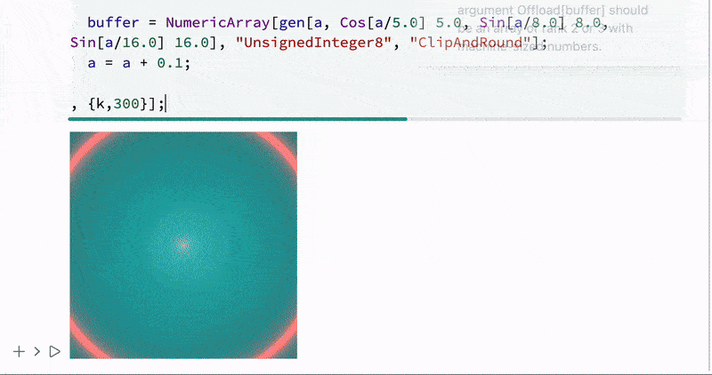

Another raster animation. Now without OpenCL, pure WL and `Compile`



<!--truncate-->

```mathematica
gen = Compile[{{time, _Real}, {f1, _Real}, {f2, _Real}, {f3, _Real}},
Table[With[{fpos = {i,j}},
  With[{result = Module[{
      d0 = Norm[fpos], 
      d1 = 1.0, 
      d2 = 1.0, 
      d3 = 1.0
    },
    
    d1 = Sin[d0 f1 + time]/6.;
    d2 = Sin[d0 f2 + time]/6.;
    d3 = Sin[d0 f3 + time]/6.;
    
    d1 = Abs[d1];
    d2 = Abs[d2];
    d3 = Abs[d3];
    
    d1 = 0.02 / (d1 + 0.01);
    d2 = 0.02 / (d2 + 0.01);
    d3 = 0.02 / (d3 + 0.01);
    
    {d1, d2, d3} 255.0
  ]},
    result
  ]
], {i, -0.5, 0.5, 1.0/500.0}, {j, -0.5, 0.5, 1.0/500.0}]
, CompilationTarget->"C", RuntimeOptions->"Speed"];

buffer = NumericArray[gen[0,5.0, 8.0, 16.0], "UnsignedInteger8", "ClipAndRound"];

Image[buffer // Offload, "Byte"]

a = 0.0;
Do[

  buffer = NumericArray[gen[a, Cos[a/5.0] 5.0, Sin[a/8.0] 8.0, Sin[a/16.0] 16.0], "UnsignedInteger8", "ClipAndRound"];
  a = a + 0.1;
  
, {k,300}];
```