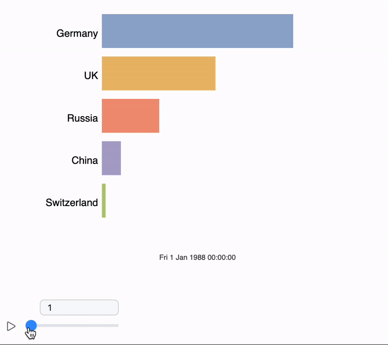

You've likely seen videos featuring animated bar charts with a timeline, where the bars dynamically shift and overtake each other



<!--truncate-->

```mathematica
Options[barTimelineAnimated] = {PlotLegends -> Automatic};

getMagnitude[e_Quantity] := QuantityMagnitude[e];
getMagnitude[e_] := e;

getLevels = Function[{list}, 
  SortBy[
    MapIndexed[Function[{value, index}, {value, index // First}], Ordering[list]], 
    First
  ][[All, 2]]
];

barTimelineAnimated[l_List, OptionsPattern[]] := With[{
  timeline = MinimalBy[(#["Times"] & /@ l), Length] // First,
  labels = If[OptionValue[PlotLegends] === Automatic, Range[Length[l]], OptionValue[PlotLegends]],
  interpolated = TimeSeries[#, MissingDataMethod -> Automatic] & /@ l
},

  With[{
    first = getMagnitude[#[timeline // First]] & /@ interpolated
  },

    Module[{
      levels = getLevels[first] / Length[first] // N,
      order = getLevels[first],
      rects,
      date = timeline // First // DateObject // TextString,
      recalc
    },

      recalc[index_] := With[{values = getMagnitude[#[timeline[[index]]]] & /@ interpolated},

        With[{newOrdering = getLevels[values]},
          If[order != newOrdering,
            order = newOrdering;
            levels = newOrdering / Length[first] // N;
          ];
        ];

        date = timeline[[index]] // DateObject // TextString;

        With[{min = Min[values], max = Max[values]},
          rects = ((values - min) / (max - min) + 0.02) / 1.02;
        ];
      ];

      recalc[1];

      Column[{
        With[{spacing = 0.8 / Length[levels]}, 
          Graphics[{
            Text[date // Offload, {0.5, 0.}, {0, 0}],
            Directive[TransitionType -> "CubicInOut", TransitionDuration -> 500],
            Table[
              With[{i = i},
                Translate[{
                  ColorData[97][i] // Lighter,
                  {
                    Directive[TransitionType -> "Linear", TransitionDuration -> 20],
                    Rectangle[{0, 0}, {Offload[rects[[i]]], spacing}]
                  },
                  Black,
                  Text[Style[labels[[i]], FontSize -> 14], {-0.02, spacing / 3.0}, {1, 0}]
                }, {0, Offload[levels[[i]]]}]
              ], 
              {i, 1, Length[rects]}
            ]
          }, PlotRange -> {{-0.4, 1}, {-0.1, 1 + spacing}}, ImagePadding -> None]
        ],
        
        EventHandler[InputRange[1, Length[timeline], 1, 1], recalc]
      }]
    ]
  ]
];

(* test it! *)

country = {"Germany", "UK", "Switzerland", "Russia", "China"};
gdp = CountryData[#, {"GDP", {1970, 2015}}] &/@ country;

barTimelineAnimated[gdp, PlotLegends->country]
```