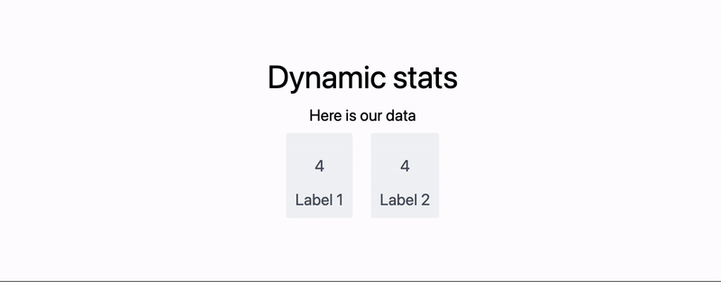

How to make simple counter animation for slides  



<!--truncate-->
  
Make a counter component in WLX

```jsx
.wlx

Stat[Text_, OptionsPattern[]] := LeakyModule[{
  cnt = 0, 
  task
}, With[{
  ev = CreateUUID[],
  HTMLCounter = HTMLView[cnt // Offload],
  max = OptionValue["Count"]
},
  EventHandler[ev, {
    "Destroy" -> Function[Null,
      EventRemove[ev]; 
      If[task["TaskStatus"] === "Running", TaskRemove[task]];
      ClearAll[task];
    ],

    "Left" -> Function[Null,
      cnt = 0;
    ],

    "Slide" -> Function[Null,
      If[task["TaskStatus"] === "Running", TaskRemove[task]];
      task = SetInterval[
        If[cnt < max, cnt = cnt + 1,
          TaskRemove[task];
        ];
      , 15];
    ]
  }];

  <div class="text-center text-gray-600 m-4 p-4 rounded bg-gray-100 flex flex-col">
    <HTMLCounter/>
    <span class="text-md"><Text/></span>
    <SlideEventListener Id={ev}/>
  </div>
] ]

Options[Stat] = {"Count"->1};


```

Place it on slide

```jsx
.slide

# Dynamic stats
Here is our data

<div class="justify-center flex flex-row ml-auto mr-auto">

<Stat Count={128}>Label 1</Stat>
<Stat Count={256}>Label 2</Stat>

</div>
```