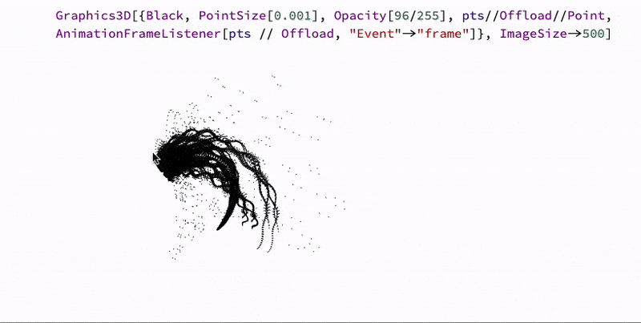

An adapted animation from Wolfram Community



<!--truncate-->

```mathematica
ClearAll[a];

a = Compile[{{x, _Real}, {y, _Real}, {t, _Real}}, Module[{k, e, o, d, q, c, xOut, yOut},

  k = x / 8 - 25;

  e = y / 8 - 25;

  o = Sqrt[k^2 + e^2] / 3;

  d = 5 * Cos[o];

  q = x / 2 + (k / ArcTan[9 * Cos[e]]) * Sin[4 * d - t];

  c = d / 3 - t / 8;

  xOut = q * Sin[c] + 200;

  yOut = ((y / 4 + 5 * o^2 + q) / 2) * Cos[c] + 200;

   

  {xOut, yOut, 0.}

], "CompilationTarget" -> "C",  "RuntimeOptions" -> "Speed"];


points[t_] := Flatten[Table[a[x,y,t],{y,100,299},{x,100,299}],1];

t = 0;

EventHandler["frame", Function[Null,

 pts = points[t = t + 0.02];

]];


pts = points[0];


Graphics3D[{Black, PointSize[0.001], Opacity[46/255], pts//Offload//Point, AnimationFrameListener[pts // Offload, "Event"->"frame"]}, ImageSize->500]
```

We used here `Graphics3D` since it is faster, when it comes to many small objects.