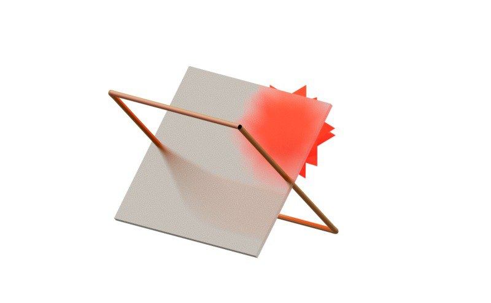

A tandem of RevealJS and Wolfram Language made using `Graphics3D` and Path-tracing



<!--truncate-->

```mathematica
With[{a = 30, b = 30}, {
  {
    {
      Graphics3D`Materials["Glass"], 
      Directive[
        "MaterialThickness" -> 0, 
        "Transmission" -> 0.8, 
        "Roughness" -> 0.5
      ], 
      Orange, 
      GeometricTransformation[
        Cuboid[{-1.1 a, -1.1 a, -b 0.03}, {1.1 a, 1.1 a, b 0.03}], 
        RotationMatrix[-45 Degree, {0, 1, 0}]
      ]
    },
    {
      Graphics3D`Materials["Iridescent"], 
      Pink, 
      With[{i = Interpolation[
        {
          {0, {-a, -a, b}}, 
          {0.25, {-a, a, b}}, 
          {0.5, {a, a, -b}}, 
          {0.75, {a, -a, -b}}, 
          {1.0, {-a, -a, b}}, 
          {1.2, {-a, -a, b}}
        }, InterpolationOrder -> 1
      ]},
      Tube[Table[i[j], {j, 0, 1.2, 0.01}]]
      ]
    }
  },
  Red, 
  Directive["Emissive" -> Red], 
  Translate[
    GeometricTransformation[
      PolyhedronData["RhombicHexecontahedron", "Faces"] // N, 
      IdentityMatrix[3] * 8
    ], 
    {40, 0, 0}
  ]
}];

Graphics3D[%, 
  ViewProjection -> "Perspective", 
  "Renderer" -> "PathTracing", 
  ImageSize -> 800
]
```