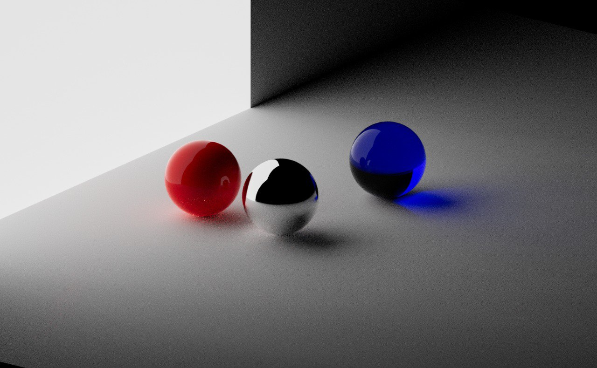

We refined our `Graphics3D` to support different material parameters



<!--truncate-->

```mathematica
Graphics3D[{
  Polygon[30 {{-1,-1,0}, {-1,1,0}, {1,1,0}, {1,-1,0}}],
  {Directive["Metalness"->1, "Roughness"->0], Sphere[{-5,0,2},2]},
  {Directive["Roughness"->0], Red, Sphere[{-5,5,2},2]},
  {Directive["Roughness"->0, "Transmission"->1.0, "MaterialThickness"->0.2], Blue, Sphere[{3,-1,2},2]},

  {Directive["Emissive"->White], Polygon[ {{10,13,0},{10,13,30},{-20,13,30},{-20,13,0}}]}
}, Lighting->None, Background->Black, "Renderer"->"PathTracing", ImageSize->700]
```