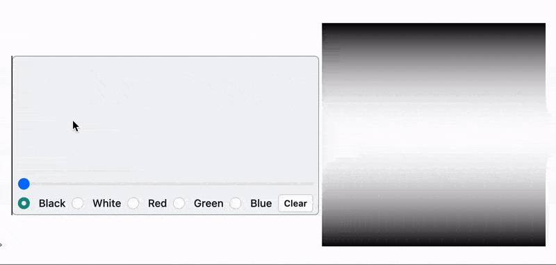

Learning Fraunhofer diffraction with Wolfram Language and WLJS Notebook



<!--truncate-->

```mathematica
amplidute2D[data_] := Module[{d, fw, nRow, nCol},
  {nRow, nCol} = Dimensions[data];
  d = data;
  d = d*(-1)^Table[i + j, {i, nRow}, {j, nCol}];
  fw = Fourier[d, FourierParameters -> {1, 1}];
  
  Log[1 + Abs@fw]
]


LeakyModule[{
  buffer = ImageData[ConstantImage[0, {300,300}], "Real32"],
  shape = InputRaster[ImageSize->{300,300}, "AllowUpdateWhileDrawing"->True]
},

  EventHandler[shape, Function[new, 
    With[{array = ImageData[RemoveAlphaChannel[new, White] // Binarize // ColorNegate, "Real32"]},
      With[{amp = amplidute2D[array]},
        buffer = amp / Max[amp];
      ];
    ]
  ]];
  
  {
    shape,
    Image[buffer // Offload, "Real32"]
  } // Row
]
```