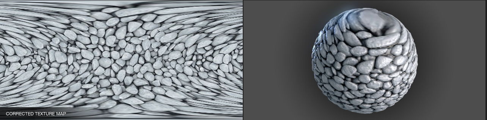
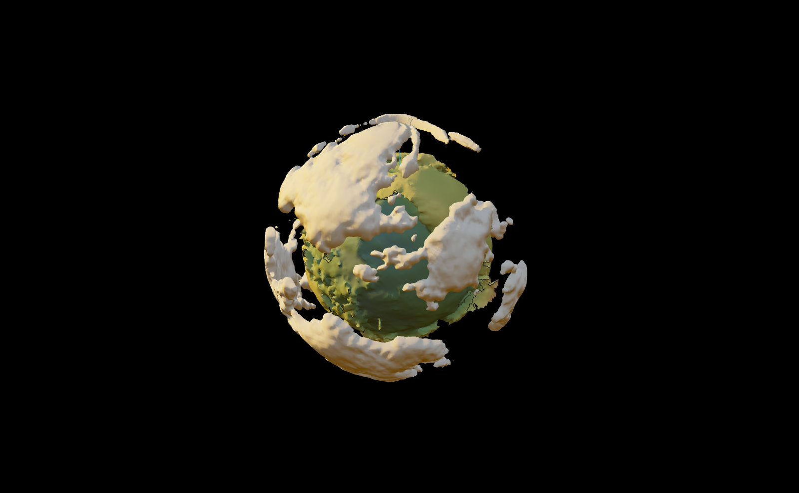
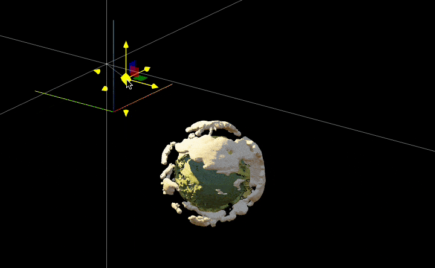

# Modeling Earth
*using GeoData, surface plot, and a bunch of other beautiful stuff*

Have you ever played Outer Wilds? The planets there are incredibly beautiful. This actually became the main motivation to create my own simple model of a planet, using real geographical elevation data and a bit of Wolfram Language magic.

<!--truncate-->

import { WLJSHTML, WLJSEditor, WLJSStore } from "@site/src/components/wljs-reactcells";

<WLJSStore kernel={require('./attachments/kernel.txt').default} json={require('./attachments/8efbb6eb-5f2a-48c8-95ab-69875db3ed41.txt').default} notebook={require('./attachments/notebook-8ef.wln').default}/>

## Spreading points on a sphere

Obviously, even if we grab Earth's elevation map, there’s the problem of projecting it onto a sphere. This is a complex topic involving triangulation (since we need to create polygons from it afterward) and more, with plenty written on the subject. For example:

- [Delaunay and Voronoi on a Sphere](https://www.redblobgames.com/x/1842-delaunay-voronoi-sphere/)  
- [Four Ways to Create a Mesh for a Sphere](https://medium.com/@oscarsc/four-ways-to-create-a-mesh-for-a-sphere-d7956b825db4)  

As one approach, we’ll go the other way around—first generating sample points on the sphere, then querying the elevation data for those points.  

So, we need to evenly distribute **N** points across a sphere. No need to reinvent the wheel when a rich standard library is available.  

<WLJSEditor display={"codemirror"} nid={"8efbb6eb-5f2a-48c8-95ab-69875db3ed41"} id={"bbd2d06b-5d31-4c91-ad0b-82ddcc132589"} type={"Input"} opts={{}} >{`Graphics3D%5B%7B%0A%20%20Sphere%5B%5D%2C%0A%20%20Red%2C%20PointSize%5B0.01%5D%2C%20SpherePoints%5B1000%5D%2F%2FPoint%0A%7D%5D%0A`}</WLJSEditor>

## Get Elevation Data
Fortunately (or unfortunately), the standard WL library already includes a rough map of the entire Earth (just in case). If more precision is needed, it can go online and fetch higher-resolution data.  

So, let’s get down to business

<WLJSEditor display={"codemirror"} nid={"8efbb6eb-5f2a-48c8-95ab-69875db3ed41"} id={"1282a522-deb2-46d9-9239-a9365b896b47"} type={"Input"} opts={{}} >{`GeoElevationData%5BGeoPosition%5BHere%5D%5D`}</WLJSEditor>

<WLJSEditor display={"codemirror"} nid={"8efbb6eb-5f2a-48c8-95ab-69875db3ed41"} id={"a919f2ad-c056-459f-ab1e-f42895e96f22"} type={"Output"} opts={{}} >{`%28%2AVB%5B%2A%29%28q%29%28%2A%2C%2A%29%28%2A%221%3AeJxTTMoPSmNkYGAoZgESHvk5KWlMIB43kAgsTcwrySypdMqvKGIAgQV1DsFsQNo3tSS1qBgAdxkNsQ%3D%3D%22%2A%29%28%2A%5DVB%2A%29`}</WLJSEditor>

Here, `Here` returns the current latitude and longitude in degrees. The function can take not just a single value but an entire list. Naturally, we’ll use this list from the points on the sphere.  

<WLJSEditor display={"codemirror"} nid={"8efbb6eb-5f2a-48c8-95ab-69875db3ed41"} id={"bc08a857-e1bf-4828-8d19-331be92abcd4"} type={"Input"} opts={{}} >{`points%20%3D%20SpherePoints%5B5000%5D%3B%0AlatLon%20%3D%20%28%2AFB%5B%2A%29%28%28180%29%28%2A%2C%2A%29%2F%28%2A%2C%2A%29%28Pi%29%29%28%2A%5DFB%2A%29%20%7B90Degree%20-%20ArcCos%5B%23%5B%5B3%5D%5D%5D%2C%20ArcTan%5B%23%5B%5B1%5D%5D%2C%20%23%5B%5B2%5D%5D%5D%7D%20%26%2F%40%20points%3B%0Aelevation%20%3D%20GeoElevationData%5BGeoPosition%5BlatLon%5D%5D%3B%0Aelevation%20%3D%20%28elevation%20%2B%20Min%5Belevation%5D%29%2FMax%5Belevation%5D%3B`}</WLJSEditor>

In the case if `Geo` did not work. Here is a dump

<WLJSEditor display={"codemirror"} nid={"8efbb6eb-5f2a-48c8-95ab-69875db3ed41"} id={"7063a966-d01e-4416-8589-fd3b335e6521"} type={"Input"} opts={{}} >{`%7Bpoints%2C%20latLon%2C%20elevation%7D%20%3D%20NotebookStore%5B%22mouse-850%22%5D%3B`}</WLJSEditor>

Here we convert from Cartesian coordinates to spherical (more precisely, geodetic) coordinates

$$
\begin{matrix}

lat =& 90^\circ - arccos(z/r) \\
lon =& arctan(x/y)
\end{matrix}
$$

we retrieve the elevations and normalize them.  

The final step is to link them back to the original points on the sphere, using the normalized elevation as the distance along the normal.  

<WLJSEditor display={"codemirror"} nid={"8efbb6eb-5f2a-48c8-95ab-69875db3ed41"} id={"54ca5e22-e45d-4bd0-b281-e5b8825c1617"} type={"Input"} opts={{}} >{`surface%20%3D%20MapThread%5B%28%231%20%280.8%20%2B%200.1%20%232%29%29%26%2C%20%7Bpoints%2C%20elevation%7D%5D%3B`}</WLJSEditor>

Here, we scale them by eye so that the height above sea level only slightly "modulates" the sphere’s surface. This way, we get a visible relief of the Earth

<WLJSEditor display={"codemirror"} nid={"8efbb6eb-5f2a-48c8-95ab-69875db3ed41"} id={"b1122254-4d6a-4cdc-b8e4-24b6f0157be0"} type={"Input"} opts={{"Hidden":false}} >{`rainbow%20%3D%20ColorData%5B%22DarkRainbow%22%5D%3B%0A%0AListSurfacePlot3D%5Bsurface%2C%20%0A%20%20Mesh-%3ENone%2C%20MaxPlotPoints-%3E100%2C%20%0A%20%20ColorFunction%20-%3E%20Function%5B%7Bx%2Cy%2Cz%7D%2C%20%0A%20%20%20%20%20%20rainbow%5B1.5%282%20Norm%5B%7Bx%2Cy%2Cz%7D%5D-1%29%5D%0A%20%20%5D%2C%20ColorFunctionScaling%20-%3E%20False%0A%5D`}</WLJSEditor>

That looks like Earth!

## Generating clouds
What’s Earth without clouds? And what are clouds without Perlin noise?  

The next piece I honestly stole from one of the forums (no GPT for you!)

<WLJSEditor display={"codemirror"} nid={"8efbb6eb-5f2a-48c8-95ab-69875db3ed41"} id={"1f8c889b-6c72-4223-b723-8c980b115fc5"} type={"Input"} opts={{}} >{`n%20%3D%20128%3B%0Ak2%20%3D%20Outer%5BPlus%2C%20%23%2C%20%23%5D%20%26%5BRotateRight%5BN%40Range%5B-n%2C%20n%20-%201%2C%202%5D%2Fn%2C%20n%2F2%5D%5E2%5D%3B%0A%0Aspectrum%20%3D%20With%5B%7Bd%20%3A%3D%20RandomReal%5BNormalDistribution%5B%5D%2C%20%7Bn%2C%20n%7D%5D%7D%2C%0A%20%20%20%281%2Fn%29%20%28d%20%2B%20I%20d%29%2F%280.002%20%2B%20k2%29%5D%3B%20%0Aspectrum%5B%5B1%2C%201%5D%5D%20%2A%3D%200%3B%0A%0Aim%5Bp_%5D%20%3A%3D%20Clip%5BRe%5BInverseFourier%5Bspectrum%20Exp%5BI%20p%5D%5D%5D%2C%20%7B0%2C%20%E2%88%9E%7D%5D%5E0.5%0A%0Ap0%20%3D%20p%20%3D%20Sqrt%5Bk2%5D%3B%0A%0AImage%5Bim%5Bp0%20%2B%3D%20p%5D%2C%20Magnification-%3E2%5D`}</WLJSEditor>

Here animated version

<WLJSEditor display={"codemirror"} nid={"8efbb6eb-5f2a-48c8-95ab-69875db3ed41"} id={"5682a891-31ac-49e3-8083-04e61290a953"} type={"Input"} opts={{}} >{`Module%5B%7Bbuffer%20%3D%20im%5Bp0%20%2B%3D%20p%5D%2C%20frame%20%3D%20CreateUUID%5B%5D%7D%2C%0A%20%20EventHandler%5Bframe%2C%20%28buffer%20%3D%20im%5Bp0%20%2B%3D%20p%5D%29%26%5D%3B%0A%20%20%0A%20%20Image%5Bbuffer%20%2F%2F%20Offload%2C%20%0A%20%20%20%20Magnification-%3E2%2C%20%0A%20%20%20%20Epilog-%3EAnimationFrameListener%5Bbuffer%20%2F%2F%20Offload%2C%20%22Event%22-%3Eframe%5D%0A%20%20%5D%0A%5D`}</WLJSEditor>

How do we make them three-dimensional? I couldn’t think of anything better than using the Marching Cubes technique to generate low-poly clouds.  

However, to start, we’ll "stretch" the 2D image into 3D with fading at the edges.  

<WLJSEditor display={"codemirror"} nid={"8efbb6eb-5f2a-48c8-95ab-69875db3ed41"} id={"d547c0ae-59d6-4167-8ff6-d8049e07ef37"} type={"Input"} opts={{}} >{`With%5B%7Bplain%20%3D%20im%5Bp0%2B%3Dp%5D%7D%2C%20Table%5Bplain%20Exp%5B-%28%20i%29%5E2%2F200.%5D%2C%20%7Bi%2C%20-20%2C20%7D%5D%5D%5B%5B%3B%3B%3B%3B8%2C%20%3B%3B%3B%3B8%2C%20%3B%3B%3B%3B8%5D%5D%20%2F%2F%20Image3D%20`}</WLJSEditor>

<WLJSEditor display={"codemirror"} nid={"8efbb6eb-5f2a-48c8-95ab-69875db3ed41"} id={"526acaa8-1699-4d29-b715-934bde224592"} type={"Output"} opts={{}} >{`%28%2AVB%5B%2A%29%28Image3DDump28%29%28%2A%2C%2A%29%28%2A%221%3AeJxTTMoPSmNkYGAoZgESHvk5KRCeEJBwK8rPK3HNS3GtSE0uLUlMykkNVgEKm6WmGRulJlvomhsYGOuamJmZ6Fomm5voJlqaJRkkJ6WmWqSmAgCAOhXh%22%2A%29%28%2A%5DVB%2A%29`}</WLJSEditor>

*this is not an image, try to drag*

To turn this scalar field into polygons, we can use the `ImageMesh` function. However, it's quite challenging to work with when nonlinear transformations need to be applied to the mesh. And we will need to do these transformations, otherwise, how will we map this square onto the sphere?

Let’s use an external library, `wl-marchingcubes`.  

<WLJSEditor display={"codemirror"} nid={"8efbb6eb-5f2a-48c8-95ab-69875db3ed41"} id={"0da848ad-0138-4d23-964c-6569541a0f0c"} type={"Input"} opts={{}} >{`PacletRepositories%5B%7B%0A%20%20%20%20Github%20-%3E%20%22https%3A%2F%2Fgithub.com%2FJerryI%2Fwl-marching-cubes%22%20-%3E%20%22master%22%0A%7D%5D%0A%0A%3C%3CJerryI%60MarchingCubes%60`}</WLJSEditor>

<WLJSEditor display={"codemirror"} nid={"8efbb6eb-5f2a-48c8-95ab-69875db3ed41"} id={"733317c9-0f7e-48c8-81d9-836c5a5be035"} type={"Input"} opts={{}} >{`With%5B%7Bplain%20%3D%20im%5Bp0%2B%3Dp%5D%7D%2C%20Table%5Bplain%20Exp%5B-%28%20i%29%5E2%2F200.%5D%2C%20%7Bi%2C%20-20%2C20%7D%5D%5D%3B%0A%0A%7Bvertices%2C%20normals%7D%20%3D%20CMarchingCubes%5B%25%2C%200.2%5D%3B`}</WLJSEditor>

The result is stored in `vertices`. By default, the library generates an unindexed set of triangle vertices. This means we can directly interpret them as 

<WLJSEditor display={"codemirror"} nid={"8efbb6eb-5f2a-48c8-95ab-69875db3ed41"} id={"b261854a-a9c9-4aa6-aa68-954f1b1f2b1f"} type={"Input"} opts={{}} >{`Polygon%5B%7B%0A%20%20%7B1%2C%202%2C%203%7D%2C%20%2F%2F%20Triangle%201%0A%20%20%7B4%2C%205%2C%206%7D%2C%20%2F%2F%20Triangle%202%0A%20%20...%0A%7D%5D`}</WLJSEditor>

Where none of the vertices are reused by another triangle. This format is especially simple for the GPU, as only one such list needs to be sent to one of the WebGL buffers. Fortunately, the `Polygon` primitive supports this format

<WLJSEditor display={"codemirror"} nid={"8efbb6eb-5f2a-48c8-95ab-69875db3ed41"} id={"706bf7f9-87c2-489f-9542-410fb0eb7aa1"} type={"Input"} opts={{}} >{`GraphicsComplex%5Bvertices%2C%20Polygon%5B1%2C%20Length%5Bvertices%5D%5D%5D%20%2F%2F%20Graphics3D`}</WLJSEditor>

### Inverse UV-mapping

It is important to note, that on the next few steps we will map those clouds on the sphere (our Earth surface model). The easiest way is to perform so-called __UV-mapping__, which will naturally distort our original texture. ==Especially on poles==.

For the educational purpose let's perform a naive inverse UV-mapping (from the the "texture" to a sphere)

$$
\begin{matrix}
x \rightarrow & \rho ~ cos(\phi) sin(\theta) \\
y \rightarrow & \rho ~ sin(\phi) sin(\theta) \\
z \rightarrow & \rho ~ cos(\theta)
\end{matrix}
$$

where $\phi = 2\pi u$, $\theta = \pi v$ and $\rho$ is 3rd coordinate (depth). Those 3 coordinates are vertices of generated clouds $(u, v, \rho)$ normalized in the range from 0 to 1 (except $\rho$)

<WLJSEditor display={"codemirror"} nid={"8efbb6eb-5f2a-48c8-95ab-69875db3ed41"} id={"fb9099e2-3df9-47dd-9ce4-c01af9e1a094"} type={"Input"} opts={{}} >{`With%5B%7Bplain%20%3D%20im%5Bp0%20%2B%3D%20p%5D%7D%2C%20Table%5Bplain%20Exp%5B-%28%20i%29%5E2%2F200.%5D%2C%20%7Bi%2C%20-20%2C20%7D%5D%5D%3B%0A%0A%7Bvertices%2C%20normals%7D%20%3D%20CMarchingCubes%5B%25%2C%200.2%2C%20%22CalculateNormals%22%20-%3E%20False%5D%3B%0A%0Avertices%20%3D%20With%5B%7B%0A%20%20offset%20%3D%20%7BMin%5Bvertices%5B%5BAll%2C1%5D%5D%5D%2C%20Min%5Bvertices%5B%5BAll%2C2%5D%5D%5D%2C%200%7D%2C%0A%20%20maxX%20%3D%20Max%5Bvertices%5B%5BAll%2C1%5D%5D%5D%20-%20Min%5Bvertices%5B%5BAll%2C1%5D%5D%5D%2C%0A%20%20maxY%20%3D%20Max%5Bvertices%5B%5BAll%2C2%5D%5D%5D%20-%20Min%5Bvertices%5B%5BAll%2C2%5D%5D%5D%0A%7D%2C%20Map%5BFunction%5Bv%2C%20With%5B%7Bp%20%3D%20v%20-%20offset%7D%2C%20%7Bp%5B%5B1%5D%5D%2FmaxX%2C%20p%5B%5B2%5D%5D%2FmaxY%2C%20p%5B%5B3%5D%5D%7D%5D%5D%2C%20vertices%5D%5D%3B%0A%0Apvertices%20%3D%20Map%5BFunction%5Bv%2C%0A%20%20%20%20With%5B%7B%5C%5BRho%5D%20%3D%2050.0%20%2B%200.25%20%28v%5B%5B3%5D%5D%20-%2010%29%2C%20%5C%5BPhi%5D%20%3D%20%202%20Pi%20Clip%5Bv%5B%5B1%5D%5D%2C%20%7B0%2C1%7D%5D%2C%20%5C%5BTheta%5D%20%3D%20%20Pi%20Clip%5Bv%5B%5B2%5D%5D%2C%20%7B0%2C1%7D%5D%7D%2C%0A%20%20%20%20%20%20%7B%5C%5BRho%5D%20Cos%5B%5C%5BPhi%5D%5D%20Sin%5B%5C%5BTheta%5D%5D%2C%20%5C%5BRho%5D%20Sin%5B%5C%5BPhi%5D%5D%20Sin%5B%5C%5BTheta%5D%5D%2C%20%5C%5BRho%5D%20Cos%5B%5C%5BTheta%5D%5D%7D%0A%20%20%20%20%5D%0A%20%20%5D%0A%2C%20vertices%5D%3B%0A%0A%7B%0A%20%20GraphicsComplex%5B0.017%20pvertices%2C%20Polygon%5B1%2C%20Length%5Bvertices%5D%5D%5D%0A%7D%20%2F%2F%20Graphics3D`}</WLJSEditor>

This looks horrible on the poles, when $\theta$ is approaching $\pi$ or $0$ 👎

:::note
There __are two problems to solve__

- distorshions on poles
- incorrect aspect ratio
:::

<WLJSHTML>{`%3Cbr%20%2F%3E`}</WLJSHTML>

We need to go back and rethink our approach.

### Correcting aspect ratio
This is relatively easy to fix, we need a rectangle with 1/2 ratio, since $\phi$ goes up to $2\pi$ compared to $\theta$

<WLJSEditor display={"codemirror"} nid={"8efbb6eb-5f2a-48c8-95ab-69875db3ed41"} id={"d897f6b9-d487-42c1-9adc-652244812a19"} type={"Input"} opts={{}} >{`n%20%3D%20256%3B%0Aratio%20%3D%201%2F2%3B%0A%0Ak2%20%3D%20Outer%5BPlus%2C%20%23%2C%20%23%5D%20%26%5BRotateRight%5BN%40Range%5B-n%2C%20n%20-%201%2C%202%5D%2Fn%2C%20n%2F2%5D%5E2%5D%3B%0A%0Ak2%20%3D%20k2%5B%5B%3B%3B%20%3B%3B%201%2Fratio%2C%20All%5D%5D%3B%0A%0Aspectrum%20%3D%20With%5B%7Bd%20%3A%3D%20RandomReal%5BNormalDistribution%5B%5D%2C%20%7Bn%20ratio%2C%20n%7D%5D%7D%2C%0A%20%20%20%281%2Fn%29%20%28d%29%2F%280.001%20%2B%20k2%29%5D%3B%20%0Aspectrum%5B%5B1%2C%201%5D%5D%20%2A%3D%200%3B%0A%0Aim%5Bp_%5D%20%3A%3D%20Clip%5BRe%5BInverseFourier%5Bspectrum%20Exp%5BI%20p%5D%5D%5D%2C%20%7B0%2C%20%E2%88%9E%7D%5D%5E0.5%0A%0Ap0%20%3D%20p%20%3D%20Sqrt%5Bk2%5D%3B%0A%0AcloudTexture%20%3D%20im%5Bp0%20%2B%3D%20p%5D%20%2F%2F%20Image%3B`}</WLJSEditor>

Double check if it is still repeating from all 4 sides

<WLJSEditor display={"codemirror"} nid={"8efbb6eb-5f2a-48c8-95ab-69875db3ed41"} id={"6a8a8554-e254-46bd-a693-7cd54f11e6ef"} type={"Input"} opts={{}} >{`Table%5BcloudTexture%2C%20%7B2%7D%2C%20%7B2%7D%5D%20%2F%2F%20Grid%20`}</WLJSEditor>

 There is a 🚀 science behind the question how to project things on or from the sphere
### Mapping things to a sphere

I'll mention right away that I’m not an expert in geodesy (@JerryI), but I’ve "heard" about some concepts from computational geometry and 3D graphics ;)

In any case, we’ll be "mapping" this texture onto the sphere in one form or another (as polygons). This means we’ll transform all its points following one of the cartographic projections. 

> A method we used UV-mapping is analogous to an equal-area cartographic projection, with the exception of coefficients responsible for angle shifts.

Let’s imagine that if we apply some inverse transformation to our original texture, when projecting it onto the sphere, they should compensate for each other, and we’ll see an undistorted image of the clouds.  

Then, the questions are:  

- What is our original texture right now, and what do we want to see in the end?

- What does an undistorted image mean in this context?

- How can we generally talk about what we want to see on the sphere while looking at a rectangular Perlin noise image in Cartesian coordinates?

These questions could be answered in this article if I were an expert in the subject 🧐 Unfortunately, I cannot meet that criterion, so let's at least try to find a way to eliminate artifacts at the poles. Looking at textures from games, we can notice a pattern

*https://richardrosenman.com/shop/spherical-mapping-corrector/*

<WLJSHTML>{`%3Cbr%20%2F%3E`}</WLJSHTML>

At the edges of the texture projected from the sphere, the details stretch towards the top and bottom edges of the rectangle. This is exactly the case when $ \theta \rightarrow 0, \pi $ or $ v \rightarrow 0, 1 $ — our poles.

Thus, if we artificially distort the original texture in the same way, we should eliminate the artifacts at the poles. Do you know what this transformation resembles?

It’s akin to transforming [the Mollweide projection into an equal-area cartographic projection](https://mathematica.stackexchange.com/a/79868/53728)

<WLJSEditor display={"codemirror"} nid={"8efbb6eb-5f2a-48c8-95ab-69875db3ed41"} id={"861e4b62-14a0-4a4b-a420-2387d28cdc0a"} type={"Input"} opts={{}} >{`lat%5By_%2C%20rad_%3A1%5D%20%3A%3D%20ArcSin%5B%282%20theta%5By%2C%20rad%5D%20%2B%20Sin%5B2%20theta%5By%2C%20rad%5D%5D%29%2FPi%5D%3B%0Alon%5Bx_%2C%20y_%2C%20rad_%3A1%2C%20lonzero_%3A%200%5D%20%3A%3D%20lonzero%20%2B%20Pi%20x%2F%282%20rad%20Sqrt%5B2%5D%20Cos%5Btheta%5By%2C%20rad%5D%5D%29%3B%0Atheta%5By_%2C%20rad_%3A1%5D%20%3A%3D%20ArcSin%5By%2F%28rad%20Sqrt%5B2%5D%29%5D%3B%0Amollweidetoequirect%5B%7Bx_%2C%20y_%7D%5D%20%3A%3D%20%7Blon%5Bx%2C%20y%2C%201%5D%2C%20lat%5By%5D%7D%3B%0A%0AnewCloudTexture%20%3D%20ImageForwardTransformation%5B%0A%20%20cloudTexture%2C%0A%20%20mollweidetoequirect%2C%0A%20%20DataRange%20-%3E%20%7B%7B-2%20Sqrt%5B2%5D%2C%202%20Sqrt%5B2%5D%7D%2C%20%7B-Sqrt%5B2%5D%2C%20Sqrt%5B2%5D%7D%7D%2C%0A%20%20PlotRange%20-%3E%20All%0A%5D%3B%0A%0AImage%5B%25%2C%20Magnification-%3E2%5D`}</WLJSEditor>

Next, we simply need to repeat Marching Cubes on it and transform all the vertices using the equation above. As a bonus, let's transform `normals` as well!

<WLJSEditor display={"codemirror"} nid={"8efbb6eb-5f2a-48c8-95ab-69875db3ed41"} id={"ad0974ff-bfc9-45d0-a3a2-2f05c197d462"} type={"Input"} opts={{}} >{`With%5B%7Bplain%20%3D%20ImageData%5BnewCloudTexture%5D%7D%2C%20Table%5Bplain%20Exp%5B-%28%20i%29%5E2%2F200.%5D%2C%20%7Bi%2C%20-20%2C20%7D%5D%5D%3B%0A%0A%7Bvertices%2C%20normals%7D%20%3D%20CMarchingCubes%5B%25%2C%200.2%5D%3B%0A%0Avertices%20%3D%20With%5B%7B%0A%20%20offset%20%3D%20%7BMin%5Bvertices%5B%5BAll%2C1%5D%5D%5D%2C%20Min%5Bvertices%5B%5BAll%2C2%5D%5D%5D%2C%200%7D%2C%0A%20%20maxX%20%3D%20Max%5Bvertices%5B%5BAll%2C1%5D%5D%5D%20-%20Min%5Bvertices%5B%5BAll%2C1%5D%5D%5D%2C%0A%20%20maxY%20%3D%20Max%5Bvertices%5B%5BAll%2C2%5D%5D%5D%20-%20Min%5Bvertices%5B%5BAll%2C2%5D%5D%5D%0A%7D%2C%20Map%5BFunction%5Bv%2C%20With%5B%7Bp%20%3D%20v%20-%20offset%7D%2C%20%7Bp%5B%5B1%5D%5D%2FmaxX%2C%20p%5B%5B2%5D%5D%2FmaxY%2C%20p%5B%5B3%5D%5D%7D%5D%5D%2C%20vertices%5D%5D%3B%0A%0A%7Bpvertices%2C%20pnormals%7D%20%3D%20MapThread%5BFunction%5B%7Bv%2Cn%7D%2C%0A%20%20%20%20With%5B%7B%5C%5BRho%5D%20%3D%2050.0%20%2B%200.25%20%28v%5B%5B3%5D%5D%20-%2010%29%2C%20%5C%5BPhi%5D%20%3D%20%202%20Pi%20Clip%5Bv%5B%5B1%5D%5D%2C%20%7B0%2C1%7D%5D%2C%20%5C%5BTheta%5D%20%3D%20%20Pi%20Clip%5Bv%5B%5B2%5D%5D%2C%20%7B0%2C1%7D%5D%7D%2C%0A%20%20%20%20%20%20%7B%0A%20%20%20%20%20%20%20%20%7B%5C%5BRho%5D%20Cos%5B%5C%5BPhi%5D%5D%20Sin%5B%5C%5BTheta%5D%5D%2C%20%5C%5BRho%5D%20Sin%5B%5C%5BPhi%5D%5D%20Sin%5B%5C%5BTheta%5D%5D%2C%20%5C%5BRho%5D%20Cos%5B%5C%5BTheta%5D%5D%7D%2C%0A%0A%20%20%20%20%20%20%20%20n%5B%5B3%5D%5D%20%7BCos%5B%5C%5BPhi%5D%5D%20Sin%5B%5C%5BTheta%5D%5D%2C%20Sin%5B%5C%5BPhi%5D%5D%20Sin%5B%5C%5BTheta%5D%5D%2C%20Cos%5B%5C%5BTheta%5D%5D%7D%20%2B%20%0A%20%20%20%20%20%20%20%20n%5B%5B2%5D%5D%20%7BCos%5B%5C%5BTheta%5D%5D%20Cos%5B%5C%5BPhi%5D%5D%2CCos%5B%5C%5BTheta%5D%5D%20Sin%5B%5C%5BPhi%5D%5D%2C-Sin%5B%5C%5BTheta%5D%5D%7D%20%2B%20%0A%20%20%20%20%20%20%20%20n%5B%5B1%5D%5D%20%7B-Sin%5B%5C%5BTheta%5D%5D%20Sin%5B%5C%5BPhi%5D%5D%2CCos%5B%5C%5BPhi%5D%5D%20Sin%5B%5C%5BTheta%5D%5D%2C0%7D%0A%20%20%20%20%20%20%7D%0A%20%20%20%20%5D%0A%20%20%5D%0A%2C%20%7Bvertices%2C%20-normals%7D%5D%20%2F%2F%20Transpose%3B%0A%0A%7B%0A%20%20clouds%20%3D%20GraphicsComplex%5B0.017%20pvertices%2C%20Polygon%5B1%2C%20Length%5Bvertices%5D%5D%2C%20VertexNormals-%3Epnormals%5D%0A%7D%20%2F%2F%20Graphics3D`}</WLJSEditor>

If `VertexNormals` is explicitly set in `GraphicsComplex`, then when shading, the surface will be interpolated across all three normals of the triangle, instead of just one (which is automatically calculated by the graphics library if no other data is provided, in which case the polygon looks like a flat plane — a.k.a. the effect seen in 80s demos).  

## Putting it all together
We can extend the original `SurfacePlot` with options and add additional graphic primitives through them. Oh, and don’t forget to turn off the default lighting. After all, we’re in space!  

<WLJSEditor display={"codemirror"} nid={"8efbb6eb-5f2a-48c8-95ab-69875db3ed41"} id={"af4a7590-fde2-48dd-b27a-bc99a25a4066"} type={"Input"} opts={{}} >{`rainbow%20%3D%20ColorData%5B%22DarkRainbow%22%5D%3B%0A%0AListSurfacePlot3D%5B%0A%20%20MapThread%5B%28%231%20%280.8%20%2B%200.1%20%232%29%29%26%2C%20%7Bpoints%2C%20elevation%7D%5D%2C%20%0A%20%20Mesh-%3ENone%2C%20MaxPlotPoints-%3E100%2C%20%0A%20%20ColorFunction%20-%3E%20Function%5B%7Bx%2Cy%2Cz%7D%2C%20rainbow%5B1.5%282%20Norm%5B%7Bx%2Cy%2Cz%7D%5D-1%29%5D%5D%2C%20%0A%20%20ColorFunctionScaling%20-%3E%20False%2C%20%0A%20%20Lighting-%3ENone%2C%0A%20%20PlotStyle-%3EDirective%5B%22Shadows%22-%3ETrue%2C%20%22CastShadow%22-%3ETrue%5D%2C%0A%0A%20%20Prolog%20-%3E%20%7B%0A%20%20%20%20Directive%5B%22Shadows%22-%3ETrue%2C%20%22CastShadow%22-%3ETrue%5D%2C%0A%20%20%20%20clouds%2C%0A%20%20%20%20HemisphereLight%5BLightBlue%2C%20Orange%20%2F%2F%20Darker%20%2F%2F%20Darker%5D%2C%0A%20%20%20%20SpotLight%5BOrange%2C%20%7B-2.4909%2C%204.069%2C%203.024%7D%5D%0A%20%20%7D%2C%0A%20%20%0A%20%20Background-%3EBlack%0A%2C%20ImageSize-%3E800%5D%0A`}</WLJSEditor>

<WLJSHTML>{`%3Cbr%20%2F%3E`}</WLJSHTML>

We can play around with real-time lighting by adding a handler to the `transform` property of a small sphere at the light source’s position

<WLJSEditor display={"codemirror"} nid={"8efbb6eb-5f2a-48c8-95ab-69875db3ed41"} id={"73669941-51fb-4e55-912d-1b58bd0aefea"} type={"Input"} opts={{}} >{`rainbow%20%3D%20ColorData%5B%22DarkRainbow%22%5D%3B%0AlightPos%20%3D%20%7B-2.4909%2C%204.069%2C%203.024%7D%3B%0A%0A%0AListSurfacePlot3D%5B%0A%20%20MapThread%5B%28%231%20%280.8%20%2B%200.1%20%232%29%29%26%2C%20%7Bpoints%2C%20elevation%7D%5D%2C%20%0A%20%20Mesh-%3ENone%2C%20MaxPlotPoints-%3E100%2C%20%0A%20%20ColorFunction%20-%3E%20Function%5B%7Bx%2Cy%2Cz%7D%2C%20rainbow%5B1.5%282%20Norm%5B%7Bx%2Cy%2Cz%7D%5D-1%29%5D%5D%2C%20%0A%20%20ColorFunctionScaling%20-%3E%20False%2C%20%0A%20%20Lighting-%3ENone%2C%0A%20%20PlotStyle-%3EDirective%5B%22Shadows%22-%3ETrue%2C%20%22CastShadow%22-%3ETrue%5D%2C%0A%0A%20%20Prolog%20-%3E%20%7B%0A%20%20%20%20Directive%5B%22Shadows%22-%3ETrue%2C%20%22CastShadow%22-%3ETrue%5D%2C%0A%20%20%20%20clouds%2C%0A%20%20%20%20HemisphereLight%5BLightBlue%2C%20Orange%20%2F%2F%20Darker%20%2F%2F%20Darker%5D%2C%0A%20%20%20%20SpotLight%5BOrange%2C%20lightPos%20%2F%2F%20Offload%5D%2C%0A%20%20%20%20EventHandler%5BSphere%5BlightPos%2C%200.001%5D%2C%20%7B%22transform%22%20-%3E%20Function%5Bt%2C%0A%20%20%20%20%20%20lightPos%20%3D%20t%5B%22position%22%5D%0A%20%20%20%20%5D%7D%5D%0A%20%20%7D%2C%0A%20%20%0A%20%20Background-%3EBlack%0A%2C%20ImageSize-%3E800%5D`}</WLJSEditor>

## Animation  
Let’s add a simple animation for the movement of the light source, as well as the rotation of the cloud sphere to spice up the scene

<WLJSEditor display={"codemirror"} nid={"8efbb6eb-5f2a-48c8-95ab-69875db3ed41"} id={"35f1467d-55e1-484f-9815-cb6050ffb0ae"} type={"Input"} opts={{}} >{`rainbow%20%3D%20ColorData%5B%22DarkRainbow%22%5D%3B%0AlightPos%20%3D%20%7B-2.4909%2C%204.069%2C%203.024%7D%3B%0A%0ArotationMatrix%20%3D%20RotationMatrix%5B0.%2C%20%7B0%2C0%2C1%7D%5D%3B%0Aangle%20%3D%200.%3B%0A%0Aanimation%20%3D%20CreateUUID%5B%5D%3B%0A%0AEventHandler%5Banimation%2C%20Function%5BNull%2C%0A%20%20lightPos%20%3D%20RotationMatrix%5B1%20Degree%2C%20%7B1%2C1%2C1%7D%5D.lightPos%3B%0A%20%20rotationMatrix%20%3D%20RotationMatrix%5Bangle%2C%20%7B0%2C0%2C1%7D%5D%3B%0A%20%20angle%20%2B%3D%200.5%20Degree%3B%0A%5D%5D%3B%0A%0AListSurfacePlot3D%5B%0A%20%20MapThread%5B%28%231%20%280.8%20%2B%200.1%20%232%29%29%26%2C%20%7Bpoints%2C%20elevation%7D%5D%2C%20%0A%20%20Mesh-%3ENone%2C%20MaxPlotPoints-%3E100%2C%20%0A%20%20ColorFunction%20-%3E%20Function%5B%7Bx%2Cy%2Cz%7D%2C%20rainbow%5B1.5%282%20Norm%5B%7Bx%2Cy%2Cz%7D%5D-1%29%5D%5D%2C%20%0A%20%20ColorFunctionScaling%20-%3E%20False%2C%20%0A%20%20Lighting-%3E%22Default%22%2C%0A%20%20PlotStyle-%3EDirective%5B%22Shadows%22-%3ETrue%2C%20%22CastShadow%22-%3ETrue%5D%2C%0A%0A%20%20Prolog%20-%3E%20%7B%0A%20%20%20%20Directive%5B%22Shadows%22-%3ETrue%2C%20%22CastShadow%22-%3ETrue%5D%2C%0A%20%20%20%20GeometricTransformation%5Bclouds%2C%20rotationMatrix%20%2F%2F%20Offload%5D%2C%0A%20%20%20%20HemisphereLight%5BLightBlue%2C%20Orange%20%2F%2F%20Darker%20%2F%2F%20Darker%5D%2C%0A%20%20%20%20SpotLight%5BOrange%2C%20lightPos%20%2F%2F%20Offload%5D%0A%20%20%7D%2C%0A%0A%20%20Epilog%20-%3E%20AnimationFrameListener%5BlightPos%20%2F%2F%20Offload%2C%20%22Event%22-%3Eanimation%5D%2C%0A%20%20Background-%3EBlack%2C%0A%20%20ImageSize-%3E800%0A%5D`}</WLJSEditor>

To start animation

<WLJSEditor display={"codemirror"} nid={"8efbb6eb-5f2a-48c8-95ab-69875db3ed41"} id={"753bb7c2-f6d5-4736-b9cc-b15a49d7be62"} type={"Input"} opts={{}} >{`EventFire%5Banimation%2C%20True%5D%3B`}</WLJSEditor>

__Alternative version for a blog__

Drag a slider to control clouds and etc

<WLJSEditor display={"codemirror"} nid={"8efbb6eb-5f2a-48c8-95ab-69875db3ed41"} id={"44fd2ee0-2971-4fee-a7d6-85457d58d138"} type={"Input"} opts={{}} >{`rainbow%20%3D%20ColorData%5B%22DarkRainbow%22%5D%3B%0AlightPos%20%3D%20%7B-2.4909%2C%204.069%2C%203.024%7D%3B%0A%0ArotationMatrix%20%3D%20RotationMatrix%5B0.%2C%20%7B0%2C0%2C1%7D%5D%3B%0A%0AEventHandler%5BInputRange%5B0%2C1%2C%200.01%5D%2C%20Function%5Bvalue%2C%0A%20%20lightPos%20%3D%20RotationMatrix%5B2Pi%20value%2C%20%7B1%2C1%2C1%7D%5D.%7B-2.4909%2C%204.069%2C%203.024%7D%20%2F%2F%20N%3B%0A%20%20rotationMatrix%20%3D%20RotationMatrix%5B2Pi%20value%2C%20%7B0%2C0%2C1%7D%5D%20%2F%2F%20N%3B%0A%5D%5D%0A%0AListSurfacePlot3D%5B%0A%20%20MapThread%5B%28%231%20%280.8%20%2B%200.1%20%232%29%29%26%2C%20%7Bpoints%2C%20elevation%7D%5D%2C%20%0A%20%20Mesh-%3ENone%2C%20MaxPlotPoints-%3E100%2C%20%0A%20%20ColorFunction%20-%3E%20Function%5B%7Bx%2Cy%2Cz%7D%2C%20rainbow%5B1.5%282%20Norm%5B%7Bx%2Cy%2Cz%7D%5D-1%29%5D%5D%2C%20%0A%20%20ColorFunctionScaling%20-%3E%20False%2C%20%0A%20%20Lighting-%3E%22Default%22%2C%0A%20%20PlotStyle-%3EDirective%5B%22Shadows%22-%3ETrue%2C%20%22CastShadow%22-%3ETrue%5D%2C%0A%0A%20%20Prolog%20-%3E%20%7B%0A%20%20%20%20Directive%5B%22Shadows%22-%3ETrue%2C%20%22CastShadow%22-%3ETrue%5D%2C%0A%20%20%20%20GeometricTransformation%5Bclouds%2C%20rotationMatrix%20%2F%2F%20Offload%5D%2C%0A%20%20%20%20HemisphereLight%5BLightBlue%2C%20Orange%20%2F%2F%20Darker%20%2F%2F%20Darker%5D%2C%0A%20%20%20%20SpotLight%5BOrange%2C%20lightPos%20%2F%2F%20Offload%5D%0A%20%20%7D%2C%0A%20%20%0A%20%20Background-%3EBlack%2C%0A%20%20ImageSize-%3E800%0A%5D`}</WLJSEditor>

<WLJSEditor display={"codemirror"} nid={"8efbb6eb-5f2a-48c8-95ab-69875db3ed41"} id={"81b991c6-71f3-4abb-a8f2-3329dbc197b1"} type={"Output"} opts={{}} >{`%28%2AVB%5B%2A%29%28EventObject%5B%3C%7C%22Id%22%20-%3E%20%22ff6faf86-9d42-4da8-8fbe-f1845435c70f%22%2C%20%22Initial%22%20-%3E%200.5%2C%20%22View%22%20-%3E%20%224df83bb7-528b-4c4d-9e90-d912f21cbea2%22%7C%3E%5D%29%28%2A%2C%2A%29%28%2A%221%3AeJxTTMoPSmNkYGAoZgESHvk5KRCeEJBwK8rPK3HNS3GtSE0uLUlMykkNVgEKm6SkWRgnJZnrmhpZJOmaJJuk6FqmWhroplgaGqUZGSYnpSYaAQCJ9BYE%22%2A%29%28%2A%5DVB%2A%29`}</WLJSEditor>

<WLJSEditor display={"codemirror"} nid={"8efbb6eb-5f2a-48c8-95ab-69875db3ed41"} id={"00c77136-a803-4644-a764-9ad17b2cc046"} type={"Output"} opts={{}} >{`%28%2AVB%5B%2A%29%28FrontEndRef%5B%223d57cc3f-8abb-4477-a47b-08de43858d5a%22%5D%29%28%2A%2C%2A%29%28%2A%221%3AeJxTTMoPSmNkYGAoZgESHvk5KRCeEJBwK8rPK3HNS3GtSE0uLUlMykkNVgEKG6eYmicnG6fpWiQmJemamJib6yaamCfpGlikpJoYW5hapJgmAgCLwxXd%22%2A%29%28%2A%5DVB%2A%29`}</WLJSEditor>

*Try to drag a slider and Earth*

<WLJSHTML>{`%3Cbr%20%2F%3E`}</WLJSHTML><WLJSHTML>{`%3Cbr%20%2F%3E`}</WLJSHTML>

See you next time 🦹