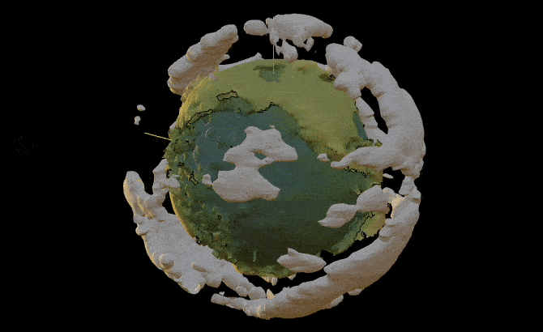

# Modeling Earth
*using GeoData, surface plot, and a bunch of other beautiful stuff*

Have you ever played `Outer Wilds` ? Planets there are so beautiful. That was the main motivation to rebuild one using real elevation data and a bunch of WL's magic 

<!--truncate-->

import { WLJSHTML, WLJSEditor, WLJSStore } from "@site/src/components/wljs-reactcells";

<WLJSStore kernel={require('./attachments/kernel.txt').default} json={require('./attachments/a3d056d8-5bf5-48ef-8ab5-9dd6ca7b3d69.txt').default} notebook={require('./attachments/notebook-a3d.wln').default}/>

## Spreading points on a sphere
A small task to do

<WLJSEditor display={"codemirror"} nid={"a3d056d8-5bf5-48ef-8ab5-9dd6ca7b3d69"} id={"dbed2cc2-a6ab-4dc3-b3dc-cbd71a1cf00f"} type={"Input"} opts={{}} >{`Graphics3D%5B%7B%0A%20%20Sphere%5B%5D%2C%0A%20%20Red%2C%20PointSize%5B0.01%5D%2C%20SpherePoints%5B1000%5D%2F%2FPoint%0A%7D%5D%0A`}</WLJSEditor>

<WLJSEditor display={"codemirror"} nid={"a3d056d8-5bf5-48ef-8ab5-9dd6ca7b3d69"} id={"04a84fbc-24c2-4bb1-b575-451b0e04cd03"} type={"Output"} opts={{}} >{`%28%2AVB%5B%2A%29%28FrontEndRef%5B%226133ae90-57e8-4be5-8ed4-54d14e466715%22%5D%29%28%2A%2C%2A%29%28%2A%221%3AeJxTTMoPSmNkYGAoZgESHvk5KRCeEJBwK8rPK3HNS3GtSE0uLUlMykkNVgEKmxkaGyemWhrompqnWuiaJKWa6lqkppjompqkGJqkmpiZmRuaAgB9OhUh%22%2A%29%28%2A%5DVB%2A%29`}</WLJSEditor>

## Convert to Geo coordinates
Find latitude and langitude

<WLJSEditor display={"codemirror"} nid={"a3d056d8-5bf5-48ef-8ab5-9dd6ca7b3d69"} id={"3c740dc6-11ae-4a35-9f92-8e0eb81d3d1e"} type={"Input"} opts={{}} >{`points%20%3D%20SpherePoints%5B5000%5D%3B%0AlatLon%20%3D%20%28%2AFB%5B%2A%29%28%28180%29%28%2A%2C%2A%29%2F%28%2A%2C%2A%29%28Pi%29%29%28%2A%5DFB%2A%29%20%7B90Degree%20-%20ArcCos%5B%23%5B%5B3%5D%5D%5D%2C%20ArcTan%5B%23%5B%5B1%5D%5D%2C%20%23%5B%5B2%5D%5D%5D%7D%20%26%2F%40%20points%3B%0Aelevation%20%3D%20GeoElevationData%5BGeoPosition%5BlatLon%5D%5D%3B%0Aelevation%20%3D%20%28elevation%20%2B%20Min%5Belevation%5D%29%2FMax%5Belevation%5D%3B`}</WLJSEditor>

In the case if `Geo` did not work. Here is a dump

<WLJSEditor display={"codemirror"} nid={"a3d056d8-5bf5-48ef-8ab5-9dd6ca7b3d69"} id={"30ed7825-e7b1-4ded-a6b6-d39fba872a8b"} type={"Input"} opts={{}} >{`%7Bpoints%2C%20latLon%2C%20elevation%7D%20%3D%20%28%2AVB%5B%2A%29%28Get%5BFileNameJoin%5B%7B%22.iconized%22%2C%20%22iconized-337e.wl%22%7D%5D%5D%29%28%2A%2C%2A%29%28%2A%221%3AeJxTTMoPSmNkYGAoZgESHvk5KRAeH5DwTM7Py6xKdcvMSXXKr8j0YOVmAADrbgrN%22%2A%29%28%2A%5DVB%2A%29%3B`}</WLJSEditor>

<WLJSEditor display={"codemirror"} nid={"a3d056d8-5bf5-48ef-8ab5-9dd6ca7b3d69"} id={"1b4247a1-cc44-4501-a3e0-9209df0ae33c"} type={"Input"} opts={{}} >{`rainbow%20%3D%20ColorData%5B%22DarkRainbow%22%5D%3B%0A%0AListSurfacePlot3D%5BMapThread%5B%28%231%20%280.8%20%2B%200.1%20%232%29%29%26%2C%20%7Bpoints%2C%20elevation%7D%5D%2C%20Mesh-%3ENone%2C%20MaxPlotPoints-%3E100%2C%20ColorFunction%20-%3E%20Function%5B%7Bx%2Cy%2Cz%7D%2C%20rainbow%5B1.5%282%20Norm%5B%7Bx%2Cy%2Cz%7D%5D-1%29%5D%5D%2C%20ColorFunctionScaling%20-%3E%20False%5D`}</WLJSEditor>

<WLJSEditor display={"codemirror"} nid={"a3d056d8-5bf5-48ef-8ab5-9dd6ca7b3d69"} id={"02c5cf5d-7a4f-489e-8b05-ef95a7f9941b"} type={"Output"} opts={{}} >{`%28%2AVB%5B%2A%29%28FrontEndRef%5B%22ef4101c8-35c1-415b-a881-83c0e3a8f8f1%22%5D%29%28%2A%2C%2A%29%28%2A%221%3AeJxTTMoPSmNkYGAoZgESHvk5KRCeEJBwK8rPK3HNS3GtSE0uLUlMykkNVgEKp6aZGBoYJlvoGpsmG%2BqaGJom6SZaWBjqWhgnG6QaJ1qkWaQZAgB%2BRxVt%22%2A%29%28%2A%5DVB%2A%29`}</WLJSEditor>

That looks like Earth!

## Generating clouds
One can simply use Perlin noise and perform marching cubes

<WLJSEditor display={"codemirror"} nid={"a3d056d8-5bf5-48ef-8ab5-9dd6ca7b3d69"} id={"719ae7b0-e161-4441-86d6-f1f040185bf5"} type={"Input"} opts={{}} >{`n%20%3D%20128%3B%0Ak2%20%3D%20Outer%5BPlus%2C%20%23%2C%20%23%5D%20%26%5BRotateRight%5BN%40Range%5B-n%2C%20n%20-%201%2C%202%5D%2Fn%2C%20n%2F2%5D%5E2%5D%3B%0A%0Aspectrum%20%3D%20With%5B%7Bd%20%3A%3D%20RandomReal%5BNormalDistribution%5B%5D%2C%20%7Bn%2C%20n%7D%5D%7D%2C%0A%20%20%20%281%2Fn%29%20%28d%20%2B%20I%20d%29%2F%280.002%20%2B%20k2%29%5D%3B%20%0Aspectrum%5B%5B1%2C%201%5D%5D%20%2A%3D%200%3B%0A%0Aim%5Bp_%5D%20%3A%3D%20Clip%5BRe%5BInverseFourier%5Bspectrum%20Exp%5BI%20p%5D%5D%5D%2C%20%7B0%2C%20%E2%88%9E%7D%5D%5E0.5%0A%0Ap0%20%3D%20p%20%3D%20Sqrt%5Bk2%5D%3B%0A%0AImage%5Bim%5Bp0%20%2B%3D%20p%5D%5D`}</WLJSEditor>

<WLJSEditor display={"codemirror"} nid={"a3d056d8-5bf5-48ef-8ab5-9dd6ca7b3d69"} id={"15f7f79a-b712-4778-b301-049aa7c61621"} type={"Output"} opts={{}} >{`%28%2AVB%5B%2A%29%28FrontEndRef%5B%22f77ace65-5c0e-4968-abdf-b65fdb70367f%22%5D%29%28%2A%2C%2A%29%28%2A%221%3AeJxTTMoPSmNkYGAoZgESHvk5KRCeEJBwK8rPK3HNS3GtSE0uLUlMykkNVgEKp5mbJyanmpnqmiYbpOqaWJpZ6CYmpaTpJpmZpqUkmRsYm5mnAQCRdxZG%22%2A%29%28%2A%5DVB%2A%29`}</WLJSEditor>

It is hard to wrap on the sphere `RegionMesh` function from the standard library. Therefore we will go with an external library

<WLJSEditor display={"codemirror"} nid={"a3d056d8-5bf5-48ef-8ab5-9dd6ca7b3d69"} id={"b3ff92e7-6437-49a7-83b2-e54788c9c86c"} type={"Input"} opts={{}} >{`PacletRepositories%5B%7B%0A%20%20Github%20-%3E%20%22https%3A%2F%2Fgithub.com%2FJerryI%2Fwl-marching-cubes%22%20-%3E%20%22main%22%0A%7D%5D%0A%0A%3C%3CJerryI%60MarchingCubes%60`}</WLJSEditor>

Now generate vertices and map them to sphere

<WLJSEditor display={"codemirror"} nid={"a3d056d8-5bf5-48ef-8ab5-9dd6ca7b3d69"} id={"d75e1dd7-938e-4010-8ac6-98b1d034a413"} type={"Input"} opts={{}} >{`With%5B%7Bplain%20%3D%20im%5Bp0%2B%3Dp%5D%7D%2C%20Table%5Bplain%20Exp%5B-%28%20i%29%5E2%2F200.%5D%2C%20%7Bi%2C%20-20%2C20%7D%5D%5D%3B%0A%0A%7Bvertices%2C%20normals%7D%20%3D%20CMarchingCubes%5B%25%2C%200.2%2C%20%22CalculateNormals%22%20-%3E%20False%5D%3B%0A%0Avertices%20%3D%20Map%5BFunction%5Bv%2C%0A%20%20%20%20With%5B%7B%5C%5BRho%5D%20%3D%2050.0%20%2B%200.25%20%28v%5B%5B3%5D%5D%20-%2010%29%2C%20%5C%5BPhi%5D%20%3D%202.0%20Pi%20v%5B%5B1%5D%5D%2F127.0%2C%20%5C%5BTheta%5D%20%3D%20%20Pi%2F2%20%2B%20Pi%20v%5B%5B2%5D%5D%2F127.0%7D%2C%0A%20%20%20%20%20%20%7B%5C%5BRho%5D%20Cos%5B%5C%5BPhi%5D%5D%20Cos%5B%5C%5BTheta%5D%5D%2C%20%5C%5BRho%5D%20Sin%5B%5C%5BPhi%5D%5D%20Cos%5B%5C%5BTheta%5D%5D%2C%20%5C%5BRho%5D%20Sin%5B%5C%5BTheta%5D%5D%7D%0A%20%20%20%20%5D%0A%20%20%5D%0A%2C%20vertices%5D%3B%0A%0A%7B%0A%20%20clouds%20%3D%20GraphicsComplex%5B0.017%20vertices%2C%20Polygon%5B1%2C%20Length%5Bvertices%5D%5D%5D%0A%7D%20%2F%2F%20Graphics3D%3B`}</WLJSEditor>

We shifted $\theta$ angle for purpose, to avoid visibles artifacts on poles.

## Combine
Plot together

<WLJSEditor display={"codemirror"} nid={"a3d056d8-5bf5-48ef-8ab5-9dd6ca7b3d69"} id={"6ce1f97f-509f-462f-ac04-a72c7f1a8696"} type={"Input"} opts={{}} >{`rainbow%20%3D%20ColorData%5B%22DarkRainbow%22%5D%3B%0AlightPos%20%3D%20%7B-2.4909%2C%204.069%2C%203.024%7D%3B%0A%0ArotationMatrix%20%3D%20RotationMatrix%5B0.%2C%20%7B0%2C0%2C1%7D%5D%3B%0Aangle%20%3D%200.%3B%0A%0Aanimation%20%3D%20CreateUUID%5B%5D%3B%0AEventHandler%5Banimation%2C%20Function%5BNull%2C%0A%20%20lightPos%20%3D%20RotationMatrix%5B1%20Degree%2C%20%7B1%2C1%2C1%7D%5D.lightPos%3B%0A%20%20rotationMatrix%20%3D%20RotationMatrix%5Bangle%2C%20%7B0%2C0%2C1%7D%5D%3B%0A%20%20angle%20%2B%3D%200.5%20Degree%3B%0A%5D%5D%3B%0A%0AListSurfacePlot3D%5B%0A%20%20MapThread%5B%28%231%20%280.8%20%2B%200.1%20%232%29%29%26%2C%20%7Bpoints%2C%20elevation%7D%5D%2C%20%0A%20%20Mesh-%3ENone%2C%20MaxPlotPoints-%3E100%2C%20%0A%20%20ColorFunction%20-%3E%20Function%5B%7Bx%2Cy%2Cz%7D%2C%20rainbow%5B1.5%282%20Norm%5B%7Bx%2Cy%2Cz%7D%5D-1%29%5D%5D%2C%20%0A%20%20ColorFunctionScaling%20-%3E%20False%2C%20%0A%20%20Lighting-%3E%22Default%22%2C%0A%20%20PlotStyle-%3EDirective%5B%22Shadows%22-%3ETrue%2C%20%22CastShadow%22-%3ETrue%5D%2C%0A%0A%20%20Prolog%20-%3E%20%7B%0A%20%20%20%20Directive%5B%22Shadows%22-%3ETrue%2C%20%22CastShadow%22-%3ETrue%5D%2C%0A%20%20%20%20GeometricTransformation%5Bclouds%2C%20rotationMatrix%20%2F%2F%20Offload%5D%2C%0A%20%20%20%20HemisphereLight%5BLightBlue%2C%20Orange%20%2F%2F%20Darker%20%2F%2F%20Darker%5D%2C%0A%20%20%20%20SpotLight%5BOrange%2C%20lightPos%20%2F%2F%20Offload%5D%0A%20%20%7D%2C%0A%0A%20%20Epilog%20-%3E%20AnimationFrameListener%5BlightPos%20%2F%2F%20Offload%2C%20%22Event%22-%3Eanimation%5D%2C%0A%20%20Background-%3EBlack%0A%5D`}</WLJSEditor>

<WLJSEditor display={"codemirror"} nid={"a3d056d8-5bf5-48ef-8ab5-9dd6ca7b3d69"} id={"702d6017-cbed-4666-b128-adbabfe8716c"} type={"Output"} opts={{}} >{`%28%2AVB%5B%2A%29%28FrontEndRef%5B%22c8e48c06-39cf-41b3-b9e8-9d005bb356f5%22%5D%29%28%2A%2C%2A%29%28%2A%221%3AeJxTTMoPSmNkYGAoZgESHvk5KRCeEJBwK8rPK3HNS3GtSE0uLUlMykkNVgEKJ1ukmlgkG5jpGlsmp%2BmaGCYZ6yZZplroWqYYGJgmJRmbmqWZAgCHGhWu%22%2A%29%28%2A%5DVB%2A%29`}</WLJSEditor>

To start animation

<WLJSEditor display={"codemirror"} nid={"a3d056d8-5bf5-48ef-8ab5-9dd6ca7b3d69"} id={"94ca22ac-6bae-45bf-8d11-961defbf1114"} type={"Input"} opts={{}} >{`EventFire%5Banimation%2C%20True%5D%3B`}</WLJSEditor>