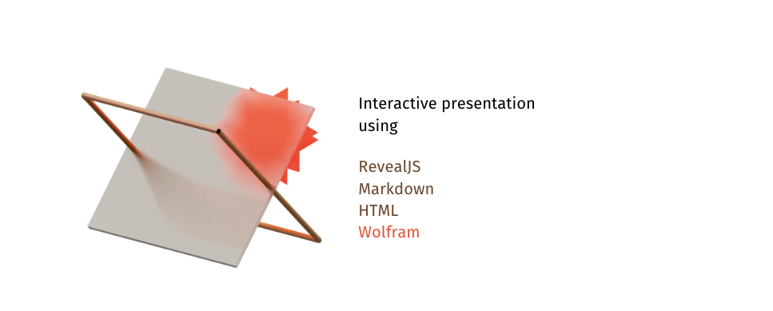
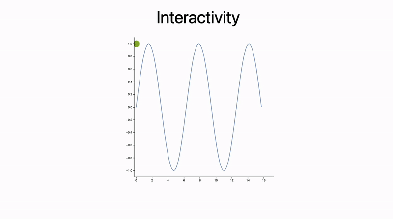

---
tags:
  - slides
  - tutorial
enableComments: true
authors: jerryi
---

# Dynamic Presentation, or How to Code a Slide with Markdown and WL

*An Ultimate Guide for non-WLJS or non-WL users*



The idea of programmatically generating slides and graphics for presentations, reports, or lecture notes is far from new. Today, you can do this using [Python](https://python-pptx.readthedocs.io/en/latest/), [HTML](https://revealjs.com/), [JSX](https://motioncanvas.io/), [Julia](https://github.com/piever/Remark.jl), and more. Most of these tools follow a similar concept—combining declarative markup like Markdown and HTML. We’ll follow a similar path but add support for dynamic elements, reusable components, and event bindings. Sounds complicated? Actually, the goal is to simplify.

> ⚠️ Heads-up: This approach involves traditional text-based programming.

> ⚠️ Warning: Lots of images ahead. It *is* about presentations 😄

---

<!--truncate-->

## Introduction & Motivation

In academic settings or at conferences, presentations can be critical to conveying ideas. In Russian academic culture, form was historically considered secondary to content. But times have changed. Visuals are richer, animations more common. Some [journals](https://onlinelibrary.wiley.com/journal/21983844) even require *eye-catching thumbnails* to attract broader readership. 

Yet, interactivity in presentations—and in publications—is often overlooked. This area has potential, especially for internal reports, lecture notes, or educational materials where interactivity could aid understanding.

Take a look at [**this example**](https://jerryi.github.io/wljs-demo/fitting_tds_ppt.html) ⭐️

Creating traditional slides is time-consuming: drag items, align, format... And if you're dealing with 3D content (protein structures, crystal models), you’ll often resort to GIFs.

My personal issue with this workflow is the cycle:

1. Prepare data in one environment  
2. Plot it in another  
3. Export to file  
4. Format into slides  
5. Repeat from step 2 if changes are needed

Wouldn’t it be better if we could reuse visual elements like templates? This is where a declarative, component-based approach starts to shine ⤵️

---

## Declarative Markup

Let’s revisit our roots. TeX Beamer is likely one of the earliest tools in this space:

```latex
\documentclass{beamer}

\title{Sample title}
\author{Anonymous}
\institute{Overleaf}
\date{2021}

\begin{document}
\frame{\titlepage}

\begin{frame}
\frametitle{Hi Harbor}
This is some text in the first frame.
\end{frame}
\end{document}
```


Beamer is extremely powerful, but also intimidating. For something easier and web-native, there's [RevealJS](https://revealjs.com/):

```markdown
# Heading
## Subheading

Hi there!

---

# Next Heading
Hi again!
```


Slides are separated by `---`, and the layout is controlled by CSS. Since RevealJS runs in a browser, you can use raw HTML—allowing things like video, audio, PDFs, even entire websites using `iframe`. Want [Mermaid diagrams](https://mermaid.js.org/)? You can embed those too.

But interactivity and reusable components? Not quite built-in.

RevealJS is a framework, not a full system. Even referencing an image locally can become tricky. This is where tools like [Motion Canvas](https://motioncanvas.io/) shine. Based on JSX and React, they treat everything as a component:

```tsx
import {makeScene2D, Txt} from '@motion-canvas/2d';
import {beginSlide, createRef, waitFor} from '@motion-canvas/core';

export default makeScene2D(function* (view) {
  const title = createRef<Txt>();
  view.add(<Txt ref={title} />);

  title().text('FIRST SLIDE');
  yield* beginSlide('first slide');
  yield* waitFor(1);

  title().text('SECOND SLIDE');
  yield* beginSlide('second slide');
  yield* waitFor(1);

  title().text('LAST SLIDE');
  yield* beginSlide('last slide');
  yield* waitFor(1);
});
```

Or MDX:

```jsx
import Tabs from '@theme/Tabs';  
import TabItem from '@theme/TabItem';

## Desktop App

<Tabs defaultValue="Windows" values={[{label: 'Windows', value: 'Windows'}, {label: 'Linux', value: 'Linux'}, {label: 'Mac', value: 'Mac'}]}>
  <TabItem value="Windows">- Windows build</TabItem>  
  <TabItem value="Linux">- Linux builds</TabItem>  
  <TabItem value="Mac">- Mac builds</TabItem>
</Tabs>
```

JSX might feel complex, but it introduces very useful concepts:

- Components as functions
- Custom HTML-like tags

So you can write something like this once:

```jsx
<MakeTitle>Slide Header</MakeTitle>

Here's your content.

<SomeWidget align="center" />
```

Feels like a cross between Beamer and JSX. Now let’s see how to implement it.

---

## Bridging Worlds ⚗️

> As a physicist, it’s easier to demonstrate calculations with sliders—especially during lectures.

JSX/React means adopting frontend tooling (Vite, bundlers, etc.), which may be too much overhead for quick educational material. Plus, JavaScript isn’t ideal for scientific plotting. Python, R, Julia, or even MATLAB often provide a smoother experience.

But as of 2025, **no platform beats Wolfram Mathematica** for producing clean, precise, interactive plots with minimal setup.

```mathematica
ContourPlot[Cos[x] + Cos[y], {x, 0, 4 Pi}, {y, 0, 4 Pi}]
```


Want interactivity?

```mathematica
Manipulate[Plot[Sin[a x], {x, 0, 2 Pi}], {a, 1, 10}]
```

Our goal is to make these tools feel **native** inside Markdown + HTML.

```mathematica
Figure = ContourPlot[Cos[x] + Cos[y], {x, 0, 4 Pi}, {y, 0, 4 Pi}];
```

```mathematica
# First Slide

Look at this plot:

<Figure />
```

Want to style it?

```mathematica
<div style="background: gray; border: solid 1px red;">
  <Figure />
</div>
```

Or make it a reusable component. This is where [Wolfram Language XML](https://jerryi.github.io/wlx-docs/) (WLX) comes in—a syntax extension designed to bring this all together. You don’t need to install anything extra—it’s already integrated in the environment we’ll explore next.

---

## TL;DR – How to Code Presentation Slides 

### Environment: [WLJS Notebook](https://jerryi.github.io/wljs-docs/)

Download binaries [here](https://github.com/JerryI/wolfram-js-frontend/releases). **You don’t need** the app to view presentations—**a browser is enough**, even offline.


This is a client-server setup. The client is your browser (or Electron app), and computations happen on the server.

Cells are typed—starting with extensions like `.slide`. If you don’t specify anything, it's treated as standard Wolfram Language.

You can attach images, insert code blocks, define graphics inline, or dynamically. Everything gets evaluated and embedded inside your final slide.

## First Slide with Images and Graphs

Let’s create our first `.slide` cell with an image. Simply drag and drop a picture into the cell:

```markdown
.slide

# Hey There!


```

The image is automatically uploaded to the notebook directory and inserted as a Markdown image reference. Press **Shift + Enter** or click the play button to render the slide.


Now let’s move from 2D to 3D with a custom graph. First, define a helper function:

```mathematica
square[{{imin_, imax_}, {jmin_, jmax_}}] := 
 Table[
  UnitStep[i - imin, imax - i] UnitStep[j - jmin, jmax - j],
  {i, 0, 20}, {j, 0, 20}
]
```

Then create the plot:

```mathematica
OurPlot = ListPlot3D[square[{{2, 5}, {3, 7}}], Mesh -> None];
```

Now insert it into your slide:

```markdown
.slide

# Hey there!

<OurPlot />
```


Yes—you can rotate it live in the browser.

Prefer Plotly? We’ve got you covered. The Plotly interface is available and works identically to the JS version:

```mathematica
OurPlotly = With[{data = square[{{2, 5}, {3, 7}}]},
  Plotly[<|"type" -> "surface", "z" -> data|>]
]
```


---

## Important Notes on WLX

- Tags starting with a lowercase letter are interpreted as HTML.
- Tags starting with an uppercase letter are WL components.
- All tags must be properly closed.
- Leave a blank line above and below Markdown headers and HTML blocks to avoid parsing issues.
- Full WLX [documentation](https://jerryi.github.io/wlx-docs/) and presentation-specific docs [here](https://jerryi.github.io/wljs-docs/frontend/Advanced/Slides/).

---

## Presenting Slides

Want fullscreen mode? Press `f` on any slide or choose “Project to a New Window” in cell settings.

Want to show all slides in sequence? Just use the `.slides` cell to collect content from all other `.slide` cells:

```markdown
.slides

Thank you for your attention
```

This aggregates slides across the notebook regardless of order or location.

---

## Styling Your Slides

Minimalist slides are often best—just a graphic and a short list. But if you want custom fonts, themes, or logos, use a `.wlx` cell to insert CSS:

```html
.wlx
<style>
  .reveal h1 {
    font-family: consolas;
  }
</style>
```


Reusable headers or footers? Easy. Let’s define and use them as components next...


## Reusable Local Components

### Columns Layout

Want to create a two-column layout? Here’s a simple component implementation using WLX:

```jsx
.wlx

Columns[data__, OptionsPattern[]] := With[{
  Style = OptionValue["Style"]
},
  With[{DataList = Table[
    <div>
      <Item />
    </div>,
    {Item, List[data]}
  ]},

  <div class="flex flex-row justify-between" style="{Style}">
    <DataList />
  </div>
  ]
]

Options[Columns] = {"Style" -> ""};
```

Use it on a slide like this:

```markdown
.slide

# Hey There!

<Columns>
  <p>Column 1</p>
  <p>Column 2</p>
</Columns>
```


You can safely use Markdown by wrapping content in `<p>` tags and adding blank lines:

```markdown
<Columns>
  <p>
  
# Heading 1

  </p>
  <p>

# Heading 2

  </p>
</Columns>
```


Style the component directly:

```markdown
<Columns Style={"
  border-radius: 4px;
  color: #ffffff;
  background: rgb(49 87 170);
  padding: 1rem;
"}>

  <p>Heading 1</p>
  <p>Heading 2</p>
</Columns>
```


---

### Row Layout and Grouped Plots

You can also use the built-in `Row` layout. Example: a signal and its Fourier transform side-by-side.

```mathematica
square[{{imin_, imax_}, {jmin_, jmax_}}] := 
 Table[
  UnitStep[i - imin, imax - i] UnitStep[j - jmin, jmax - j],
  {i, 0, 20}, {j, 0, 20}
]

OurPlot = Row[{
  ListPlot3D[square[{{2, 5}, {3, 7}}], Mesh -> None],
  ListPlot3D[Abs@Fourier@square[{{2, 5}, {3, 7}}], Mesh -> None, ColorFunction -> "Rainbow"]
}];
```

```markdown
.slide

# Example

<OurPlot/>
```


You can also bind each to a separate variable and use them together:

```mathematica
{Figure1, Figure2} = {
  ListPlot3D[square[{{2, 5}, {3, 7}}], Mesh -> None],
  ListPlot3D[Abs@Fourier@square[{{2, 5}, {3, 7}}], Mesh -> None, ColorFunction -> "Rainbow"]
};
```

```markdown
.slide

# Example

<Row>
  <Figure1 />
  <Figure2 />
</Row>
```

---

### Footers and Headers

You can use the same pattern to define reusable headers and footers—great for academic presentations. Example:

```jsx
.wlx

MakeTitle[Title__String] := MakeTitle[StringJoin[Title]]
MakeTitle[Title_String] := <div class="relative flex w-full text-left flex-row gap-x-4" style="align-items: center; margin-bottom:1.5rem;">
  <div style="bottom:0; z-index:1; position: absolute; background: linear-gradient(to left, red, blue, green); width: 100%; height: 0.7rem;"></div>
  
  <h2><Title /></h2>
</div>

Footer = <div class="w-full ml-auto mr-auto bottom-0 text-sm absolute">
  DFG Retreat Meeting TRR360: <i>C4 Ultrastrong matter-magnon coupling</i>, Kirill Vasin
</div>;
```

Use them like this:

```markdown
.slide

<!-- .slide: style="height:100vh" -->

<MakeTitle>Ultrastrong coupling</MakeTitle>

Content goes here...

<Footer />
```


## Fragments & Animations

RevealJS supports slide fragments, which allow staged reveals of content. This can be used to animate text appearance or any HTML element.

### Basic Example

```markdown
.slide

<!-- .slide: data-background-color="black" -->

# Red <!-- .element: style="color:red" class="fragment" -->

# White <!-- .element: style="color:white" class="fragment" -->
```


Each `.fragment` appears step-by-step as the user presses →. You can also control the order using `data-fragment-index`:

```markdown
# Red <!-- .element: style="color:red" data-fragment-index="1" class="fragment" -->

# White <!-- .element: style="color:white" data-fragment-index="1" class="fragment" -->
```


You can apply the same styling to any HTML element.

---

## Math & LaTeX

Wolfram supports LaTeX rendering directly. Just avoid single backslashes unless you escape them (`\\`).

```markdown
.slide

## LaTeX

$$
\\begin{align*}
\\mathbf{E}(t,x) &= \\sum_{\omega} \\mathbf{E}_0^{\omega} ~\\exp\\Big( i\\omega t - \\frac{i\\hat{n}(\\omega) \\omega x}{c}\\Big) \\\\
&= \\sum\\mathbf{E}_0^{\\omega} \\colorbox{white}{$\\exp(-\\frac{\\alpha x}{2})$} ~\\exp\\Big(i\\omega t - \\frac{i n \\omega x}{c}\\Big)
\\end{align*}
$$
```


### Animated Equations

Use the `data-eq-speed` attribute for animated reveal:

```markdown
$$
\\begin{align*}
...your equation here...
\\end{align*}
$$ <!-- .element: data-eq-speed="0.1" -->
```


---

## Diagrams with Mermaid

You can embed [Mermaid](https://mermaid.js.org/) diagrams using `CellView`:

```mathematica
MyDiagram = CellView["
  graph LR
      A[Text Header] --> B[Binary Header]
      B --> C1[Trace 1] --> T1[Samples 1]
      B --> C2[Trace 2] --> T2[Samples 2]
", ImageSize -> 650, "Display" -> "mermaid"];
```

Use it in a slide:

```markdown
.slide

# Embedded Diagram

<MyDiagram />
```


---

## Source Code on Slides

To display syntax-highlighted WL source code inline, define a helper:

```jsx
.wlx
CodeInset[str_String] := With[{Fe = EditorView[str]},
  <div style="text-align: left; font-size:14px;"><Fe /></div>
]
```

Add styling to align properly:

```html
.wlx
<style>
  .slide-frontend-object .cm-editor {
    text-align: left;
  }
</style>
```

Use in a slide:

```markdown
.slide

## Source code (WL) on the slide

<CodeInset>
1-((*FB[*)((1)(*,*)/(*,*)(6))(*]FB*)) ((*SpB[*)Power[x(*|*),(*|*)2](*]SpB*))+((*FB[*)((1)(*,*)/(*,*)(120))(*]FB*)) ((*SpB[*)Power[x(*|*),(*|*)4](*]SpB*))-(*FB[*)(((*SpB[*)Power[x(*|*),(*|*)6](*]SpB*))(*,*)/(*,*)(5040))(*]FB*)+(*FB[*)(((*SpB[*)Power[x(*|*),(*|*)8](*]SpB*))(*,*)/(*,*)(362880))(*]FB*)-(*FB[*)(((*SpB[*)Power[x(*|*),(*|*)10](*]SpB*))(*,*)/(*,*)(39916800))(*]FB*)
</CodeInset>
```


## Excalidraw Integration

[Excalidraw](https://excalidraw.com/) is a vector-based sketching tool that feels like a digital whiteboard. It’s lightweight, fast, and outputs SVG graphics.

To embed a drawing area, just use this simple syntax in a `.slide` cell:

```markdown
.slide

!![]
```

This creates an embedded drawing canvas. Your sketch is saved inside the widget itself, allowing it to be moved or nested inside other tags.


Support is still evolving, but it works well for basic annotation and ideas.

---

## Dynamic Elements with Slide Events 🧙

Let’s build a simple dynamic counter that reacts to slide transitions.

### Step 1: Static Widget

```jsx
.wlx

Stat[Text_, OptionsPattern[]] := With[{
  Count = OptionValue["Count"]
},

  <div class="text-center text-gray-600 m-4 p-4 rounded bg-gray-100 flex flex-col">
    <Count />
    <span class="text-md"><Text /></span>
  </div>
]

Options[Stat] = {"Count" -> 1};
```

Render it on a slide:

```markdown
.slide

# Basic counter

<Stat Count={11}>Number of publications</Stat>
```


### Step 2: Make It Dynamic

Add a module and use `SlideEventListener` to update it in real-time:

```jsx
.wlx

Stat[Text_, OptionsPattern[]] := Module[{
  cnt = 0,
  task
}, With[{
  ev = CreateUUID[],
  HTMLCounter = HTMLView[cnt // Offload],
  max = OptionValue["Count"]
},

  EventHandler[ev, {
    "Destroy" -> Function[Null, EventRemove[ev]; If[task["TaskStatus"] === "Running", TaskRemove[task]]; ClearAll[task];],
    "Left" -> Function[Null, cnt = 0],
    "Slide" -> Function[Null, task = SetInterval[
      If[cnt < max, cnt += 1, TaskRemove[task]], 15]]
  }];

  <div class="text-center text-gray-600 m-4 p-4 rounded bg-gray-100 flex flex-col">
    <HTMLCounter/>
    <span class="text-md"><Text/></span>
    <SlideEventListener Id={ev}/>
  </div>
      
] ]

Options[Stat] = {"Count" -> 1};
```

Now use multiple instances:

```markdown
.slide

# Dynamic Counters

<Row>
  <Stat Count={11}>Citations</Stat>
  <Stat Count={110}>Hours</Stat>
  <Stat Count={1010}>Symbols</Stat>
</Row>
```


Each counter is self-contained and responds only when the slide is active.


## Interactive Plots with Manipulate

Remember `Manipulate` in Wolfram Language? In this system, there's a more efficient version called `ManipulatePlot`, which works great for presentations.

Try it first in a regular cell:

```mathematica @
Widget = ManipulatePlot[{
  Sin[x t], 
  (*TB[*)Sum[(*|*)(*FB[*)((Sin[w x t])(*,*)/(*,*)(w))(*]FB*)(*|*), {(*|*)w(*|*),(*|*)1(*|*),(*|*)n(*|*)}](*|*)(*1:eJxTTMoPSmNiYGAoZgMSwaW5TvkVmYwgPguQCCkqTQUAeAcHBQ==*)(*]TB*) 
} // Re,  {t, 0, 10 Pi}, {x, 0, 2}, {n, 1, 15, 1}]
```


Now let’s embed it directly into a slide:

```markdown
.slide

# Interactivity

You can drag the sliders!

<Widget />
```


Each slider input sends a signal back to the WL kernel to re-evaluate the plot in real time. But this doesn’t mean you can’t export it to HTML.

---

## Precomputed Animations with AnimatePlot

Sometimes, full reactivity isn’t necessary. Use `AnimatePlot` for looping, client-side animations.

```mathematica
AnimatePlot[
  Sum[(Sin[2π(2j - 1) x])/(2j), {j, 1.0, n}],
  {x, -1, 1},
  {n, 1, 30, 1}
]
```


This approach caches every frame in advance—great for offline use or lighter devices.

---

## Reactive Data: Real-Time Graphics Updates

Let’s simulate dynamic data updates using `Offload`, which enables reactive primitives like `Line`, `Disk`, etc.

```mathematica
myData = Table[{x, Sin[x]}, {x, 0, 5 Pi, 0.1}];

Graphics[{
  ColorData[97][1], Line[myData // Offload]
}, Axes -> True, TransitionDuration -> 1000]
```

Update the data elsewhere:

```mathematica
myData = Table[{x, Sinc[x]}, {x, 0, 5 Pi, 0.1}];
```


You can combine this with slide fragments, animations, or event triggers.


## Custom Widgets Reacting to Fragments

Want to go beyond sliders? Let’s create a custom widget that reacts to slide fragments. For example, a reactive chart with a flying disk that moves when a fragment appears.

### Step 1: The Widget Module

```jsx
.wlx

PlotWidget[OptionsPattern[]] := Module[{
  data = OptionValue["DataA"],
  disk = OptionValue["DataA"] // Last
},

  With[{
    Canvas = Graphics[{
      ColorData[97][1], Line[data // Offload],
      ColorData[97][3], Disk[disk // Offload, {0.4,0.05}]
    }, Axes -> True, ImageSize -> 500, PlotRange -> {{-0.2, 1.1 5 Pi}, 1.1 {-1, 1}},
       TransitionDuration -> 500],
    uid = CreateUUID[],
    dataA = OptionValue["DataA"],
    dataB = OptionValue["DataB"]
  },
    EventHandler[uid, {
      "fragment-1" -> Function[Null,
        data = dataB;
        disk = dataB // Last;
      ],
      ("Left" | "Destroy" | "Slide") -> Function[Null,
        data = dataA;
        disk = dataB // First;
      ]
    }];

    <div class="flex flex-col gap-y-2">
      <Canvas />
      <div class="fragment">Dummy text</div>
      <SlideEventListener Id={uid} />
    </div>
  ]
]

Options[PlotWidget] = {"DataA" -> {}, "DataB" -> {}};
```

### Step 2: Generate the Data

```wolfram
{dataA, dataB} = {
  Table[{x, Sin[x]}, {x, 0, 5 Pi, 0.1}],
  Table[{x, Tan[x]}, {x, 0, 5 Pi, 0.1}]
};
```

### Step 3: Use in a Slide

```markdown
.slide

# Interactivity

<PlotWidget DataA={dataA} DataB={dataB} />

---

# Second slide
```



---

## External Event Wiring

You can wire multiple widgets to the same global event ID:

```markdown
.slide

First fragment <!-- .element: data-fragment-index="1" class="fragment" -->

Second fragment <!-- .element: data-fragment-index="2" class="fragment" -->

<SomeWidget1 Event={"my-first-slide"} /> 
<SomeWidget2 Event={"my-first-slide"} /> 

<SlideEventListener Id={"my-first-slide"} />
```

This lets you control multiple widgets from one place—great for large presentations.


## Procedural Backgrounds

Why not make your slide backgrounds dynamic? Let’s simulate orbiting balls around a center with smooth animation.

### Step 1: Define the Background Generator

```jsx
.wlx

BackImageDynamic := Module[{
  frameEvent = CreateUUID[],
  animationEvent = CreateUUID[],
  slideEvent = CreateUUID[],
  allowedQ = False,
  trigger = 1
}, With[{

  Canvas = Graphics[{
    Black, Rectangle[{0,0}, {1,1}], Red,
    curveDynamicGenerator[{0.5,0.5}, 0.8, animationEvent], Blue,
    curveDynamicGenerator[{0.5,0.5}, 0.3, animationEvent],

    AnimationFrameListener[trigger // Offload, "Event"->frameEvent]
  }, "Controls"->False, ImagePadding->0, TransitionDuration->200, ImageSize->{960,700}, PlotRange->{{0,1}, {0,1}}]
},

  EventHandler[frameEvent, Function[Null,
    If[!allowedQ, Return[]];
    If[Mod[trigger, 5] == 0, EventFire[animationEvent, True]];
    trigger = trigger + 1;
  ]];

  EventHandler[slideEvent, {
    "Slide" -> Function[Null,
      allowedQ = True;
      trigger = trigger + 1;
      Print["Animation started"];
    ],

    ("Destroy" | "Left") -> Function[Null,
      allowedQ = False;
      Print["Animation stopped"];
    ]
  }];

  <div>
    <SlideEventListener Id={slideEvent}/>
    <Canvas/>
  </div>
] ]
```

### Step 2: Create Curve Generator

```mathematica
curveDynamicGenerator[center_, radius_, ev_] := With[{}, 
Module[{
  pts = Table[Norm[center - radius] {Sin[i], Cos[i]} +
         center, {i, 0, 2 Pi + 0.1, 0.1}],
         
  disk = {10,10},
  modulation = 0.,
  phase = 0.,
  initial = 12. RandomInteger[{0,10}]
},

  EventHandler[EventClone[ev], Function[Null,
      pts = Table[(
        Norm[center - radius] 
        + 0.02 modulation Sin[50. i + 30 phase]
      ) {Sin[i], Cos[i]} + center
      , {i, 0, 2 Pi + 0.1, 0.01}];

      disk = With[{i = 3. phase + initial},
        (Norm[center - radius] 
        + 0.01 modulation Sin[50. i + 30 phase]
        ) {Sin[i], Cos[i]} + center
      ];

      phase = phase + 0.02;
      modulation = Sin[phase/2];
  ]];
  
  {
    Line[pts // Offload], 
    Disk[disk // Offload, 0.013]
  }
]]
```

### Step 3: Embed the Background on a Slide

```markdown
.slide

<!-- .element: data-background-color="black" -->
<!-- .slide: style="height:100vh; color: white;" -->

<div class="flex flex-col h-full"> 

<div class="absolute w-full h-full" style="scale: 1.1; left:-30px; z-index:-100">
  <BackImageDynamic/>
</div>

<div class="mt-auto mb-auto">
    
  
# Procedural background

It will be animated till slide is visible

</div>
</div>

---

<!-- .element: data-background-color="black" -->
<!-- .slide: style="height:100vh; color: white;" -->

Now the animation stops
```


Use CSS `filter` to blur it if needed.

It might looks like an overkill, but in this form it does the following

- ensures a low CPU usage;
- component-like behaviour, i.e. you can copy and paste it to any presentation and reuse;
- stops animation if slide is not visible or removed;
- shares a single animation trigger between all curves and moving objects

---

## Confetti with External JS

### Step 1: Load the Library

```html
.wlx
<script src="https://cdn.jsdelivr.net/npm/party-js@latest/bundle/party.min.js"></script>
```

### Step 2: Define a JS Function to Trigger It

```js
.js
core.RunFireworks = async (args, env) => {
  const id = await interpretate(args[0], env);
  party.confetti(document.getElementById(id).parentNode, {
    count: party.variation.range(20, 40),
    size: party.variation.range(0.8, 2.2),
  });
}
```

### Step 3: Trigger from Slide Event

```jsx
.wlx

Party := Module[{
  UId = CreateUUID[],
  Ev = CreateUUID[]
},

EventHandler[Ev, {
  "Slide" -> Function[Null,
      FrontSubmit[RunFireworks[UId]]
  ]
}];

<div id="{UId}">
  <SlideEventListener Id={Ev}/>
</div>

]
```

### Step 4: Use It

```markdown
.slide

# Let's have

---

# A Party!

<Party />
```


---

## Exporting to Standalone HTML 🚀

Everything—plots, animations, code—is rendered by the browser. That makes exporting to HTML incredibly easy.

### Step 1: Create a `.slides` Cell

```markdown
.slides

Thank you for your attention
```

This collects all `.slide` cells.

### Step 2: Click the Share Icon


### Result: A Single HTML File


See it in action 👉 [**example link**](https://jerryi.github.io/wljs-demo/habr_ppt2.html)

What’s included:

- All graphs (2D, 3D, Plotly)
- All images (converted to base64)
- Code, styles, layout, assets

What’s *not*:

- Interactive sliders (they require kernel)


## Exporting Dynamic HTML with Interactivity

Static HTML is great, but what if you want the sliders and interactivity **without** the kernel?

That’s where [**dynamic HTML export**](https://wljs.io/frontend/Exporting/Dynamic%20HTML) comes in. It works in two phases: sniffing and sampling.

---

### Phase 1: Sniffer Mode

The **sniffer** listens to all interactions and records them. It captures how reactive widgets behave and stores possible input-output pairs.

You’ll need to **manually move all sliders** in the presentation to their full range. The system will record state changes and build a lookup table.

```mathematica
Widget := ManipulatePlot[Sum[(Sin[2π(2j - 1) x])/(2j), {j, 1.0, n}], {x, -1, 1}, {n, 1, 30, 1}];
```

```md
.slide

# Offline interactivity

This Widget works with no Wolfram Kernel attached

<Widget/>
```


---

### Phase 2: Sampling & Bundling

The **sampler** uses the sniffed events to generate all visual states. It stores these in compressed form and embeds them into your exported HTML.

No kernel is needed afterward.

How does it work?

Once exported, widgets don’t talk to a backend—they call the built-in response table. Think of it like a pre-recorded helpdesk answering slider movements.


Not perfect for everything, but works beautifully for stateless or time-based interactions.


See live: [**Offline HTML Example**](https://jerryi.github.io/wljs-demo/habr_ppt3.html) ⭐️

> ⚠️ Text inputs and checkboxes may behave unpredictably—this is still evolving. Please report issues on GitHub!

---

## Published Examples 📔

These presentations were all exported using the techniques above:

- [Why fitting the raw data matters – Augsburg 2024](https://jerryi.github.io/wljs-demo/fitting_tds_ppt.html)
- [Basic animation presentation](https://jerryi.github.io/wljs-demo/offload_slide.html)
- [THz report on Fe₂Mo₃O₈ in a magnetic field](https://jerryi.github.io/wljs-demo/thz_report.html)
- [Example with `ManipulatePlot`](https://jerryi.github.io/wljs-demo/habr_ppt3.html)
- [2-slide animation demo](https://jerryi.github.io/wljs-demo/habr_ppt2.html)

---

## Conclusion

This approach blends code and content into a single, powerful system. At a glance:

- Simpler than PowerPoint for tech-heavy talks
- Fully reproducible (every visual has traceable code)
- Runs in any browser—no dependencies
- Supports dynamic or static export to a single HTML file (free of the license restrictions)

Markdown becomes your structure, Wolfram Language your engine (sometimes with a help of Javascript). With a little setup, you can focus on content—not formatting.

And yes, interactivity makes learning and presenting way more engaging. Your students and colleagues will thank you ☺️

---

## Links

- [RevealJS](https://revealjs.com/) – Markdown presentations (core engine)
- [Excalidraw](https://excalidraw.com/) – drawing board (SVG tool)
- [WLJS Notebook Docs](https://jerryi.github.io/wljs-docs/)
- [Wolfram Engine](https://www.wolfram.com/engine/)
- [Mathematica Programming Introduction (free PDF)](https://jerryi.github.io/wljs-docs/assets/files/MathProgrammingIntro-90327183685b448b1fc72200e4e1c507.pdf)

---

Happy sliding ✨
