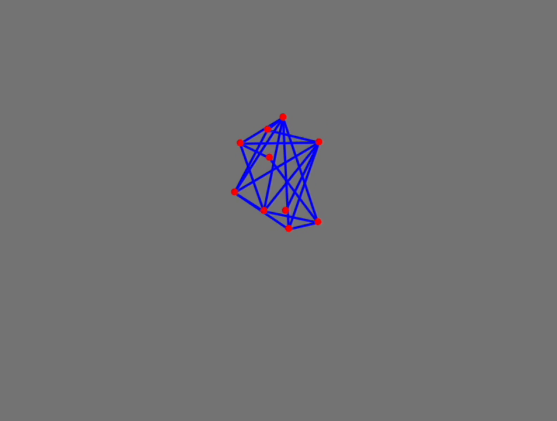

---
tags:
  - tutorial
enableComments: true
authors: jerryi
---

# Basic Verlet Integration implementation
*Using the power of Newton's equations and numerics to solve dynamics of arbitary planar meshes in real-time*

---

<!--truncate-->

## Bunch of points
Define a set of random points

import { WLJSHTML, WLJSEditor, WLJSStore } from "@site/src/components/wljs-notebook-react";

<WLJSStore kernel={require('./attachments/kernel.txt').default} json={require('./attachments/7ed76a6a-ca03-4410-a4bf-f0f29790de38.txt').default} notebook={require('./attachments/notebook-7ed.wln').default}/>

<WLJSEditor display={"codemirror"} nid={"7ed76a6a-ca03-4410-a4bf-f0f29790de38"} id={"f4b7e769-1304-4cf9-bff5-b98a82ebb6f4"} type={"Input"} opts={{"InitGroup":true}} >{`pts0%20%3D%20RandomReal%5B%7B-1%2C1%7D%2C%20%7B10%2C%202%7D%5D%3B%0Apts1%20%3D%20pts0%3B%20pts2%20%3D%20pts0%3B%0A%0AGraphics%5B%7BRectangle%5B%7B-10%2C-10%7D%2C%20%7B10%2C10%7D%5D%2C%20Red%2C%20Point%5Bpts0%20%2F%2F%20Offload%5D%7D%2C%20%22Controls%22-%3EFalse%5D`}</WLJSEditor>

<WLJSEditor display={"codemirror"} nid={"7ed76a6a-ca03-4410-a4bf-f0f29790de38"} id={"bd6d9d8a-3b0a-4f3a-a806-c06f597553bf"} type={"Output"} opts={{}} >{`%28%2AVB%5B%2A%29%28Graphics%5B%7BRectangle%5B%7B-10%2C%20-10%7D%2C%20%7B10%2C%2010%7D%5D%2C%20RGBColor%5B1%2C%200%2C%200%5D%2C%20Point%5BOffload%5Bpts0%5D%5D%7D%2C%20%22Controls%22%20-%3E%20False%5D%29%28%2A%2C%2A%29%28%2A%221%3AeJxdjlsKAjEMResLH7twB67BAccPQakrqDOtBkIzNHXr%2Fta0pQj%2BHHLzuLn7B2k3U0rxUnAmHN08q42gD2Z6wcBu0eYX4FjnW4G2QzT%2Biba22gJ8UkoFf%2F2dFAXVML%2FQ%2FbEjpAA5AqiGmmgluBH4WOVacHUOyYzFc4p8%2BH3Qb7T3bNmRj4GQy%2FnJINsvH7wzTQ%3D%3D%22%2A%29%28%2A%5DVB%2A%29`}</WLJSEditor>

The **Størmer–Verlet method** is a variant of the discretization of Newton's equations of motion:

$$
x_{i+1} = 2x_i - x_{i-1} + a_i\, \delta t^2
$$

This method only requires storing the current position $x_{i+1}$ and the two previous positions $x_i$ and $x_{i-1}$; velocity is not needed. Try to run this cell below

<WLJSEditor display={"codemirror"} nid={"7ed76a6a-ca03-4410-a4bf-f0f29790de38"} id={"15e1d00f-f75b-4498-ad15-6477796e24fe"} type={"Input"} opts={{}} >{`With%5B%7B%5C%5BDelta%5Dt%20%3D%200.5%7D%2C%0A%20%20pts0%20%20%3D%202%20pts1%20-%20pts2%20%2B%20Table%5B%7B0%2C-1%7D%2C%20%7BLength%5Bpts0%5D%7D%5D%20%28%2ASpB%5B%2A%29Power%5B%5C%5BDelta%5Dt%28%2A%7C%2A%29%2C%28%2A%7C%2A%292%5D%28%2A%5DSpB%2A%29%3B%0A%20%20pts2%20%3D%20pts1%3B%0A%20%20pts1%20%3D%20pts0%3B%0A%5D`}</WLJSEditor>

We can add random connections to our points (forming bonds) using graphs

<WLJSEditor display={"codemirror"} nid={"7ed76a6a-ca03-4410-a4bf-f0f29790de38"} id={"410a95ff-19b1-4700-a395-60596fdf7b58"} type={"Input"} opts={{"InitGroup":true}} >{`bonds%20%3D%20RandomGraph%5BLength%5Bpts0%5D%7B1%2C%202%7D%2C%20VertexCoordinates-%3Epts0%5D`}</WLJSEditor>

<WLJSEditor display={"codemirror"} nid={"7ed76a6a-ca03-4410-a4bf-f0f29790de38"} id={"1e042568-e965-4f98-b8b4-6c09630b2866"} type={"Output"} opts={{}} >{`%28%2AVB%5B%2A%29%28Graph%5B%7B1%2C%202%2C%203%2C%204%2C%205%2C%206%2C%207%2C%208%2C%209%2C%2010%7D%2C%20%7BNull%2C%20SparseArray%5BAutomatic%2C%20%7B10%2C%2010%7D%2C%200%2C%20%7B1%2C%20%7B%7B0%2C%205%2C%209%2C%2013%2C%2018%2C%2022%2C%2022%2C%2027%2C%2031%2C%2034%2C%2040%7D%2C%20%7B%7B2%7D%2C%20%7B4%7D%2C%20%7B5%7D%2C%20%7B8%7D%2C%20%7B10%7D%2C%20%7B1%7D%2C%20%7B4%7D%2C%20%7B9%7D%2C%20%7B10%7D%2C%20%7B4%7D%2C%20%7B8%7D%2C%20%7B9%7D%2C%20%7B10%7D%2C%20%7B1%7D%2C%20%7B2%7D%2C%20%7B3%7D%2C%20%7B5%7D%2C%20%7B7%7D%2C%20%7B1%7D%2C%20%7B4%7D%2C%20%7B7%7D%2C%20%7B10%7D%2C%20%7B4%7D%2C%20%7B5%7D%2C%20%7B8%7D%2C%20%7B9%7D%2C%20%7B10%7D%2C%20%7B1%7D%2C%20%7B3%7D%2C%20%7B7%7D%2C%20%7B10%7D%2C%20%7B2%7D%2C%20%7B3%7D%2C%20%7B7%7D%2C%20%7B1%7D%2C%20%7B2%7D%2C%20%7B3%7D%2C%20%7B5%7D%2C%20%7B7%7D%2C%20%7B8%7D%7D%7D%2C%20Pattern%7D%5D%7D%2C%20%7BVertexCoordinates%20-%3E%20%7B%7B0.6097071079842546%2C%200.5710193798306946%7D%2C%20%7B0.4947448371382195%2C%200.03477815591969424%7D%2C%20%7B-0.4796507057494588%2C%200.04473276586757047%7D%2C%20%7B-0.34030553279374187%2C%20-0.8852674833737066%7D%2C%20%7B0.1649401002552966%2C%20-0.24559529545285486%7D%2C%20%7B-0.8468460711918513%2C%20-0.7206445114959674%7D%2C%20%7B0.716511927090667%2C%200.7961901483219602%7D%2C%20%7B0.8287698960754502%2C%200.26045296296986464%7D%2C%20%7B-0.9624145652706186%2C%20-0.8017079325257308%7D%2C%20%7B0.9342990378264822%2C%200.7007185855469098%7D%7D%7D%5D%29%28%2A%2C%2A%29%28%2A%221%3AeJxTTMoPSmNkYGAoZgESHvk5KWlMIB4HkHAvSizIyEwuhojwI4k45%2BcW5KRWpIIkuIAYRG84LVu9o%2BmxvYOmRf4p10f2Gc%2Bv2z9bed%2BeYf4Ul8JzC%2B1XzF9zf8ame%2FsdPr%2FuMXu%2BzL7iXP3tCcev7k9Zo1kpE%2FJmf8E8oxsHZY7aN%2BxnWrkq%2F%2Fz%2BOdUT3sVIvt6%2FIUJWpJX%2F%2BX6JnoPZq94%2BszcQ4zucXPXS3mXrx0KP1lf2DK1tz51WX7D%2FwJC4UPLMu%2F0dnU9Spi9%2FuX%2FNkRaJ40%2Ff2nd8Ek7yzHlmD%2FEFyJc%2BmcUlacyYPE4g4ZJZlJpcklmWCgkUdiDhX5CYnFlSWZQGBkCDwIpBhEdpapExGDy2h0sj1MFNcE4scMsvyg1mBbKD8kvzUiBSoJBzLCrKL89ITUwpLmKAAkR0gJ0GdjYrTGmaCKYkjOcJ0mgIJo1wypjglDHFKWOBVQYkZmiARcoIp0UQGUusMjiNM8ZpnDFO1xnjtMgYt0UmOIMBImOORcYUjwxOi8xxutscp7vNcRtnAZUquqG5zjDAa5p9GjdmIkFN3NiTMCT9PYAxPkCTMKgscE1JTwWlYWyGMcKEgMVDpU9qWWpOJiIdY81BcD%2B4ZBZnZ4LUIdyOKseER44ZjxwLHjlWPHJseOTY8chx4JHjxCPHhSLHihlvIF5QaU4quLQAxUBiSUhlQSq4OA4pSkzJLMnMz0vMQcQNqoaixNzUkMzk7GKwuF9%2BXiqaKh4gwzM3MT01IDElJTMvHZc6Tpi64Myq1MwToPhFURAMCgHn%2FLySovycYnB55ZaYU5wKABn%2BemI%3D%22%2A%29%28%2A%5DVB%2A%29`}</WLJSEditor>

<WLJSHTML>{`%3Cdetails%20%3E%0AThe%20%2A%2ASt%C3%B8rmer%E2%80%93Verlet%20method%2A%2A%20really%20shines%20when%20it%20comes%20to%20solving%20equations%20with%20constraints.%20In%20our%20case%2C%20we%20want%20to%20keep%20the%20distances%20between%20points%20fixed%20according%20to%20a%20connection%20graph.%20Normally%2C%20this%20would%20involve%20approximating%20motion%20using%20a%20combination%20of%20acceleration%2C%20velocity%2C%20and%20position.%0A%0AHowever%2C%20things%20can%20become%20complicated%20quickly.%20With%20the%20St%C3%B8rmer%E2%80%93Verlet%20method%2C%20we%20only%20work%20with%20positions%20%5C%28%20x_i%20%5C%29.%20By%20directly%20adjusting%20the%20positions%20of%20two%20points%20connected%20by%20a%20bond%20to%20maintain%20the%20bond%20length%2C%20we%20effectively%20account%20for%20all%20forces%20in%20a%20single%20step.%0A%3C%2Fdetails%3E`}</WLJSHTML>

The stiffness of the bond is not directly in the differential equation It’s introduced through how you enforce the constraint — either strictly (hard) or partially (soft). Let's define the initial length $L=|\mathbf{d}|$

$$
\mathbf{d} := \mathbf{x}_a - \mathbf{x}_b
$$

To enforce the bond we compute the correction vector

$$
\Delta \mathbf{d} :=  \mathbf{d} \cdot k \Big( \frac{L}{|\mathbf{d}| } - 1 \Big)
$$

and then apply it to each point

$$
\begin{align*}
\mathbf{x}_a &= \mathbf{x}_a +  \frac{1}{2} \Delta \mathbf{d} \\
\mathbf{x}_b &= \mathbf{x}_b - \frac{1}{2} \Delta \mathbf{d} \\
\end{align*}
$$

where $k$ is a stiffness parameter. There are two cases:

- $k=1$ hard bond
- $k < 1$ soft bond (kinda bouncy like a spring)

Let's try to implement this in pure functions

<WLJSEditor display={"codemirror"} nid={"7ed76a6a-ca03-4410-a4bf-f0f29790de38"} id={"a26bbc67-eee3-439f-a187-8b6f85741df5"} type={"Input"} opts={{"InitGroup":true}} >{`getDir%5Bbonds_%2C%20pts_%5D%20%3A%3D%20Map%5B%28pts%5B%5B%23%5B%5B1%5D%5D%5D%5D%20-%20pts%5B%5B%23%5B%5B2%5D%5D%5D%5D%29%20%26%2C%20bonds%5D%20%0A%0AapplyBond%5Bpairs_%2C%20k_%3A1.0%2C%20maxDelta_%3A0.1%5D%5Bp_%5D%20%3A%3D%20Module%5B%7Bpts%20%3D%20p%7D%2C%0A%20%20MapThread%5BFunction%5B%7Bedge%2C%20length%7D%2C%20With%5B%7B%0A%20%20%20%20diff%20%3D%20pts%5B%5Bedge%5B%5B1%5D%5D%5D%5D%20-%20pts%5B%5Bedge%5B%5B2%5D%5D%5D%5D%0A%20%20%7D%2C%0A%20%20%20%20With%5B%7B%0A%20%20%20%20%20%20delta%20%3DMin%5Bk%20%28%20%28%2AFB%5B%2A%29%28%28length%29%28%2A%2C%2A%29%2F%28%2A%2C%2A%29%28Norm%5Bdiff%5D%2B0.001%29%29%28%2A%5DFB%2A%29%20-%201%29%2C%20maxDelta%5D%20diff%0A%20%20%20%20%7D%2C%0A%20%20%20%20%20%20pts%5B%5Bedge%5B%5B1%5D%5D%5D%5D%20%2B%3D%20delta%2F2.0%3B%0A%20%20%20%20%20%20pts%5B%5Bedge%5B%5B2%5D%5D%5D%5D%20-%3D%20delta%2F2.0%3B%0A%20%20%20%20%5D%0A%20%20%5D%20%5D%2C%20RandomSample%5Bpairs%5D%2F%2FTranspose%5D%3B%0A%0A%20%20pts%0A%5D%20`}</WLJSEditor>

Here is a helper function to draw bonds, keeping them coupled to a dynamic symbol so that we can see how they change in real time.

<WLJSEditor display={"codemirror"} nid={"7ed76a6a-ca03-4410-a4bf-f0f29790de38"} id={"b503cce2-371a-4e5d-b003-d22798d7ac7e"} type={"Input"} opts={{"InitGroup":true}} >{`showGeometry%5Bpoints_%2C%20bonds_%2C%20opts___%5D%20%3A%3D%20Graphics%5B%7B%0A%20%20Gray%2C%20Rectangle%5B5%7B-1%2C-1%7D%2C%205%7B1%2C1%7D%5D%2C%20Blue%2C%0A%20%20%0A%20%20Table%5B%0A%20%20%20%20With%5B%7Bi%20%3D%20edge%5B%5B1%5D%5D%2C%20j%20%3D%20edge%5B%5B2%5D%5D%7D%2C%0A%20%20%20%20%20%20Line%5BWith%5B%7B%0A%20%20%20%20%20%20%20%20p%20%3D%20points%0A%20%20%20%20%20%20%7D%2C%20%7Bp%5B%5Bi%5D%5D%2C%20p%5B%5Bj%5D%5D%7D%5D%5D%20%2F%2F%20Offload%0A%20%20%20%20%5D%0A%20%20%2C%20%7Bedge%2C%20bonds%7D%5D%2C%0A%20%20%0A%20%20Red%2C%20Point%5Bpoints%20%2F%2F%20Offload%5D%0A%7D%2C%20opts%5D%0A%0ASetAttributes%5BshowGeometry%2C%20HoldFirst%5D%3B`}</WLJSEditor>

Show it using our randomly generated points

<WLJSEditor display={"codemirror"} nid={"7ed76a6a-ca03-4410-a4bf-f0f29790de38"} id={"f81bc33c-83f0-4115-b9e0-7f79a92cabd2"} type={"Input"} opts={{}} >{`showGeometry%5Bpts0%2C%20EdgeList%20%40%20bonds%5D`}</WLJSEditor>

<WLJSEditor display={"codemirror"} nid={"7ed76a6a-ca03-4410-a4bf-f0f29790de38"} id={"848c2118-cbce-4205-96ae-2c6bb306d052"} type={"Output"} opts={{}} >{`%28%2AVB%5B%2A%29%28FrontEndRef%5B%22a5b31a9d-b6d6-4c3e-b884-a85c8357c438%22%5D%29%28%2A%2C%2A%29%28%2A%221%3AeJxTTMoPSmNkYGAoZgESHvk5KRCeEJBwK8rPK3HNS3GtSE0uLUlMykkNVgEKJ5omGRsmWqboJpmlmOmaJBun6iZZWJjoJlqYJlsYm5onmxhbAACMnhWu%22%2A%29%28%2A%5DVB%2A%29`}</WLJSEditor>

We are almost set for our animation! Let's regenerate random points and connections each time we evaluate the next cell and run the main update loop, which consists of Verlet methods combined with hard constraints

<WLJSEditor display={"codemirror"} nid={"7ed76a6a-ca03-4410-a4bf-f0f29790de38"} id={"70922fa1-fb02-4c09-82ad-55fffbc463f4"} type={"Input"} opts={{}} >{`pts0%20%3D%20RandomReal%5B%7B-1%2C1%7D%2C%20%7B10%2C%202%7D%5D%3B%0Apts1%20%3D%20pts0%3B%20pts2%20%3D%20pts0%3B%0A%0Abonds%20%3D%20EdgeList%5BRandomGraph%5BLength%5Bpts0%5D%7B1%2C%203%7D%5D%5D%3B%0Alengths%20%3D%20Norm%20%2F%40%20getDir%5Bbonds%2C%20pts0%5D%3B%0Apairs%20%3D%20%7Bbonds%2C%20lengths%7D%20%2F%2F%20Transpose%3B%0A%0ADo%5BWith%5B%7B%5C%5BDelta%5Dt%20%3D%200.05%7D%2C%0A%20%20pts0%20%3D%20Clip%5BapplyBond%5Bpairs%2C%201.0%5D%5B%0A%20%20%20%202%20pts1%20-%20pts2%20%2B%20Table%5B%7B0%2C-1%7D%2C%20%7Bi%2C%20Length%5Bpts0%5D%7D%5D%20%28%2ASpB%5B%2A%29Power%5B%5C%5BDelta%5Dt%28%2A%7C%2A%29%2C%28%2A%7C%2A%292%5D%28%2A%5DSpB%2A%29%0A%20%20%5D%2C%20%7B-5%2C5%7D%5D%3B%0A%20%20%0A%20%20pts2%20%3D%20pts1%3B%0A%20%20pts1%20%3D%20pts0%3B%0A%20%20%0A%20%20Pause%5B0.01%5D%3B%0A%20%20%0A%5D%2C%20%7Bi%2C%20200%7D%5D`}</WLJSEditor>

## Procedurally generated structures
Even without any optimizations of present code (normally you would need to use vectorization tricks or `Compile` or switch to `OpenCLLink`) we can still try to model some more complex than random graph of 10 points and add interaction with a user's mouse.

<WLJSHTML>{`%3Cbr%20%2F%3E`}</WLJSHTML>

### Rim
Here is a quick way of making this using just tables

<WLJSEditor display={"codemirror"} nid={"7ed76a6a-ca03-4410-a4bf-f0f29790de38"} id={"dbc64e6b-b3a3-4a57-b13a-adc7c2e89bb8"} type={"Input"} opts={{"InitGroup":true}} >{`rim%20%3D%20Join%20%40%40%0A%20%20%28Table%5B%23%7BSin%5Bx%5D%2C%20Cos%5Bx%5D%7D%2C%20%7Bx%2C-Pi%2C%20Pi%2C%20Pi%2F6%7D%5D%20%26%2F%40%20%7B1%2C%200.9%7D%20%2F%2F%20Transpose%29%3B%0A%20%20%0Arbonds%20%3D%20Graph%5B%0A%20%20Join%5B%0A%20%20%20%20Table%5Bi%3C-%3Ei%2B1%2C%20%7Bi%2C%201%2C%20Length%5Brim%5D-1%7D%5D%2C%0A%20%20%20%20Table%5Bi%3C-%3Ei%2B2%2C%20%7Bi%2C%201%2C%20Length%5Brim%5D-2%2C%202%20%7D%5D%2C%0A%20%20%20%20Table%5Bi%3C-%3Ei%2B2%2C%20%7Bi%2C%202%2C%20Length%5Brim%5D-4%2C%202%20%7D%5D%2C%0A%20%20%20%20%7BLength%5Brim%5D-2%20%3C-%3E%202%7D%2C%0A%20%20%20%20%7BLength%5Brim%5D-1%20%3C-%3E%201%7D%0A%20%20%5D%0A%2C%20VertexCoordinates-%3Erim%5D%0A%0Arbonds%20%3D%20EdgeList%5Brbonds%5D%3B%0Arpairs%20%3D%20%7Brbonds%2C%20Norm%20%2F%40%20getDir%5Brbonds%2C%202.0%20rim%5D%7D%20%2F%2F%20Transpose%3B`}</WLJSEditor>

<WLJSEditor display={"codemirror"} nid={"7ed76a6a-ca03-4410-a4bf-f0f29790de38"} id={"a272f243-1a54-4aaa-ac1d-41784e025cae"} type={"Output"} opts={{}} >{`%28%2AVB%5B%2A%29%28CoffeeLiqueur%60Extensions%60Boxes%60Workarounds%60temporal%24555644%29%28%2A%2C%2A%29%28%2A%221%3AeJxTTMoPSmNkYGAoZgESHvk5KRCeEJBwK8rPK3HNS3GtSE0uLUlMykkNVgEKJ1kaGiZZmBnpWpgYG%2BqaANm6FqmmhrqJBsmJSWZGyUmJZmYAd84VZQ%3D%3D%22%2A%29%28%2A%5DVB%2A%29`}</WLJSEditor>

Prepare variables for storing positions

<WLJSEditor display={"codemirror"} nid={"7ed76a6a-ca03-4410-a4bf-f0f29790de38"} id={"39c43181-ccef-4f96-98a8-b5e1ba093f8f"} type={"Input"} opts={{"InitGroup":true}} >{`rim0%20%3D%202.0%20rim%3B%20rim1%20%3D%20rim0%3B%20rim2%20%3D%20rim0%3B%0ArimR%20%3D%20rim0%3B%0A%0AmousePos%20%20%20%3D%20%7B100.%2C0.%7D%3B`}</WLJSEditor>

Here we will automate our update cycle by attaching an animation frame listener to the `rimR` symbol. It will trigger an event to prepare the next frame of animation within the update cycle of your screen (actually - the app window). Each time, the timer is reset by an update of the `rimR` symbol, ensuring that the next frame will only come after the previous one has been finished.

<WLJSEditor display={"codemirror"} nid={"7ed76a6a-ca03-4410-a4bf-f0f29790de38"} id={"78a0303e-bf1c-47ab-869a-0d50b6cec631"} type={"Input"} opts={{"InitGroup":true}} >{`EventHandler%5B%0A%20%20showGeometry%5BrimR%2C%20rbonds%2C%20TransitionType-%3ENone%2C%20%22Controls%22-%3EFalse%2C%20Epilog-%3E%7B%0A%20%20%20%20AnimationFrameListener%5BrimR%20%2F%2F%20Offload%2C%20%22Event%22-%3E%22anim%22%5D%2C%20%0A%20%20%20%20Circle%5BmousePos%20%2F%2F%20Offload%2C%200.5%5D%0A%20%20%7D%2C%20PlotRange-%3E%7B%7B-5%2C5%7D%2C%20%7B-5%2C5%7D%7D%5D%0A%2C%20%7B%22mousemove%22%20-%3E%20Function%5Bxy%2C%0A%20%20%20%20mousePos%20%3D%20xy%3B%0A%5D%7D%5D`}</WLJSEditor>

<WLJSEditor display={"codemirror"} nid={"7ed76a6a-ca03-4410-a4bf-f0f29790de38"} id={"99db7378-2c3e-4478-aa18-a6b488c3c247"} type={"Output"} opts={{}} >{`%28%2AVB%5B%2A%29%28FrontEndRef%5B%223bce9eb6-f53f-4ddb-8443-f7d28a8076ec%22%5D%29%28%2A%2C%2A%29%28%2A%221%3AeJxTTMoPSmNkYGAoZgESHvk5KRCeEJBwK8rPK3HNS3GtSE0uLUlMykkNVgEKGyclp1qmJpnpppkap%2BmapKQk6VqYmBjrppmnGFkkWhiYm6UmAwCVvhZE%22%2A%29%28%2A%5DVB%2A%29`}</WLJSEditor>

Animation controls

<WLJSEditor display={"codemirror"} nid={"7ed76a6a-ca03-4410-a4bf-f0f29790de38"} id={"55ac84d8-3ba9-4359-aaf1-3fb770558960"} type={"Input"} opts={{"InitGroup":true,"Fade":true}} >{`Button%5B%22Start%22%2C%20%0A%20EventHandler%5B%22anim%22%2C%20With%5B%7B%7D%2C%20Do%5BWith%5B%7B%5C%5BDelta%5Dt%20%3D%200.006%7D%2C%20%0A%20%20rim0%20%3D%20applyBond%5Brpairs%2C%201.0%2C%200.8%5D%5B%0A%20%20%20%20Clip%5B%282%20rim1%20-%20rim2%29%20%2B%20Table%5B%0A%20%20%20%20%20%20%20If%5BMax%5BAbs%5Bi%20-%20mousePos%5D%5D%20%3C%202.0%2C%20%7B0%2C-1%7D%20-%207.0%20%28i%20-%20mousePos%29%2C%20%7B0%2C-1%7D%5D%0A%20%20%20%20%2C%20%7Bi%2C%20rim0%7D%5D%20%28%2ASpB%5B%2A%29Power%5B%5C%5BDelta%5Dt%28%2A%7C%2A%29%2C%28%2A%7C%2A%292%5D%28%2A%5DSpB%2A%29%2C%20%7B-5%2C5%7D%5D%0A%20%20%5D%3B%0A%0A%20%20%0A%20%20rim2%20%3D%20rim1%3B%0A%20%20rim1%20%3D%20rim0%3B%0A%20%20%0A%20%5D%2C%20%7Bi%2C%2010%7D%5D%3B%0A%20%20rimR%20%3D%20rim0%3B%0A%0A%20%5D%26%5D%3B%20%0A%20rimR%20%3D%20rim0%3B%0A%5D%0A%0AButton%5B%22Stop%22%2C%20EventRemove%5B%22anim%22%5D%5D%0A%0AButton%5B%22Reset%22%2C%20With%5B%7B%7D%2C%20rim0%20%3D%202.0%20rim%3B%20rim1%20%3D%20rim0%3B%20rim2%20%3D%20rim0%3B%0ArimR%20%3D%20rim0%3B%5D%5D`}</WLJSEditor>

## Generate a Mesh from an Image
The more challenging, the more fun! It would be great to sketch a bitmap image using a brush and transform it into a mesh that can be modeled.

<WLJSEditor display={"codemirror"} nid={"7ed76a6a-ca03-4410-a4bf-f0f29790de38"} id={"6e164f86-eac9-43e5-9b2b-6f9c0dc5f9da"} type={"Input"} opts={{"InitGroup":true}} >{`mask%20%3D%20NotebookStore%5B%22carnivorous-284%22%5D%3B%0AEventHandler%5BInputRaster%5Bmask%5D%2C%20%28mask%20%3D%20%23%29%26%5D`}</WLJSEditor>

<WLJSEditor display={"codemirror"} nid={"7ed76a6a-ca03-4410-a4bf-f0f29790de38"} id={"6c818ae8-0f3c-4bcd-a53c-e87019268a89"} type={"Output"} opts={{}} >{`%28%2AVB%5B%2A%29%28EventObject%5B%3C%7C%22Id%22%20-%3E%20%22c55c1db7-d2bc-405f-92b2-ff686e34700f%22%2C%20%22View%22%20-%3E%20%22071dc109-8cda-4156-8af8-c541963477de%22%7C%3E%5D%29%28%2A%2C%2A%29%28%2A%221%3AeJxTTMoPSmNkYGAoZgESHvk5KRCeEJBwK8rPK3HNS3GtSE0uLUlMykkNVgEKG5gbpiQbGljqWiSnJOqaGJqa6VokplnoJpuaGFqaGZuYm6ekAgB91BVN%22%2A%29%28%2A%5DVB%2A%29`}</WLJSEditor>

Now convert this image to a mesh, triangulate it and render as an index graph. Using `Graph` object is a bit easier, than working with triangulated mesh, since all bonds are sorted and can easily be extracted

<WLJSEditor display={"codemirror"} nid={"7ed76a6a-ca03-4410-a4bf-f0f29790de38"} id={"23f5ba95-953e-4181-9f70-9064ab506404"} type={"Input"} opts={{"InitGroup":true}} >{`mesh%20%3D%20TriangulateMesh%5B%0A%20%20ImageMesh%5BImageResize%5Bmask%20%2C%20100%5D%2F%2F%20ColorNegate%5D%0A%2C%20MaxCellMeasure-%3E%7B%22Area%22-%3E100%7D%5D%3B%0A%0Agraph%20%3D%20MeshConnectivityGraph%5Bmesh%2C%200%5D%20%2F%2F%20IndexGraph%0Avertices%20%3D%20graph%20%2F%2F%20GraphEmbedding%3B%0Aedges%20%3D%20%28List%20%40%40%20%23%29%20%26%2F%40%20%28graph%20%2F%2F%20EdgeList%29%20%28%2ABB%5B%2A%29%28%2Aconvert%20to%20list%20of%20lists%2A%29%28%2A%2C%2A%29%28%2A%221%3AeJxTTMoPSmNhYGAo5gcSAUX5ZZkpqSn%2BBSWZ%2BXnFaYwgCS4g4Zyfm5uaV%2BKUXxEMUqxsbm6exgSSBPGCSnNSg9mAjOCSosy8dLBYSFFpKpoKkDkeqYkpEFXBILO1sCgJSczMQVYCAOFrJEU%3D%22%2A%29%28%2A%5DBB%2A%29%3B%0A%0Avertices%20%3D%20Map%5BFunction%5Bx%2C%20x%20-%20%7B0.4%2C-1.2%7D%5D%2C%200.04%20vertices%5D%20%28%2ABB%5B%2A%29%28%2Ascale%20and%20translate%2A%29%28%2A%2C%2A%29%28%2A%221%3AeJxTTMoPSmNhYGAo5gcSAUX5ZZkpqSn%2BBSWZ%2BXnFaYwgCS4g4Zyfm5uaV%2BKUXxEMUqxsbm6exgSSBPGCSnNSg9mAjOCSosy8dLBYSFFpKpoKkDkeqYkpEFXBILO1sCgJSczMQVYCAOFrJEU%3D%22%2A%29%28%2A%5DBB%2A%29%3B`}</WLJSEditor>

<WLJSEditor display={"codemirror"} nid={"7ed76a6a-ca03-4410-a4bf-f0f29790de38"} id={"100dd749-97c0-4a4b-8a8d-36ec6a25c690"} type={"Output"} opts={{}} >{`%28%2AVB%5B%2A%29%28CoffeeLiqueur%60Extensions%60Boxes%60Workarounds%60temporal%24824230%29%28%2A%2C%2A%29%28%2A%221%3AeJxTTMoPSmNkYGAoZgESHvk5KRCeEJBwK8rPK3HNS3GtSE0uLUlMykkNVgEKJ6ampBlbpFnompknmuqaGBsa6VqaJVvqmpuaGyWnGFokGacYAQCH7xWE%22%2A%29%28%2A%5DVB%2A%29`}</WLJSEditor>

Animation cycle (*as before*)

<WLJSEditor display={"codemirror"} nid={"7ed76a6a-ca03-4410-a4bf-f0f29790de38"} id={"1622273f-3f33-4f3b-a1bd-5c3341ded77b"} type={"Input"} opts={{"InitGroup":true}} >{`vertices0%20%3D%20%20vertices%3B%20vertices1%20%3D%20vertices0%3B%20vertices2%20%3D%20vertices0%3B%0AverticesR%20%3D%20vertices0%3B%0A%0Avpairs%20%3D%20%7Bedges%2C%20Norm%20%2F%40%20getDir%5Bedges%2C%20vertices0%5D%7D%20%2F%2F%20Transpose%3B%0A%0AmousePos%20%20%20%3D%20%7B100.%2C0.%7D%3B`}</WLJSEditor>

<WLJSEditor display={"codemirror"} nid={"7ed76a6a-ca03-4410-a4bf-f0f29790de38"} id={"fae01903-3399-45a8-89c4-5f74274a672f"} type={"Input"} opts={{"InitGroup":true}} >{`EventHandler%5B%0A%20%20showGeometry%5BverticesR%2C%20edges%2C%20TransitionType-%3ENone%2C%20%22Controls%22-%3EFalse%2C%20Epilog-%3E%7B%0A%20%20%20%20AnimationFrameListener%5BverticesR%20%2F%2F%20Offload%2C%20%22Event%22-%3E%22anim2%22%5D%2C%20%0A%20%20%20%20Circle%5BmousePos%20%2F%2F%20Offload%2C%200.5%5D%0A%20%20%7D%2C%20PlotRange-%3E%7B%7B-5%2C5%7D%2C%20%7B-5%2C5%7D%7D%5D%0A%2C%20%7B%22mousemove%22%20-%3E%20Function%5Bxy%2C%0A%20%20%20%20mousePos%20%3D%20xy%3B%0A%5D%7D%5D`}</WLJSEditor>

<WLJSEditor display={"codemirror"} nid={"7ed76a6a-ca03-4410-a4bf-f0f29790de38"} id={"321d8fb6-4802-4d20-8935-859f74c863b4"} type={"Output"} opts={{}} >{`%28%2AVB%5B%2A%29%28FrontEndRef%5B%22042dbb94-164f-4875-860c-7e260c54bedb%22%5D%29%28%2A%2C%2A%29%28%2A%221%3AeJxTTMoPSmNkYGAoZgESHvk5KRCeEJBwK8rPK3HNS3GtSE0uLUlMykkNVgEKG5gYpSQlWZroGpqZpOmaWJib6lqYGSTrmqcaASlTk6TUlCQAecUVdQ%3D%3D%22%2A%29%28%2A%5DVB%2A%29`}</WLJSEditor>

<WLJSEditor display={"codemirror"} nid={"7ed76a6a-ca03-4410-a4bf-f0f29790de38"} id={"a2c8ac2b-a23a-4623-9641-f1c9cfdb40f4"} type={"Input"} opts={{"InitGroup":true,"Fade":true}} >{`Button%5B%22Start%22%2C%20%0A%20EventHandler%5B%22anim2%22%2C%20With%5B%7B%7D%2C%20Do%5BWith%5B%7B%5C%5BDelta%5Dt%20%3D%200.003%7D%2C%20%0A%20%20vertices0%20%3D%20applyBond%5Bvpairs%2C%201.0%2C%200.8%5D%5B%0A%20%20%20%20Clip%5B%282%20vertices1%20-%20vertices2%29%20%2B%20Table%5B%0A%20%20%20%20%20%20%20If%5BMax%5BAbs%5Bi%20-%20mousePos%5D%5D%20%3C%202.0%2C%20%7B0%2C-1%7D%20-%207.0%20%28i%20-%20mousePos%29%2C%20%7B0%2C-1%7D%5D%0A%20%20%20%20%2C%20%7Bi%2C%20vertices0%7D%5D%20%28%2ASpB%5B%2A%29Power%5B%5C%5BDelta%5Dt%28%2A%7C%2A%29%2C%28%2A%7C%2A%292%5D%28%2A%5DSpB%2A%29%2C%20%7B-5%2C5%7D%5D%0A%20%20%5D%3B%0A%0A%20%20%0A%20%20vertices2%20%3D%20vertices1%3B%0A%20%20vertices1%20%3D%20vertices0%3B%0A%20%20%0A%20%5D%2C%20%7Bi%2C%203%7D%5D%3B%0A%20%20verticesR%20%3D%20vertices0%3B%0A%0A%20%5D%26%5D%3B%20%0A%20verticesR%20%3D%20vertices0%3B%0A%5D%0A%0AButton%5B%22Stop%22%2C%20EventRemove%5B%22anim2%22%5D%5D%0A%0AButton%5B%22Reset%22%2C%20With%5B%7B%7D%2C%20vertices0%20%3D%20%20vertices%3B%20vertices1%20%3D%20vertices0%3B%20vertices2%20%3D%20vertices0%3B%0AverticesR%20%3D%20vertices0%3B%5D%5D`}</WLJSEditor>

As a next step I would suggest to you take `Compile` expression and try keep all pure functions there. Thank you fro your attention 🧙🏼‍♂️