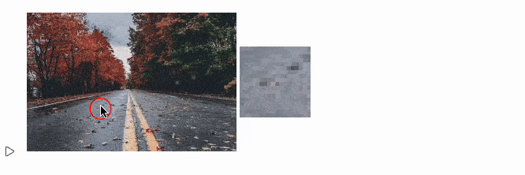

---
tags:
  - graphics
  - image
enableComments: true
authors: jerryi
---

# Interactive Magnifying Glass Effect
This code creates a magnifying glass effect over an image in Wolfram Language. As the mouse moves over the image, a zoomed-in circular region follows the cursor, simulating a magnifying lens.

<!--truncate-->

### 🔧 How it works:
 - `takeImagePart`: Extracts and resizes a square region of the image around a given position.
 - `magnifyingGlass`: Displays the full image in a graphics canvas with a circular “lens” that updates in real time using EventHandler. The lens dynamically shows a magnified version of the area under the cursor.

It uses low-level image manipulation (ImageTake, ImageCrop, ImageResize) and efficient buffer updates with ImageData for performance.

import { WLJSHTML, WLJSEditor, WLJSStore } from "@site/src/components/wljs-notebook-react";

<WLJSStore json={require('./attachments/765224ff-79b7-47f7-8739-63ad68ed73ee.txt').default} notebook={require('./attachments/notebook-765.wln').default}/>

<WLJSEditor display={"codemirror"} nid={"765224ff-79b7-47f7-8739-63ad68ed73ee"} id={"2ec03511-3ee8-4d84-8bc6-2ad04e0807c8"} type={"Input"} opts={{"InitGroup":true,"Fade":true}} >{`takeImagePart%5Bi_Image%2C%20position_%2C%20size_%3A0.1%5D%20%3A%3D%20With%5B%7B%0A%20%20dims%20%3D%20ImageDimensions%5Bi%5D%20%7BImageAspectRatio%5Bi%5D%2C1%7D%0A%7D%2C%20With%5B%7B%0A%20%20part%20%3D%20%7Bposition%20-%20%28%2AFB%5B%2A%29%28%28size%20dims%29%28%2A%2C%2A%29%2F%28%2A%2C%2A%29%282.0%29%29%28%2A%5DFB%2A%29%2C%20position%20%2B%20%28%2AFB%5B%2A%29%28%28size%20dims%29%28%2A%2C%2A%29%2F%28%2A%2C%2A%29%282.0%29%29%28%2A%5DFB%2A%29%7D%20%2F%2F%20Round%20%2F%2F%20Transpose%0A%7D%2C%0A%20%20ImageResize%5BImageCrop%5BImageTake%5Bi%2C%20Sequence%20%40%40%20part%5B%5B%7B2%2C1%7D%5D%5D%5D%2C%20Round%5Bsize%20dims%5D%5D%2C%20Scaled%5B5%5D%5D%0A%5D%20%5D%0A%0AmagnifyingGlass%5Bi_Image%5D%20%3A%3D%20Module%5B%7B%0A%20%20p%20%3D%20%7B0%2C0%7D%2C%20buffer%20%3D%20ImageData%5BtakeImagePart%5Bi%2C%20%7B0%2C0%7D%5D%2C%20%22Byte%22%5D%0A%7D%2C%20With%5B%7B%0A%20%20canvas%20%3D%20Graphics%5B%7B%0A%20%20%20%20Inset%5Bi%2C%20ImageDimensions%5Bi%5D%2F2%5D%2C%0A%20%20%20%20%28%2AVB%5B%2A%29%28RGBColor%5B1%2C%200%2C%200%5D%29%28%2A%2C%2A%29%28%2A%221%3AeJxTTMoPSmNiYGAo5gUSYZmp5S6pyflFiSX5RcEsQBHn4PCQNGaQPAeQCHJ3cs7PyS8qYgCDD%2FZQBgMDnAEA4iUPRg%3D%3D%22%2A%29%28%2A%5DVB%2A%29%2C%20Circle%5Bp%2F%2FOffload%2C%20Scaled%5B0.05%7B1%2C1%2FImageAspectRatio%5Bi%5D%7D%5D%5D%0A%20%20%7D%2C%20%0A%20%20%20%20ImagePadding-%3E0%2C%20%22Controls%22-%3EFalse%2C%0A%20%20%20%20PlotRange-%3E%20Transpose%5B%7B%7B0%2C0%7D%2C%20ImageDimensions%5Bi%5D%7D%5D%2C%0A%20%20%20%20ImageSize-%3E%28ImageDimensions%5Bi%5D%2FFrontFetch%5BGraphics%60DPR%5B%5D%5D%29%0A%20%20%5D%0A%7D%2C%0A%20%20Labeled%5BEventHandler%5Bcanvas%2C%20%7B%22mousemove%22%20-%3E%20Function%5Bposition%2C%0A%20%20%20%20buffer%20%3D%20ImageData%5BtakeImagePart%5Bi%2C%20%7B0%2C1%7D%20ImageDimensions%5Bi%5D%20%2B%20%7B1%2C-1%7D%20position%5D%2C%20%22Byte%22%5D%3B%0A%20%20%20%20p%20%3D%20position%3B%0A%20%20%5D%7D%5D%2C%20Image%5Bbuffer%20%2F%2F%20Offload%2C%20%22Byte%22%5D%2C%20Right%5D%0A%5D%20%5D`}</WLJSEditor>

<WLJSEditor display={"codemirror"} nid={"765224ff-79b7-47f7-8739-63ad68ed73ee"} id={"39576819-31fe-43ad-9eb7-b65cf7e665dd"} type={"Input"} opts={{}} >{`%28%2AVB%5B%2A%29%28FrontEndRef%5B%22c5af8cfd-9848-47b8-8292-eb9a23b501c2%22%5D%29%28%2A%2C%2A%29%28%2A%221%3AeJxTTMoPSmNkYGAoZgESHvk5KRCeEJBwK8rPK3HNS3GtSE0uLUlMykkNVgEKJ5smplkkp6XoWlqYWOiamCdZ6FoYWRrppiZZJhoZJ5kaGCYbAQCNCxWx%22%2A%29%28%2A%5DVB%2A%29%20%2F%2F%20magnifyingGlass`}</WLJSEditor>

