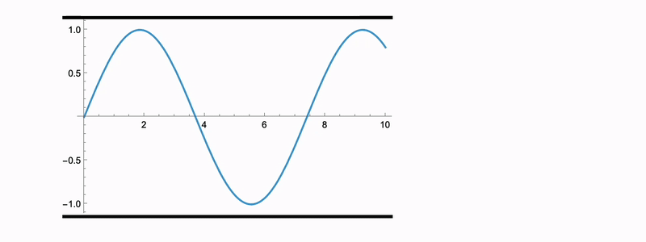
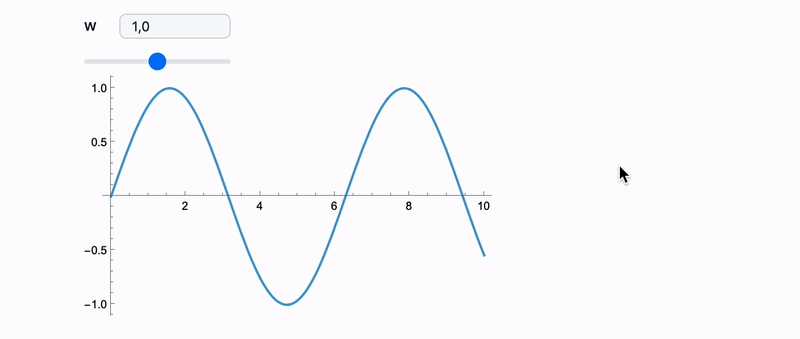
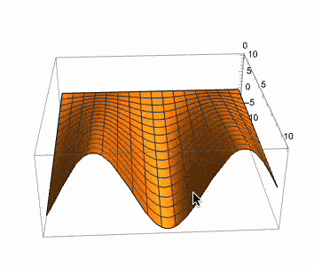

# Mathematica's render in animations and dynamics

**Developers log**

It is clear, that not everyone is happy with WLJS rendering engine. Some styles might be different or look different from the traditional Mathematica's plots. For this reason we have `MMAView` allowing to use built-in raster rendering engine of Wolfram Engine. 

But is it possible to animate things or use `Manipulate` together with `MMAView`?

<!--truncate-->

---

Short answer: __kinda__

```mathematica
MMAView[]
```

acts indirectly using parallel kernel to build and render the given expression, which is already async operation. Having it inside `Manipulate` or `Animate` makes it 2x async, which is not possible in Wolfram Kernel. Therefore most likely you will get

```
Timeout!
```

## Animation
Utilizing raster dynamics of `Image` and manually updating pixel data, one can achieve the desired effect:

1. prepare frames of animation

```mathematica
frames = Table[MMAView @ Plot[Sin[y x], {y,0,10}], {x, 0.1, 1.0, 0.05}];
```

2. animate frames

```mathematica
Module[{buffer = ImageData[frames//First, "Byte"]},
  Animate[Image[buffer // Offload, "Byte"], {i, 1, Length[frames], 1},
    "UpdateFunction" -> Function[i,
      (* stabilize raw image size *)
      buffer = ImageData[ImageCrop[frames[[i]], ImageDimensions[frames // First]], "Byte"];
      False (* prevent full refresh *)
    ]
  ]
]
```




## Manipulate
Here we need to forget about `Manipulate` or `ManipulatePlot` and define directly all sliders and etc. Also `MMAView` is a blocking function and does not provide a control over the rasterization process. However we can do it all at the low level anyway

```mathematica
With[{function = Plot[Sin[#1 x], {x,0,10}]&},
 With[{firstImage = MMAView[function[1]]},
  With[{dims = ImageDimensions[firstImage]},
    Module[{buffer = ImageData[firstImage, "Byte"]},
      {
        EventHandler[InputRange[0, 2, 0.1, "Label"->"w"], Function[w,
          Then[ParallelSubmitFunctionAsync[Function[{args, cbk},
              cbk @ ImageData[ImageCrop[Rasterize[function @ w], dims], "Byte"]
            ], {all}], Function[imgData,
              buffer = imgData;
          ]];
        ]],

        Image[buffer // Offload, "Byte"]
      } // Column 

    ]
  ]
 ]
]
```



Viola

PS: Most probably we need to make a wrapper for such things 🧙🏼‍♂️


## UPD
Screw that! We made it 🎈

### Graphics3D
We have a special wrapper for [Graphics3D](frontend/Reference/Graphics3D/Graphics3D.md) -like plots to make them interactive in the session

```mathematica
With[{p = Plot3D[f[x] y, {x,0,10}, {y,0,10}]},
  MMAView[p]
]
```

:::note
Note, that it is important to pass it using `With`, since `MMAView` has `HoldFirst` attribute. Otherwise the direct pass will give your a static plot
:::




**See more examples in the documentation!**