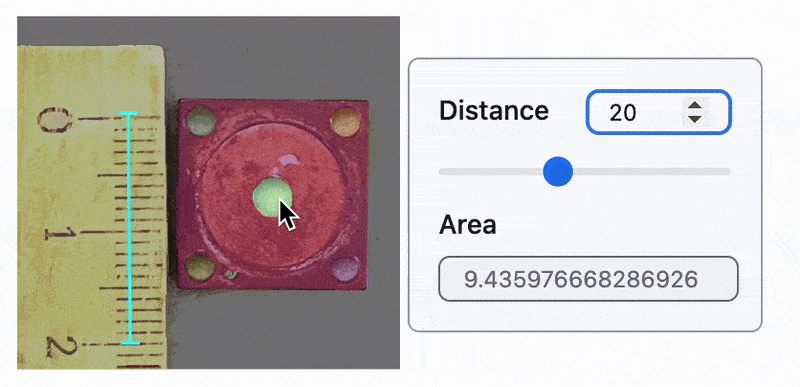
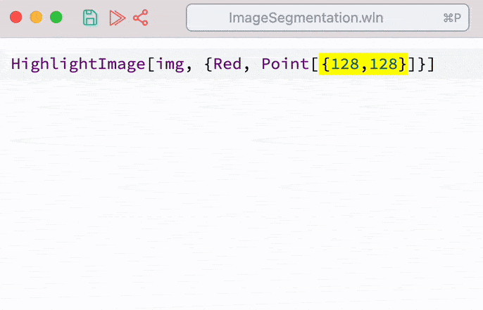

# Estimate the Area of an Image Segment
*Using Basic ML with Wolfram Engine*

Hi there! I am working as a spectroscopist. We shine light through the samples and estimate how much is absorbed and at which frequency. In this case, it is quite crucial to know the light spot, which is collimated by a special copper aperture:

<!--truncate-->

import { WLJSHTML, WLJSEditor, WLJSStore } from "@site/src/components/wljs-notebook-react";

<WLJSStore json={require('./attachments/32417caf-1fd1-413f-8ed5-7014f0ca6366.txt').default} notebook={require('./attachments/notebook-324.wln').default}/>

Let's drag and drop our image and adjust the brightness:

<WLJSEditor display={"codemirror"} nid={"32417caf-1fd1-413f-8ed5-7014f0ca6366"} id={"adf8e995-70f9-4354-abc1-508d0b66cbe4"} type={"Input"} opts={{}} >{`Import%5B%22yourPathToDroppedImage.jpeg%22%5D%3B%0AImageAdjust%5BImageResize%5B%25%2C%20400%5D%2C%20%7B0.01%2C%202%7D%5D`}</WLJSEditor>

Here is my sample image:

<WLJSEditor display={"codemirror"} nid={"32417caf-1fd1-413f-8ed5-7014f0ca6366"} id={"d8658b4f-815c-439d-8060-2a54d217229f"} type={"Input"} opts={{"InitGroup":true}} >{`img%20%3D%20%28%2AVB%5B%2A%29%28FrontEndRef%5B%2229e2ab9f-8a3d-492a-a77a-13df130878b9%22%5D%29%28%2A%2C%2A%29%28%2A%221%3AeJxTTMoPSmNkYGAoZgESHvk5KRCeEJBwK8rPK3HNS3GtSE0uLUlMykkNVgEKG1mmGiUmWabpWiQap%2BiaWBol6iaamyfqGhqnpBkaG1iYWyRZAgCJ%2BxWr%22%2A%29%28%2A%5DVB%2A%29%3B`}</WLJSEditor>

## Image segmentation
There is a local neural network, which is ready to be used for a general image segmentation:

<WLJSEditor display={"codemirror"} nid={"32417caf-1fd1-413f-8ed5-7014f0ca6366"} id={"bd1d0f61-60c4-4d7e-bca3-f8e96573ef00"} type={"Input"} opts={{"InitGroup":false}} >{`%28segments%20%3D%20ImageSegmentationComponents%5Bimg%5D%29%20%2F%2F%20AbsoluteTiming%3B%0AQuantity%5B%25%20%2F%2F%20First%2C%20%22Seconds%22%5D%0Asegments%20%2F%2F%20Colorize%20`}</WLJSEditor>

<WLJSEditor display={"codemirror"} nid={"32417caf-1fd1-413f-8ed5-7014f0ca6366"} id={"7eb8a2db-f84a-47c7-96c6-69404d149901"} type={"Output"} opts={{}} >{`%28%2AVB%5B%2A%29%28Quantity%5B63.408851%2C%20%22Seconds%22%5D%29%28%2A%2C%2A%29%28%2A%221%3AeJxTTMoPSmNkYGAoZgESHvk5KWnMIB4vkAjLTC13SU3OL0osyS8K5gCKBJYm5pVkllQWvfl%2BxCp0i79DMDtQNBioJi%2BlGADByRWf%22%2A%29%28%2A%5DVB%2A%29`}</WLJSEditor>

<WLJSEditor display={"codemirror"} nid={"32417caf-1fd1-413f-8ed5-7014f0ca6366"} id={"538ca437-8cb2-4808-bc5e-3bfece9c497a"} type={"Output"} opts={{}} >{`%28%2AVB%5B%2A%29%28FrontEndRef%5B%2233a9e052-8529-40e9-bb21-d580107ea254%22%5D%29%28%2A%2C%2A%29%28%2A%221%3AeJxTTMoPSmNkYGAoZgESHvk5KRCeEJBwK8rPK3HNS3GtSE0uLUlMykkNVgEKGxsnWqYamBrpWpgaWeqaGKRa6iYlGRnqpphaGBgamKcmGpmaAAB1TxTa%22%2A%29%28%2A%5DVB%2A%29`}</WLJSEditor>

It takes __a lot of time__! Can we do better for our case?

### Morphological components

<WLJSEditor display={"codemirror"} nid={"32417caf-1fd1-413f-8ed5-7014f0ca6366"} id={"1bac8809-60ca-48c7-a353-5cdf58f1f498"} type={"Input"} opts={{}} >{`MorphologicalComponents%5Bimg%5D%20%2F%2F%20Colorize%20`}</WLJSEditor>

<WLJSEditor display={"codemirror"} nid={"32417caf-1fd1-413f-8ed5-7014f0ca6366"} id={"ee0bbaf9-ddae-4c97-aeb0-6fc8cebb1166"} type={"Output"} opts={{}} >{`%28%2AVB%5B%2A%29%28FrontEndRef%5B%228f24228f-919c-4006-9f65-a8eca3335f86%22%5D%29%28%2A%2C%2A%29%28%2A%221%3AeJxTTMoPSmNkYGAoZgESHvk5KRCeEJBwK8rPK3HNS3GtSE0uLUlMykkNVgEKW6QZmRgZWaTpWhpaJuuaGBiY6VqmmZnqJlqkJicaGxubplmYAQB4JhUn%22%2A%29%28%2A%5DVB%2A%29`}</WLJSEditor>

Wow cool. It is faster than CNN (I guess), but requires some tweaking:

<WLJSEditor display={"codemirror"} nid={"32417caf-1fd1-413f-8ed5-7014f0ca6366"} id={"f977b283-959c-4c54-bbd0-b194b99e7b17"} type={"Input"} opts={{}} >{`MorphologicalComponents%5Bimg%2C%200.5%5D%20%2F%2F%20Colorize%20`}</WLJSEditor>

<WLJSEditor display={"codemirror"} nid={"32417caf-1fd1-413f-8ed5-7014f0ca6366"} id={"e7a36fa8-1544-47c5-9f25-c37f34e85a53"} type={"Output"} opts={{}} >{`%28%2AVB%5B%2A%29%28FrontEndRef%5B%22e584841b-1ba8-4ff7-ba7f-0a8f79268bab%22%5D%29%28%2A%2C%2A%29%28%2A%221%3AeJxTTMoPSmNkYGAoZgESHvk5KRCeEJBwK8rPK3HNS3GtSE0uLUlMykkNVgEKp5pamFiYGCbpGiYlWuiapKWZ6yYlmqfpGiRapJlbGplZJCUmAQCHXRYP%22%2A%29%28%2A%5DVB%2A%29`}</WLJSEditor>

Nope 🥺
I did not manage to make it work with a simpler approach. I guess, we have to stick to CNN.

## Back to CNN
Let's pick a point on our image:

<WLJSEditor display={"codemirror"} nid={"32417caf-1fd1-413f-8ed5-7014f0ca6366"} id={"12c5f7ce-cd6b-46e1-9592-796a17b3605a"} type={"Input"} opts={{}} >{`HighlightImage%5Bimg%2C%20%7BRed%2C%20Point%5B%28%2ABB%5B%2A%29%28%7B268%2C177.65625%60%7D%29%28%2A%2C%2A%29%28%2A%221%3AeJxTTMoPSmNkYGAoZgESHvk5KRAeB5AILqnMSXXKr0hjgskHleakFnMBGU6JydnpRfmleSlpzDDlQe5Ozvk5%2BUVFDGDwwR6dwcAAAAHdFiw%3D%22%2A%29%28%2A%5DBB%2A%29%5D%7D%5D`}</WLJSEditor>

<WLJSEditor display={"codemirror"} nid={"32417caf-1fd1-413f-8ed5-7014f0ca6366"} id={"c0381727-69dd-41e4-9e53-431b20e3f12a"} type={"Output"} opts={{}} >{`%28%2AVB%5B%2A%29%28FrontEndRef%5B%222d6fd627-6c9f-469a-8add-1613a1062c9a%22%5D%29%28%2A%2C%2A%29%28%2A%221%3AeJxTTMoPSmNkYGAoZgESHvk5KRCeEJBwK8rPK3HNS3GtSE0uLUlMykkNVgEKG6WYpaWYGZnrmiVbpumamFkm6lokpqToGpoZGicaGpgZJVsmAgCHARWn%22%2A%29%28%2A%5DVB%2A%29`}</WLJSEditor>

:::tip
Do not do by repeated revaluation of the same cell. Use __Command Palette__ tool ==Inline navigation drag gizmo== while selecting the coordinates of a point highlighted in yellow

:::

Now let us try again:

<WLJSEditor display={"codemirror"} nid={"32417caf-1fd1-413f-8ed5-7014f0ca6366"} id={"8b971bd2-388d-401b-9d55-5443d41cda4a"} type={"Input"} opts={{"InitGroup":false}} >{`segments%20%3D%20ImageSegmentationComponents%5Bimg%5D%3B`}</WLJSEditor>

Select one with a minimal area and one that includes our point:

<WLJSEditor display={"codemirror"} nid={"32417caf-1fd1-413f-8ed5-7014f0ca6366"} id={"43207f0d-0047-4e61-a633-54796649e079"} type={"Input"} opts={{}} >{`hole%20%3D%20With%5B%7Bi%20%3D%20SortBy%5BSelect%5BComponentMeasurements%5B%7Bimg%2C%20segments%7D%2C%20%22BoundingBox%22%5D%2C%20RegionMember%5BRectangle%20%40%40%20%23%5B%5B2%5D%5D%2C%20%28%2ABB%5B%2A%29%28%7B268%2C177.65625%60%7D%29%28%2A%2C%2A%29%28%2A%221%3AeJxTTMoPSmNkYGAoZgESHvk5KRAeB5AILqnMSXXKr0hjgskHleakFnMBGU6JydnpRfmleSlpzDDlQe5Ozvk5%2BUVFDGDwwR6dwcAAAAHdFiw%3D%22%2A%29%28%2A%5DBB%2A%29%5D%26%5D%2C%20Area%5BRectangle%20%40%40%20%23%5D%26%5D%2F%2FLast%2F%2FFirst%7D%2C%0A%20%20SelectComponents%5B%7Bimg%2C%20segments%7D%2C%20%28%23Label%20%3D%3D%20i%29%20%26%5D%20%2F%2F%20Last%20%0A%5D%3B%0A%0Ahole%20%2F%2F%20Colorize%20`}</WLJSEditor>

<WLJSEditor display={"codemirror"} nid={"32417caf-1fd1-413f-8ed5-7014f0ca6366"} id={"fde54d11-8895-4d25-bfb8-8ccf320b71a8"} type={"Output"} opts={{}} >{`%28%2AVB%5B%2A%29%28FrontEndRef%5B%22c5cbc3ab-ac8a-485d-993d-54d53cccc5e5%22%5D%29%28%2A%2C%2A%29%28%2A%221%3AeJxTTMoPSmNkYGAoZgESHvk5KRCeEJBwK8rPK3HNS3GtSE0uLUlMykkNVgEKJ5smJyUbJybpJiZbJOqaWJim6FpaGqfompqkmBonA4FpqikAmiAWlA%3D%3D%22%2A%29%28%2A%5DVB%2A%29`}</WLJSEditor>

Measure the area

<WLJSEditor display={"codemirror"} nid={"32417caf-1fd1-413f-8ed5-7014f0ca6366"} id={"8eb78215-fa8a-40ca-99c2-c175bc6aced9"} type={"Input"} opts={{}} >{`ComponentMeasurements%5Bhole%2C%20%22Area%22%5D%20%2F%2F%20First%20%2F%2F%20Last%20`}</WLJSEditor>

<WLJSEditor display={"codemirror"} nid={"32417caf-1fd1-413f-8ed5-7014f0ca6366"} id={"f5b53e63-6754-49b6-9b2c-daf392ec205b"} type={"Output"} opts={{}} >{`1358.875%60`}</WLJSEditor>

## Calibration
To get the correct value in real units, we need to adjust the integrated value by the corresponding Jacobian. Assuming that perspective distortions are negligible and the aspect ratio of the image was not changed, the area can be corrected by a constant multiplier corresponding to:

$$
\text{Area} = \text{UnitsPerPixel}^2 \cdot \text{PixelArea}
$$

We simply place two points using gizmo helpers:

<WLJSEditor display={"codemirror"} nid={"32417caf-1fd1-413f-8ed5-7014f0ca6366"} id={"fd769a3e-2082-4dd3-baac-f7e82c275dec"} type={"Input"} opts={{}} >{`HighlightImage%5Bimg%2C%20%7BRed%2C%20Line%5B%7B%7B129%2C24.828125000000018%60%7D%2C%20%7B129%2C262.828125%60%7D%7D%5D%7D%5D`}</WLJSEditor>

<WLJSEditor display={"codemirror"} nid={"32417caf-1fd1-413f-8ed5-7014f0ca6366"} id={"d64bc141-60e1-4198-8d1b-ebffcc2ec5d5"} type={"Output"} opts={{}} >{`%28%2AVB%5B%2A%29%28FrontEndRef%5B%22539e7a14-15ed-475e-8766-e19f8116320b%22%5D%29%28%2A%2C%2A%29%28%2A%221%3AeJxTTMoPSmNkYGAoZgESHvk5KRCeEJBwK8rPK3HNS3GtSE0uLUlMykkNVgEKmxpbpponGproGpqmpuiamJum6lqYm5npphpaplkYGpoZGxkkAQB5tRTx%22%2A%29%28%2A%5DVB%2A%29`}</WLJSEditor>

Esimate units per pixel

<WLJSEditor display={"codemirror"} nid={"32417caf-1fd1-413f-8ed5-7014f0ca6366"} id={"5767ac64-f6f0-4689-8f20-ab1efb60e0e7"} type={"Input"} opts={{}} >{`Line%5B%7B%7B129%2C24.828125000000018%60%7D%2C%20%7B129%2C262.828125%60%7D%7D%5D%20%2F%2F%20ArcLength%3B%0A20.0%20%2F%20%25`}</WLJSEditor>

<WLJSEditor display={"codemirror"} nid={"32417caf-1fd1-413f-8ed5-7014f0ca6366"} id={"2a2ce490-0ca1-48bd-bd90-5f4563633132"} type={"Output"} opts={{}} >{`0.08403361344537816%60`}</WLJSEditor>

__Final result: area of the hole__

<WLJSEditor display={"codemirror"} nid={"32417caf-1fd1-413f-8ed5-7014f0ca6366"} id={"35e31b74-b64f-43f1-9d8d-5ceeaaf76baa"} type={"Input"} opts={{}} >{`HighlightImage%5BBlend%5B%7Bimg%2C%20Colorize%5Bhole%5D%7D%2C%200.5%5D%2C%20%0A%20%20%7BDirective%5BRed%2C%20FontSize-%3E18%5D%2C%20Text%5BStringTemplate%5B%22Area%3A%20%60%60%20mm%5E%7B2%7D%22%5D%5B%28%2ASpB%5B%2A%29Power%5B0.08403%28%2A%7C%2A%29%2C%28%2A%7C%2A%292%5D%28%2A%5DSpB%2A%29%201358.87%5D%2C%20%7B268%2C177.65625%20%2B%2035%7D%2C%20%7B0%2C0%7D%5D%7D%0A%5D`}</WLJSEditor>

<WLJSEditor display={"codemirror"} nid={"32417caf-1fd1-413f-8ed5-7014f0ca6366"} id={"ce014d20-79d6-457d-87f7-b31cab004d10"} type={"Output"} opts={{}} >{`%28%2AVB%5B%2A%29%28FrontEndRef%5B%2283b999da-39b4-4e04-9c78-32b37c57299a%22%5D%29%28%2A%2C%2A%29%28%2A%221%3AeJxTTMoPSmNkYGAoZgESHvk5KRCeEJBwK8rPK3HNS3GtSE0uLUlMykkNVgEKWxgnWVpapiTqGlsmmeiapBqY6Fomm1voGhslGZsnm5obWVomAgB%2BBxUv%22%2A%29%28%2A%5DVB%2A%29`}</WLJSEditor>

## Automate it!
Let's create a widget that can accomplish this task in a few steps:

### Overlay
Here, we overlay our image with an inset that includes a dynamic `Image`. We reload the image data with masked regions depending on where the user's cursor is pointing:

<WLJSEditor display={"codemirror"} nid={"32417caf-1fd1-413f-8ed5-7014f0ca6366"} id={"7a3ed534-2660-4d1d-b543-a2b91e02403d"} type={"Input"} opts={{}} >{`Module%5B%7B%0A%20%20overlay%2C%20%0A%20%20segment%20%3D%201%0A%7D%2C%20With%5B%7B%0A%20%20masks%20%3D%20Values%5BComponentMeasurements%5B%7Bimg%2C%20segments%7D%2C%20%7B%22Mask%22%2C%20%22BoundingBox%22%2C%20%22Label%22%2C%20%22Area%22%2C%20%22BoundingBoxArea%22%7D%5D%5D%0A%7D%2C%0A%20%20%0A%20%20overlay%20%3D%20ImageData%5BColorize%5Bmasks%5B%5Bsegment%2C%201%5D%5D%5D%2C%20%22Byte%22%5D%3B%0A%0A%20%20EventHandler%5BHighlightImage%5BBlend%5B%7Bimg%2C%20Colorize%5Bsegments%5D%7D%2C%200.4%5D%2C%20%7B%0A%20%20%20%20%7BOpacity%5B0.2%5D%2C%20Inset%5BImage%5Boverlay%20%2F%2F%20Offload%2C%20%22Byte%22%5D%2C%20Center%2C%20Center%5D%7D%0A%20%20%7D%5D%2C%20%7B%22mousemove%22%20-%3E%20Function%5Bxy%2C%20%0A%20%20%20%20With%5B%7B%0A%20%20%20%20%20%20r%20%3D%20SortBy%5BSelect%5Bmasks%2C%20RegionMember%5BRectangle%20%40%40%20%23%5B%5B2%5D%5D%2C%20xy%5D%26%5D%2C%20Last%5D%20%2F%2F%20First%20%2F%2F%20Quiet%0A%20%20%20%20%7D%2C%0A%20%20%20%20%20%20If%5B%21ListQ%5Br%5D%2C%20Return%5B%5D%5D%3B%0A%20%20%20%20%20%20If%5Br%5B%5B3%5D%5D%20%3D%3D%20segment%2C%20Return%5B%5D%5D%3B%0A%20%20%20%20%20%20%0A%20%20%20%20%20%20segment%20%3D%20r%5B%5B3%5D%5D%3B%0A%20%20%20%20%20%20overlay%20%3D%20ImageData%5BColorize%5Bmasks%5B%5Bsegment%2C%201%5D%5D%5D%2C%20%22Byte%22%5D%3B%0A%20%20%20%20%5D%0A%20%20%5D%7D%5D%0A%0A%5D%5D`}</WLJSEditor>

:::note
Here we pick a segment with a minimal bounding box area to discard tiny distributed non-connected features.
:::

### Virtual Ruler
We need to match the scale of the image with real units. For that resound we construct two handles to place two points on the image. The easiest one would be this:

<WLJSEditor display={"codemirror"} nid={"32417caf-1fd1-413f-8ed5-7014f0ca6366"} id={"afec6a82-42a1-4899-ad26-bc3a5a10d635"} type={"Input"} opts={{}} >{`Graphics%5B%7B%0A%20%20Line%5B%7B%7B0%2C1%7D%2C%20%7B0%2C-1%7D%7D%5D%2C%20Line%5B%7B%7B-0.3%2C1%7D%2C%20%7B0.3%2C1%7D%7D%5D%2C%20Line%5B%7B%7B-0.3%2C-1%7D%2C%20%7B0.3%2C-1%7D%7D%5D%2C%0A%20%20Opacity%5B0.5%5D%2C%20Red%2C%20Rectangle%5B%7B0%2C1%7D-%7B0.2%2C0.2%7D%2C%20%7B0%2C1%7D%2B%7B0.2%2C0.2%7D%5D%2C%20Rectangle%5B%7B0%2C-1%7D-%7B0.2%2C0.2%7D%2C%20%7B0%2C-1%7D%2B%7B0.2%2C0.2%7D%5D%0A%7D%2C%20PlotRange-%3E1.2%7B%7B-1%2C1%7D%2C%20%7B-1%2C1%7D%7D%2C%20ImageSize-%3ESmall%5D`}</WLJSEditor>

<WLJSEditor display={"codemirror"} nid={"32417caf-1fd1-413f-8ed5-7014f0ca6366"} id={"a2ab3b55-1a53-45ac-9de9-664f90047746"} type={"Output"} opts={{}} >{`%28%2AVB%5B%2A%29%28Graphics%5B%7BLine%5B%7B%7B0%2C%201%7D%2C%20%7B0%2C%20-1%7D%7D%5D%2C%20Line%5B%7B%7B-0.3%2C%201%7D%2C%20%7B0.3%2C%201%7D%7D%5D%2C%20Line%5B%7B%7B-0.3%2C%20-1%7D%2C%20%7B0.3%2C%20-1%7D%7D%5D%2C%20Opacity%5B0.5%5D%2C%20RGBColor%5B1%2C%200%2C%200%5D%2C%20Rectangle%5B%7B-0.2%2C%200.8%7D%2C%20%7B0.2%2C%201.2%7D%5D%2C%20Rectangle%5B%7B-0.2%2C%20-1.2%7D%2C%20%7B0.2%2C%20-0.8%7D%5D%7D%2C%20PlotRange%20-%3E%20%7B%7B-1.2%2C%201.2%7D%2C%20%7B-1.2%2C%201.2%7D%7D%2C%20ImageSize%20-%3E%20Small%5D%29%28%2A%2C%2A%29%28%2A%221%3AeJxTTMoPSmNkYGAoZgESHvk5KWnMIB4HkHAvSizIyEwuTmOHyftkFpcgVPtk5qWmMaHIofAygTRDJkg5NvH%2FQEC8WUXGYHB5PxbzYHL2EDkyzAS7BYeZCHeCgsG%2FIDE5s6SyiAEMHtgjQivI3ck5Pye%2FCOwIiBcZ4E7lBClITS5JzEvPQXNT0ayZIHByP5Tx0h67vD3USZ%2FtSTASqmU%2FLiOhViLJB5XmpILNDsjJLwkCGk5MEH7ej%2BY4YuThNnnmJqanBmdWpRazAnnBuYk5OQCX9Kl6%22%2A%29%28%2A%5DVB%2A%29`}</WLJSEditor>

Where two red rectangles can be used as dragging area for a user mouse. Of course we have to recalculate the posiitons of upper and bottom segments considering the angle, i.e. not only for horisontal or vertical directions.

<WLJSEditor display={"codemirror"} nid={"32417caf-1fd1-413f-8ed5-7014f0ca6366"} id={"672009ac-3fae-4058-b5a2-e397afd490ad"} type={"Input"} opts={{}} >{`Module%5B%7B%0A%20%20overlay%2C%20%0A%20%20segment%20%3D%201%2C%20%0A%20%20nav%20%3D%20%7B%7B0.5%2C0.6%7D%20ImageDimensions%5Bimg%5D%2C%20%7B0.5%2C0.4%7D%20ImageDimensions%5Bimg%5D%7D%2C%0A%20%20minScale%20%3D%20%7B0.1%2C0.1%7D%20ImageDimensions%5Bimg%5D%20%2F%204.0%0A%7D%2C%20With%5B%7B%0A%20%20masks%20%3D%20Values%5BComponentMeasurements%5B%7Bimg%2C%20segments%7D%2C%20%7B%22Mask%22%2C%20%22BoundingBox%22%2C%20%22Label%22%2C%20%22Area%22%2C%20%22BoundingBoxArea%22%7D%5D%5D%2C%0A%20%20helperLines%20%3D%20Function%5Bp%2C%20With%5B%7Bdir%20%3D%20Normalize%5Bp%5B%5B2%5D%5D-p%5B%5B1%5D%5D%5D%7D%2C%0A%20%20%20%20%7Bp%2C%20%0A%20%20%20%20%20%20%7Bp%5B%5B1%5D%5D%20-%20minScale%5B%5B1%5D%5D%20%20%7Bdir%5B%5B2%5D%5D%2C%20-dir%5B%5B1%5D%5D%7D%2C%20p%5B%5B1%5D%5D%20%2B%20minScale%5B%5B1%5D%5D%20%20%7Bdir%5B%5B2%5D%5D%2C%20-dir%5B%5B1%5D%5D%7D%7D%2C%20%0A%20%20%20%20%20%20%7Bp%5B%5B2%5D%5D%20-%20minScale%5B%5B1%5D%5D%20%20%7Bdir%5B%5B2%5D%5D%2C%20-dir%5B%5B1%5D%5D%7D%2C%20p%5B%5B2%5D%5D%20%2B%20minScale%5B%5B1%5D%5D%20%20%7Bdir%5B%5B2%5D%5D%2C%20-dir%5B%5B1%5D%5D%7D%7D%0A%20%20%20%20%7D%0A%20%20%5D%5D%0A%7D%2C%0A%0A%20%20nav%20%3D%20helperLines%5Bnav%5D%3B%0A%20%20%0A%20%20overlay%20%3D%20ImageData%5BColorize%5Bmasks%5B%5Bsegment%2C%201%5D%5D%5D%2C%20%22Byte%22%5D%3B%0A%0A%20%20EventHandler%5BHighlightImage%5BBlend%5B%7Bimg%2C%20Colorize%5Bsegments%5D%7D%2C%200.4%5D%2C%20%7B%0A%0A%20%20%20%20%7BOpacity%5B0.2%5D%2C%20Inset%5BImage%5Boverlay%20%2F%2F%20Offload%2C%20%22Byte%22%5D%2C%20Center%2C%20Center%5D%7D%2C%0A%20%20%0A%20%20%20%20Cyan%2C%20Line%5Bnav%5B%5B1%5D%5D%20%2F%2F%20Offload%5D%2C%20%0A%20%20%20%20Line%5Bnav%5B%5B2%5D%5D%20%2F%2F%20Offload%5D%2C%20Line%5Bnav%5B%5B3%5D%5D%20%2F%2F%20Offload%5D%2C%0A%0A%20%20%20%20%7B%20Opacity%5B0%5D%2C%0A%20%20%20%20%20%20EventHandler%5BRectangle%5Bnav%5B%5B1%2C1%5D%5D%20-%20minScale%2C%20nav%5B%5B1%2C1%5D%5D%20%2B%20minScale%5D%2C%20%7B%22drag%22-%3EFunction%5Bxy%2C%0A%20%20%20%20%20%20%20%20nav%5B%5B1%2C%201%5D%5D%20%3D%20xy%3B%0A%20%20%20%20%20%20%20%20nav%20%3D%20helperLines%5Bnav%5B%5B1%5D%5D%5D%3B%0A%20%20%20%20%20%20%5D%7D%5D%2C%0A%20%20%20%20%20%20EventHandler%5BRectangle%5Bnav%5B%5B1%2C2%5D%5D%20-%20minScale%2C%20nav%5B%5B1%2C2%5D%5D%20%2B%20minScale%5D%2C%20%7B%22drag%22-%3EFunction%5Bxy%2C%0A%20%20%20%20%20%20%20%20nav%5B%5B1%2C%202%5D%5D%20%3D%20xy%3B%0A%20%20%20%20%20%20%20%20nav%20%3D%20helperLines%5Bnav%5B%5B1%5D%5D%5D%3B%0A%20%20%20%20%20%20%5D%7D%5D%0A%20%20%20%20%7D%0A%20%20%20%20%0A%20%20%7D%5D%2C%20%7B%22mousemove%22%20-%3E%20Function%5Bxy%2C%20%0A%20%20%20%20With%5B%7B%0A%20%20%20%20%20%20r%20%3D%20SortBy%5BSelect%5Bmasks%2C%20RegionMember%5BRectangle%20%40%40%20%23%5B%5B2%5D%5D%2C%20xy%5D%26%5D%2C%20Last%5D%20%2F%2F%20First%20%2F%2F%20Quiet%0A%20%20%20%20%7D%2C%0A%20%20%20%20%20%20If%5B%21ListQ%5Br%5D%2C%20Return%5B%5D%5D%3B%0A%20%20%20%20%20%20If%5Br%5B%5B3%5D%5D%20%3D%3D%20segment%2C%20Return%5B%5D%5D%3B%0A%20%20%20%20%20%20%0A%20%20%20%20%20%20segment%20%3D%20r%5B%5B3%5D%5D%3B%0A%20%20%20%20%20%20overlay%20%3D%20ImageData%5BColorize%5Bmasks%5B%5Bsegment%2C%201%5D%5D%5D%2C%20%22Byte%22%5D%3B%0A%20%20%20%20%5D%0A%20%20%5D%7D%5D%0A%0A%5D%5D`}</WLJSEditor>

### Final version
Let's add a panel with a slider to enter the length of the measured distance in real-world units and a text window with calculated area:

<WLJSEditor display={"codemirror"} nid={"32417caf-1fd1-413f-8ed5-7014f0ca6366"} id={"24f53e98-cf14-49e7-a627-1a16d12b49a3"} type={"Input"} opts={{}} >{`Module%5B%7B%0A%20%20overlay%2C%20%0A%20%20segment%20%3D%201%2C%20%0A%20%20distance%20%3D%201.0%2C%0A%20%20area%20%3D%200.0%2C%0A%20%20nav%20%3D%20%7B%7B0.5%2C0.6%7D%20ImageDimensions%5Bimg%5D%2C%20%7B0.5%2C0.4%7D%20ImageDimensions%5Bimg%5D%7D%2C%0A%20%20minScale%20%3D%20%7B0.1%2C0.1%7D%20ImageDimensions%5Bimg%5D%20%2F%204.0%0A%7D%2C%20With%5B%7B%0A%20%20masks%20%3D%20Values%5BComponentMeasurements%5B%7Bimg%2C%20segments%7D%2C%20%7B%22Mask%22%2C%20%22BoundingBox%22%2C%20%22Label%22%2C%20%22Area%22%2C%20%22BoundingBoxArea%22%7D%5D%5D%2C%0A%20%20helperLines%20%3D%20Function%5Bp%2C%20With%5B%7Bdir%20%3D%20Normalize%5Bp%5B%5B2%5D%5D-p%5B%5B1%5D%5D%5D%7D%2C%0A%20%20%20%20%7Bp%2C%20%0A%20%20%20%20%20%20%7Bp%5B%5B1%5D%5D%20-%20minScale%5B%5B1%5D%5D%20%20%7Bdir%5B%5B2%5D%5D%2C%20-dir%5B%5B1%5D%5D%7D%2C%20p%5B%5B1%5D%5D%20%2B%20minScale%5B%5B1%5D%5D%20%20%7Bdir%5B%5B2%5D%5D%2C%20-dir%5B%5B1%5D%5D%7D%7D%2C%20%0A%20%20%20%20%20%20%7Bp%5B%5B2%5D%5D%20-%20minScale%5B%5B1%5D%5D%20%20%7Bdir%5B%5B2%5D%5D%2C%20-dir%5B%5B1%5D%5D%7D%2C%20p%5B%5B2%5D%5D%20%2B%20minScale%5B%5B1%5D%5D%20%20%7Bdir%5B%5B2%5D%5D%2C%20-dir%5B%5B1%5D%5D%7D%7D%0A%20%20%20%20%7D%0A%20%20%5D%5D%2C%0A%0A%20%20computeArea%20%3D%20Function%5B%7Bd%2Cp%2Cm%2Cs%7D%2C%20%28%2ASpB%5B%2A%29Power%5B%28%28%2AFB%5B%2A%29%28%28d%29%28%2A%2C%2A%29%2F%28%2A%2C%2A%29%28Norm%5Bp%5B%5B1%2C1%5D%5D-p%5B%5B1%2C2%5D%5D%5D%29%29%28%2A%5DFB%2A%29%29%28%2A%7C%2A%29%2C%28%2A%7C%2A%292%5D%28%2A%5DSpB%2A%29%20m%5B%5Bs%2C%204%5D%5D%5D%0A%7D%2C%0A%0A%20%20nav%20%3D%20helperLines%5Bnav%5D%3B%0A%20%20area%20%3D%20computeArea%5Bdistance%2C%20nav%2C%20masks%2C%20segment%5D%3B%0A%20%20%0A%20%20overlay%20%3D%20ImageData%5BColorize%5Bmasks%5B%5Bsegment%2C%201%5D%5D%5D%2C%20%22Byte%22%5D%3B%0A%0A%20%7B%0A%20%20%20EventHandler%5BHighlightImage%5BBlend%5B%7Bimg%2C%20Colorize%5Bsegments%5D%7D%2C%200.4%5D%2C%20%7B%0A%0A%20%20%20%20%7BOpacity%5B0.2%5D%2C%20Inset%5BImage%5Boverlay%20%2F%2F%20Offload%2C%20%22Byte%22%5D%2C%20Center%2C%20Center%5D%7D%2C%0A%20%20%0A%20%20%20%20Cyan%2C%20Line%5Bnav%5B%5B1%5D%5D%20%2F%2F%20Offload%5D%2C%20%0A%20%20%20%20Line%5Bnav%5B%5B2%5D%5D%20%2F%2F%20Offload%5D%2C%20Line%5Bnav%5B%5B3%5D%5D%20%2F%2F%20Offload%5D%2C%0A%0A%20%20%20%20%7B%20Opacity%5B0%5D%2C%0A%20%20%20%20%20%20EventHandler%5BRectangle%5Bnav%5B%5B1%2C1%5D%5D%20-%20minScale%2C%20nav%5B%5B1%2C1%5D%5D%20%2B%20minScale%5D%2C%20%7B%22drag%22-%3EFunction%5Bxy%2C%0A%20%20%20%20%20%20%20%20nav%5B%5B1%2C%201%5D%5D%20%3D%20xy%3B%0A%20%20%20%20%20%20%20%20nav%20%3D%20helperLines%5Bnav%5B%5B1%5D%5D%5D%3B%0A%20%20%20%20%20%20%5D%7D%5D%2C%0A%20%20%20%20%20%20EventHandler%5BRectangle%5Bnav%5B%5B1%2C2%5D%5D%20-%20minScale%2C%20nav%5B%5B1%2C2%5D%5D%20%2B%20minScale%5D%2C%20%7B%22drag%22-%3EFunction%5Bxy%2C%0A%20%20%20%20%20%20%20%20nav%5B%5B1%2C%202%5D%5D%20%3D%20xy%3B%0A%20%20%20%20%20%20%20%20nav%20%3D%20helperLines%5Bnav%5B%5B1%5D%5D%5D%3B%0A%20%20%20%20%20%20%5D%7D%5D%0A%20%20%20%20%7D%0A%20%20%20%20%0A%20%20%7D%5D%2C%20%7B%22mousemove%22%20-%3E%20Function%5Bxy%2C%20%0A%20%20%20%20With%5B%7B%0A%20%20%20%20%20%20r%20%3D%20SortBy%5BSelect%5Bmasks%2C%20RegionMember%5BRectangle%20%40%40%20%23%5B%5B2%5D%5D%2C%20xy%5D%26%5D%2C%20Last%5D%20%2F%2F%20First%20%2F%2F%20Quiet%0A%20%20%20%20%7D%2C%0A%20%20%20%20%20%20If%5B%21ListQ%5Br%5D%2C%20Return%5B%5D%5D%3B%0A%20%20%20%20%20%20If%5Br%5B%5B3%5D%5D%20%3D%3D%20segment%2C%20Return%5B%5D%5D%3B%0A%20%20%20%20%20%20%0A%20%20%20%20%20%20segment%20%3D%20r%5B%5B3%5D%5D%3B%0A%20%20%20%20%20%20overlay%20%3D%20ImageData%5BColorize%5Bmasks%5B%5Bsegment%2C%201%5D%5D%5D%2C%20%22Byte%22%5D%3B%0A%20%20%20%20%20%20area%20%3D%20computeArea%5Bdistance%2C%20nav%2C%20masks%2C%20segment%5D%3B%0A%20%20%20%20%5D%0A%20%20%5D%7D%5D%2C%0A%20%20%0A%20%20Panel%5B%7B%0A%20%20%20%20EventHandler%5BInputRange%5B0%2C%2050%2C%200.01%2C%201.0%2C%20%22Label%22-%3E%22Distance%22%5D%2C%20Function%5Bd%2C%20%0A%20%20%20%20%20%20distance%20%3D%20d%3B%0A%20%20%20%20%20%20area%20%3D%20computeArea%5Bdistance%2C%20nav%2C%20masks%2C%20segment%5D%3B%0A%20%20%20%20%5D%5D%2C%0A%0A%20%20%20%20TextView%5Barea%20%2F%2F%20Offload%2C%20%22Label%22-%3E%22Area%22%5D%0A%20%20%7D%20%2F%2F%20Column%5D%0A%20%7D%20%2F%2F%20Row%20%0A%0A%5D%5D`}</WLJSEditor>

### Final final version
As a last commit we can add a file browser and contrast/brightness correction widget:

<WLJSEditor display={"codemirror"} nid={"32417caf-1fd1-413f-8ed5-7014f0ca6366"} id={"d285159a-558c-4571-9bf9-094f146effbe"} type={"Input"} opts={{"InitGroup":true,"Fade":true}} >{`widget1%5Bimg_Image%5D%20%3A%3D%20Module%5B%7B%0A%20%20overlay%2C%20%0A%20%20segment%20%3D%201%2C%20%0A%20%20distance%20%3D%201.0%2C%0A%20%20area%20%3D%200.0%2C%0A%20%20nav%20%3D%20%7B%7B0.5%2C0.6%7D%20ImageDimensions%5Bimg%5D%2C%20%7B0.5%2C0.4%7D%20ImageDimensions%5Bimg%5D%7D%2C%0A%20%20minScale%20%3D%20%7B0.1%2C0.1%7D%20ImageDimensions%5Bimg%5D%20%2F%204.0%2C%0A%20%20segments%20%3D%20ImageSegmentationComponents%5Bimg%5D%0A%7D%2C%20With%5B%7B%0A%20%20masks%20%3D%20Values%5BComponentMeasurements%5B%7Bimg%2C%20segments%7D%2C%20%7B%22Mask%22%2C%20%22BoundingBox%22%2C%20%22Label%22%2C%20%22Area%22%2C%20%22BoundingBoxArea%22%7D%5D%5D%2C%0A%20%20helperLines%20%3D%20Function%5Bp%2C%20With%5B%7Bdir%20%3D%20Normalize%5Bp%5B%5B2%5D%5D-p%5B%5B1%5D%5D%5D%7D%2C%0A%20%20%20%20%7Bp%2C%20%0A%20%20%20%20%20%20%7Bp%5B%5B1%5D%5D%20-%20minScale%5B%5B1%5D%5D%20%20%7Bdir%5B%5B2%5D%5D%2C%20-dir%5B%5B1%5D%5D%7D%2C%20p%5B%5B1%5D%5D%20%2B%20minScale%5B%5B1%5D%5D%20%20%7Bdir%5B%5B2%5D%5D%2C%20-dir%5B%5B1%5D%5D%7D%7D%2C%20%0A%20%20%20%20%20%20%7Bp%5B%5B2%5D%5D%20-%20minScale%5B%5B1%5D%5D%20%20%7Bdir%5B%5B2%5D%5D%2C%20-dir%5B%5B1%5D%5D%7D%2C%20p%5B%5B2%5D%5D%20%2B%20minScale%5B%5B1%5D%5D%20%20%7Bdir%5B%5B2%5D%5D%2C%20-dir%5B%5B1%5D%5D%7D%7D%0A%20%20%20%20%7D%0A%20%20%5D%5D%2C%0A%0A%20%20computeArea%20%3D%20Function%5B%7Bd%2Cp%2Cm%7D%2C%20%28%2ASpB%5B%2A%29Power%5B%28%28%2AFB%5B%2A%29%28%28d%29%28%2A%2C%2A%29%2F%28%2A%2C%2A%29%28Norm%5Bp%5B%5B1%2C1%5D%5D-p%5B%5B1%2C2%5D%5D%5D%29%29%28%2A%5DFB%2A%29%29%28%2A%7C%2A%29%2C%28%2A%7C%2A%292%5D%28%2A%5DSpB%2A%29%20m%5B%5B4%5D%5D%5D%0A%7D%2C%0A%0A%20%20nav%20%3D%20helperLines%5Bnav%5D%3B%0A%20%20area%20%3D%20computeArea%5Bdistance%2C%20nav%2C%20masks%5B%5Bsegment%5D%5D%5D%3B%0A%20%20%0A%20%20overlay%20%3D%20ImageData%5BColorize%5Bmasks%5B%5Bsegment%2C%201%5D%5D%5D%2C%20%22Byte%22%5D%3B%0A%0A%20%7B%0A%20%20%20EventHandler%5BHighlightImage%5BBlend%5B%7Bimg%2C%20Colorize%5Bsegments%5D%7D%2C%200.4%5D%2C%20%7B%0A%0A%20%20%20%20%7BOpacity%5B0.2%5D%2C%20Inset%5BImage%5Boverlay%20%2F%2F%20Offload%2C%20%22Byte%22%5D%2C%20Center%2C%20Center%5D%7D%2C%0A%20%20%0A%20%20%20%20Cyan%2C%20Line%5Bnav%5B%5B1%5D%5D%20%2F%2F%20Offload%5D%2C%20%0A%20%20%20%20Line%5Bnav%5B%5B2%5D%5D%20%2F%2F%20Offload%5D%2C%20Line%5Bnav%5B%5B3%5D%5D%20%2F%2F%20Offload%5D%2C%0A%0A%20%20%20%20%7B%20Opacity%5B0%5D%2C%0A%20%20%20%20%20%20EventHandler%5BRectangle%5Bnav%5B%5B1%2C1%5D%5D%20-%20minScale%2C%20nav%5B%5B1%2C1%5D%5D%20%2B%20minScale%5D%2C%20%7B%22drag%22-%3EFunction%5Bxy%2C%0A%20%20%20%20%20%20%20%20nav%5B%5B1%2C%201%5D%5D%20%3D%20xy%3B%0A%20%20%20%20%20%20%20%20nav%20%3D%20helperLines%5Bnav%5B%5B1%5D%5D%5D%3B%0A%20%20%20%20%20%20%5D%7D%5D%2C%0A%20%20%20%20%20%20EventHandler%5BRectangle%5Bnav%5B%5B1%2C2%5D%5D%20-%20minScale%2C%20nav%5B%5B1%2C2%5D%5D%20%2B%20minScale%5D%2C%20%7B%22drag%22-%3EFunction%5Bxy%2C%0A%20%20%20%20%20%20%20%20nav%5B%5B1%2C%202%5D%5D%20%3D%20xy%3B%0A%20%20%20%20%20%20%20%20nav%20%3D%20helperLines%5Bnav%5B%5B1%5D%5D%5D%3B%0A%20%20%20%20%20%20%5D%7D%5D%0A%20%20%20%20%7D%0A%20%20%20%20%0A%20%20%7D%5D%2C%20%7B%22mousemove%22%20-%3E%20Function%5Bxy%2C%20%0A%20%20%20%20With%5B%7B%0A%20%20%20%20%20%20r%20%3D%20SortBy%5BSelect%5Bmasks%2C%20RegionMember%5BRectangle%20%40%40%20%23%5B%5B2%5D%5D%2C%20xy%5D%26%5D%2C%20Last%5D%20%2F%2F%20First%20%2F%2F%20Quiet%0A%20%20%20%20%7D%2C%0A%20%20%20%20%20%20If%5B%21ListQ%5Br%5D%2C%20Return%5B%5D%5D%3B%0A%20%20%20%20%20%20If%5Br%5B%5B3%5D%5D%20%3D%3D%20segment%2C%20Return%5B%5D%5D%3B%0A%20%20%20%20%20%20%0A%20%20%20%20%20%20segment%20%3D%20r%5B%5B3%5D%5D%3B%0A%20%20%20%20%20%20overlay%20%3D%20ImageData%5BColorize%5Bmasks%5B%5Bsegment%5D%5D%5B%5B1%5D%5D%5D%2C%20%22Byte%22%5D%3B%0A%20%20%20%20%20%20area%20%3D%20computeArea%5Bdistance%2C%20nav%2C%20masks%5B%5Bsegment%5D%5D%5D%3B%0A%20%20%20%20%5D%0A%20%20%5D%7D%5D%2C%0A%20%20%0A%20%20Panel%5B%7B%0A%20%20%20%20EventHandler%5BInputRange%5B0%2C%2050%2C%200.01%2C%201.0%2C%20%22Label%22-%3E%22Distance%22%5D%2C%20Function%5Bd%2C%20%0A%20%20%20%20%20%20distance%20%3D%20d%3B%0A%20%20%20%20%20%20area%20%3D%20computeArea%5Bdistance%2C%20nav%2C%20masks%5B%5Bsegment%5D%5D%5D%3B%0A%20%20%20%20%5D%5D%2C%0A%0A%20%20%20%20TextView%5Barea%20%2F%2F%20Offload%2C%20%22Label%22-%3E%22Area%22%5D%0A%20%20%7D%20%2F%2F%20Column%5D%0A%20%7D%20%2F%2F%20Row%20%0A%0A%5D%5D%3B%0A%0Awidget2%5Bimg_%5D%20%3A%3D%20Module%5B%7B%0A%20%20imageData%20%3D%20ImageData%5Bimg%2C%20%22Byte%22%5D%0A%7D%2C%20With%5B%7Bo%20%3D%20img%7D%2C%0A%0A%20%20%7B%0A%20%20%20%20Image%5BimageData%20%2F%2F%20Offload%2C%20%22Byte%22%5D%2C%0A%20%20%20%20EventHandler%5BInputGroup%5B%7B%0A%20%20%20%20%20%20InputRange%5B-1%2C2%2C0.1%2C%20%22Label%22-%3E%22Contrast%22%5D%2C%0A%20%20%20%20%20%20InputRange%5B0%2C2%2C0.1%2C%20%22Label%22-%3E%22Brightness%22%5D%0A%20%20%20%20%7D%5D%2C%20Function%5Bc%2C%0A%20%20%20%20%20%20img%20%3D%20ImageAdjust%5Bo%2C%20c%5D%3B%0A%20%20%20%20%20%20imageData%20%3D%20ImageData%5Bimg%2C%20%22Byte%22%5D%3B%0A%20%20%20%20%5D%5D%0A%20%20%7D%20%2F%2F%20Row%0A%0A%5D%5D%3B%0A%0ASetAttributes%5Bwidget2%2C%20HoldFirst%5D`}</WLJSEditor>

1. Evaluate this cell

<WLJSEditor display={"codemirror"} nid={"32417caf-1fd1-413f-8ed5-7014f0ca6366"} id={"5df3c9b9-2f6e-44b3-b6f6-447bf6b49e2b"} type={"Input"} opts={{}} >{`path%20%3D%20SystemDialogInput%5B%22FileOpen%22%5D%3B%0Aimg%20%3D%20Null%3B%0A%0AIf%5BImageQ%5Bimg%20%3D%20Import%5Bpath%5D%5D%2C%0A%20%20img%20%3D%20ImageResize%5Bimg%2C%20350%5D%3B%0A%20%20widget2%5Bimg%5D%0A%2C%20%24Failed%5D`}</WLJSEditor>

- After adjusting evaluate this one

<WLJSEditor display={"codemirror"} nid={"32417caf-1fd1-413f-8ed5-7014f0ca6366"} id={"2b50b031-9f1e-49ea-a372-88f45820164b"} type={"Input"} opts={{}} >{`widget1%5Bimg%5D`}</WLJSEditor>

## Convert to a Mini App
You can export this entire notebook into a mini-app. There are a few rules to follow:
- All initialization cells will be executed on start.
- The last input cell will represent the main window of the app.
- Any defined variables in the notebook will be isolated.

Since we have two widgets, it might be handy to work with multiple windows.

### Main Window
This will just be a file browser button. But first, define some helper components:

<WLJSEditor display={"codemirror"} nid={"32417caf-1fd1-413f-8ed5-7014f0ca6366"} id={"dbe2f848-1bf5-4b98-a32c-4625b62cd0a3"} type={"Input"} opts={{"InitGroup":true,"Fade":true}} >{`.wlx%0A%0AprogressBarIcon%20%3D%20%3Csvg%20aria-hidden%3D%22true%22%20class%3D%22w-5%20h-4%20text-gray-200%20animate-spin%20dark%3Atext-gray-600%20fill-teal-600%22%20viewBox%3D%220%200%20100%20101%22%20fill%3D%22none%22%3E%3Cpath%20d%3D%22M100%2050.5908C100%2078.2051%2077.6142%20100.591%2050%20100.591C22.3858%20100.591%200%2078.2051%200%2050.5908C0%2022.9766%2022.3858%200.59082%2050%200.59082C77.6142%200.59082%20100%2022.9766%20100%2050.5908ZM9.08144%2050.5908C9.08144%2073.1895%2027.4013%2091.5094%2050%2091.5094C72.5987%2091.5094%2090.9186%2073.1895%2090.9186%2050.5908C90.9186%2027.9921%2072.5987%209.67226%2050%209.67226C27.4013%209.67226%209.08144%2027.9921%209.08144%2050.5908Z%22%20fill%3D%22currentColor%22%3E%3C%2Fpath%3E%3Cpath%20d%3D%22M93.9676%2039.0409C96.393%2038.4038%2097.8624%2035.9116%2097.0079%2033.5539C95.2932%2028.8227%2092.871%2024.3692%2089.8167%2020.348C85.8452%2015.1192%2080.8826%2010.7238%2075.2124%207.41289C69.5422%204.10194%2063.2754%201.94025%2056.7698%201.05124C51.7666%200.367541%2046.6976%200.446843%2041.7345%201.27873C39.2613%201.69328%2037.813%204.19778%2038.4501%206.62326C39.0873%209.04874%2041.5694%2010.4717%2044.0505%2010.1071C47.8511%209.54855%2051.7191%209.52689%2055.5402%2010.0491C60.8642%2010.7766%2065.9928%2012.5457%2070.6331%2015.2552C75.2735%2017.9648%2079.3347%2021.5619%2082.5849%2025.841C84.9175%2028.9121%2086.7997%2032.2913%2088.1811%2035.8758C89.083%2038.2158%2091.5421%2039.6781%2093.9676%2039.0409Z%22%20fill%3D%22currentFill%22%3E%3C%2Fpath%3E%3C%2Fsvg%3E`}</WLJSEditor>

<WLJSEditor display={"wlx"} nid={"32417caf-1fd1-413f-8ed5-7014f0ca6366"} id={"da6a57e3-d15c-4a77-ab4b-37b01b01dc4f"} type={"Output"} opts={{}} >{`%3Csvg%20aria-hidden%3D%22true%22%20class%3D%22w-5%20h-4%20text-gray-200%20animate-spin%20dark%3Atext-gray-600%20fill-teal-600%22%20viewBox%3D%220%200%20100%20101%22%20fill%3D%22none%22%3E%3Cpath%20d%3D%22M100%2050.5908C100%2078.2051%2077.6142%20100.591%2050%20100.591C22.3858%20100.591%200%2078.2051%200%2050.5908C0%2022.9766%2022.3858%200.59082%2050%200.59082C77.6142%200.59082%20100%2022.9766%20100%2050.5908ZM9.08144%2050.5908C9.08144%2073.1895%2027.4013%2091.5094%2050%2091.5094C72.5987%2091.5094%2090.9186%2073.1895%2090.9186%2050.5908C90.9186%2027.9921%2072.5987%209.67226%2050%209.67226C27.4013%209.67226%209.08144%2027.9921%209.08144%2050.5908Z%22%20fill%3D%22currentColor%22%3E%3C%2Fpath%3E%3Cpath%20d%3D%22M93.9676%2039.0409C96.393%2038.4038%2097.8624%2035.9116%2097.0079%2033.5539C95.2932%2028.8227%2092.871%2024.3692%2089.8167%2020.348C85.8452%2015.1192%2080.8826%2010.7238%2075.2124%207.41289C69.5422%204.10194%2063.2754%201.94025%2056.7698%201.05124C51.7666%200.367541%2046.6976%200.446843%2041.7345%201.27873C39.2613%201.69328%2037.813%204.19778%2038.4501%206.62326C39.0873%209.04874%2041.5694%2010.4717%2044.0505%2010.1071C47.8511%209.54855%2051.7191%209.52689%2055.5402%2010.0491C60.8642%2010.7766%2065.9928%2012.5457%2070.6331%2015.2552C75.2735%2017.9648%2079.3347%2021.5619%2082.5849%2025.841C84.9175%2028.9121%2086.7997%2032.2913%2088.1811%2035.8758C89.083%2038.2158%2091.5421%2039.6781%2093.9676%2039.0409Z%22%20fill%3D%22currentFill%22%3E%3C%2Fpath%3E%3C%2Fsvg%3E`}</WLJSEditor>

Now our window and it's logic:

<WLJSEditor display={"codemirror"} nid={"32417caf-1fd1-413f-8ed5-7014f0ca6366"} id={"4ff1958e-f017-45ac-9f17-8422c4d64b25"} type={"Input"} opts={{"InitGroup":true}} >{`notebook%20%3D%20EvaluationNotebook%5B%5D%3B%0Aimg%20%3D%20Null%3B%0A%0AClearAll%5BMainWindow%5D%3B%0A%0AMainWindow%20%3A%3D%20Panel%5B%7B%0A%20%20Style%5B%22Open%20an%20image%22%2C%2010%2C%20Lighter%5BBlack%5D%2CFontFamily-%3E%22system-ui%22%5D%2C%0A%20%20EventHandler%5B%0A%20%20%20%20InputButton%5B%22Browse%22%5D%2C%20%0A%20%20%20%20AsyncFunction%5BNull%2C%20Module%5B%7Bpath%2C%20cell%2C%20progressBar%20%3D%20%22%22%7D%2C%20%0A%20%20%20%20%20%20path%20%3D%20SystemDialogInputAsync%5B%22FileOpen%22%5D%20%2F%2F%20Await%3B%0A%20%20%20%20%20%20If%5BStringQ%5Bpath%5D%2C%0A%20%20%20%20%20%20%20%20With%5B%7Bi%20%3D%20Import%5Bpath%5D%7D%2C%0A%20%20%20%20%20%20%20%20%20%20If%5BImageQ%5Bi%5D%2C%20%0A%20%20%20%20%20%20%20%20%20%20%20%20img%20%3D%20ImageResize%5Bi%2C%20350%5D%3B%0A%20%20%20%20%20%20%20%20%20%20%20%20cell%20%3D%20CellPrint%5B%0A%20%20%20%20%20%20%20%20%20%20%20%20%20Panel%5B%7B%0A%20%20%20%20%20%20%20%20%20%20%20%20%20%20widget2%5Bimg%5D%2C%20%7B%0A%20%20%20%20%20%20%20%20%20%20%20%20%20%20EventHandler%5BInputButton%5B%22Continue%22%5D%2C%20Function%5BNull%2C%0A%20%20%20%20%20%20%20%20%20%20%20%20%20%20%20%20%20%20If%5BprogressBar%20%3D%21%3D%20%22%22%2C%20Return%5B%5D%5D%3B%0A%20%20%20%20%20%20%20%20%20%20%20%20%20%20%20%20%20%20progressBar%20%3D%20progressBarIcon%3B%0A%20%20%20%20%20%20%20%20%20%20%20%20%20%20%20%20%20%20CellPrint%5B%0A%20%20%20%20%20%20%20%20%20%20%20%20%20%20%20%20%20%20%20%20Panel%5Bwidget1%5Bimg%5D%5D%2C%20%0A%20%20%20%20%20%20%20%20%20%20%20%20%20%20%20%20%20%20%20%20%22Target%22-%3E_%2C%20%22Notebook%22-%3Enotebook%2C%20%0A%20%20%20%20%20%20%20%20%20%20%20%20%20%20%20%20%20%20%20%20ImageSize-%3E%7B800%2C500%7D%0A%20%20%20%20%20%20%20%20%20%20%20%20%20%20%20%20%20%20%5D%3B%0A%20%20%20%20%20%20%20%20%20%20%20%20%20%20%20%20%20%20Delete%5Bcell%5D%3B%0A%20%20%20%20%20%20%20%20%20%20%20%20%20%20%20%20%20%20ClearAll%5BprogressBar%5D%3B%0A%20%20%20%20%20%20%20%20%20%20%20%20%20%20%20%20%5D%0A%20%20%20%20%20%20%20%20%20%20%20%20%20%20%5D%2C%20%0A%20%20%20%20%20%20%20%20%20%20%20%20%20%20HTMLView%5BprogressBar%20%2F%2F%20Offload%5D%0A%20%20%20%20%20%20%20%20%20%20%20%20%7D%20%2F%2FRow%20%0A%20%20%20%20%20%20%20%20%20%20%20%7D%20%2F%2FColumn%20%5D%0A%20%20%20%20%20%20%20%20%2C%20%22Target%22-%3E_%2C%20%22Notebook%22-%3Enotebook%2C%20ImageSize-%3E%7B800%2C500%7D%5D%0A%20%20%20%20%20%20%5D%0A%20%20%20%20%5D%0A%20%20%5D%3B%0A%20%20%0A%20%20ClearAll%5Bpath%5D%3B%0A%5D%5D%5D%7D%20%2F%2F%20Column%5D`}</WLJSEditor>

As a final step - export this notebook to a mini app using `Share` menu

<WLJSEditor display={"codemirror"} nid={"32417caf-1fd1-413f-8ed5-7014f0ca6366"} id={"75d32a60-ac8b-4100-b8d8-d678c83dfbeb"} type={"Input"} opts={{}} >{`MainWindow`}</WLJSEditor>