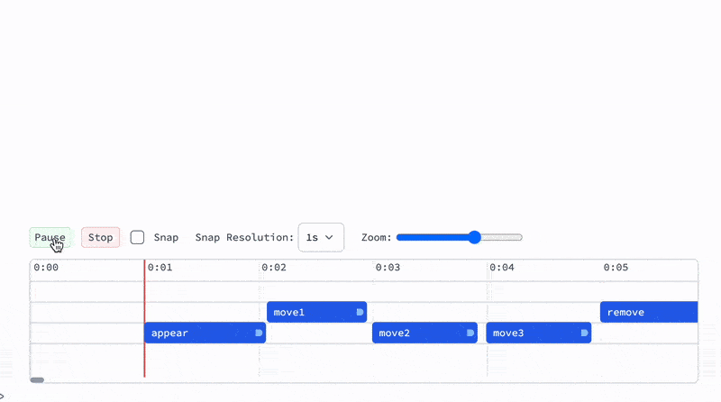

# Visualize your Ideas




```mathematica
Needs["AnimationFramework`" -> "af`"] // Quiet
```

 __AF__ is a build-in library for creating complex event-driven 2D animations in a functional style. You create all necessary primitives by yourself  combining well-known expressions of Wolfram Language.

> In general, you do not need it for animating things in WLJS Notebook, __AF__ only provides a set of helper tools to organize your workflow. It's fundament is based on the existing [Graphics](frontend/Reference/Graphics/Graphics.md), [Offload](frontend/Reference/Interpreter/Offload.md), [FrontInstanceGroup](frontend/Reference/Frontend%20IO/FrontInstanceGroup.md) and [Asynchronous Functions](frontend/Advanced/Events%20system/Asynchronous%20Functions.md) expressions and concepts.

### What is included?
- Automatic object-like management, layers
- Animated transitions (linear, cubic, custom function)
- Workers, loops and helper structures
- Timeline GUI
- Recorder


Let's describe what should happen each frame:

```mathematica title="make a scene"
scene = af`Scene[];
scene // Framed
```

:::tip
Use [Projector](frontend/Advanced/Projector.md) to render your scene in a separate window
:::

```mathematica title="describe logic"
animation = AsyncFunction[scene, Module[{d},
  d = af`AddTo[scene, {
    Opacity[#o], 
    Translate[
      Rotate[
        Rectangle[{-0.5,-0.1}, {0.5,0.1}]
      , #r]
    , #c]
  }, {
    "o" -> 0.,
    "r" -> 0.,
    "c" -> {0,0}
  }];

  af`Animate[scene, d, {"o" -> 1.0,"r" -> 3.14}, "Ease", 1.0] // Await;

  PauseAsync[0.4] // Await;

  af`Animate[scene, d, {"c"->{0.5,0.5}}, "Ease", 1.0] // Await;
  af`Animate[scene, d, {"c"->{-0.5,0.5}, "r"->4.2}, "Ease", 1.0] // Await;
  af`Animate[scene, d, {"c"->{0.5,-0.5}}, "Ease", 1.0] // Await;

  af`Animate[scene, d, {"c"->{0.,0.}, "o"->0., "r"->0}, "Ease", 1.0] // Await;

  af`Remove[d];

  "The End"
]];

Then[animation[scene], Speak];
```


## Real World Examples
There are not that many of them. This framework was originally created for the sake of this <b style={{color:"red"}}>Youtube</b> Short below

<details>


<iframe
 width="720"
 height="576"
 src="https://www.youtube.com/embed/vTrVGam84m8"
 title="YouTube video player"
 frameborder="0"
 allow="accelerometer; autoplay; clipboard-write; encrypted-media; gyroscope; picture-in-picture"
 allowfullscreen>
</iframe>


</details>

## Limitations
- Not possible to export the animation to [Dynamic HTML](frontend/Exporting/Dynamic%20HTML.md) for now

