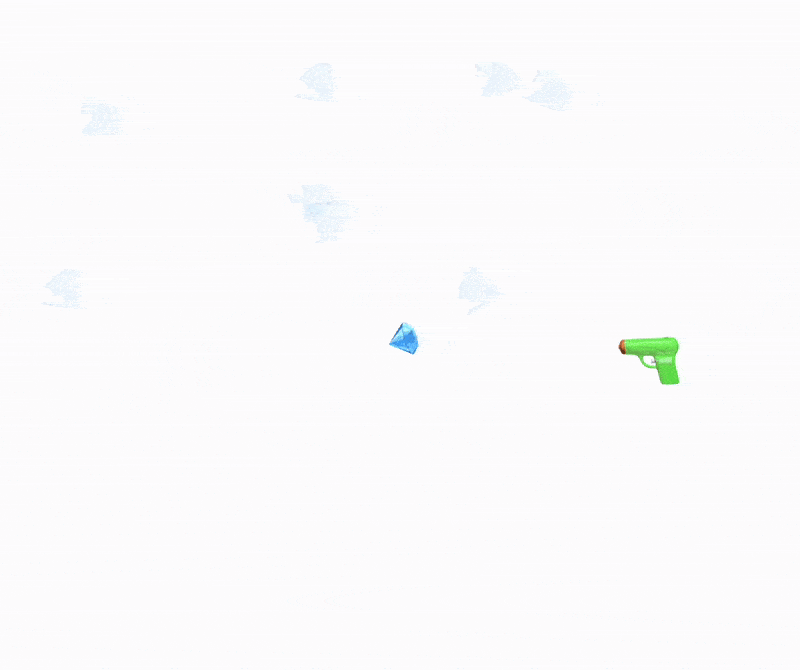

# Visualize your Ideas


:::warning
Animation Framework is currently in *beta* phase
:::

```mathematica
Needs["AnimationFramework`" -> "af`"] // Quiet
```

 __AF__ is a build-in library for creating complex event-driven 2D animations in a functional style. You create all necessary primitives by yourself  combining well-known expressions of Wolfram Language.

> In general, you do not need it for animating things in WLJS Notebook, __AF__ only provides a set of helper tools to organize your workflow. It's fundament is based on the existing [Graphics](frontend/Reference/Graphics/Graphics.md), [Offload](frontend/Reference/Interpreter/Offload.md), [FrontInstanceGroup](frontend/Reference/Frontend%20IO/FrontInstanceGroup.md) and [Asynchronous Functions](frontend/Advanced/Events%20system/Asynchronous%20Functions.md) expressions and concepts.

### What is included?
- Automatic object-like management, layers
- Animated transitions (linear, cubic, custom function)
- Workers, loops and helper structures
- Timeline GUI
- Recorder

### Basic Example
Let's describe what should happen each frame:

```mathematica title="make a scene"
scene = af`Scene[];
scene // Framed
```

:::tip
Use [Projector](frontend/Advanced/Projector.md) to render your scene in a separate window
:::

```mathematica title="describe logic"
animation = AsyncFunction[scene, Module[{d},
  d = af`AddTo[scene, {
    Opacity[#o], 
    Translate[
      Rotate[
        Rectangle[{-0.5,-0.1}, {0.5,0.1}]
      , #r]
    , #c]
  }, {
    "o" -> 0.,
    "r" -> 0.,
    "c" -> {0,0}
  }];

  af`Animate[scene, d, {"o" -> 1.0,"r" -> 3.14}, "Ease", 1.0] // Await;

  PauseAsync[0.4] // Await;

  af`Animate[scene, d, {"c"->{0.5,0.5}}, "Ease", 1.0] // Await;
  af`Animate[scene, d, {"c"->{-0.5,0.5}, "r"->4.2}, "Ease", 1.0] // Await;
  af`Animate[scene, d, {"c"->{0.5,-0.5}}, "Ease", 1.0] // Await;

  af`Animate[scene, d, {"c"->{0.,0.}, "o"->0., "r"->0}, "Ease", 1.0] // Await;

  af`Remove[d];

  "The End"
]];

Then[animation[scene], Speak];
```


### Emoji pistol shooting crystals
Here is fun one using workers:

<details>

```mathematica
mainScene = af`Scene[ImageSize->2 {500,400}];
kill = InputButton["Stop"]
```

```mathematica
animateShooting[mainScene, kill];
```

```mathematica
shoot = AsyncFunction[{scene, layer, d, crystal, p, target}, 
  Module[{s, pos},
    pos = p;
    With[
      {angle = Sign[target[[2]] - p[[2]]] ArcCos[{-1, 0}.Normalize[target - p]]},
      af`Animate[scene, d, "r" -> angle, "Linear", 0.2] // Await;

      s = af`AddTo[layer, {
        Pink, Opacity[#o], Line[{#origin, #target}]
      }, {
        "origin" -> pos,
        "target" -> pos,
        "o" -> 0.0
      }];

      af`Animate[scene, s, {
        "target" -> target,
        "o" -> 1.0
      }, "Linear", 0.2] // Await;

      af`Update[scene, s, {"origin" -> target}];

      {
        af`Animate[scene, s, {
          "target" -> {1.5, RandomReal[{-1, 1}]},
          "o" -> 0.0
        }, "Linear", 0.3],
        af`Animate[scene, crystal, {
          "o" -> 0.1,
          "s" -> 1.5
        }, "QuadOut", 0.15]
      } // Await;

      af`Remove[s];
    ]
  ]
];

addCrystal = AsyncFunction[scene,
  Module[{c},
    c = With[{pos = {RandomReal[{-1.0, 0.4}], -2.0}},
      {
        af`AddTo[scene, {
          Opacity[#o],
          Translate[
            Scale[
              Rotate[
                {
                  Directive[FontSize -> 20],
                  Text["💎", {0, 0}, {0, 0}]
                },
                RandomReal[{0, 6.}]
              ],
              #s
            ],
            #p
          ]
        }, {
          "p" -> pos,
          "s" -> 1.0,
          "o" -> 1.0
        }],
        pos
      }
    ];

    c[[2]] = {c[[2]][[1]], RandomReal[{-0.2, 0.9}]};

    af`Animate[scene, c[[1]], "p" -> c[[2]], "CubicInOut", 1.0] // Await;

    c
  ]
];

animateShooting = AsyncFunction[{scene, kill},
  Module[{d, worker, bg},
    bg = af`Layer[scene, SVGGroup[{#children}]];
    
    d = af`AddTo[scene, {
      Translate[
        Rotate[
          {
            Directive[FontSize -> 34],
            Text["🔫", {0, 0}, {0, 1}]
          },
          #r, {0.05, 0.0}
        ],
        {0.6568339538574219, 0.06299530029296868}
      ]
    }, {
      "r" -> 0.
    }];

    worker = af`Worker[scene, AsyncFunction[Null,
      Module[{crystal},
        crystal = addCrystal[scene] // Await;
        shoot[
          scene,
          bg,
          d,
          crystal[[1]],
          {0.6568339538574219, 0.06299530029296868},
          crystal[[2]]
        ] // Await;
      ]
    ]];

    kill // Await;

    af`Finish[worker] // Await;
    af`Remove[worker];
    af`Remove[scene];
  ]
];
```

</details>



:::note
Not all graphics primitives or their properties __are animatable__. Please check in our `Reference` section on [Graphics](frontend/Reference/Graphics/Graphics.md) the following tag:


:::

## Real World Examples
There are not that many of them. This framework was originally created for the sake of this <b style={{color:"red"}}>Youtube</b> Short below

<details>


<iframe
 width="720"
 height="576"
 src="https://www.youtube.com/embed/vTrVGam84m8"
 title="YouTube video player"
 frameborder="0"
 allow="accelerometer; autoplay; clipboard-write; encrypted-media; gyroscope; picture-in-picture"
 allowfullscreen>
</iframe>


</details>

## Limitations
- Not possible to export the animation to [Dynamic HTML](frontend/Exporting/Dynamic%20HTML.md) for now

