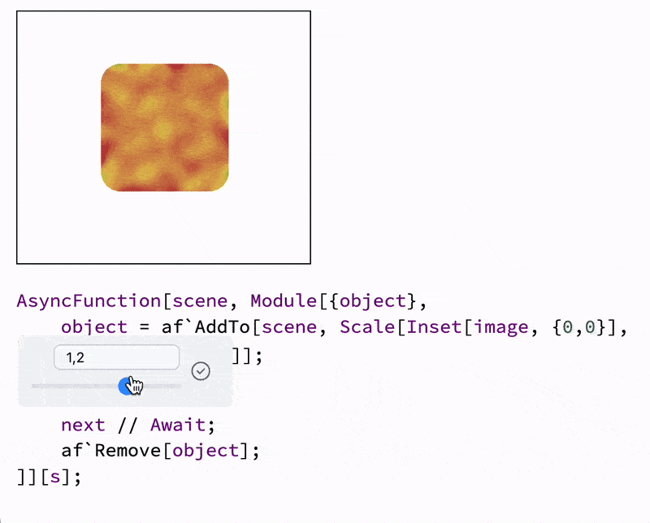
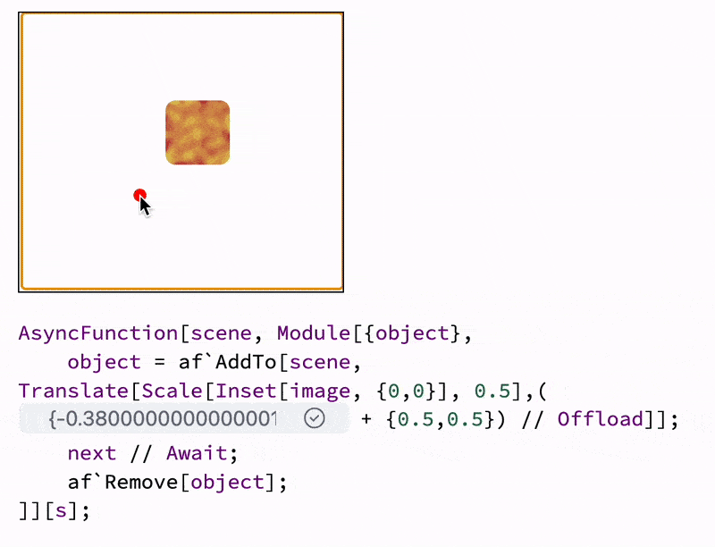
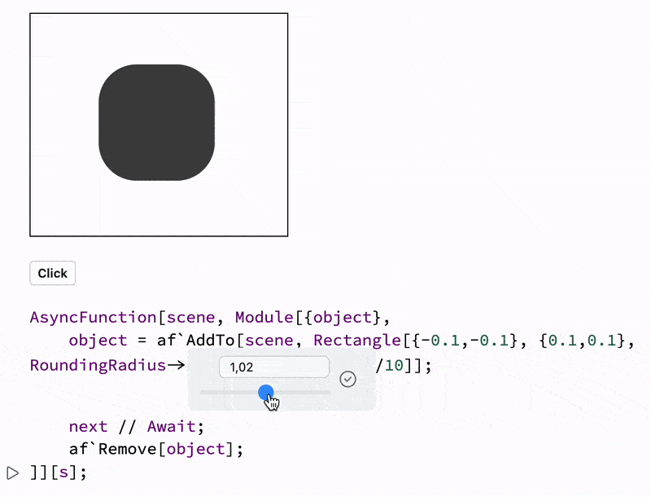

__AF__ is build on top of the existing concepts of [Dynamics](frontend/Dynamics.md) used in WLJS Notebook ecosystem. Therefore, you can use [Command palette](frontend/Command%20palette.md)'s gizmos as well as everything what is mentioned in the guide [Prototyping](frontend/Advanced/Dynamics/Prototyping.md).

For example, you planning a scene and you are not sure __about the scale of your image__:

```mathematica
Needs["AnimationFramework`" -> "af`"] // Quiet
```

```mathematica
s = af`Scene[];
Framed[s]
```

```mathematica
round[i_, r_] :=
 Module[{w, h},
  {w, h} = ImageDimensions@i;
  With[{
    f = Reverse,
    p = PadRight[DiskMatrix[r][[;; r, ;; r]], {h, w}, 1]},
   i~ImageAdd~ColorNegate@Image[p f /@ p f@p f[f /@ p]]]]

image = round[Colorize[Blur[RandomImage[LaplaceDistribution[0.1, .1], {200, 200}],20]], 30];

next = InputButton[]

AsyncFunction[scene, Module[{object},
	object = af`AddTo[scene, Scale[Inset[image, {0,0}], 0.5]];
	next // Await;
	af`Remove[object];
]][s];
```


Now select the scaling value `0.1`

```mathematica @
AsyncFunction[scene, Module[{object},
	object = af`AddTo[scene, Scale[Inset[image, {0,0}], (*BB[*)(0.5)(*,*)(*"1:eJxTTMoPSmNkYGAoZgESHvk5KRAeB5AILqnMSXXKr0hjgskHleakFnMBGU6JydnpRfmleSlpzDDlQe5Ozvk5+UVFDGDwwR6dwcAAAAHdFiw="*)(*]BB*)]];
	next // Await;
	af`Remove[object];
]][s];
```

and then call a [Command palette](frontend/Command%20palette.md) using top-bar or `Ctrl/Cmd + P`:


Now it is interactive and you can re-evaluate this cell:



The same can be done with dragging and etc, positioning the text, objects:



Here we used `drag gizmo` with added offset to prevent overlapping:

```mathematica @
 + {0.5,0.5} ) // Offload
```

`Offload` or `Hold` is needed to prevent Wolfram Kernel from applying vector math and adding our control box to each coordinate of the vector.

Here is another example with [Rectangle](frontend/Reference/Graphics/Rectangle.md) and rounding radius with a slider  helper:

