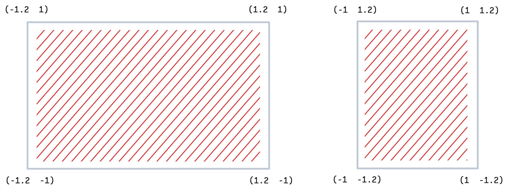

Note, that you need to import this library to any context expect `Global`

```mathematica
Needs["AnimationFramework`"->"af`"] // Quiet;
```

## Scene
```mathematica
af`Scene[opts___] _Scene
```

constructs the main object `Scene`, where animation is going to be rendered. It also serves the purpose of a hosting object for primitives, animations, workers and etc. 

The local coordinates are limited to $\pm 1$ for the square aspect ratio, otherwise the smallest side takes is scaled to 1:



Scenes can be reused multiple times in different animations. 

### Options
#### `ImageSize`
By the default is `Medium`. Not that unlike in `Graphics` here the size is pixel perfect.

#### `"TimeMarkers"`
Sets the time markers from the [Timeline](frontend/Advanced/Animation%20Framework/Timeline.md)

#### Other options
The rest is inherited from [Graphics](frontend/Reference/Graphics/Graphics.md). `PlotRange`, `ImageSizeRaw`, cannot be changed.

### Animation Flow
All animations on the scene should follows the pattern:
- append objects
- animate
- remove objects

By design most of methods and functions of AF framework return [Promise](frontend/Reference/Misc/Promise.md) expression. In this regard, it makes sense to describe your animation flow using [Asynchronous Functions](frontend/Advanced/Events%20system/Asynchronous%20Functions.md):

```mathematica
AsyncFunction[scene, Module[{},
	...
]][scene];
```


### Supported methods
- [AddTo](#AddTo)
- [Remove](#Remove)

## AddTo
The most important method for the animation scene or to a layer:

```mathematica title="immutable object"
af`AddTo[_Scene | layer_, primitives_] _af`Private`entity
```

```mathematica title="object with mutable properties"
af`AddTo[_Scene | layer_, primitives_, {
	prop1_String -> value1_,
	...
}] _af`Private`entity
```

where `primitives` can be any 2D graphics object, or an expression, that produces graphics objects or your custom written [WLJS Function](frontend/Advanced/Frontend%20interpretation/WLJS%20Functions.md) that support `.update` method. 

:::note
`AddTo` function works for both: [Scene](#Scene) and [Layer](#Layer) objects
:::

Mutable properties are embed using `Slot` expression aka

```mathematica
Primitive[#prop1, #prop2] ...
```

Basic example:

```mathematica
disk = af`AddTo[scene, {Red, Disk[{0,0}, 1]}];
```

However, *it does not have any mutable properties*. Here is another example

```mathematica
disk = af`AddTo[scene, {Red, Disk[#pos, #r]}, {
	"pos" -> {0.,0.},
	"r" -> 0.5
}];
```

On the created entity the following methods are supported
### Supported methods
- [Update](#Update)
- [Animate](#Animate)
- [Remove](#Remove)


## Update
Assigns a new value to a given property or list of properties

```mathematica title="assign 1 value"
af`Update[scene_Scene, entity_, prop_String -> newValue_ ..]
```

```mathematica title="assign set of values"
af`Update[scene_Scene, entity_, {
	prop1_String -> val1_,
	...
}]
```

```mathematica
af`Update[entity_, {__Rule}]
```

The action will be applied immediately without easing. For example:

```mathematica
disk = af`AddTo[scene, {Red, Disk[#pos, #r]}, {
	"pos" -> {0.,0.},
	"r" -> 0.5
}];
```

```mathematica
af`Update[scene, disk, "pos"->RandomReal[{-1,1}, 2]];
```

## Remove
Removes a single object or object from the scene or in a layer (including all children)

```mathematica title="remove a single object"
af`Remove[_af`Private`entity | _af`Private`runner | _af`Private`worker]
```

```mathematica title="remove a layer with children"
af`Remove[layer_af`Private`entity]
```

```mathematica title="remove all obejcts in the scene"
af`Remove[_Scene]
```

:::note
`Remove` acting on `Scene` does not remove the scene itself, but it disposes all objects added to it including the nested ones (layers). Use it as a fast way to clean up the scene.
:::

## Animate
It animates the transition of a property or set of properties with a given easing function on the scene

```mathematica
af`Animate[scene_Scene, entity_, prop_String -> value_, easing_:"CubicInOut", duration_:1] _Promise
```

```mathematica
af`Animate[scene_Scene, entity_, {
	prop1_String -> value1_,
	prop2_String -> value2_, ...
}, easing_:"CubicInOut", duration_:1] _Promise
```

where `easing` is function used for animating the transition:

- `"Linear"`
- `"CubicInOut"` or `"Ease"`
- `"QuadIn"`
- `"QuadOut"`
- `"LinearEuclidean"`  (usually used for colors)
- `Function[{t, initial, current, target}, ...]`

and `duration` is given in __seconds__.

In addition `Animate` can be applied to any held `_Symbol`:

```mathematica
af`Animate[scene_Scene, Hold[symbol_], newValue_, easing_:"CubicInOut", duration_:1] _Promise
```

or a [Layer](#Layer) entity

```mathematica
af`Animate[scene_Scene, layer_, prop_String->newValue_, easing_:"CubicInOut", duration_:1] _Promise
```

`Animate` always returns [Promise](frontend/Reference/Misc/Promise.md), which is resolved when the animation is finished, i.e.:

*wait for the animation to be finished*
```mathematica
af`Animate[scene, object, "prop"->1.0] // Await;
```

*wait for multiple animations to be finished*
```mathematica
{
	af`Animate[scene, object1, "prop"->1.0],
	af`Animate[scene, object2, "prop"->1.0],
}// Await;
```

:::tip
For animating multiple properties of __the same object__ - use
```mathematica
af`Animate[scene, object1, {"prop1"->1.0, "prop2"->3.0}]
```
:::

Animation is done fully using Wolfram Kernel (no Javascript easing is involved) at the maximum available frame rate (dynamic).

For example:

```mathematica
scene = af`Scene[];
scene
```

```mathematica
AsyncFunction[scene, Module[{d},
  d = af`AddTo[scene, {
    Opacity[#o], 
    Translate[
      Rotate[
        Rectangle[{-0.5,-0.1}, {0.5,0.1}]
      , #r]
    , #c]
  }, {
    "o" -> 0.,
    "r" -> 0.,
    "c" -> {0,0}
  }];

  af`Animate[scene, d, {"o" -> 1.0,"r" -> 3.14}, "Ease", 1.0] // Await;

  PauseAsync[1] // Await;
  
  af`Animate[scene, d, {"o"->0., "r"->0}, "Ease", 1.0] // Await;

  af`Remove[d];
]][scene];
```


### Supported property types
- `Real`, `Integer`
- `List` of integers, reals
- `List` of `List` and etc
- `String` with numbers inside

In principle anything, which can be combined with multiplication and sum can work as a property value. 

#### Strings
String interpolation is done in steps:
- exploding string into string and number-like string
- convert number-like strings into array
- interpolate a array (using easing function) between the original and target value (transformed from a string)
- compose back into a string

For example, one can easily animate the following SVG attribute

```mathematica
scene = af`Scene[];
scene
```

```mathematica
AsyncFunction[scene, Module[{layer},
  
  layer = af`Layer[scene, {
	SVGAttribute[#children, "style"->#style]
  }, {"style" -> "filter: blur(0px)"}];

  af`AddTo[layer, Table[{RandomColor[], Disk[RandomReal[{-1,1},2], 1.0]}, {10}]];
  af`Animate[scene, layer, "style"->"filter: blur(100px)", "Ease", 5]//Await;

  af`Remove[layer];

]][scene];
```


## Layer
It creates an isolated group of objects (layer):

```mathematica title="no mutable props"
af`Layer[scene_Scene | layer_, body_] _af`Private`entity
```

```mathematica title="mutable props"
af`Layer[scene_Scene | layer_, body_, {
	prop1_String -> value1_,
	...
}] _af`Private`entity
```

where `body` is defined similar to one in [AddTo](#AddTo):

```mathematica
{
	Opacity[0.5],
	#children
}
```

or

```mathematica
{
	Opacity[#opacity],
	Translate[#children, #coordinates]
}
```

where `#children` is **a special reserved slot** to specify where to append children. __You can append objects similar to `Scene` using [AddTo](#AddTo) expression__:

```mathematica
layer = af`Layer[scene, {
	Opacity[#opacity],
	Translate[#children, #coordinates]
}, {"opacity" -> 0.5, "coordinates"->{0,0}}];

af`AddTo[layer, Table[{RandomColor[], Disk[RandomReal[{-0.2,0.2},2], 0.05]}, {10}]];
```

### Supported methods
- [AddTo](#AddTo)
- [Update](#Update)
- [Animate](#Animate)
- [Remove](#Remove)


## Loop
It create custom animation loop, which is repeated until manually removed

```mathematica
af`Loop[scene_Scene, entity_, property_String, function_, duration_:1] _af`Private`runner
```

where `function` should have the following form:

```mathematica
Function[{t, prevValue, cycleNumber},
	
]
```

Here `t` goes from `0` to `1` in `duration` seconds, and `cycleNumber` represents the number of rounds passed. 

:::note
`function` is fired every frame
:::

### How to stop a loop
Before removing a loop animation call `Await` [Finish](#Finish) on the loop object to wait until the cycle is fully finished. `Finish` returns promise, which is resolved on the end of the current cycle. This will help to avoid abrupt stop of the loop. For example

```mathematica
scene = af`Scene[];
scene

stop = InputButton["Stop"]
```

```mathematica
AsyncFunction[scene, Module[{d, loop},
  d = af`AddTo[scene, {
    Rotate[
      Rectangle[{-0.5,-0.1}, {0.5,0.1}]
    , #r]
  }, {
    "r" -> 0.
  }];

  loop = af`Loop[scene, d, "r", Function[{t, o, n},
    3.14 t + (n-1) 3.14
  ], 2];

  stop // Await;

  af`Finish[loop] // Await;
  
  af`Remove[loop];

  PauseAsync[0.5] // Await;

  af`Remove[d];
]][scene]
```


### Supported methods
- [Remove](#Remove)
- [Finish](#Finish)


## Worker
Workers are similar to [Loop](#Loop)s, but allow to execute an arbitrary code concurrently with the main animation on each frame:

```mathematica
af`Worker[scene_Scene, function_] _af`Private`worker
```

where `function` has the following form

```mathematica
Function[absoluteTime, ...]
```

You can place an entire new animation sequence to a worker as [Asynchronous Functions](frontend/Advanced/Events%20system/Asynchronous%20Functions.md):  

```mathematica
AsyncFunction[absoluteTime, ...]
```

`function` is called every frame, but only after the execution of the previous `function` call is finished. `absoluteTime` is a time in seconds passed after the worker has been created.

For example:

```mathematica
scene = af`Scene[];
scene
stop = InputButton["Stop"]
```

```mathematica
AsyncFunction[scene, Module[{d, worker},
  d = af`AddTo[scene, {
    Rotate[
      Rectangle[{-0.5,-0.1}, {0.5,0.1}]
    , #r]
  }, {
    "r" -> 0.
  }];

  worker = af`Worker[scene, AsyncFunction[Null,
    af`Animate[scene, d, "r"->Pi/2] // Await;
    af`Animate[scene, d, "r"->-Pi/2] // Await;
  ]];

  stop // Await;

  af`Finish[worker] // Await;
  af`Remove[worker];

  PauseAsync[0.5] // Await;

  af`Remove[d];
]][scene]
```

### How to stop a worker
Before removing a worker call `Await` [Finish](#Finish) on the worker object to wait until the execution is fully finished (as on the example above). `Finish` returns promise, which is resolved on the end of the current cycle. This will help to avoid abrupt stop.

### Supported methods
- [Remove](#Remove)
- [Finish](#Finish)

## Finish
```mathematica
af`Finish[worker_ | loop_ | _Promise] _Promise
```
It is a special promise generator used for waiting for various events:
- [Loop](#Loop) has finished the cycle of animation
- [Worker](#Worker) has finished the function execution

Any `Promise` object will be returned without changes. __It only makes sense to use it with `Await` expression__:

```mathematica
af`Finish[worker1] // Await
```

or multiple events

```mathematica
{
	af`Finish[worker1],
	af`Finish[worker2]
} // Await
```

## RecordAnimation
:::info
Read more at [Recording](frontend/Advanced/Animation%20Framework/Recording.md) page
:::

To render the animation into the sequence of images:

```mathematica
af`RecordAnimation[animationFunction_, opts___] _af`Private`recorder
```

where `animationFunction` is your async animation function, that accepts `Scene` object and `opts` are the same as for [Scene](#Scene) including extra:

- `FrameRate` - frames per second (`60` by the default)
- `GeneratedAssetLocation` - by the default is `$TemporalDirectory`
- `GeneratedAssetFormat` - format for rendered sequence: `"PNG"`, `"JPEG"`
- `CompressionLevel` - by the default is `0.2` (applicable only for JPEG)
- `"TimeMarkers"` - sets the time markers from the [Timeline](frontend/Advanced/Animation%20Framework/Timeline.md)

#### Properties
`recorder` object provides the following fields:
- `"GeneratedAssetLocation"` - path to sequence
- `"Recording"` - status

### TimelinedAnimation
:::info
Read more at [Timeline](frontend/Advanced/Animation%20Framework/Timeline.md) page
:::

To play an animation with a graphical timeline attached:

```mathematica
af`RecordAnimation[animationFunction_, opts___] _af`Private`timelined
```


where `animationFunction` is your async animation function, that accepts `Scene` object and `opts` are the same as for [Scene](#Scene) including extra:

- `"TimeMarkers"` - sets the time markers from the [Timeline](frontend/Advanced/Animation%20Framework/Timeline.md)
- `"AudioClips"` - restores recorded voice overs

Note, `RecordAnimation` has `HoldFirst` attribute.

#### Properties
`timelined` object provides the following fields:
- `"TimeMarkers"` - current time markers
- `"AudioClips"` - gets audio clips from the timeline
- `"AudioClipsAsync"` - gets audio clips from the timeline

## Utilities
### Color
```mathematica
af`Color[_Hue | _RGBColor | _LABColor] _List
```

a color conversion tool, which turns any color representation to a list of RGB values. This comes handy with [RGBColor](frontend/Reference/Graphics/RGBColor.md), since to update it you need to provide a list instead of an actual color:

```mathematica
{RGBColor[#color], ...}
```

then when you update

```mathematica
af`Animate[... "color"->af`Color[Red], ...]
```

### PauseAsync
A modified version of system default `PauseAsync` with extra argument

```mathematica
PauseAsync[scene_Scene, n_Integer | n_Real] _Promise
```

Here the time delay will be in sync with [Scene](#Scene). It makes sense during the [Recording](frontend/Advanced/Animation%20Framework/Recording.md) process, where the actual time is fixed with a frame rate.

### RecorderToVideo
It converts `recorder` object to [Video](frontend/Reference/Video/Video.md)  __after the rendering is finished__

```mathematica
af`RecorderToVideo[_af`Private`recorder] _Video
```

### Marker
A helper to wait or extract property from [Timeline](frontend/Advanced/Animation%20Framework/Timeline.md) markers

*wait for the marker*
```mathematica
af`Marker[scene_Scene, name_String] _Promise
af`Marker[scene_Scene, name_String, "Start"] _Promise
```

*wait for the end of the marker*
```mathematica
af`Marker[scene_Scene, name_String, "End"] _Promise
```

*take duration in seconds*
```mathematica
af`Marker[scene_Scene, name_String, "Duration"] _Real
```

### AudioFromClips
A helper function to convert a list of audio clips (voice overs) retrieved from the properties of `timelined` object to a single audio object:

```mathematica
af`AudioFromClips[clips_List]
```

For example:

```mathematica
af`AudioFromClips[t["AudioClips"]]
```

where `t` is your [TimelinedAnimation](#TimelinedAnimation) object