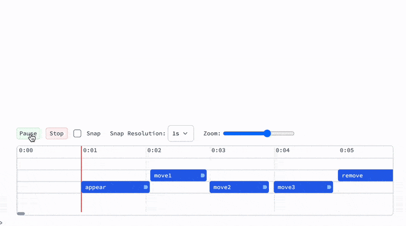

__AF__ provides a GUI element for timing and adjusting the events on the timeline filling some gaps between programmatic approach for animations and visual like in a typical video editor:



:::note
You are still working with `AsyncFunction` functions. Timeline is an external addition to that.
:::

## Quick start
Let's create a timeline:

```mathematica
Needs["AnimationFramework`"->"af`"];
```

```mathematica
t = af`TimelinedAnimation[animationFunction];
t
```

:::tip
Use [Projector](frontend/Advanced/Projector.md) on the timeline input cell to work with in in a separate window
:::

There are some key aspects of working with a timeline:

- The duration of your playback is defined by the total time needed for executing your __animationFunction__ (which has to be [Asynchronous Function](frontend/Advanced/Events%20system/Asynchronous%20Functions.md))
- `TimelinedAnimation` has `HoldFirst` attribute and __PLAY__ button releases it and evaluates animation function symbol provided. I.e. when you update the definition of `animationFunction`, __you do not need to reevaluate__ `TimelinedAnimation`
- Seeking the position on the timeline is done via artificially speeding up time of the scene, since animation function may have internal states.
- Use [PauseAsync](frontend/Advanced/Animation%20Framework/Reference.md#PauseAsync) with `scene` argument provided, otherwise the animation will be un-synced with the timeline.

Now define a basic animation sequence for now without a direct connection with a timeline:

```mathematica
animationFunction = AsyncFunction[scene, Module[{d},
  d = af`AddTo[scene, {
    Opacity[#o], 
    Translate[
      Rotate[
        Rectangle[{-0.5,-0.1}, {0.5,0.1}]
      , #r]
    , #c]
  }, {
    "o" -> 0.,
    "r" -> 0.,
    "c" -> {0,0}
  }];

  af`Animate[scene, d, {"o" -> 1.0,"r" -> 3.14}, "Ease", 1.0] // Await;

  PauseAsync[scene, 0.4] // Await;

  af`Animate[scene, d, {"c"->{0.5,0.5}}, "Ease", 1.0] // Await;
  af`Animate[scene, d, {"c"->{-0.5,0.5}, "r"->4.2}, "Ease", 1.0] // Await;
  af`Animate[scene, d, {"c"->{0.5,-0.5}}, "Ease", 1.0] // Await;

  af`Animate[scene, d, {"c"->{0.,0.}, "o"->0., "r"->0}, "Ease", 1.0] // Await;

  af`Remove[d];
]];
```

Now hit *PLAY* button:


When focused on the timeline:
- `Spacebar` - play/pause

## Time markers
To place a time marker - __double click__:


- All marker must have a __unique label__
- Double click on a marker to remove it
- Each marker has a duration, you can change it by dragging a gizmo on the right
- Timeline rows have no effect and exists only for the user convenience in placing overlapping markers

A user can can reference the markers from `Scene` object in two possible ways in the animation function:

1. As a pause

*wait for the marker*
```mathematica
af`Marker[scene, "M1"] // Await;
```

*wait for the end of the marker*
```mathematica
af`Marker[scene, "M1", "End"] // Await;
```

2. As a quantity

```mathematica
af`Marker[scene, "M1", "Duration"]
```

This will return a number in seconds.

### Example
Let us transform our previous animation to use marker events

```mathematica
animationFunction = AsyncFunction[scene, Module[{d, u},
  d = af`AddTo[scene, {
    Opacity[#o], 
    Translate[
      Rotate[
        Rectangle[{-0.5,-0.1}, {0.5,0.1}]
      , #r]
    , #c]
  }, {
    "o" -> 0.,
    "r" -> 0.,
    "c" -> {0,0}
  }];

  af`Marker[scene, "appear"] // Await;
  af`Animate[scene, d, {"o" -> 1.0,"r" -> 3.14}, "Ease", af`Marker[scene, "appear", "Duration"]] // Await;

  af`Marker[scene, "move1"] // Await;
  af`Animate[scene, d, {"c"->{0.5,0.5}}, "Ease", af`Marker[scene, "move1", "Duration"]] // Await;
  
  af`Marker[scene, "move2"] // Await;
  af`Animate[scene, d, {"c"->{-0.5,0.5}, "r"->4.2}, "Ease", af`Marker[scene, "move2", "Duration"]] // Await;
  
  af`Marker[scene, "move3"] // Await;
  af`Animate[scene, d, {"c"->{0.5,-0.5}}, "Ease", af`Marker[scene, "move3", "Duration"]] // Await;

  af`Marker[scene, "remove"]//Await;
  af`Animate[scene, d, {"c"->{0.,0.}, "o"->0., "r"->0}, "Ease", af`Marker[scene, "remove", "Duration"]] // Await;

  af`Remove[d];
]];
```

And then place those markers on the timeline:


Here is serialized version of all markers from the screenshot above:

```mathematica
<|"move1"-><|"uid"->"move1","time"->2.0757575757575757`,"duration"->0.8787878787878788`,"track"->48|>,"appear"-><|"uid"->"appear","time"->1,"duration"->1.07`,"track"->72|>,"move2"-><|"uid"->"move2","time"->2.9846153846153847`,"duration"->0.9242424242424242`,"track"->72|>,"move3"-><|"uid"->"move3","time"->4,"duration"->0.9242424242424242`,"track"->72|>,"remove"-><|"uid"->"remove","time"->5,"duration"->1,"track"->48|>|>
```

See how to restore / store markers position in the section [Export markers](#Export%20markers).

Now if you hit a playback button it will play the animation according to your time markers:


import Tutor3 from './../../../TimelineAnimation.mp4';

<video width="100%" controls>
  <source src={Tutor3}/>
</video>


### Export markers
Access the object `t` created by `TimelinedAnimation` animation expression

```mathematica
t["TimeMarkers"]
```

### Restore markers
To import time markers to a new scene or `TimelinedAnimation` provide `"TimeMarkers"` options. For example:

*import to the scene*
```mathematica
s = af`Scene["TimeMarkers" -> ...];
```

*import to the scene in TimelinedAnimation*
```mathematica
t = af`TimelinedAnimation[
	animationFunction, "TimeMarkers" -> ...
];
```

*import to recorder object*
```mathematica
r = af`RecordAnimation[
	animationFunction, ImageSize->Large, FrameRate->120,
	"TimeMarkers" -> ...
];
```

## Recording
1. Export your existing markers following [Export markers](#Export%20markers)
2. Following the guide [Recording](frontend/Advanced/Animation%20Framework/Recording.md) provide an options to `RecordAnimation` expression (see [Import markers](#Import%20markers)) with exported timeline markers 

## Voice-over
You can record voice-overs directly to the timeline:


In general it does not matter on which track you place it. Voice clips do not interferer with regular time markers and has to be exported / imported separately.

:::info
This functionality serves a purpose of roughly aligning the timing of your animation with your audio narratives, which can be later polished in a professional video editing software. 
:::

### Recording
Find a place on a timeline and hit `Voice` button to start recording. Press stop to stop it.

### Exporting
To export you can simply read a property of a timeline object:

```mathematica
clips = t["AudioClips"]
```

Then you can merge it into a single audio file for later production:

```mathematica
af`AudioFromClips[clips]
```

This will contain an [Audio](frontend/Reference/Sound/Audio.md) object, which can be exported to be used in other video-editing programs.

### Restoring
To restore clips for a new session or a timeline object - provide clips as an options to the constructor:

```mathematica
t = af`TimelinedAnimation[
	animationFunction, "TimeMarkers" -> ...,
	"AudioClips" -> clips
];
```