Let's learn how to make animations step by step:

```mathematica
Needs["AnimationFramework`" -> "af`"] // Quiet
```

Create a scene

```mathematica
s = af`Scene[];
Framed[s]
```

:::tip
Use [Projector](frontend/Advanced/Projector.md) to output this cell to a separate window
:::

### Animation Flow
All animations on the scene should follows the pattern:
- append objects
- animate
- remove objects

By design most of methods and functions of AF framework return [Promise](frontend/Reference/Misc/Promise.md) expression. In this regard, it makes sense to describe your animation flow using [Asynchronous Functions](frontend/Advanced/Events%20system/Asynchronous%20Functions.md).

## Basics
### Append and move
Append and move a disk on the scene:


```mathematica
AsyncFunction[scene, Module[{d},
  d = af`AddTo[scene, Disk[#pos, 0.1], {
    "pos" -> {-1,0}
  }];

  af`Animate[scene, d, "pos"->{1,0}, "QuadOut", 1.5] // Await;
  
  af`Remove[d];
]][s];
```

Combine animations of two properties:


```mathematica
AsyncFunction[scene, Module[{d},
  d = af`AddTo[scene, Disk[#pos, #r], {
    "pos" -> {-1,0}, "r"->0.1
  }];

  af`Animate[scene, d, {
	  "pos"->{1,0}, "r"->1.0
  }, "QuadOut", 1.5] // Await;
  
  af`Remove[d];
]][s];
```

Animate two objects at the same time:

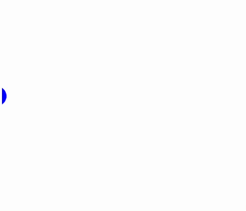

```mathematica
AsyncFunction[scene, Module[{d,r},
  r = af`AddTo[scene, {Red, Translate[Rotate[
      Rectangle[0.2{-1,-1}, 0.2{1,1}]
  , #angle], #pos]}, {
    "pos" -> {1.5,1.5},
    "angle" -> 0.
  }];  

  d = af`AddTo[scene, {Blue, Disk[#pos, 0.1]}, {
    "pos" -> {-1.5,0}
  }];

  {
    af`Animate[scene, d, "pos"->{0,0}, "QuadOut", 1.5],
    af`Animate[scene, r, {
      "pos"->{0,0}, "angle"->2Pi
    }, "QuadOut", 1.5]
  }// Await;
  
  af`Remove[d];
  af`Remove[r];
]][s];
```

### Timings
Try different easing functions:

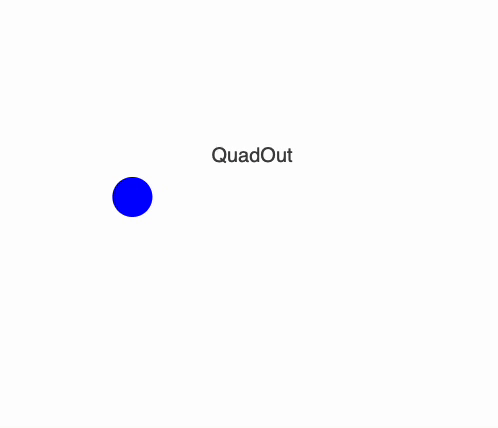

```mathematica
AsyncFunction[scene, Module[{d,label},
  d = af`AddTo[scene, {Blue, Disk[#pos, 0.1]}, {
    "pos" -> {-0.8,0}
  }];

  label = af`AddTo[scene, 
    {Text[#text, {0,0.2}, {0,0}]}, {"text"->"QuadOut"}
  ];

  af`Animate[scene, d, "pos"->{0.8,0}, "QuadOut", 2] // Await;
  af`Update[scene, d, "pos"->{-0.8,0}];

  af`Update[scene, label, "text"->"QuadIn"];
  af`Animate[scene, d, "pos"->{0.8,0}, "QuadIn", 2] // Await;
  af`Update[scene, d, "pos"->{-0.8,0}];

  af`Update[scene, label, "text"->"CubicInOut"];
  af`Animate[scene, d, "pos"->{0.8,0}, "CubicInOut", 2] // Await;
  af`Update[scene, d, "pos"->{-0.8,0}];

  af`Update[scene, label, "text"->"Linear"];
  af`Animate[scene, d, "pos"->{0.8,0}, "Linear", 2] // Await;
  
  af`Remove[d];
  af`Remove[label];
]][s];
```

Use pauses:

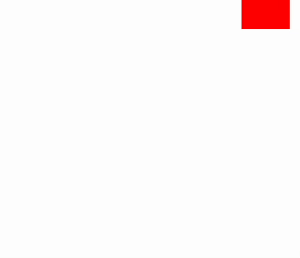

```mathematica
AsyncFunction[scene, Module[{r},
  r = af`AddTo[scene, {Red, Translate[Rotate[
      Rectangle[0.2{-1,-1}, 0.2{1,1}]
  , #angle], #pos]}, {
    "pos" -> {1.5,1.5},
    "angle" -> 0.
  }];  

  af`Animate[scene, r, "pos"->{0,0}, "CubicInOut", 1] // Await;
  PauseAsync[scene, 0.2] // Await;
  af`Animate[scene, r, "angle"->Pi/4, "CubicInOut", 0.4] // Await;
  PauseAsync[scene, 0.2] // Await;
  af`Animate[scene, r, "pos"->{-0.5,0}, "CubicInOut", 1] // Await;
  PauseAsync[scene, 0.2] // Await;
  {
    af`Animate[scene, r, "angle"->Pi/2, "CubicInOut", 1],
    af`Animate[scene, r, "pos"->{-0.5,-0.5}, "CubicInOut", 1]
  } // Await;

  {
    af`Animate[scene, r, "angle"->(Pi/2 + Pi/4), "CubicInOut", 1],
    af`Animate[scene, r, "pos"->{0.5,-0.5}, "CubicInOut", 1]
  } // Await;  

  {
    af`Animate[scene, r, "angle"->(Pi/2 + Pi/2), "CubicInOut", 1],
    af`Animate[scene, r, "pos"->{0.5,0.5}, "CubicInOut", 1]
  } // Await; 

  {
    af`Animate[scene, r, "angle"->(10Pi), "CubicInOut", 4],
    af`Animate[scene, r, "pos"->{0,0}, "CubicInOut", 1]
  } // Await; 

  PauseAsync[scene, 2] // Await;
  
  af`Remove[r];
]][s];
```


### Turn repeating elements into async functions
Using the pervious examples on [Timings](#Timings) we can simplify the code:

```mathematica
animateStuff = AsyncFunction[{s, d, l, type}, (
  af`Update[s, d, "pos"->{-0.8,0}];
  af`Update[s, l, "text"->type];
  af`Animate[s, d, "pos"->{0.8,0}, type, 2] // Await;
)];

AsyncFunction[scene, Module[{d,label},

  d = af`AddTo[scene, {Blue, Disk[#pos, 0.1]}, {
    "pos" -> {-0.8,0}
  }];

  label = af`AddTo[scene, 
    {Text[#text, {0,0.2}, {0,0}]}, {"text"->""}
  ];

  animateStuff[scene, d, label, "QuadOut"] // Await;
  animateStuff[scene, d, label, "QuadIn"] // Await;
  animateStuff[scene, d, label, "CubicInOut"] // Await;
  animateStuff[scene, d, label, "Linear"] // Await;
  
  af`Remove[d];
  af`Remove[label];
]][s];
```


### Animating more properties
Animate [Opacity](frontend/Reference/Graphics/Opacity.md) for adding or removing an objects:


```mathematica
AsyncFunction[scene, Module[{d},
  d = af`AddTo[scene, {Opacity[#o], Red, Disk[#pos, 0.1]}, {
    "pos" -> {-0.5,0},
    "o"->0
  }];

  af`Animate[scene, d, "o"->1.0, "Linear", 0.2] // Await;
  af`Animate[scene, d, "pos"->{0.5,0}, "Ease", 1.5] // Await;
  PauseAsync[scene, 0.5] // Await;
  af`Animate[scene, d, "o"->0.0, "Linear", 0.2] // Await;
  
  af`Remove[d];
]][s];
```


To interpolate color of the object we use `"LinearEuclidean"` to get the correct gamma of the intermediate colors:

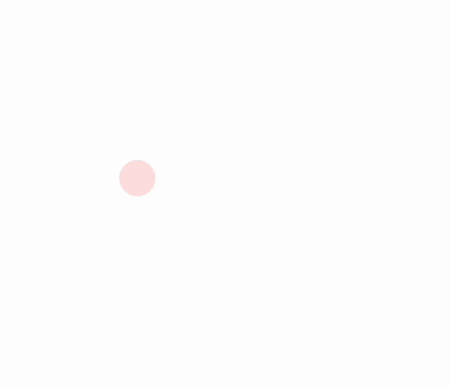

```mathematica
AsyncFunction[scene, Module[{d},
  d = af`AddTo[scene, {Opacity[#o], RGBColor[#c], Disk[#pos, 0.1]}, {
    "pos" -> {-0.5,0},
    "o"->0,
    "c"->af`Color[Red]
  }];

  af`Animate[scene, d, "o"->1.0, "Linear", 0.2] // Await;
  {
    af`Animate[scene, d, "c"->af`Color[Blue], "LinearEuclidean", 1.5],
    af`Animate[scene, d, "pos"->{0.5,0}, "Linear", 1.5]
  } // Await;
  PauseAsync[scene, 0.5] // Await;
  af`Animate[scene, d, "o"->0.0, "Linear", 0.2] // Await;
  
  af`Remove[d];
]][s];
```

Background animation:


```mathematica
AsyncFunction[scene, Module[{bg,text},

  bg = af`AddTo[scene, {
    RGBColor[#c], Opacity[#o], Rectangle[{-2,-2}, {2,2}]
  }, {
    "o"->0.,
    "c"->af`Color[Pink]
  }];

  text = af`AddTo[scene, {White, Text[Style["Hello World", FontSize->68], {0,0}, {0,0}]}];

  af`Animate[scene, bg, "o"->1.0, "CubicInOut", 0.5] // Await;
  
  PauseAsync[scene, 0.3] // Await;

  af`Animate[scene, bg, "c"->af`Color[Lighter[Magenta]], "LinearEuclidean", 0.5] // Await;
  PauseAsync[scene, 0.3] // Await;

  af`Animate[scene, bg, "c"->af`Color[Lighter[Brown]], "LinearEuclidean", 0.5] // Await;
  PauseAsync[scene, 0.3] // Await;

  af`Animate[scene, bg, "o"->0.0, "CubicInOut", 0.5] // Await;

  af`Remove[bg];
  af`Remove[text];

]][s];
```

### Layers
[Layer](frontend/Advanced/Animation%20Framework/Reference.md#Layer) are used for grouping multiple objects. All properties do not propagate to the objects in the group, but applied to the container. You can animate:

- `Opacity`
- `Rotate`
- `Translate`
- `Scale`
- `SVGAttribute`

There is a special key-property for placing children objects `#children`. Methods used for operating groups are similar to `Scene` and to a regular object. For example:


```mathematica
AsyncFunction[scene, Module[{layer},
  layer = af`Layer[scene, {
	Opacity[#opacity],
	Scale[#children, #scale]
  }, {"opacity" -> 0., "scale"->1.0}];

  af`AddTo[layer, Table[{RandomColor[], Disk[RandomReal[{-0.2,0.2},2], 0.05]}, {10}]];

  af`Animate[scene, layer, "opacity"->1.0, "Linear", 0.5] // Await;
  af`Animate[scene, layer, "scale"->3.0, "QuadOut", 0.5] // Await;
  af`Animate[scene, layer, "scale"->0.1, "QuadIn", 0.5] // Await;
  
  af`Remove[layer];
]][s];
```

Apply directly any CSS style:

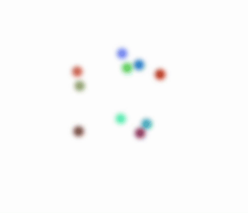

```mathematica
AsyncFunction[scene, Module[{layer},
  layer = af`Layer[scene, {
	SVGAttribute[#children, "style"->#style]
  }, {"style"->"filter: blur(0px)"}];

  af`AddTo[layer, Table[{RandomColor[], Disk[RandomReal[{-0.5,0.5},2], 0.05]}, {10}]];

  af`Animate[scene, layer, "style"->"filter: blur(100px)", "Linear", 2] // Await;
  
  af`Remove[layer];
]][s];
```

:::note
`Animate` does support string interpolation
:::

:::info
By removing the layer object you will removes all children as well
:::


### External events
Any `EventObject` or `Promise` can be used a trigger for your animation:

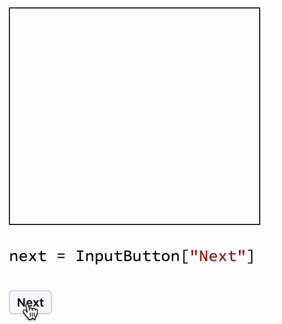

```mathematica
next = InputButton["Next"]
```

```mathematica
AsyncFunction[scene, Module[{d},
  d = af`AddTo[scene, {
	  Disk[#pos, #r], Hue[0.3], Circle[#pos, #r #r]
  },
    {"pos"->{0.,0.}, "r"->0.001}
  ];

  next // Await;
  af`Animate[scene, d, "r"->0.5, "CubicInOut", 1] // Await;
  next // Await;
  af`Animate[scene, d, "r"->0.0001, "CubicInOut", 1] // Await;
  
  af`Remove[d];
]][s];
```


### Embed foreign objects
For general case you need to use [Inset](frontend/Reference/Graphics/Inset.md) (see also [Inset expressions](frontend/Advanced/Graphics/Inset%20expressions.md)).

Embed a graph:

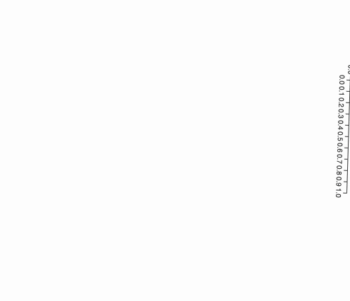

```mathematica
AsyncFunction[scene, Module[{d},
  d = af`AddTo[scene, {
    Translate[Scale[
      Rotate[Inset[Plot[x, {x,0,1}, ImageSize->Small]], #a],
      0.5
    ], #pos]
  },
    {"pos"->{2.0,0.}, "a"->0}
  ];

  af`Animate[scene, d, {
    "pos"->{0,0},
    "a"->2Pi
  }, "CubicInOut", 1] // Await;

  PauseAsync[scene, 1] // Await;

  af`Remove[d];
]][s];
```

:::warning
Inset is pixel-perfect and it does not autoscale. Results might depend on pixel-density of the screen. To avoid that use `ImageSizeRaw`  instead of `ImageSize` on `Graphics`-like objects
:::


## Medium

### Combining with Offload
`AddTo` method effectively uses [Offload](frontend/Reference/Interpreter/Offload.md) technique from [general dynamics ](frontend/Dynamics.md) of WLJS Notebook. It means you can still use it in any animated object.

`Animate` method can animate an arbitrary symbol as well:


```mathematica
AsyncFunction[scene, Module[{d, pos = {2,0}, a = 0.},
  d = af`AddTo[scene, {
    Translate[
      Rotate[
        Text["Hello World", {0,0}, {0,0}]
      , Offload[a]]
    , Offload[pos]]
  }];

  {
    af`Animate[scene, Hold[pos], {0,0}, "CubicInOut", 1],
    af`Animate[scene, Hold[a],   2Pi, "CubicInOut", 1]
  } // Await;

  PauseAsync[scene, 1] // Await;

  af`Remove[d];
]][s];
```

<details>

<summary>Equivalent using AF only</summary>

```mathematica
AsyncFunction[scene, Module[{d},
  d = af`AddTo[scene, {
    Translate[Rotate[Text["Hello World", {0,0}, {0,0}], #a], #pos]
  },
    {"pos"->{2.0,0.}, "a"->0}
  ];

  af`Animate[scene, d, {
    "pos"->{0,0},
    "a"->2Pi
  }, "CubicInOut", 1] // Await;

  PauseAsync[scene, 1] // Await;

  af`Remove[d];
]][s];
```

</details>

An example, where we combine both approaches to avoid extra `Translate` function:


```mathematica
AsyncFunction[scene, Module[{d, pos = {2,0}, a = 0.},
  d = af`AddTo[scene, {
    Magenta, Rectangle[
      Offload[{-0.5,-0.5} + #pos], 
      Offload[{0.5,0.5} + #pos]
    , RoundingRadius->0.1]
  }, {"pos"->{0,-1.5}}];

  af`Animate[scene, d, "pos"->{0,0}, "CubicInOut", 1] // Await;

  PauseAsync[scene, 1] // Await;

  af`Remove[d];
]][s];
```


Another example:

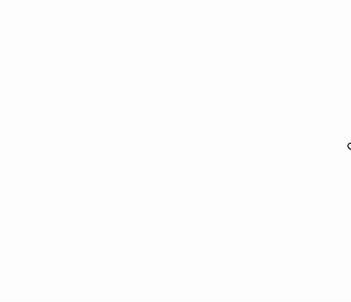

```mathematica
AsyncFunction[scene, Module[{d, text = "Hello"},
  d = af`AddTo[scene, {
    Translate[Rotate[Text[text // Offload, {0,0}, {0,0}], #a], #pos]
  },
    {"pos"->{2.0,0.}, "a"->0}
  ];

  af`Animate[scene, d, {
    "pos"->{0,0},
    "a"->2Pi
  }, "CubicInOut", 1] // Await;

  text = "Hello W";
  af`PauseAsync[scene, 0.2] // Await;
  text = "Hello Wo";
  af`PauseAsync[scene, 0.2] // Await;
  text = "Hello Wor";
  af`PauseAsync[scene, 0.2] // Await;
  text = "Hello Worl";
  af`PauseAsync[scene, 0.2] // Await;
  text = "Hello World";
  af`PauseAsync[scene, 0.2] // Await;

  af`Remove[d];
]][s];
```

In general named property slots `#pos` and etc can be passed further to other function outside the main one:


<details>

```mathematica
fakeWritting[from_, to_, vert_, scale_: 1, freq_: 50] := 
  Line[
    MovingAverage[
      Table[
        {
          i,
          vert + scale 0.065 Sin[freq i] + 0 RandomReal[scale 0.05 {-1, 1}]
        },
        {i, from, to, (to - from)/300.0}
      ],
      10
    ]
  ];

slidersComponent[p1_, p2_] := {
  White,
  Rectangle[{-0.5, -0.5}, {0.5, 0.2}, RoundingRadius -> 2 0.14],
  {
    RGBColor[0.9, 0.9, 0.9],
    Rectangle[{-0.3, -0.02}, {0.3, 0.02}, RoundingRadius -> 0.04],
    RGBColor[0.4, 0.6, 0.9],
    Disk[{0.25 p1, 0}, 0.05]
  },
  Translate[
    {
      RGBColor[0.9, 0.9, 0.9],
      Rectangle[{-0.3, -0.02}, {0.3, 0.02}, RoundingRadius -> 0.04],
      RGBColor[0.4, 0.6, 0.9],
      Disk[{0.25 p2, 0}, 0.05]
    },
    {0, -0.3}
  ]
};
ClearAll[notebookModel]
notebookModel[size_, scale_, contentOpacity_, s_] := 
  Scale[
    SVGGroup[
      {
        Lighter[Black],
        Text[Style["Notebook", FontSize -> 14], {0, 0.4}, {0, -1}],
        RGBColor[0.93, 0.93, 0.90],
        Rectangle[size {-1, -1}, size {1, 1}, RoundingRadius -> 0.13],
        Opacity[contentOpacity],
        SVGGroup[{
          {
            Translate[
              Scale[
                slidersComponent[Offload[s[[1]]], Offload[s[[2]]]],
                0.2
              ],
              {0.16015625, 0.16022949218750004}
            ]
          },
          Black // Lighter // Lighter,
          {
            AbsoluteThickness[2],
            fakeWritting[-0.3, 0.05, 0.27, 0.4, 170/1.8]
          },
          Table[
            fakeWritting[-0.3, 0.3, i, 0.1, 170],
            {i, 0.13, 0.3 - 0.07, 0.04}
          ],
          Table[
            fakeWritting[-0.3, 0.3, i, 0.1, 170],
            {i, -0.3 + 0.03, -0.1, 0.04}
          ]
        }]
      }
    ],
    scale
  ];
```

</details>

```mathematica
AsyncFunction[scene, Module[{d, sliders = {0,0}},

  d = af`AddTo[scene, {
    Translate[notebookModel[0.33, 2.0, 1.0, sliders // Offload], #pos]
  }, {
    "pos"->{0,2.0},
    "cop"->1.0
  }];

  af`Animate[scene, d, "pos"->{0,0}, "CubicInOut", 1] // Await;
  
  af`Animate[scene, Hold[sliders], RandomReal[{-1,1},2], "CubicInOut", 0.5] // Await;
  af`Animate[scene, Hold[sliders], RandomReal[{-1,1},2], "CubicInOut", 0.5] // Await;
  af`Animate[scene, Hold[sliders], RandomReal[{-1,1},2], "CubicInOut", 0.5] // Await;
  af`Animate[scene, Hold[sliders], RandomReal[{-1,1},2], "CubicInOut", 0.5] // Await;
  af`Animate[scene, Hold[sliders], RandomReal[{-1,1},2], "CubicInOut", 0.5] // Await;

  af`Remove[d];


]][s];
```

This example can be heavily simplified using [Workers](#Workers)

:::warning
Be careful with temporal symbols defined within the `Module`. If they are not involved into any animation Wolfram Kernel will collect them as garbage.
:::

### Loops
It allows to create custom animation loop on a given property of an object on the scene:

```mathematica
af`Loop[scene_, object_, prop_String, Function[{t, previousValue, n},
	...
], duration_]
```

where `t` goes from `0` to `1` every `duration` and `n` represents the number of a cycle.

Loop function is called every frame (usually 30 times per second) and is running until manually removed using [Remove](frontend/Advanced/Animation%20Framework/Reference.md#Remove) method.

To simulate a delayed event we introduce a button:

```mathematica
next = InputButton["Stop"]
```

As an example we rotate infinitely a rectangle:

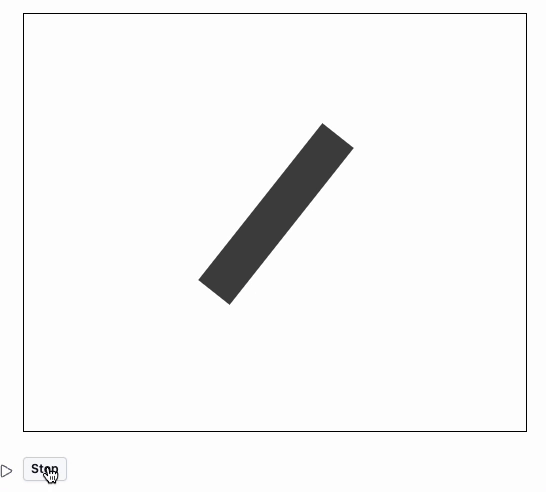

```mathematica
AsyncFunction[scene, Module[{d, loop},
  d = af`AddTo[scene, {
    Rotate[
      Rectangle[{-0.5,-0.1}, {0.5,0.1}]
    , #r]
  }, {
    "r" -> 0.
  }];

  loop = af`Loop[scene, d, "r", Function[{t, o, n},
    Pi t + (n-1) Pi
  ], 0.5];

  next // Await;
  
  af`Remove[loop];

  PauseAsync[scene, 0.5] // Await;

  af`Remove[d];
]][s]
```

However, one can see that our animation has been interrupted somewhere mid-cycle, which may not be great for some cases. Using [Finish](frontend/Advanced/Animation%20Framework/Reference.md#Finish) method we can wait extra time until the cycle of animation has been finished:

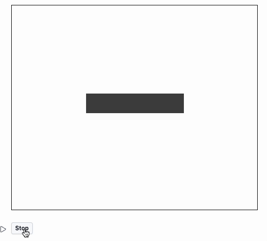

```mathematica
AsyncFunction[scene, Module[{d, loop},
  d = af`AddTo[scene, {
    Rotate[
      Rectangle[{-0.5,-0.1}, {0.5,0.1}]
    , #r]
  }, {
    "r" -> 0.
  }];

  loop = af`Loop[scene, d, "r", Function[{t, o, n},
    Pi t + (n-1) Pi
  ], 0.5];

  next // Await;

  af`Finish[loop] // Await; (* <---- HERE *)
  
  af`Remove[loop];

  PauseAsync[scene, 0.5] // Await;

  af`Remove[d];
]][s]
```


### Workers
Workers are like parallel threads - a more general and extended version of loops. It allows to execute an arbitrary code concurrently with the main animation on each frame:

```mathematica
af`Worker[scene_Scene, Function[absoluteTime, 
	...
]] 
```

or 

```mathematica
af`Worker[scene_Scene, AsyncFunction[absoluteTime, 
	...
]] 
```

The last case is the most valuable. You can assign a sub-animation to a worker. Using [Finish](frontend/Advanced/Animation%20Framework/Reference.md#Finish) method on worker one can catch the moment when async sub-animation has been finished. Workers are running until they are manually removed using [Remove](frontend/Advanced/Animation%20Framework/Reference.md#Remove) method.

Taking a previous example, we can modify it slightly to take advantage of workers:

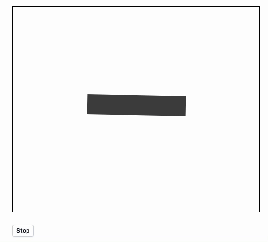

```mathematica
next = InputButton["Stop"]
```

```mathematica
AsyncFunction[scene, Module[{d, worker},
  d = af`AddTo[scene, {
    Rotate[
      Rectangle[{-0.5,-0.1}, {0.5,0.1}]
    , #r]
  }, {
    "r" -> 0.
  }];

  worker = af`Worker[scene, AsyncFunction[Null,
    af`Animate[scene, d, "r"->Pi/2] // Await;
    af`Animate[scene, d, "r"->-Pi/2] // Await;
  ]];

  next // Await;

  af`Finish[worker] // Await;
  af`Remove[worker];

  PauseAsync[scene, 0.5] // Await;

  af`Remove[d];
]][s]
```

Here is an adapter example from [Combining with Offload](#Combining%20with%20Offload), that becomes much more compact and easier to read using workers:


<details>

```mathematica
fakeWritting[from_, to_, vert_, scale_: 1, freq_: 50] := 
  Line[
    MovingAverage[
      Table[
        {
          i,
          vert + scale 0.065 Sin[freq i] + 0 RandomReal[scale 0.05 {-1, 1}]
        },
        {i, from, to, (to - from)/300.0}
      ],
      10
    ]
  ];

slidersComponent[p1_, p2_] := {
  White,
  Rectangle[{-0.5, -0.5}, {0.5, 0.2}, RoundingRadius -> 2 0.14],
  {
    RGBColor[0.9, 0.9, 0.9],
    Rectangle[{-0.3, -0.02}, {0.3, 0.02}, RoundingRadius -> 0.04],
    RGBColor[0.4, 0.6, 0.9],
    Disk[{0.25 p1, 0}, 0.05]
  },
  Translate[
    {
      RGBColor[0.9, 0.9, 0.9],
      Rectangle[{-0.3, -0.02}, {0.3, 0.02}, RoundingRadius -> 0.04],
      RGBColor[0.4, 0.6, 0.9],
      Disk[{0.25 p2, 0}, 0.05]
    },
    {0, -0.3}
  ]
};
ClearAll[notebookModel]
notebookModel[size_, scale_, contentOpacity_, s_] := 
  Scale[
    SVGGroup[
      {
        Lighter[Black],
        Text[Style["Notebook", FontSize -> 14], {0, 0.4}, {0, -1}],
        RGBColor[0.93, 0.93, 0.90],
        Rectangle[size {-1, -1}, size {1, 1}, RoundingRadius -> 0.13],
        Opacity[contentOpacity],
        SVGGroup[{
          {
            Translate[
              Scale[
                slidersComponent[Offload[s[[1]]], Offload[s[[2]]]],
                0.2
              ],
              {0.16015625, 0.16022949218750004}
            ]
          },
          Black // Lighter // Lighter,
          {
            AbsoluteThickness[2],
            fakeWritting[-0.3, 0.05, 0.27, 0.4, 170/1.8]
          },
          Table[
            fakeWritting[-0.3, 0.3, i, 0.1, 170],
            {i, 0.13, 0.3 - 0.07, 0.04}
          ],
          Table[
            fakeWritting[-0.3, 0.3, i, 0.1, 170],
            {i, -0.3 + 0.03, -0.1, 0.04}
          ]
        }]
      }
    ],
    scale
  ];
```

</details>

```mathematica
AsyncFunction[scene, Module[{d, sliders = {0,0}, w},

  d = af`AddTo[scene, {
    Translate[notebookModel[0.33, 2.0, 1.0, sliders // Offload], #pos]
  }, {
    "pos"->{0,2.0},
    "cop"->1.0
  }];

  af`Animate[scene, d, "pos"->{0,0}, "CubicInOut", 1] // Await;

  w = af`Worker[scene, AsyncFunction[Null,
    af`Animate[scene, Hold[sliders], RandomReal[{-1,1},2], "CubicInOut", 0.5] // Await;
  ]];
  
  
  PauseAsync[scene, 4] // Await;

  af`Remove[w];
  af`Remove[d];

]][s];
```
