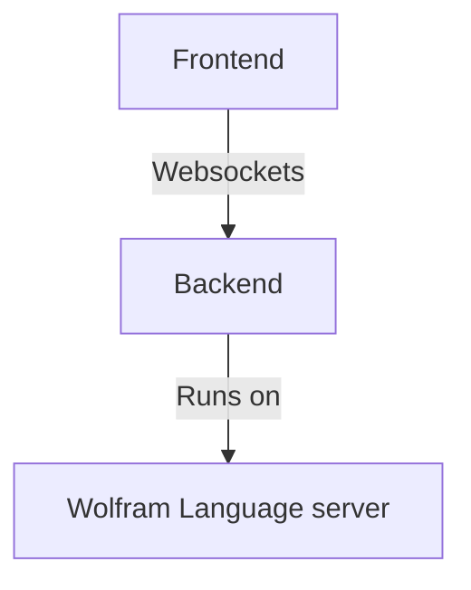

## FAQ

### How to *restart* chat
Type and send a message

```
reset chat
```

### Ask to fix any errors
When your cursor is inside a cell (no matter *javascript*, *wolfram language* or whatever) it is called `focused cell`.

AI can have an access to it. Mention __explicitly__
> fix my errors in the focused cell


### Fix typos in selected text
When you select something in the cell, you can call AI bot to perform actions on a text. For example `Ctrl/Cmd + P` and 

> Fix selected

or more explicitly

> Fix grammar in selected

### Read or edit selected text
AI can also see currently selected text. However, the information about language is not provided. By the default it assumes the the main language is WL. 

Ask for example
> what is this symbol i selected?


### Remove/add cells
You can drop a cursor in any cell and ask to remove all cells starting from the focused one for instance

> remove all cells starting from the focused

### Say "do it" in a single message
if assistant hesitates to apply changes to your cell and prints changes to a chat, just tell
> apply changes

### Create new cells
You can simply ask 
> show me an example in Javascript

by the default it will print it to the end of your notebook. To specify the place, one can mention current cell as `focused`
> show me an example in Javascript and print it to a cell below focused

### Ask to change attributes of cells
It can also toggle input cells visibility
> unhide all input markdown cells


### Ask to evaluate something
You can ask to evaluate specific type of cells. For example
> evaluate all markdown cells

or you can also chain more commands

> evaluate all markdown cells and hide inputs

### Ask to redo something
If an AI made a mistake or you need something different. Tell directly to edit the cell it created, i.e.
> i need red background instead of white. edit your cell


### Ask to comment on something
One can ask AI to check all code cells and print description to the notebook. 

:::warning
If you have a large cells or many small, consider it will cost you a lot of tokens
:::

You can chain multiple commands
> read all my cells and comment on them using Markdown. Insert your markdown cells at the corresponding places in the notebook. evaluate them and hide


or if it sometimes print code blocks as well, we can mention not to do it directly
> read all my cells and comment (no code blocks inside) on them using Markdown. Insert your markdown cells at the corresponding places in the notebook. evaluate them and hide


### Access to internet
By the default AI can use Wolfram Alpha to get real-time data.

> where am I?


### AI is not responding ⌛️
Sometimes the operation takes 1-2 minutes to complete. If it is not the case, try to wake it up by sending a dummy message

> So?

in the worst case
- type and send `reset chat` to restart session
- you have probably run out of tokens. Check OpenAI API page, then `Billing`


## Note on cell types
An assistant is aware of being in a notebook environment. The following cell types are described well in the initial system prompt

- [Input cell](frontend/Cell%20types/Input%20cell.md)
- [Javascript](frontend/Cell%20types/Javascript.md)
- [HTML](frontend/Cell%20types/HTML.md)
- [Slides](frontend/Cell%20types/Slides.md)
- Mermaid diagrams

We also include the differences between Wolfram Mathematica and WLJS Notebook to the initial prompt including [Dynamics](frontend/Dynamics.md), [InputButton](frontend/Reference/GUI/InputButton.md), [InputRange](frontend/Reference/GUI/InputRange.md), [ManipulatePlot](frontend/Reference/Plotting%20Functions/ManipulatePlot.md) and some of the [Events](frontend/Reference/Misc/Events.md) system features.

## Library
We sorted out all additional information by topics for AI and placed it in a sort of database, what we call `AI Library`, you can find it in settings menu


This means that all those items are accessible on demand, and __it won’t use up your tokens if your request doesn’t match the topic__.


## Prompt examples
Here is a few typical examples 

### Fixing errors
For instance you typed something

```mathematica title="cell"
Plot[x, {x,0,1,0.1}]

               ^^^
```

Then, keeping your cursor in the cell, __open command palette__ by `Cmd/Ctrl+P` and typing 

```
fix my errors in focused cell
```

or if an assistant hesitates to make changes, write in addition `apply changes` or `fix it in my cell`

:::note
Assistant can help you with any kind of used languages. Make sure that your cursor inside the correct cell
:::

### Fixing grammar
Simply ask

```
fix my grammar in the focused cell
```

and then if it does not apply changes to the current cell - ask as well

```
apply changes
```

### Helping with Dynamics
An assistant is aware of new libraries used here. For example

```
make an dynamic example, where a green ball follows your cursor on a 2d graph
```

```mathematica title="sample output"
pt = {0.,0.};

Graphics[{
  White, EventHandler[Rectangle[{-10,-10}, {10,10}], {
    "mousemove" -> Function[pos,
        pt = pos
    ]
  }],
  Green, Disk[pt // Offload, 0.5]
}, PlotRange -> {{-10, 10}, {-10, 10}}]
```


### Make *something*
Ask directly from the command palette what you want

``` title="prompt"
make an example slide
```

it will print a new [Slides](frontend/Cell%20types/Slides.md) cell

```jsx title="sample output"
.slide
# Welcome to the Presentation

This slide introduces you to the world of presentations in notebooks.

---

# The Power of Slides

Slides can convey complex ideas succinctly and engagingly.

---

# Thank You!

We hope you found this introduction useful.
```


Or __to write Javascript code example__

``` title="prompt"
write some javascript example with animation
```

```js title="sample output"
.js
let canvas = document.createElement('canvas');
canvas.width = 200;
canvas.height = 200;
let ctx = canvas.getContext('2d');

let posX = 0;
let speed = 2;

function draw() {
  ctx.clearRect(0, 0, canvas.width, canvas.height);
  ctx.fillStyle = 'red';
  ctx.fillRect(posX, 75, 50, 50);
  posX += speed;
  if (posX > canvas.width || posX < 0) speed *= -1;
}

let animFrame;
function animate() {
  draw();
  animFrame = requestAnimationFrame(animate);
}

animate();

this.ondestroy = () => {
    cancelAnimationFrame(animFrame);
};

return canvas;
```


Or HTML

```
show me example with HTML language. Print it to a new cell
```

```html title="sample output"
.html
<div>
    <h1 class="text-2xl font-bold">My First Heading</h1>
    <p>This is a paragraph in a div element.</p>
</div>
```


Or mermaid diagram

```
write a mermaid flow-type diagram with the following data: Frontend, which is connected to Backend using Websockets and on the backend Wolfram Language server is running
```




### Asking to write an entire program
Quite often it is quite risky, but with more popular languages like Javascript it can work very well. For example

```
how to capture data from webcam in Javascript and draw it to canvas. Print it to a new cell
```

which produces a fully working code

```js title="sample output"
.js
// First, create elements for the video and canvas
const video = document.createElement('video');
const canvas = document.createElement('canvas');
const context = canvas.getContext('2d');

// Set video constraints
canvas.width = 640;
canvas.height = 480;

// Use getUserMedia to access the webcam
if(navigator.mediaDevices && navigator.mediaDevices.getUserMedia) {
    navigator.mediaDevices.getUserMedia({ video: true })
        .then(function(stream) {
            video.srcObject = stream;
            video.play();
        })
        .catch(function(error) {
            console.log("Error accessing webcam: ", error);
        });
}

// Draw the video frame to the canvas
document.body.appendChild(video);
video.addEventListener('play', function() {
    (function draw() {
        context.drawImage(video, 0, 0, canvas.width, canvas.height);
        requestAnimationFrame(draw);
    })();
});

// Return the canvas element to be rendered
return canvas;
```


:::warning
This code does not stop even if you remove a cell. Please ask AI in addition

```
please modify it so that when i remove a cell it will also stop streaming
```
:::

### Make a linear gradient for a div
We have some [WLX](frontend/Cell%20types/WLX.md) cell with the following content

```jsx
.wlx

<div class="flex w-full flex-row gap-x-4" style="align-items: center">
  
  <h1>Title of the talk</h1>
  <div></div>
</div>
```

then we select the last div

```
<div></div>
```

and use a prompt

> make a linear gradient from the selected text with 3 colors (red, blue, green) horizontally. Height is 2rem

AI applies the changes

```jsx
.wlx

<div class="flex w-full flex-row gap-x-4" style="align-items: center">
  
  <h1>Title of the talk</h1>
  <div style="background: linear-gradient(to right, red, blue, green); width: 100%; height: 2rem;"></div>
</div>
```


### Restart session
If you need to flush the session, simply type in the chat window

```
reset chat
```

