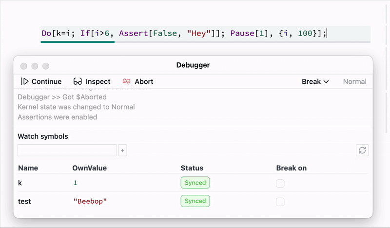

Debugger is a [Command palette](frontend/Command%20palette.md) tool, which attaches to a notebook and a working kernel in order to intercept the evaluation process and watch symbol changes. 

__Inspect__ is a central mode for debugging. 

## Inspecting mode
It pauses the current execution and allows interactive evaluation of any other cells in the sub-session, so that you can get the state of other symbols. You can write and evaluate other cells in `Inspect` mode. 

For example evaluate this one

```mathematica
Do[k=i; Pause[1], {i, 100}];
```

then switch to `Inspect` mode, it will pause the evaluation. Now you can check the state of `k` symbol by running a new cell with

```mathematica
k
```

:::note
You can always continue the execution from this mode by clicking `Continue` till then next possible break. All transitions take time and depends on the current Kernel occupancy. 
:::

## Watching symbols
One can append a symbol to a tracking list, so you can monitor their `OwnValue` in realtime automatically. It won't interrupt your execution unless you switched on a checkbox for that.

:::note
Live updates are supported only for assignments, i.e. when `symbol = *newValue*`. If you mutate a part of a `List` it won't cause an update.
:::

:::note
It applies `Shallow` to an expression of a symbol for displaying in tracking window.
:::

## Break points
In Wolfram Language it is hard to came up with a traditional break-points, since there is such things as *source code file* in a classical way. Everything is an expression, and a break point must an expression too.

There are 2 sources for breaking events, which immediately switch kernel to [Inspecting mode](#Inspecting%20mode).

### Asserts
Firstly, __enable breaking on assertions__ from the dropdown menu in the top-bar of debugger. Then whenever execution encounters `False` [Assert](frontend/Reference/Misc/Assert.md), it will break. 

For example

```mathematica
Do[k=i; If[i>6, Assert[False, "Hey"]]; Pause[1], {i, 100}];
```

this code will break automatically after 6 seconds. And in inspecting mode the evaluation of `k` will return `7`.  

If you track `k` symbol at the same time you will see the following



### Symbols
When a symbol has been assigned to a new value, generates an event in the debugger. Use checkbox `Break on` to turn on breaking.

For example

```mathematica
Do[k=i; If[i>6, test = Now]; Pause[1], {i, 100}];
```

this code will break after 6 iterations

