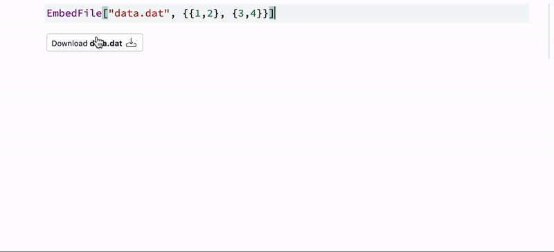

---
tags:
  - export
---


If you export your notebook or presentation to a [Static HTML](frontend/Exporting/Static%20HTML.md), you might need to provide some ASCII or other binary files together with it. It may benefit a user, if you provide a direct link to it right on the notebook page

:::tip
Do not embed files larger than 1-5 Mb using this wrapper
:::



For example

```mathematica
EmbedFile["data.dat", {{1,2}, {3,4}}]
```

*It effectively uses the same interface as `Export` and can export image, sound or any binary data as well*

One can also put it on a slide or any [WLX](frontend/Cell%20types/WLX.md) cell if needed

## Source code
Copy and evaluate both cells

```mathematica title="cell 1"
EmbedFile[name_String, data_] := With[{exported = Export[name, data]},
  If[!FailureQ[exported],
    With[{base64 = BaseEncode[ReadByteArray[exported]]},
      EmbedFile[name, base64] // Hold // CreateFrontEndObject
    ]
  ,
    $Failed
  ]
]
```

```js title="cell 2"
.js

const b64toBlob = (b64Data, contentType='', sliceSize=512) => {
  const byteCharacters = atob(b64Data);
  const byteArrays = [];

  for (let offset = 0; offset < byteCharacters.length; offset += sliceSize) {
    const slice = byteCharacters.slice(offset, offset + sliceSize);

    const byteNumbers = new Array(slice.length);
    for (let i = 0; i < slice.length; i++) {
      byteNumbers[i] = slice.charCodeAt(i);
    }

    const byteArray = new Uint8Array(byteNumbers);
    byteArrays.push(byteArray);
  }
    
  const blob = new Blob(byteArrays, {type: contentType});
  return blob;
}

core.EmbedFile = async (args, env) => {
  const name = await interpretate(args[0], env);
  const data = await interpretate(args[1], env);

  // Create the anchor element
  const anchor = document.createElement("button");
  anchor.className = "sm-controls rounded bg-white px-2 py-1 text-xs text-gray-900 shadow-sm ring-1 ring-inset ring-gray-300 hover:bg-gray-50 flex flex-row gap-x-1 items-end";


  anchor.textContent = "Download";

  anchor.innerHTML = `<span>Download <b>${name}</b></span> 
  <svg xmlns="http://www.w3.org/2000/svg" fill="none" class="w-5 h-5 ml-auto" viewBox="0 0 24 24">
    <path stroke="currentColor" stroke-linecap="round" stroke-linejoin="round" d="M17 17h.01m.39-3h.6c.932 0 1.398 0 1.765.152a2 2 0 0 1 1.083 1.083C21 15.602 21 16.068 21 17s0 1.398-.152 1.765a2 2 0 0 1-1.083 1.083C19.398 20 18.932 20 18 20H6c-.932 0-1.398 0-1.765-.152a2 2 0 0 1-1.083-1.083C3 18.398 3 17.932 3 17s0-1.398.152-1.765a2 2 0 0 1 1.083-1.083C4.602 14 5.068 14 6 14h.6m5.4 1V4m0 11-3-3m3 3 3-3"></path>
  </svg>
`;
  
  env.element.appendChild(anchor);

  env.element.onclick = () => {
    const blob = b64toBlob(data);

    // Create a download link
    const link = document.createElement('a');
    link.href = URL.createObjectURL(blob);
    link.download = name;
    link.click();
    link.remove();
  }
}
```
