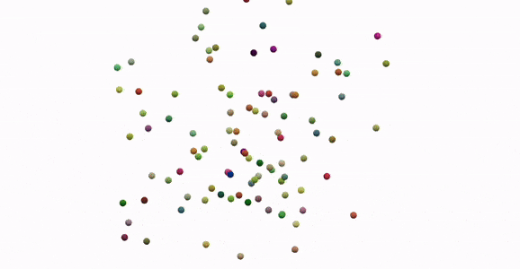
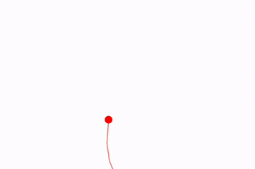
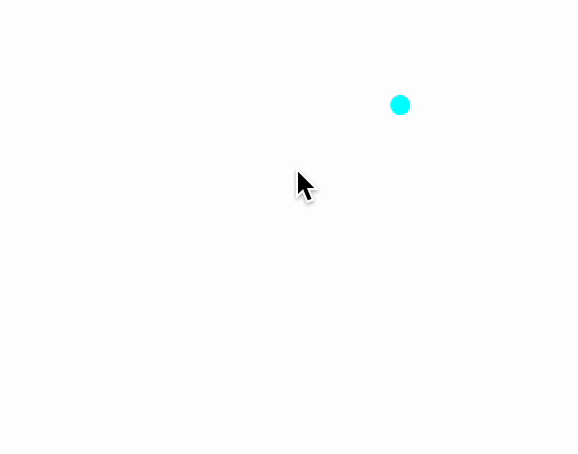
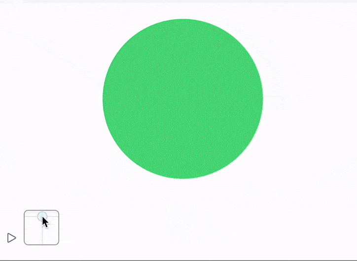

## Basics
### Way 1
Consider to use __to get the highest frame-rate__ and __smooth animations__
- [AnimationFrameListener](frontend/Reference/Graphics/AnimationFrameListener.md) for [Graphics](frontend/Reference/Graphics/Graphics.md) 
- [AnimationFrameListener](frontend/Reference/Graphics3D/AnimationFrameListener.md) for [Graphics3D](frontend/Reference/Graphics3D/Graphics3D.md)

with [TransitionType](frontend/Reference/Graphics/TransitionType.md) set to `None` if the calculation time does not exceed the `1/60` of the second. Otherwise consider to use `"Linear"` interpolation option and a small amount of [TransitionDuration](frontend/Reference/Graphics/TransitionDuration.md) around 10-100 depending on how long it takes to update the data.

:::tip
If you animation looks sloppy, you can always cheat asking Javascript to interpolate between data portions over the time. Use [TransitionType](frontend/Reference/Graphics/TransitionType.md) and [TransitionDuration](frontend/Reference/Graphics/TransitionDuration.md)
:::

For example

```mathematica title="cell 1"
balls = RandomReal[{-1,1}, {100,3}];
vels  = RandomReal[{-1,1}, {100,3}];

Graphics3D[{
  Table[With[{i = i},
    {
      RGBColor[RandomReal[{0,1}, 3]],
      Sphere[balls[[i]] // Offload, 0.03]
    }
  ], {i, Length[balls]}], 
  AnimationFrameListener[balls // Offload, "Event"->"frame"]
}]
```

*evaluate the cell above. It will create a canvas with randomly scattered balls*

At the start of the browser's frame, an event `"frame"` is triggered to request an update of data from the Kernel. However, after this, you'll need to "recharge" an `AnimationFrameListener`, otherwise it will not trigger the event again. This can be automated to occur whenever a change in the `balls` symbol is detected.

This process ensures the following benefits:

- Synchronization of animation with the browser's engine (eliminating flickering).
- Ability to skip frames if recalculations take longer than one frame of your browser, adapting to your computing power.

Here is our update function

```mathematica
EventHandler["frame", Function[Null,

  vels = Table[
    If[Norm[balls[[i]]] < 0.01, -1, 1] vels[[i]] - 0.08 balls[[i]]
  , {i, Length[balls]}];
  
  balls = Table[balls[[i]] + 0.08 vels[[i]], {i, Length[balls]}];
]];
```

To start an animation - reevaluate *cell 1* or use this "kickstarter"
```mathematica
EventFire["frame", Null]
```




### Way 2
Consider to use [`SetInterval`](frontend/Reference/Misc/Async.md#`SetInterval`) for simple or resource intensive animation. Set [TransitionDuration](frontend/Reference/Graphics/TransitionDuration.md) and [TransitionType](frontend/Reference/Graphics/TransitionType.md) to a proper value to interpolate the values.

Usually if your [`SetInterval`](frontend/Reference/Misc/Async.md#`SetInterval`) is let's say `100 ms`, then [TransitionDuration](frontend/Reference/Graphics/TransitionDuration.md) should be around `100 ms` as well to get *the smoothest animation*.

:::tip
If you animation looks sloppy, you can always cheat asking Javascript to interpolate between data portions over the time. Use [TransitionType](frontend/Reference/Graphics/TransitionType.md) and [TransitionDuration](frontend/Reference/Graphics/TransitionDuration.md)
:::

For example 

```mathematica
ParametricAnimator[equation_, variable_:t, range_:{0, Infinity, 0.1}] := LeakyModule[{time = range[[1]], task, scale = 1, array = {}, scaledArray={}, cell = ResultCell[]},

    (* sample the equation each frame and rescale if needed *)
	animate := Block[{variable = time},
        With[{e = {Sin[t], Cos[t]} equation},
    		scale = If[Norm[e scale] > 1.4, scale 0.95, scale 1];
            array = Append[array, e];
    		scaledArray = scale array; 
            pointer = e scale;
        ];

		time += range[[3]];
		If[time >= range[[2]], TaskRemove[task]];
	];

    animate;

    (* async task to animate every 50 ms *)
	task = SetInterval[animate, 50];

    (* stop the task if cell was destroyed or reevaluated *)
	EventHandler[cell, {"Destroy"->Function[Null, TaskRemove[task]; Print["removed"]]}];

	Graphics[{Red, PointSize[0.05], Point[pointer // Offload],
 Opacity[0.5], Line[scaledArray // Offload]
  }, TransitionDuration->50, TransitionType->"Linear", Controls->False, PlotRange->{{-1,1}, {-1,1}}]
]
```

This will sample a given parametric equation and animate it with `50 ms` time step, while on Javascript's side it will interpolate between frames, so that overall animation will look smooth and will be rendered at 60FPS

```mathematica
ParametricAnimator[Exp[Sin[t]] - 2 Cos[4t] + Sin[(2t - Pi)/24], t, {0,16, 0.05}]
```




### Way 3
If you animation depends on some interaction with a user, it might be a good idea to run it and update objects attributes only, when some event is fired.

For example

```mathematica
pt = {0,0};
Graphics[{
	White,
	EventHandler[
		Rectangle[{-2,-2}, {2,2}],
		{"mousemove"->Function[xy, pt = xy]}
	],
	PointSize[0.05], Cyan,
	Point[pt // Offload]
}]
```

*a mouse follower*



## A remark on color and opacity
[RGBColor](frontend/Reference/Graphics/RGBColor.md) as well as [Opacity](frontend/Reference/Graphics/Opacity.md) do support dynamic updates in the context of [Graphics](frontend/Reference/Graphics/Graphics.md). Here it is a bit tricky, since all graphics symbols sharing the same scope should bind to them indirectly. The good news, you do not have to think about and just

```mathematica
color = {1,0,0};
Graphics[{RGBColor[color // Offload], Disk[{0,0}, 1]}]

EventHandler[InputJoystick[], Function[xy,
	color = Normalize[{xy[[1]], xy[[2]], 0.5}] // Abs;
]]
```



Or even more complicated - combining it together with traditional dynamics with nested variables

```mathematica
opacity = 0.5;
Graphics[{Opacity[Offload[opacity]], Red, Disk[{0,0}, Offload[1-opacity]], Blue, Opacity[Offload[1.0 - opacity]], Disk[{0,0}, Offload[opacity]]}, ImagePadding->None]

EventHandler[InputRange[0,1,0.1], Function[value,
	opacity = value;
]]
```


## Creating and removing objects
The most examples given on the pages [Dynamics](frontend/Dynamics.md), [AnimationFrameListener](frontend/Reference/Graphics/AnimationFrameListener.md) considers only changing the attributes of created graphics primitives on the screen. One can also use pure raster graphics together with [Image](frontend/Reference/Image/Image.md), however, this is quite cumbersome to deal with. 

Wolfram Language is *mostly* immutable by the design, the same is true for all graphics primitives. We can violate this rule, by injecting new expressions into existing one dynamically and evaluate them in-place. Since our frontend (browser) actually has OOP structure inside, we can refer to the particular instance of some object on the screen using [FrontInstanceReference](frontend/Reference/Frontend%20IO/FrontInstanceReference.md).

### Simple example
Here we will append colorful [Disk](frontend/Reference/Graphics/Disk.md) s to a [Graphics](frontend/Reference/Graphics/Graphics.md) symbol context following the mouse position. As usual the best way to do it is to use white [Rectangle](frontend/Reference/Graphics/Rectangle.md) 😀

```mathematica title="cell 1"
scene = FrontInstanceReference[];
Graphics[{White, EventHandler[Rectangle[{-1,-1}, {1,1}], {"mousemove"->handler}], scene}, ImagePadding->None]
```

The last thing is to define `handler` function

```mathematica
With[{win = CurrentWindow[]},
  handler = Function[xy, 
    FrontSubmit[{
      Hue[RandomReal[{0,1}], 1,1],
      Disk[xy, RandomReal[{0.01,0.1}]]
    }, scene]
  ];
];
```

Here we use created reference `scene`, which makes sure, that new expressions will be evaluated __in existing context__ of our graphics object. 


### Animating bubbles
We can go further and animate bubbles. The problem comes, when we create a bubble, in fact, we need to provide some graphics primitive (lets say `Disk`) and a dynamic symbol to control its properties (see in [Dynamics](frontend/Dynamics.md)). Creating 1000 dynamic symbols is a big overhead to the system, especially if we want to update all of them.

#### Pool of objects
Let us use a limited number of dynamic symbols - buffers and bind each animated `Disk` or bubble to one of its part

```mathematica
cPool = Table[{0.,0.}, {i,100}]; (* positions *)
vPool = cPool; (* velocities *)
rPool = Table[0., {i,100}]; (* radius or lifetime *)

oPool = Table[Null, {i,100}]; (* references to objects *)
```

The general idea is not to allocate new variables for new object, but rather reuse objects from the pool.

Graphical output is going to be the same

```mathematica
scene = FrontInstanceReference[];
Graphics[{White, EventHandler[Rectangle[{-1,-1}, {1,1}], {"mousemove"->handler[scene]}], scene}, ImagePadding->None]
```

Our future animation loop is going to look like this

```mathematica
  handler[scene_] := Function[xy, 
    If[!created[xy, scene], update[]];
  ];
```

We don't need to evaluate it now.

An update functions - just go over our arrays and produce new

```mathematica
update[] := With[{},
  {cPool, rPool} = Transpose[MapIndexed[Function[{a, index},
    (* if slot is not empty - recalculate *)
    If[oPool[[index//First]] =!= Null,
        
      If[a[[2]] <= 0.002, 
        (* if radius is too small - remove an object *)
        remove[index//First];
        a
      ,
        (* if ok - animate *)
        {a[[1]] + 0.05 vPool[[index//First]], 0.9 a[[2]]}
      ]
    ,
      a
    ]
    
  ], {cPool, rPool} // Transpose]];
];
```

if a lifetime is close to zero, we need to remove created instance and free some slots in our buffers for new objects

```mathematica
remove[index_] := (
  (* destroy instance on the frontend *)
  Delete[oPool[[index]]]; 
  oPool[[index]] = Null
);
```

And finally a function to create new objects

```mathematica
created[xy_, scene_] := With[{
  (* find empty slot *)
  slot = FirstPosition[oPool, Null]
},
  If[!MissingQ[slot],
    With[{s = slot // First},

      (* initial positions and etc *)
      cPool[[s]] = xy;
      rPool[[s]] = 0.05;
      vPool[[s]] = RandomReal[{-1,1}, 2];
      oPool[[s]] = True;

      (* update so that object wont appear in an odd way *)
      update[];

      (* create an instance of Disk on a graph *)
      With[{
	    group = FrontInstanceGroup[],
        o = {
          Hue[RandomReal[{0,1}],1,1],
                                                (* prevent double updates *)
          Disk[Offload[cPool[[s]]], Offload[rPool[[s]], "Static"->True]]
        }
      },
        oPool[[s]] = group;
        FrontSubmit[o // group, scene];
      ];
    ];

    True
  ,
    False
  ]
]
```

The big difference to the previous example [Simple example](#Simple%20example) is that we track our created instances [FrontInstanceGroup](frontend/Reference/Frontend%20IO/FrontInstanceGroup.md), so that we can remove them later for our SVG canvas (aka [Graphics](frontend/Reference/Graphics/Graphics.md))


All positions and radiuses are passed in two solid symbols `cPool` and `rPool`, then we only need to perform two data transactions to our frontend, which saves a lot of resources, when it comes to make objects flying on the screen. Because of the payload matters less, than each act of transactions in terms of the transport load. 

