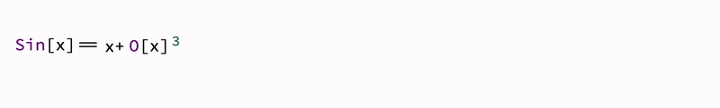
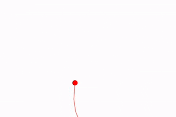

## Basic
### Way 1
Use [AnimatePlot](frontend/Reference/Plotting%20Functions/AnimatePlot.md) for plot-like animations

```mathematica
AnimatePlot[Sum[Sin[x w]/w, {w, 1,n}] // Re, {x, -2Pi,2Pi}, {n, 1,20, 1}]
```


### Way 2
Use [Animate](frontend/Reference/GUI/Animate.md) for animating arbitrary expressions 

```mathematica
Animate[Row[{Sin[x], "==", Series[Sin[x], {x,0,n}], Invisible[1/2]}], {n, 1, 10, 1}, AnimationRate->3]
```

here we used [Invisible](frontend/Reference/Formatting/Invisible.md) with a dummy expression to keep the height of the editor the same. The result will look like



Using `UpdateFunction` option, one can bypass the default update method and write your own using [[Offload]]

```mathematica
Module[{pts},
  Animate[Graphics[{
    Circle[{0,0},1],
    Red, Point[pts // Offload]
  }, ImageSize->Small], {t, 0, 2Pi, 0.1}, 
  "UpdateFunction" -> Function[t,
    pts = {Sin[t], Cos[t]};
    False
  ]]
]
```


#### Smoother version
There are two way how to make the previous example look smoother.

1. Native `Graphics`'s data interpolation

```mathematica
Module[{pts},
  Animate[Graphics[{
    Circle[{0,0},1],
    Red, Point[pts // Offload]
  }, ImageSize->Small,
    TransitionDuration->220
  ], {t, 0, 2Pi, 0.1}, 
  "UpdateFunction" -> Function[t,
    pts = {Sin[t], Cos[t]};
    False
  ]]
]
```

2. Increate the update frame rate

```mathematica
Module[{pts},
  Animate[Graphics[{
    Circle[{0,0},1],
    Red, Point[pts // Offload]
  }, ImageSize->Small,
    TransitionType->None
  ], {t, 0, 2Pi, 0.02}, 
  "UpdateFunction" -> Function[t,
    pts = {Sin[t], Cos[t]};
    False
  ], AnimationRate->60]
]
```


It is important to disable interpolation, since it will only hurt the performance at higher rates.


## Advanced

### Way 1
Consider using __to achieve the highest frame rate__ and __smooth animations__.
- [AnimationFrameListener](frontend/Reference/Graphics/AnimationFrameListener.md) for [Graphics](frontend/Reference/Graphics/Graphics.md) 
- [AnimationFrameListener](frontend/Reference/Graphics3D/AnimationFrameListener.md) for [Graphics3D](frontend/Reference/Graphics3D/Graphics3D.md)

Use [TransitionType](frontend/Reference/Graphics/TransitionType.md) set to `None` if the calculation time does not exceed `1/60` seconds. Otherwise, consider using the `"Linear"` interpolation option and a small value for [TransitionDuration](frontend/Reference/Graphics/TransitionDuration.md), around 10-100, depending on how long it takes to update the data.

:::tip
If your animation looks choppy, you can use JavaScript to interpolate between data changes over time. Use [TransitionType](frontend/Reference/Graphics/TransitionType.md) and [TransitionDuration](frontend/Reference/Graphics/TransitionDuration.md).
:::

For example:

```mathematica title="cell 1"
balls = RandomReal[{-1,1}, {100,3}];
vels  = RandomReal[{-1,1}, {100,3}];

Graphics3D[{
  Table[With[{i = i},
    {
      RGBColor[RandomReal[{0,1}, 3]],
      Sphere[balls[[i]] // Offload, 0.03]
    }
  ], {i, Length[balls]}], 
  AnimationFrameListener[balls // Offload, "Event"->"frame"]
}]
```

*Evaluate the cell above. It will create a canvas with randomly scattered balls.*

At the start of the browser's frame, an event `"frame"` is triggered to request an update of data from the Kernel. However, after this, you'll need to "recharge" `AnimationFrameListener`, or else it will not trigger the event again. This can be automated to occur whenever a change in the `balls` symbol is detected.

This process ensures the following benefits:

- Synchronization of animation with the browser's engine (eliminating flickering).
- The ability to skip frames if recalculations take longer than one frame of your browser, adapting to your computing power.

Here is our update function:

```mathematica
EventHandler["frame", Function[Null,

  vels = Table[
    If[Norm[balls[[i]]] < 0.01, -1, 1] vels[[i]] - 0.08 balls[[i]]
  , {i, Length[balls]}];
  
  balls = Table[balls[[i]] + 0.08 vels[[i]], {i, Length[balls]}];
]];
```

To start the animation, reevaluate *cell 1* or use this "kickstarter":

```mathematica
EventFire["frame", Null]
```


Here is another easy example

```mathematica
Module[{
  ltrace = {{0.,0.}},
  ev = CreateUUID[]
},
  EventHandler[ev, Function[Null, With[{t= 10.0 AbsoluteTime[]},
    ltrace = Append[ltrace, {Sin[t], Cos[1.1 t]}];
  ]]];

  Graphics[{
    Red, Line[ltrace // Offload],
    AnimationFrameListener[ltrace // Offload, "Event"->ev]
  }, PlotRange->{{-1,1}, {-1,1}}, "TransitionType"->None, ImageSize->Small]
]
```


### Way 2
Consider using [`SetInterval`](frontend/Reference/Misc/Async.md#`SetInterval`) for resource-intensive animations. Set [TransitionDuration](frontend/Reference/Graphics/TransitionDuration.md) and [TransitionType](frontend/Reference/Graphics/TransitionType.md) to appropriate values for interpolation.

Usually, if your [`SetInterval`](frontend/Reference/Misc/Async.md#`SetInterval`) is, let's say, `100 ms`, then [TransitionDuration](frontend/Reference/Graphics/TransitionDuration.md) should also be around `100 ms` to achieve *the smoothest animation*.

:::tip
If your animation looks choppy, you can use JavaScript to interpolate between data portions over time. Use [TransitionType](frontend/Reference/Graphics/TransitionType.md) and [TransitionDuration](frontend/Reference/Graphics/TransitionDuration.md).
:::

For example:

```mathematica
ParametricAnimator[equation_, variable_:t, range_:{0, Infinity, 0.1}] := LeakyModule[{time = range[[1]], task, scale = 1, array = {}, scaledArray={}, cell = ResultCell[]},

    (* Sample the equation each frame and rescale if needed *)
    animate := Block[{variable = time},
        With[{e = {Sin[t], Cos[t]} equation},
            scale = If[Norm[e scale] > 1.4, scale 0.95, scale 1];
            array = Append[array, e];
            scaledArray = scale array; 
            pointer = e scale;
        ];

        time += range[[3]];
        If[time >= range[[2]], TaskRemove[task]];
    ];

    animate;

    (* Async task to animate every 50 ms *)
    task = SetInterval[animate, 50];

    (* Stop the task if the cell is destroyed or reevaluated *)
    EventHandler[cell, {"Destroy"->Function[Null, TaskRemove[task]; Print["removed"]]}];

    Graphics[{Red, PointSize[0.05], Point[pointer // Offload],
 Opacity[0.5], Line[scaledArray // Offload]
  }, TransitionDuration->50, TransitionType->"Linear", "Controls"->False, PlotRange->{{-1,1}, {-1,1}}]
]
```

This will sample a given parametric equation and animate it with a `50 ms` time step, while on JavaScript's side, it will interpolate between frames so that the overall animation appears smooth and is rendered at 60FPS.

```mathematica
ParametricAnimator[Exp[Sin[t]] - 2 Cos[4t] + Sin[(2t - Pi)/24], t, {0,16, 0.05}]
```



### Way 3
If your animation depends on user interaction, it might be best to update object attributes only when an event occurs.

For example:

```mathematica
pt = {0,0};
Graphics[{
    White,
    EventHandler[
        Rectangle[{-2,-2}, {2,2}],
        {"mousemove"->Function[xy, pt = xy]}
    ],
    PointSize[0.05], Cyan,
    Point[pt // Offload]
}]
```

*A mouse follower.*


## A remark on color and opacity
[RGBColor](frontend/Reference/Graphics/RGBColor.md) and [Opacity](frontend/Reference/Graphics/Opacity.md) support updates in the context of [Graphics](frontend/Reference/Graphics/Graphics.md). However, all graphics symbols sharing the same scope should bind to them indirectly. The good news is that you do not have to worry about this—just use them normally.

```mathematica
color = {1,0,0};
Graphics[{RGBColor[color // Offload], Disk[{0,0}, 1]}]

EventHandler[InputJoystick[], Function[xy,
    color = Normalize[{xy[[1]], xy[[2]], 0.5}] // Abs;
]]
```


## Append or remove object
### How to remove
To make a primitive removable, one need to wrap it into [FrontInstanceGroup](frontend/Reference/Frontend%20IO/FrontInstanceGroup.md)

```mathematica
group = FrontInstanceGroup[];
Plot[x, {x,0,1}, Prolog->{
  group[Disk[{0,0}, 1]]
}]
```


and then to remove it

```mathematica
Delete[group]
```

### How to append
To append you need to track the instance of your graphics canvas using [FrontInstanceReference](frontend/Reference/Frontend%20IO/FrontInstanceReference.md) expression

```mathematica
ref = FrontInstanceReference[];
Plot[x, {x,0,1}, Prolog->{
  ref
}]
```

and then you can append anything using [FrontSubmit](frontend/Reference/Frontend%20IO/FrontSubmit.md)

```mathematica
FrontSubmit[Disk[{0,0}, 1], ref]
```

#### Bubbles
Let's make something more interesting
```mathematica
ref = FrontInstanceReference[];
EventHandler[Plot[x, {x,0,1}, Epilog->{
  ref
}], {"mousemove" -> Function[xy,
  FrontSubmit[{
    RandomColor[],
    Disk[xy, {0.7, 1} RandomReal[{0.01, 0.1}]]
  }, ref]
]}]
```


### How to append and remove
Here combines both methods

```mathematica
ref = FrontInstanceReference[];
groups = {};
EventHandler[Plot[x, {x,0,1}, Epilog->{
  ref
}], {"mousemove" -> Function[xy, With[{g = FrontInstanceGroup[]},
  AppendTo[groups, g];
  
  FrontSubmit[{
    RandomColor[],
    Disk[xy, {0.7, 1} RandomReal[{0.01, 0.1}]]
  } // g, ref];

  If[Length[groups] > 10, 
    Delete[groups // First]; 
    groups = Drop[groups, 1];
  ];
]]}]
```


:::note
[FrontInstanceGroup](frontend/Reference/Frontend%20IO/FrontInstanceGroup.md) does support batch processing as well, which may help to eliminate multiple calls to [FrontSubmit](frontend/Reference/Frontend%20IO/FrontSubmit.md) or `Delete`
:::


#### Animating Bubbles
We can go further and animate bubbles. The problem arises when we create a bubble. In fact, we need to provide a graphical primitive (let’s say `Disk`) and a dynamic symbol to control its properties (see [Dynamics](frontend/Dynamics.md)). Creating 1000 dynamic symbols is a significant overhead for the system, especially if we want to update all of them.

#### Pool of Objects
Let us use a limited number of dynamic symbols—buffers—and bind each animated `Disk` or bubble to one of its parts.

```mathematica
cPool = Table[{0., 0.}, {i, 100}]; (* Positions *)
vPool = cPool; (* Velocities *)
rPool = Table[0., {i, 100}]; (* Radius or lifetime *)

oPool = Table[Null, {i, 100}]; (* References to objects *)
```

The general idea is not to allocate new variables for each new object but rather to reuse objects from the pool.

The graphical output remains the same:

```mathematica
scene = FrontInstanceReference[];
Graphics[{White, EventHandler[Rectangle[{-1, -1}, {1, 1}], {"mousemove" -> handler[scene]}], scene}, ImagePadding -> None]
```

Our future animation loop will look like this:

```mathematica
handler[scene_] := Function[xy, 
  If[!created[xy, scene], update[]];
];
```

We don't need to evaluate it now.

The update function iterates over our arrays and produces new values:

```mathematica
update[] := With[{},
  {cPool, rPool} = Transpose[MapIndexed[Function[{a, index},
    (* If the slot is not empty, recalculate *)
    If[oPool[[index // First]] =!= Null,
      
      If[a[[2]] <= 0.002, 
        (* If the radius is too small, remove the object *)
        remove[index // First];
        a
      ,
        (* Otherwise, animate *)
        {a[[1]] + 0.05 vPool[[index // First]], 0.9 a[[2]]}
      ]
    ,
      a
    ]
  ], {cPool, rPool} // Transpose]];
];
```

If the lifetime is close to zero, we need to remove the created instance and free up slots in our buffers for new objects:

```mathematica
remove[index_] := (
  (* Destroy the instance on the frontend *)
  Delete[oPool[[index]]]; 
  oPool[[index]] = Null
);
```

And finally, a function to create new objects:

```mathematica
created[xy_, scene_] := With[{
  (* Find an empty slot *)
  slot = FirstPosition[oPool, Null]
},
  If[!MissingQ[slot],
    With[{s = slot // First},

      (* Initialize positions, radius, etc. *)
      cPool[[s]] = xy;
      rPool[[s]] = 0.05;
      vPool[[s]] = RandomReal[{-1, 1}, 2];
      oPool[[s]] = True;

      (* Update so the object doesn't appear abruptly *)
      update[];

      (* Create an instance of Disk in the graphics *)
      With[{
        group = FrontInstanceGroup[],
        o = {
          Hue[RandomReal[{0, 1}], 1, 1],
          (* Prevent double updates *)
          Disk[Offload[cPool[[s]]], Offload[rPool[[s]], "Static" -> True]]
        }
      },
        oPool[[s]] = group;
        FrontSubmit[o // group, scene];
      ];
    ];

    True
  ,
    False
  ]
]
```

The key difference from the previous example [Simple Example](#Simple%20example) is that we track our created instances using [FrontInstanceGroup](frontend/Reference/Frontend%20IO/FrontInstanceGroup.md), allowing us to remove them later from our SVG canvas (also known as [Graphics](frontend/Reference/Graphics/Graphics.md)).


All positions and radii are stored in two solid symbols, `cPool` and `rPool`. This means we only need to perform two data transactions with our frontend, significantly saving resources when animating objects on the screen. The payload size matters less than the number of transactions in terms of transport load.