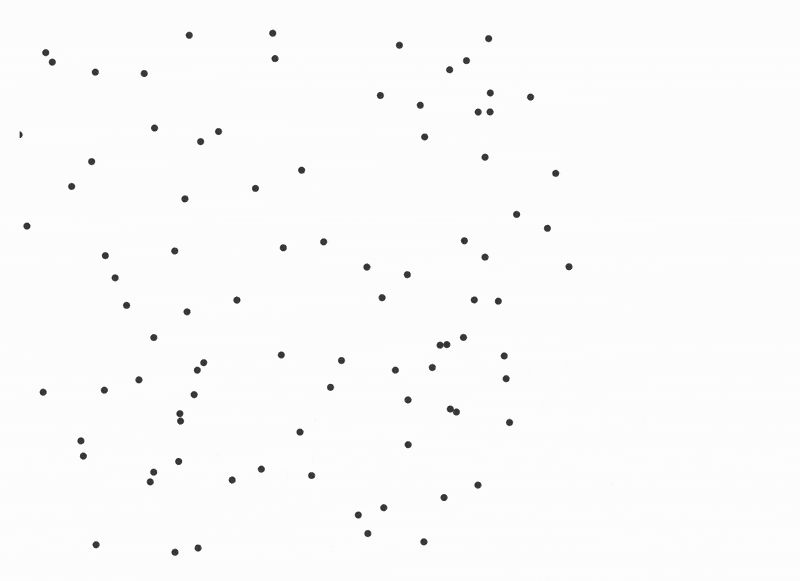
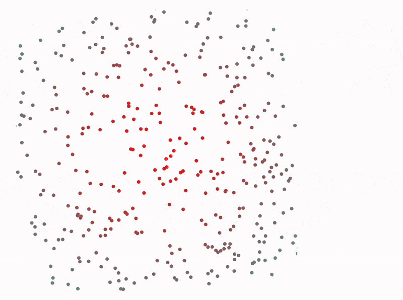
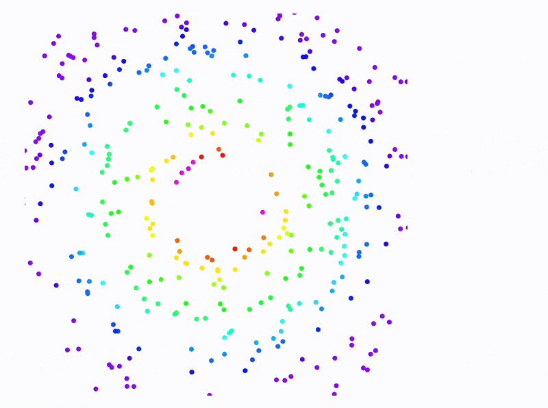

## How to update
You might notice if you try to offload an array of points (aka `List`)

```mathematica
pts = RandomReal[{-1,1}, {100, 2}];
Graphics[Point[pts // Offload], TransitionDuration->1000]
```

and then try to perform operations per element 

```mathematica
Do[pts[[i]] += 0.1 Normalize[{-1,1} pts[[i, {2,1}]]], {i, 100}];
```

Nothing will happen


Per-element operations on `List` **do not trigger a data synchronization** between Wolfram Kernel and frontend. **The only way to trigger it for lists is**

```mathematica
pts = pts;
```

This approach will definitely work, however, for such example it is easier and more efficient to do the same using a pure function and `Map`

```mathematica
pts = Map[(# + 0.1 Normalize[{-1,1} #[[{2,1}]]])&, pts];
```



## Per-element customization
In the example above we tried the ideal spherical case when one can substitute `pts` into a single primitive `Point`. In reality you might need to make then to have different properties, colors and etc. For this we need to address each element by the index explicitly and wrap everything into [Offload](frontend/Reference/Interpreter/Offload.md).

For example **not like that** ❌

```mathematica
pts = RandomReal[{-1,1}, {100, 2}];
Graphics[
	Table[{Point[pts[[i]]]}, {i, 100}] // Offload, 
	TransitionDuration->1000
]
```

but **like this** ✅

```mathematica
pts = RandomReal[{-1,1}, {100, 2}];
Graphics[
	Table[With[{i=i}, {Point[pts[[i]]] // Offload}], {i, 100}], 
	TransitionDuration->1000
]
```

<details>
<summary>Another option</summary>
This is also valid

```mathematica
pts = RandomReal[{-1,1}, {100, 2}];
Graphics[
	Table[With[{i=i}, {Point[pts[[i]] // Offload]}], {i, 100}], 
	TransitionDuration->1000
]
```

</details>

We don't dynamically create points, we statically create them on Wolfram Kernel and offload the position of each point to be evaluated (dynamically) on the frontend. 

Let's stylize our points

```mathematica
pts = RandomReal[{-1,1}, {400, 2}];
col[r_] := With[{n=Clip[Norm[r]/2]}, RGBColor[1-n, n, n]]

Graphics[
	Table[With[{i=i}, {col[pts[[i]]], Point[pts[[i]]] // Offload}], {i, 400}], 
	TransitionDuration->1000
]
```

```mathematica
Do[
  pts = Map[(# + 0.1 Normalize[{-1,1} #[[{2,1}]]])&, pts];
  Pause[0.3];
, {50}];
```



With **zero-cost** we can generate more points using the same `pts` using simple math operations (will be executed on the frontend dynamically)

```mathematica
pts = RandomReal[{-1,1}, {400, 2}];
col[r_] := With[{n=Clip[Norm[r]/2]}, RGBColor[1-n, n, n]]

Graphics[
	Table[With[{i=i}, {col[pts[[i]]], Point[1.1 pts[[i]]] // Offload, Point[pts[[i]]] // Offload}], {i, 400}], 
	TransitionDuration->1000
]
```


### Multidimensional arrays
The idea is the same, however, you have to be careful with [Part](frontend/Reference/Interpreter/Part.md) function. WLJS Interpreter does not fully support all crazy syntax of Wolfram Language. 

Instead of ❌

```mathematica
multipts[[i, j]] // Offload
```

do this ✅

```mathematica
multipts[[i]][[j]] // Offload
```

On Wolfram Kernel it is considered to be less efficient, but our Javascript implementation does the second `Part` using references only.

Here is an example with a multidimensional, where the first part stores color and the second one stores the position

```mathematica
mpts = {Clip[Norm[#]], #} &/@ RandomReal[{-1,1}, {400, 2}];

Graphics[
	Table[With[{i=i}, {
       Hue[mpts[[i]][[1]]], 
       Point[mpts[[i]][[2]]]
    } // Offload], {i, 400}], 
	TransitionDuration->30
]
```

```mathematica
Do[
  mpts = Map[{
    If[#[[1]]>0.95, 0, #[[1]] + 0.025],
    #[[2]] + 0.01 Normalize[{-1,1} #[[2, {2,1}]]]
  }&, mpts];
  Pause[1/30.0];
, {100}];
```



:::tip
For smoother animations consider to use [AnimationFrameListener](frontend/Reference/Graphics3D/AnimationFrameListener.md). See how in [Animation](frontend/Advanced/Dynamics/Animation.md)
:::


