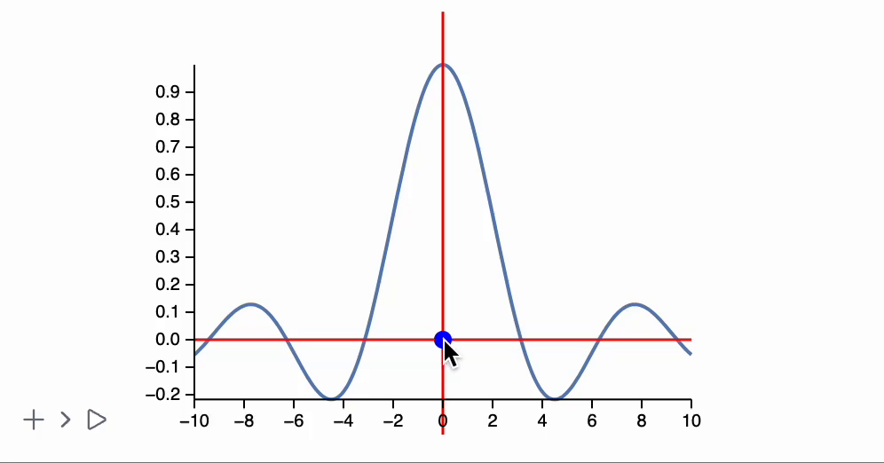

While evaluating some experimental data, some live indicators comes handy
## Crossbar and coordinates field
If you are an Origin Pro user, this one is an essential tool for picking data points from your graph.

Essentially we need two things [Line](frontend/Reference/Graphics/Line.md) and [TextView](frontend/Reference/GUI/TextView.md)

### Normal way

```mathematica title="cell 1"
point = {0.,0.};

(* plot some dummy function *)
Plot[Sinc[x], {x,-10,10}, Epilog->{
  Red,

  (* crossbar *)
  Line[With[{p = point[[1]]},
    {{p, -10}, {p, 10}}
  ] // Offload],

  Line[With[{p = point[[2]]},
    {{-10, p}, {10, p}}
  ] // Offload],

  (* attach listener *)	
  EventHandler[Graphics`Canvas[], {
    "mousemove" -> Function[xy, point = xy]
  }]
}]
```

It attaches an [`EventHandler`](frontend/Reference/Misc/Events.md#`EventHandler`) to a ``Graphics`Canvas[]`` object. Every-time user moves a mouse over it, an event handler is fired and `point` symbol is updated, that causes updates of all lines

:::tip
You can reduce the lag by tuning [TransitionDuration](frontend/Reference/Graphics/TransitionDuration.md) to a lower value.
:::



Now the text field

```matheamtica title="cell 2"
TextView[point // Offload]
```


An accuracy might be too large. We can output there separately by using another variable or a symbol

```mathematica
point = {0.,0.};
text = " ";

(* plot some dummy function *)
Plot[Sinc[x], {x,-10,10}, Epilog->{
  Red,

  (* crossbar *)
  Line[With[{p = point[[1]]},
    {{p, -10}, {p, 10}}
  ] // Offload],

  Line[With[{p = point[[2]]},
    {{-10, p}, {10, p}}
  ] // Offload],


  EventHandler[Graphics`Canvas[], {
    "mousemove" -> Function[xy, 
	    point = xy;
	    text = ToString[Round[xy, 0.01]];
	]
  }]
}]

TextView[text // Offload]
```

Now it is much better


### Dynamically append to a plot
One can also append it to a plot dynamically afterwards using [FrontInstanceReference](frontend/Reference/Frontend%20IO/FrontInstanceReference.md). Sometimes it is better, since all variables are scoped

```mathematica
placeCrossbar[ref_, pos_:{0.,0.}] := LeakyModule[{point = pos, text = ""},
  FrontSubmit[{
    Red,

    (* crossbar *)
    Line[With[{p = point[[1]]},
      {{p, -10}, {p, 10}}
    ] // Offload],

    Line[With[{p = point[[2]]},
      {{-10, p}, {10, p}}
    ] // Offload],

    EventHandler[Graphics`Canvas[], {
    "mousemove" -> Function[xy, 
	    point = xy;
	    text = ToString[Round[xy, 0.01]];
	]
  }]
  }, ref];
  
  TextView[text // Offload]
]
```

Now the only thing we need is to scope

```mathematica title="cell 1"
(* plot some dummy function *)
ref = FrontInstanceReference[];
Plot[Sinc[x], {x,-10,10}, Epilog->{ref}]
```

and after evaluation we can append it 

```mathematica
placeCrossbar[ref]
```


## Progress bar
During a long evaluation process we need some sort of indication. For this thing we need a couple of ingredients: [Rectangle](frontend/Reference/Graphics/Rectangle.md), [CellPrint](frontend/Reference/Cells%20and%20Notebook/CellPrint.md) 

One can think about it if it was a typical OOP. We need a constructor that returns an instance for tracking the evaluation progress

```mathematica
progressBar[max_Real | max_Integer] := LeakyModule[{
	progress = 0.,
	bar,
	increment,
	timer = AbsoluteTime[]
},
	bar = CellPrint[ToString[
		Graphics[{
			LightBlue, Rectangle[{-1,-1}, {1,1}],
			Green, Rectangle[{-1,-1}, {Offload[2 progress - 1], 1}]
		}, ImagePadding->None, ImageSize->{400, 30}]
	, StandardForm], "After"->EvaluationCell[]];

	(* throttling *)
	increment[value_Real | value_Integer] := If[AbsoluteTime[] - timer > 0.1,
		timer = AbsoluteTime[];
		progress = value / max // N;
		If[progress >= 0.99, 
			ClearAll[increment];
			Delete[bar];
		];
	];

	increment
]
```

here we also use sort of throttling not to overstress frontend if our progress tracking function is called too often. A progress bar itself is printed to another cell as basically a growing green rectangle.

Let us try to use it

```mathematica
bar = progressBar[10];
Table[bar[i]; Pause[0.5]; i, {i, 10}]
```


