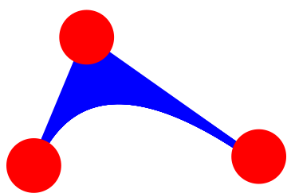

Leaving some calculations to the frontend's side can reduce an overhead from the communication between the frontend and the Kernel and also make your code much cleaner at the same time.

The idea is to reduce the amount of dynamic symbols to the minimum (see [Dynamics](frontend/Dynamics.md)). Let us start with a simples example of a Bezier curves

```mathematica
autoLine[t_, p1_, p2_, p3_] := 
 Line[
  {p1 + t (p2 - p1), p2 + t (p3 - p2)}
 ]
```

To make it *dynamic* we just need to pass our symbols like

```matheamtica
p1 = ...;
p2 = ...;
p3 = ...;

autoLine[t, p1 // Offload, p2 // Offload, p3 // Offload]
```

Imagine if we have many of those lines, and then... __Do we need to define the same number of symbols to control them?__ No, we need just `3` points and the rest can be calculated. Let us bound our `Line` to those 3 and only 3

```mathematica title="optimized version"
autoLine[t_, p1_, p2_, p3_] := 
 Line[
   With[{pc = p2, pi = p1, pf = p3}, 
     {pi + t (pc - pi), pc + t (pf - pc)}
   ] // Offload
 ]

SetAttributes[Line, HoldRest]
```

Here we used a trick with `With` so that `p1, p2, p3` are external symbol bounded to `Line` and will cause its reevaluation, while `pc, pi, pf` entering the list multiple times are just numbers calculated locally.

:::tip
Avoid multiple copies of the same dynamic symbol entering the arguments of the same expression. For example

```mathematica
Line[{Offload[a], Offload[a] + b}]
```

a single change in `a` will cause the reevaluation of `Line` __two times__, while

```mathematica
Line[With[{p = a}, {p, p + b}] // Offload]
```

a single change in `a` will cause the reevaluation of `Line` only __one time__ 👍🏼
:::

The last thing is to generate a list of those curves connected to three draggable points on a graph

```mathematica
curve[p1_, p2_, p3_] := LeakyModule[{pi = p1, pc = p2, pf = p3},
  {
    Blue, Table[autoLine[t, pi, pc, pf], {t, 0, 1, 0.01}],
    PointSize[0.06], Red, 

    EventHandler[Point[pi], {"drag" -> Function[xy, pi = xy]}],
    EventHandler[Point[pc], {"drag" -> Function[xy, pc = xy]}],
    EventHandler[Point[pf], {"drag" -> Function[xy, pf = xy]}]
  }
]
```

Here we used [`LeakyModule`](frontend/Reference/Misc/Language.md#`LeakyModule`), which is just a regular `Module`, but with a disabled garbage collector.

Now lets us draw

```mathematica
curve[{0.2,0.2}, {0.3,0.5}, {0.6,0.1}] // Graphics
```


### A side note
Computations on the frontend side does not cost much. Since everything happens within a browser. One can put many more curves and it would still work perfectly, since all of them are recalculated independently and bounded to __3 symbols__ only


