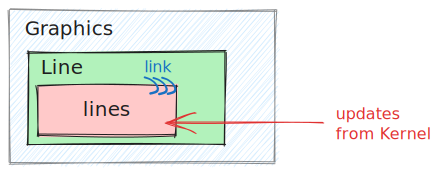

# Performance Tips

## Post processing on frontend
For instance you are passing some symbol `vec` to `Graphics` primitive and would like to change the order of elements or rescale it.

__Good approach__ 👍🏼

```mathematica
vec = {1,1};

Graphics[{
	Arrow[{{0,0}, vec, 2 {vec[[1]], 0.8 vec[[2]]}} // Offload]
}]
```


This will work, but will be slightly inefficient when it comes to large arrays of data or multiple copies of `Arrow`. 

Try to minimize to a single instance of `vec` :

__Best approach__ 👌

```mathematica
vec = {1,1};

Graphics[{
	Arrow[With[{x = vec}, {{0,0}, x, {2 x[[1]], 1.6 x[[2]]}}] // Offload]
}]
```

Then if you set `vec = RandomReal[{0,1}, 2]` it will **only cause 1 revaluation** of `vec` instance.

*Think of an onion from the Shrek movie!*

<details>
<summary>Possible wrong solution</summary>

You might try to do the following ❌

```mathematica
Graphics[{
	With[{x = vec}, Arrow[{{0,0}, x, {2 x[[1]], 1.6 x[[2]]}}]] // Offload
}]
```

It won't work, since the binding between `vec` and `Arrow` isn't possible. `Arrow` simply does not see its outer expressions.

</details>

:::note
The syntax 

```mathematica
{2, 1.6} x }]] // Offload
```

**is not yet supported by WLJS Interpreter**, but absolutely valid for Wolfram Language. Please do **this instead if you place it inside `Offload`**

```mathematica
{2 x[[1]], 1.6 x[[2]]} }]] // Offload
```

:::

## Multiple symbols to 1 primitive
Sometimes you need to controls two parameters at the same time. Then one can write something like this 

```mathematica
Graphics[{
	Disk[pos // Offload, radius // Offload]
}]
```

It will still work, but it depends how you update `pos` and `radius`. If they are completely independent in terms on time it makes sense to couple them to `Disk` equally.

<details>
<summary>Optimization</summary>

However, if you always update `pos` and `radius` **at the same time**, you might rewrite it as follows ✅

```mathematica
Graphics[{
	Disk[pos // Offload, Offload[radius, "Static"->True]]
}]
```

It might be misleading, but here setting a new value to `radius` won't cause re-evaluation of `Disk`. Then you can update two as

```mathematica
radius = newRadius; (* only sync *)
pos = newPos; (* sync + re-evalaution of Disk *)
```

Here order matters, if you flip it `Disk` might still use `radius` values from the previous update (1 step lagging behind `pos`). 

</details>

## Tables of data
You can explicitly choose what will be interpreted on the frontend or backend. There are a few possibilities for our function inside the `Line` expression.

### Full Load on the Kernel ✅
The simplest, universal and robust solution

```mathematica
EventHandler[InputRange[0,4,0.1], Function[data, 
	lines = With[{y = data}, 
		Table[{Cos[x], Sin[y x]}, {x,0,2Pi, 0.01}]
	]
]];
% // EventFire (* Just to initialize *)
```

The last line manually fires an event to initialize the symbol `lines`. Then, for the output, we can write:

```mathematica
Graphics[{Cyan, Line[lines // Offload]}]
```

This binding can be illustrated as shown in the image below:



#### Math operations for free
You can apply any basic operation on the data on the frontend almost for free

```mathematica
Graphics[{Cyan, Line[2 lines // Offload], Line[lines // Offload]}]
```

Then you have two sets of lines, each binds to its own instance of `lines` symbol. It won't cost extra in terms of bandwidth of the communication channel between frontend and backend.

### Using the Frontend
One can move the entire `Table` computation to the browser's side (WLJS Interpreter). Let's discard our previous changes:

```mathematica
EventHandler[InputRange[0,4,0.1], Function[data, 
	v = data
]];
% // EventFire
```

##### Naive Approach 1 ❌
A straightforward solution for output could be:

```mathematica
Graphics[{Cyan, Line[
	Table[{Cos[x], Sin[Offload[v] x]}, {x,0,2Pi, 0.1}]
]}]
```

This would be __a terrible solution__ 👎🏼  


Each time the `Table` iterator `x` goes through the range of values, it creates a sublist of `Sin` and `Cos` functions that contain the dynamic variable `v`. This results in multiple instances of `v`.

:::danger

```mathematica
Line[Table[Expression[Offload[symbol]], {i, 10}]]
```
Creates `10` instances of `symbol`. The `Line` function will be called __10__ times on each update of `symbol`!
:::

:::danger
Avoid placing dynamic symbols inside large `Table` expressions. Minimize the number of copies created.
:::

##### Naive Approach 2 ❌
Let's try to improve it a bit:

```mathematica
Graphics[{Cyan, Line[
	Table[{Cos[x], Sin[v x]}, {x,0,2Pi, 0.1}] // Offload
]}]
```

This is also __inefficient__ 👎🏼  The `Table` function still runs on the __browser's side__ and each time `v` gets an update it re-evaluates the whole table


##### Optimized Version ✅
One can reduce the number of instances to just one using `With`, as shown in the example above:

```mathematica
Graphics[{Cyan, Line[
	With[{y = v}, 
		Table[{Cos[x], Sin[y x]}, {x,0,2Pi, 0.01}]
	] // Offload
  ]
}]
```

This __saves a lot of resources__ 👍🏼  


:::tip
```mathematica
Line[With[{y = symbol}, Table[AnyBasicExpression[y], {i, 10}]]]
```
Creates only 1 instance of `symbol`. The `Line` function will be called __once__ per update of `symbol`.
:::

:::tip
```mathematica
Line[symbol//Offload], ... Line[symbol//Offload]
```
This is acceptable since each `Line` is bound to its own `symbol` instance. Therefore, on an update of `symbol`, each `Line` expression will be reevaluated once.
:::


### A Possible Pitfall with `With`
There might be a temptation to wrap the `Line` expression inside `With`, like this:

```mathematica
Graphics[{Cyan, With[{y = v}, 
	Line[
		Table[{Cos[x], Sin[y x]}, {x,0,2Pi, 0.01}]
	]
] // Offload}]
```

__This will not work at all__ 👎🏼 because the binding will occur between `Graphics` and `v` objects.


*Think of an onion from the Shrek movie!*

## Numeric Arrays
:::info
It is usually done automatically by Wolfram Language if the data has been generated using pure functions with `Map`, `RandomReal`, `Table` and etc.
:::

When transferring points as nested lists, it is better to wrap them in `NumericArray`. This informs the WLJS Interpreter in the browser that only numbers or lists of numbers are expected, reducing the load during parsing.

For example, using [dynamic](frontend/Reference/Interpreter/Offload.md) symbols:

```mathematica
(* Every update *)
symbol = someFunctionThatReturnsList
```

*20 FPS*


By using `NumericArray`:

```mathematica
(* Every update *)
symbol = NumericArray[someFunctionThatReturnsList]
```

*~40 FPS*

