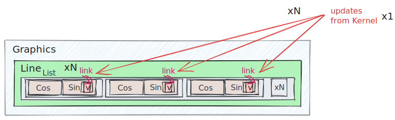
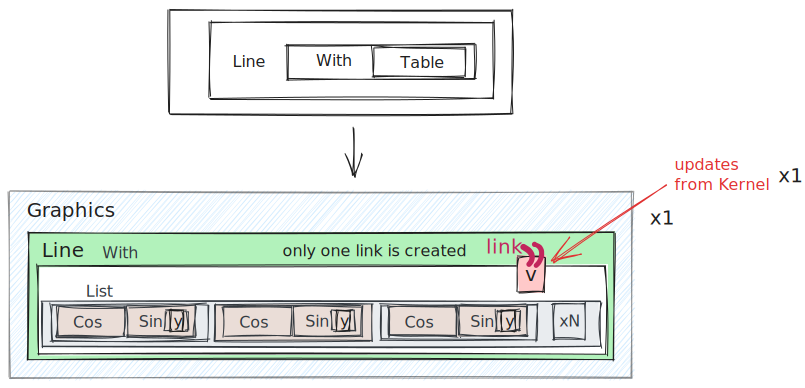
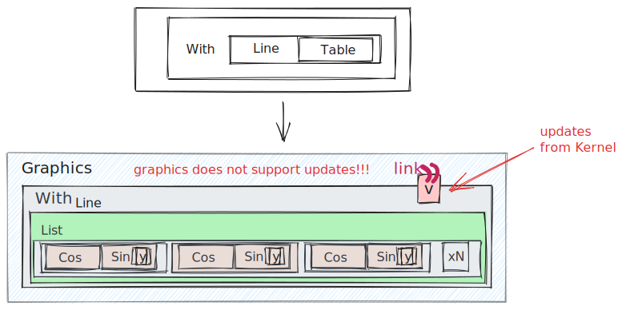

## Performance tips
You can explicitly choose what will be interpreted on the frontend or backend. We have a few possibilities for our function inside `Line` expression

### All load to Kernel
For this one need to change code to

```mathematica
EventHandler[InputRange[0,4,0.1], Function[data, 
	lines = With[{y = data}, 
		Table[{Cos[x], Sin[y x]}, {x,0,2Pi, 0.01}]
	]
]];
% // EventFire (* just to initialize *)
```

The last line manually fires an event to initialize symbol `lines`. Then for the output we can write

```mathematica
Graphics[{Cyan, Line[lines // Offload]}]
```

One can illustrate this binding as on a picture below


### Using frontend
One can move an entire `Table` to the browser's side. Let's discard our changes we made to

```mathematica
EventHandler[InputRange[0,4,0.1], Function[data, 
	v = data
]];
% // EventFire
```

##### Naive approach 1
The obvious solution for output could be

```mathematica
Graphics[{Cyan, Line[
	Table[{Cos[x], Sin[Offload[v] x]}, {x,0,2$Pi$, 0.1}]
]}]
```

That will be __a horrible solution__ 👎🏼  



Imagine, each time `Table` iterator `x` goes through the range of values, it creates a sublist of `Sin` and `Cos` functions, that contains dynamic variable `v`.  Then you end up with many instances of `v`. 

:::danger

```mathematica
Line[Table[Expression[Offload[symbol]], {i, 10}]]
```
Creates `10` instances of `symbol`. `Line` function will be called __10__ times on each update of `symbol`!
:::

:::danger
Do not put dynamic symbols inside large `Table`. Try to minimize the number of its copies made.
:::

##### Naive approach 2
Ok lets try to improve a bit

```mathematica
Graphics[{Cyan, Line[
	Table[{Cos[x], Sin[v x]}, {x,0,2Pi, 0.1}] // Offload
]}]
```

This is also __horrible__ 👎🏼  Symbol `Table` does the same thing being executed on __browser's side as well__


##### Optimized version
One can minimize the number of instances to just 1 using `With`, as it was shown in the example above

```mathematica
Graphics[{Cyan, Line[
	With[{y = v}, 
		Table[{Cos[x], Sin[y x]}, {x,0,2Pi, 0.01}]
	] // Offload
  ]
}]
```

This __will save up a lot of resources__ 👍🏼 



:::tip
```mathematica
Line[With[{y = symbol}, Table[AnyExpression[y], {i, 10}]]]
```
Creates only 1 instance of `symbol`. A `Line` function will be called __1__ time per update of a `symbol`.
:::

:::tip
```mathematica
Line[symbol//Offload], ... Line[symbol//Offload]
```
This is ok, each `Line` is bounded to its own `symbol` instance. Therefore on update of `symbol`, each `Line` expression will be reevaluated once.
:::

### If duplicating is unavoidable
If you have to update two properties of a dynamic expression such as [GraphicsComplex](frontend/Reference/Graphics3D/GraphicsComplex.md) which are `VertexColors` and list of vertices for this example, it is unavoidable to use two [Offload](frontend/Reference/Interpreter/Offload.md) s there

```mathematica
GraphicsComplex[vertices // Offload, {Polygon[triangles]}, "VertexColors"->Offload[colors]]
```

then if later in the code

```mathematica
vertices = ...;
colors = ...;
```

will cause the reevaluation of [GraphicsComplex](frontend/Reference/Graphics3D/GraphicsComplex.md) __two times__ for the same set of data. However, there is a way on how to suppress the second one using options of [Offload](frontend/Reference/Interpreter/Offload.md)

```mathematica
GraphicsComplex[vertices // Offload, {Polygon[triangles]}, "VertexColors"->Offload[colors, "Static"->True]]
```

Here `colors` __will not be bounded to__ `GraphicsComplex`. That results in __only a single reevaluation__ per updates of `colors` and `vertices`. However a new values is going to be read anyway once `vertices` has been updated.

### Possible pitfall with `With`
There might be temptation to wrap `Line` expression inside `With` as well, like that

```mathematica
Graphics[{Cyan, With[{y = v}, 
	Line[
		Table[{Cos[x], Sin[y x]}, {x,0,2Pi, 0.01}]
	]
] // Offload}]
```

__This will not work at all__ 👎🏼 because the binding will occur between `Graphics` and `v` objects



*Think about an onion from the Shrek movie*


## Numeric arrays
When it goes to transfer any points as nested lists, it is better to wrap them into `NumericArray`. It tells WLJS Interpreter on the browser, that we can expect only numbers or lists of numbers, there which reduces the load while parsing them.

For example - [dynamic](frontend/Reference/Interpreter/Offload.md) symbols

```mathematica
(* every update *)
symbol = someFunctionThatReturnsList
```

*20 FPS*


then using `NumericArray`

```mathematica
(* every update *)
symbol = NumericArray[someFunctionThatReturnsList]
```

*~40 FPS*

