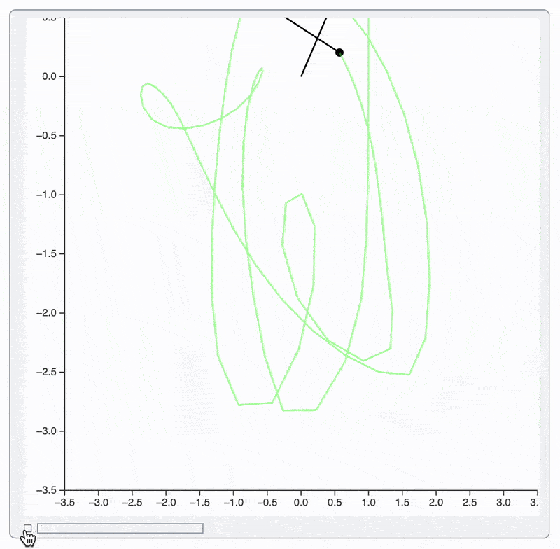
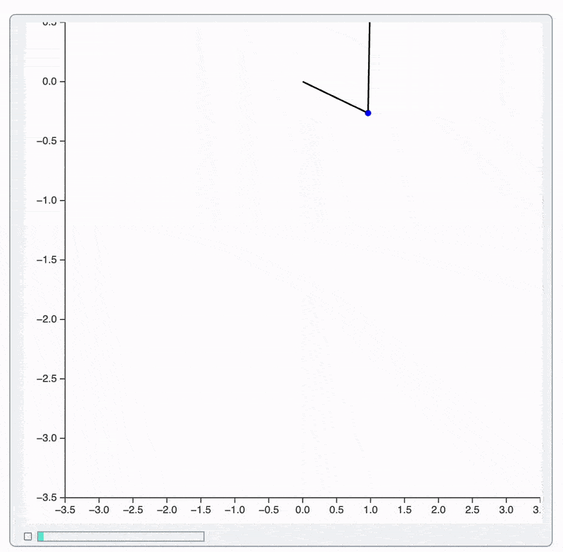
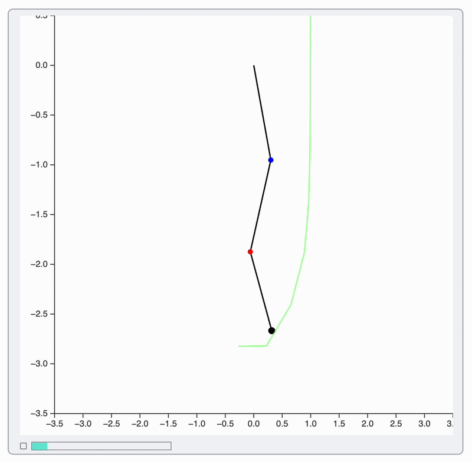

In this section we will learn step by step how to run (and port possibly) and optimize animation code from Wolfram Mathematica to WLJS.

> An example by Peter Tenisheff ([tenishefff@yandex.ru](mailto:tenishefff@yandex.ru))

Here is an original Wolfram Mathematica code of a *triple pendulum*:

*Initialization of variables, equations*

<details>

```mathematica @
ClearAll[g, m, l, timeMax, \[Theta]1, \[Theta]2, \[Theta]3];

g = 9.81;
(*SbB[*)Subscript[m(*|*),(*|*)1](*]SbB*) = 1; (*SbB[*)Subscript[m(*|*),(*|*)2](*]SbB*) = 1; (*SbB[*)Subscript[m(*|*),(*|*)3](*]SbB*) = 1;
(*SbB[*)Subscript[l(*|*),(*|*)1](*]SbB*) = 1; (*SbB[*)Subscript[l(*|*),(*|*)2](*]SbB*) = 1; (*SbB[*)Subscript[l(*|*),(*|*)3](*]SbB*) = 1;
timeMax = 10;


eqns = {
  ((*SbB[*)Subscript[m(*|*),(*|*)1](*]SbB*) + (*SbB[*)Subscript[m(*|*),(*|*)2](*]SbB*) + (*SbB[*)Subscript[m(*|*),(*|*)3](*]SbB*)) (*SpB[*)Power[(*SbB[*)Subscript[l(*|*),(*|*)1](*]SbB*)(*|*),(*|*)2](*]SpB*) \[Theta]1''[t] + ((*SbB[*)Subscript[m(*|*),(*|*)2](*]SbB*) + (*SbB[*)Subscript[m(*|*),(*|*)3](*]SbB*)) (*SbB[*)Subscript[l(*|*),(*|*)1](*]SbB*) (*SbB[*)Subscript[l(*|*),(*|*)2](*]SbB*) \[Theta]2''[t] Cos[\[Theta]1[t] - \[Theta]2[t]] +
  (*SbB[*)Subscript[m(*|*),(*|*)3](*]SbB*) (*SbB[*)Subscript[l(*|*),(*|*)1](*]SbB*) (*SbB[*)Subscript[l(*|*),(*|*)3](*]SbB*) \[Theta]3''[t] Cos[\[Theta]1[t] - \[Theta]3[t]] +
  ((*SbB[*)Subscript[m(*|*),(*|*)2](*]SbB*) + (*SbB[*)Subscript[m(*|*),(*|*)3](*]SbB*)) (*SbB[*)Subscript[l(*|*),(*|*)1](*]SbB*) (*SbB[*)Subscript[l(*|*),(*|*)2](*]SbB*) (*SpB[*)Power[\[Theta]2'[t](*|*),(*|*)2](*]SpB*) Sin[\[Theta]1[t] - \[Theta]2[t]] +
  (*SbB[*)Subscript[m(*|*),(*|*)3](*]SbB*) (*SbB[*)Subscript[l(*|*),(*|*)1](*]SbB*) (*SbB[*)Subscript[l(*|*),(*|*)3](*]SbB*) (*SpB[*)Power[\[Theta]3'[t](*|*),(*|*)2](*]SpB*) Sin[\[Theta]1[t] - \[Theta]3[t]] +
  g ((*SbB[*)Subscript[m(*|*),(*|*)1](*]SbB*) + (*SbB[*)Subscript[m(*|*),(*|*)2](*]SbB*) + (*SbB[*)Subscript[m(*|*),(*|*)3](*]SbB*)) (*SbB[*)Subscript[l(*|*),(*|*)1](*]SbB*) Sin[\[Theta]1[t]] == 0,
  
  ((*SbB[*)Subscript[m(*|*),(*|*)2](*]SbB*) + (*SbB[*)Subscript[m(*|*),(*|*)3](*]SbB*)) (*SpB[*)Power[(*SbB[*)Subscript[l(*|*),(*|*)2](*]SbB*)(*|*),(*|*)2](*]SpB*) \[Theta]2''[t] + ((*SbB[*)Subscript[m(*|*),(*|*)2](*]SbB*) + (*SbB[*)Subscript[m(*|*),(*|*)3](*]SbB*)) (*SbB[*)Subscript[l(*|*),(*|*)1](*]SbB*) (*SbB[*)Subscript[l(*|*),(*|*)2](*]SbB*) \[Theta]1''[t] Cos[\[Theta]1[t] - \[Theta]2[t]] +
  (*SbB[*)Subscript[m(*|*),(*|*)3](*]SbB*) (*SbB[*)Subscript[l(*|*),(*|*)2](*]SbB*) (*SbB[*)Subscript[l(*|*),(*|*)3](*]SbB*) \[Theta]3''[t] Cos[\[Theta]2[t] - \[Theta]3[t]] -
  ((*SbB[*)Subscript[m(*|*),(*|*)2](*]SbB*) + (*SbB[*)Subscript[m(*|*),(*|*)3](*]SbB*)) (*SbB[*)Subscript[l(*|*),(*|*)1](*]SbB*) (*SbB[*)Subscript[l(*|*),(*|*)2](*]SbB*) \[Theta]1'[t]^2 Sin[\[Theta]1[t] - \[Theta]2[t]] +
  (*SbB[*)Subscript[m(*|*),(*|*)3](*]SbB*) (*SbB[*)Subscript[l(*|*),(*|*)2](*]SbB*) (*SbB[*)Subscript[l(*|*),(*|*)3](*]SbB*) (*SpB[*)Power[\[Theta]3'[t](*|*),(*|*)2](*]SpB*) Sin[\[Theta]2[t] - \[Theta]3[t]] +
  g ((*SbB[*)Subscript[m(*|*),(*|*)2](*]SbB*) + (*SbB[*)Subscript[m(*|*),(*|*)3](*]SbB*)) (*SbB[*)Subscript[l(*|*),(*|*)2](*]SbB*) Sin[\[Theta]2[t]] == 0,

  (*SbB[*)Subscript[m(*|*),(*|*)3](*]SbB*) (*SpB[*)Power[(*SbB[*)Subscript[l(*|*),(*|*)3](*]SbB*)(*|*),(*|*)2](*]SpB*) \[Theta]3''[t] + (*SbB[*)Subscript[m(*|*),(*|*)3](*]SbB*) (*SbB[*)Subscript[l(*|*),(*|*)1](*]SbB*) (*SbB[*)Subscript[l(*|*),(*|*)3](*]SbB*) \[Theta]1''[t] Cos[\[Theta]1[t] - \[Theta]3[t]] +
  (*SbB[*)Subscript[m(*|*),(*|*)3](*]SbB*) (*SbB[*)Subscript[l(*|*),(*|*)2](*]SbB*) (*SbB[*)Subscript[l(*|*),(*|*)3](*]SbB*) \[Theta]2''[t] Cos[\[Theta]2[t] - \[Theta]3[t]] -
  (*SbB[*)Subscript[m(*|*),(*|*)3](*]SbB*) (*SbB[*)Subscript[l(*|*),(*|*)1](*]SbB*) (*SbB[*)Subscript[l(*|*),(*|*)3](*]SbB*) (*SpB[*)Power[\[Theta]1'[t](*|*),(*|*)2](*]SpB*) Sin[\[Theta]1[t] - \[Theta]3[t]] -
  (*SbB[*)Subscript[m(*|*),(*|*)3](*]SbB*) (*SbB[*)Subscript[l(*|*),(*|*)2](*]SbB*) (*SbB[*)Subscript[l(*|*),(*|*)3](*]SbB*) (*SpB[*)Power[\[Theta]2'[t](*|*),(*|*)2](*]SpB*) Sin[\[Theta]2[t] - \[Theta]3[t]] +
  g (*SbB[*)Subscript[m(*|*),(*|*)3](*]SbB*) (*SbB[*)Subscript[l(*|*),(*|*)3](*]SbB*) Sin[\[Theta]3[t]] == 0
};

initCond = {
  \[Theta]1[0] == (*FB[*)((\[Pi])(*,*)/(*,*)(2))(*]FB*) - 0.1,
  \[Theta]2[0] == \[Pi],
  \[Theta]3[0] == \[Pi],
  \[Theta]1'[0] == 0,
  \[Theta]2'[0] == 0,
  \[Theta]3'[0] == 0
};

sol = NDSolve[{eqns, initCond}, {\[Theta]1, \[Theta]2, \[Theta]3}, {t, 0, timeMax}] // First;
  
ClearAll[xC, yC];

With[{
  \[Phi]1 = \[Theta]1 /. sol,
  \[Phi]2 = \[Theta]2 /. sol,
  \[Phi]3 = \[Theta]3 /. sol
},

  xC[t_, 1] := (*SbB[*)Subscript[l(*|*),(*|*)1](*]SbB*) Sin[\[Phi]1[t]];
  yC[t_, 1] := -(*SbB[*)Subscript[l(*|*),(*|*)1](*]SbB*) Cos[\[Phi]1[t]];
  xC[t_, 2] := xC[t, 1] + (*SbB[*)Subscript[l(*|*),(*|*)2](*]SbB*) Sin[\[Phi]2[t]];
  yC[t_, 2] := yC[t, 1] - (*SbB[*)Subscript[l(*|*),(*|*)2](*]SbB*) Cos[\[Phi]2[t]];
  xC[t_, 3] := xC[t, 2] + (*SbB[*)Subscript[l(*|*),(*|*)3](*]SbB*) Sin[\[Phi]3[t]];
  yC[t_, 3] := yC[t, 2] - (*SbB[*)Subscript[l(*|*),(*|*)3](*]SbB*) Cos[\[Phi]3[t]];

];

trajectory = Table[{xC[t, 3], yC[t, 3]}, {t, 0, timeMax, 0.05}];
```

</details>

## Optimization
### Step 0
Let's run Mathematica's code for animation directly:

```mathematica
Animate[
    Graphics[
      {
        Thick, Black,
        Line[{{0, 0}, {xC[t, 1], yC[t, 1]}, {xC[t, 2], yC[t, 2]}, {xC[t, 3], yC[t, 3]}}],
        
        Blue, PointSize[0.03], Point[{xC[t, 1], yC[t, 1]}],
        Red, PointSize[0.03], Point[{xC[t, 2], yC[t, 2]}],
        Black, PointSize[0.04], Point[{xC[t, 3], yC[t, 3]}],
        
        {Green, Opacity[0.5], Line[trajectory[[;; Floor[t/0.05] + 1]]]}
      },
      PlotRange -> {{-3.5, 3.5}, {-3.5, 0.5}},
      Axes -> True,
      Background -> White,
      ImageSize -> 500
    ],
    {t, 0, timeMax, 0.05},
    AnimationRate -> 5
]
```



It is slow and shakes, but it works. Here is why:
- each frame a new `Graphics` object is created and copied to the frontend and then evaluated ❌
- each frame creates a new instanced and destroys an old one ❌

This is a huge waste of resources considering that we only need to change a few points and line segments.

### Step 1
As a first step we find what primitives we need to change each frame:
- `Point` x3
- `Line` x2 (one for pendulum segments and one for trajectory)

Then we can image:

```mathematica
{
	...,
	Red, Point[pt1 // Offload],
	Blue, Point[pt2 // Offload], 
	...
}
```

or even better - reduce the number of symbols used:

```mathematica
{
	...,
	Line[{{0,0}, pts[[1]], pts[[2]], pts[[3]]} // Offload],
	Red, Point[pts[[1]] // Offload],
	Blue, Point[pts[[2]] // Offload], 
	...
}
```

To prevent `Animate` from reevaluation of the whole `Graphics` expression we provide a custom `"UpdateFunction"`, which overrides the default behavior and update only our `pts` symbol:

```mathematica
Module[{pts, track},
  Animate[
    Graphics[
      {
        Thick, Black,
        Line[{{0,0}, pts[[1]], pts[[2]], pts[[3]]} // Offload],
        
        Blue, PointSize[0.03], Point[pts[[1]] // Offload],
        Red, PointSize[0.03], Point[pts[[2]] // Offload],
        Black, PointSize[0.04], Point[pts[[3]] // Offload],
        
        {Green, Opacity[0.5], Line[track // Offload]}
      },
      PlotRange -> {{-3.5, 3.5}, {-3.5, 0.5}},
      Axes -> True,
      Background -> White,
      ImageSize -> 500
    ],
    {t, 0, timeMax, 0.05},
    "UpdateFunction" -> Function[t,
      track = trajectory[[;; Floor[t/0.05] + 1]];
      pts = Table[{xC[t, i], yC[t, i]}, {i,3}];
      False
    ],
    AnimationRate -> 30
  ]
]
```



Note, that we also increased a frame rate up-to 30. This works much smoother because:
- `Graphics` expression stays and does not change ✅
- Only `Line` and `Point` are updated ✅


### Step 3
You may noticed an odd-looking shaking of a trajectory on the background. It is a side-effect of interpolation enabled by the default on [Graphics](frontend/Reference/Graphics/Graphics.md). It makes all transitions even smoother (60 or 120 FPS), but cannot handle properly `Line` with variable number of segments.

One can disable the transition animation completely by setting an option:

```mathematica
Graphics[..., TransitionType -> None]
```

This might give a performance boost in the case of a very fast animations (where the frame rate is close to 30). 

Another way is to disable it __only__ for `Line` primitive using `Directive`:

```mathematica
Module[{pts, track},
  Animate[
    Graphics[
      {
        Thick, Black,
        Line[{{0,0}, pts[[1]], pts[[2]], pts[[3]]} // Offload],
        
        Blue, PointSize[0.03], Point[pts[[1]] // Offload],
        Red, PointSize[0.03], Point[pts[[2]] // Offload],
        Black, PointSize[0.04], Point[pts[[3]] // Offload],
        
        {Green, Opacity[0.5], Directive[TransitionType->None], 
        Line[track // Offload]}
      },
      PlotRange -> {{-3.5, 3.5}, {-3.5, 0.5}},
      Axes -> True,
      Background -> White,
      ImageSize -> 500
    ],
    {t, 0, timeMax, 0.05},
    "UpdateFunction" -> Function[t,
      track = trajectory[[;; Floor[t/0.05] + 1]];
      pts = Table[{xC[t, i], yC[t, i]}, {i,3}];
      False
    ],
    AnimationRate -> 30
  ]
]
```



As a result:
- Points and segments of a pendulum interpolated to get extra frames ✅
- Background trajectory line is updated as it is ✅
