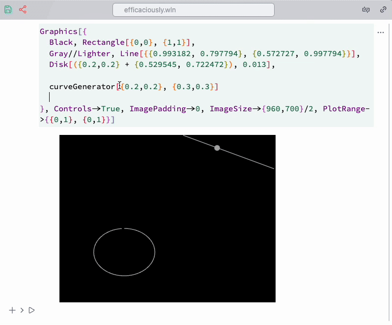
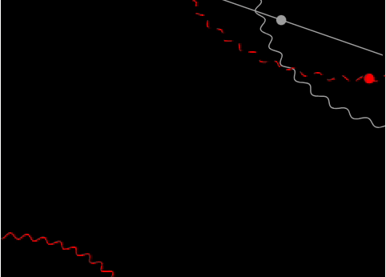

Imagine we want to recreate this background used in some presentation


From the first sight, it looks like a few circles with a huge radius with dashed lines and three [Disk](frontend/Reference/Graphics/Disk.md) s. To program this manually would be cumbersome, however, we can create our own tools for this specific task in a few lines.

### Placing objects
Here we use [Navigation gizmo](frontend/Command%20palette.md#Navigation%20gizmo) to assist us in placing straight lines and disks

```mathematica @
Graphics[{
  Black, Rectangle[{0,0}, {1,1}], Gray//Lighter, 
  
  Line[{(*BB[*)({0,0})(*,*)(*"1:eJxTTMoPSmNkYGAoZgESHvk5KRAeB5AILqnMSXXKr0hjgskHleakFnMBGU6JydnpRfmleSlpzDDlQe5Ozvk5+UVFDGDwwR6dwcAAAAHdFiw="*)(*]BB*), (*BB[*)({1,1})(*,*)(*"1:eJxTTMoPSmNkYGAoZgESHvk5KRAeB5AILqnMSXXKr0hjgskHleakFnMBGU6JydnpRfmleSlpzDDlQe5Ozvk5+UVFDGDwwR6dwcAAAAHdFiw="*)(*]BB*)}], 
  Disk[({0.2,0.2} + (*BB[*)({0.1,0.1})(*,*)(*"1:eJxTTMoPSmNkYGAoZgESHvk5KRAeB5AILqnMSXXKr0hjgskHleakFnMBGU6JydnpRfmleSlpzDDlQe5Ozvk5+UVFDGDwwR6dwcAAAAHdFiw="*)(*]BB*))//Offload, 0.013]

}, ImagePadding->0, ImageSize->{960,700}/2, PlotRange->{{0,1}, {0,1}}]
```

then select the highlighted regions and run in the command palette `navigation ...` on the selected 


It is better to add offsets to the positions, like we did with `Disk`

```mathematica @
({0.2,0.2} + (*BB[*)({0.1,0.1})(*,*)(*"1:eJxTTMoPSmNkYGAoZgESHvk5KRAeB5AILqnMSXXKr0hjgskHleakFnMBGU6JydnpRfmleSlpzDDlQe5Ozvk5+UVFDGDwwR6dwcAAAAHdFiw="*)(*]BB*))//Offload
```

then your navigation gizmo will not overlap with an actual graphics primitives you are positioning. 

### Parameterized curves
Let us have a look at some curves

*a prototype for circles*
```mathematica
curveGenerator[pt1_, pt2_] := Line[With[{
  radius = pt1,
  pos = pt2
},
  Table[Norm[pos - radius]{Sin[i], Cos[i]} + pos, {i, 0, 2Pi, 0.1}]
] // Offload]
```

what it does, it will produce a circle defined by two points. The feature here is it accepts any symbol as `pt1` / `pt2` including [dynamic one](frontend/Dynamics.md). Since all internals of [Line](frontend/Reference/Graphics3D/Line.md) including `Table` is wrapped into [Offload](frontend/Reference/Interpreter/Offload.md) it will be calculated directly on the frontend (aka WLJS Interpreter), while Wolfram Kernel only provides the values for those two control points.

To assist us, one can use [Navigation gizmo](frontend/Command%20palette.md#Navigation%20gizmo) snippet form the command line palette, which automatically generates temporal dynamic symbol and a gizmo for it

```mathematica @
Graphics[{
  Black, Rectangle[{0,0}, {1,1}],
  Gray//Lighter, Line[{{0.993182, 0.797794}, {0.572727, 0.997794}}], 
  Disk[({0.2,0.2} + {0.529545, 0.722472}), 0.013],

  curveGenerator[(*BB[*)({0.2,0.2})(*,*)(*"1:eJxTTMoPSmNkYGAoZgESHvk5KRAeB5AILqnMSXXKr0hjgskHleakFnMBGU6JydnpRfmleSlpzDDlQe5Ozvk5+UVFDGDwwR6dwcAAAAHdFiw="*)(*]BB*), (*BB[*)({0.3,0.3})(*,*)(*"1:eJxTTMoPSmNkYGAoZgESHvk5KRAeB5AILqnMSXXKr0hjgskHleakFnMBGU6JydnpRfmleSlpzDDlQe5Ozvk5+UVFDGDwwR6dwcAAAAHdFiw="*)(*]BB*)]
  
}, Controls->True, ImagePadding->0, ImageSize->{960,700}/2, PlotRange->{{0,1}, {0,1}}]
```

apply it from the command palette to selected as it is demonstrated on a GIF below



Once we placed all objects, why not to animate them as well?

### Animation
For this case we need to alter `curveGenerator` a little bit

```mathematica
ClearAll[curveGenerator];

curveGenerator[radius_, center_, dashed_:False] := With[{
  cell = ResultCell[]
}, LeakyModule[{
  pts = Table[Norm[center - radius] {Sin[i], Cos[i]} +
         center, {i, 0, 2 Pi + 0.1, 0.1}],
  pt = {10,10},
  modulation = 0.,
  phase = 0.,
  task
}, 

  EventHandler[cell, {
    "Destroy" -> Function[Null, Print["Destroy"]; TaskRemove[task]]
  }];

  task = SetInterval[
      pts = Table[(Norm[center - radius] + 0.02 modulation Sin[50. i + 30 phase]) {Sin[i], Cos[i]} +
         center, {i, 0, 2 Pi + 0.1, 0.01}];

         pt = With[{i = 3. phase},(Norm[center - radius] + 0.01 modulation Sin[50. i + 30 phase]) {Sin[i], Cos[i]} +
         center];

      phase = phase + 0.02;
      modulation = Sin[phase/2];
  , 100];  
  
  If[dashed // TrueQ, 
  
    {SVGAttribute[Line[pts // Offload],"stroke-dasharray"->"10"], Disk[pt // Offload, 0.013]} 
  ,
  
    {Line[pts // Offload], Disk[pt // Offload, 0.013]} 
  ]
] ]

```

Now it uses [`SetInterval`](frontend/Reference/Misc/Async.md#`SetInterval`) to animate the curves with `100 ms` interval and removes the task if an output cell got destroyed. If we put all together as follows

```mathematica
Graphics[{
  Black, Rectangle[{0,0}, {1,1}],
  Gray//Lighter, Line[{{0.993182, 0.797794}, {0.572727, 0.997794}}], 
  Disk[({0.2,0.2} + {0.529545, 0.722472}), 0.013],
  
  curveGenerator[{0.990909, 0.545221}, {1.19545, 1.03346}, False], 
  Red, curveGenerator[{0.584091, 0.861075}, {0.934091, 1.19931}, True],
  curveGenerator[{0.305086, -0.0154444}, {0.00942938, -0.189671}, False]
  
}, Controls->True, ImagePadding->None, ImageSize->{960,700}/2, PlotRange->{{0,1}, {0,1}}]
```

we will get a nice animation for a title slide of your presentation



You can also play with an interval and [TransitionDuration](frontend/Reference/Graphics/TransitionDuration.md) option of [Graphics](frontend/Reference/Graphics/Graphics.md) to get smoother animation. 