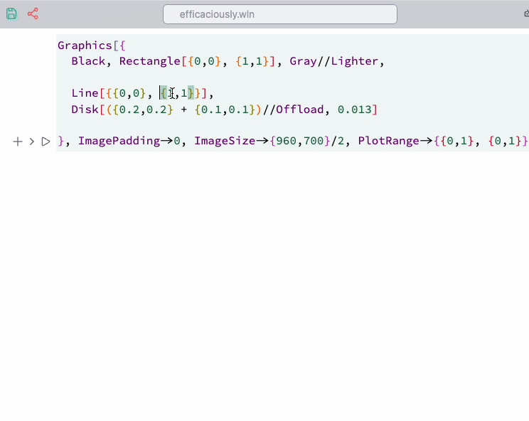

Imagine we want to recreate this background used in a presentation:


At first glance, it looks like a few circles with a large radius, dashed lines, and three [Disk](frontend/Reference/Graphics/Disk.md) elements. Programming this manually would be cumbersome. However, we can create our own tools for this specific task in just a few lines.

### Placing Objects
We use the [Navigation gizmo](frontend/Command%20palette.md#Navigation%20gizmo) to assist in placing straight lines and disks.

```mathematica @
Graphics[{
  Black, Rectangle[{0,0}, {1,1}], Gray//Lighter, 
  
  Line[{(*BB[*)({0,0})(*,*)(*"1:eJxTTMoPSmNkYGAoZgESHvk5KRAeB5AILqnMSXXKr0hjgskHleakFnMBGU6JydnpRfmleSlpzDDlQe5Ozvk5+UVFDGDwwR6dwcAAAAHdFiw="*)(*]BB*), (*BB[*)({1,1})(*,*)(*"1:eJxTTMoPSmNkYGAoZgESHvk5KRAeB5AILqnMSXXKr0hjgskHleakFnMBGU6JydnpRfmleSlpzDDlQe5Ozvk5+UVFDGDwwR6dwcAAAAHdFiw="*)(*]BB*)}], 
  Disk[({0.2,0.2} + (*BB[*)({0.1,0.1})(*,*)(*"1:eJxTTMoPSmNkYGAoZgESHvk5KRAeB5AILqnMSXXKr0hjgskHleakFnMBGU6JydnpRfmleSlpzDDlQe5Ozvk5+UVFDGDwwR6dwcAAAAHdFiw="*)(*]BB*))//Offload, 0.013]

}, ImagePadding->0, ImageSize->{960,700}/2, PlotRange->{{0,1}, {0,1}}]
```

Then, select the highlighted regions and run `navigation ...` from the command palette.



It is better to add offsets to the positions, like we did with `Disk`:

```mathematica @
({0.2,0.2} + (*BB[*)({0.1,0.1})(*,*)(*"1:eJxTTMoPSmNkYGAoZgESHvk5KRAeB5AILqnMSXXKr0hjgskHleakFnMBGU6JydnpRfmleSlpzDDlQe5Ozvk5+UVFDGDwwR6dwcAAAAHdFiw="*)(*]BB*))//Offload
```

This prevents the navigation gizmo from overlapping with the actual graphic primitives being positioned.

### Parameterized Curves
Let’s examine some curves.

*A prototype for circles:*

```mathematica
curveGenerator[pt1_, pt2_] := Line[With[{
  radius = pt1,
  pos = pt2
},
  Table[Norm[pos - radius]{Sin[i], Cos[i]} + pos, {i, 0, 2Pi, 0.1}]
] // Offload]
```

This function produces a circle defined by two points. The key feature is that it accepts any symbol as `pt1` / `pt2`, including [dynamic ones](frontend/Dynamics.md). Since all internals of [Line](frontend/Reference/Graphics3D/Line.md), including `Table`, are wrapped in [Offload](frontend/Reference/Interpreter/Offload.md), the calculation occurs directly on the frontend (WLJS Interpreter), while the Wolfram Kernel only provides values for the control points.

To assist with placement, use the [Navigation gizmo](frontend/Command%20palette.md#Navigation%20gizmo) snippet from the command palette. It automatically generates a temporary dynamic symbol and a gizmo for it:

```mathematica @
Graphics[{
  Black, Rectangle[{0,0}, {1,1}],
  Gray//Lighter, Line[{{0.993182, 0.797794}, {0.572727, 0.997794}}], 
  Disk[({0.2,0.2} + {0.529545, 0.722472}), 0.013],

  curveGenerator[(*BB[*)({0.2,0.2})(*,*)(*"1:eJxTTMoPSmNkYGAoZgESHvk5KRAeB5AILqnMSXXKr0hjgskHleakFnMBGU6JydnpRfmleSlpzDDlQe5Ozvk5+UVFDGDwwR6dwcAAAAHdFiw="*)(*]BB*), (*BB[*)({0.3,0.3})(*,*)(*"1:eJxTTMoPSmNkYGAoZgESHvk5KRAeB5AILqnMSXXKr0hjgskHleakFnMBGU6JydnpRfmleSlpzDDlQe5Ozvk5+UVFDGDwwR6dwcAAAAHdFiw="*)(*]BB*)]
}, Controls->True, ImagePadding->0, ImageSize->{960,700}/2, PlotRange->{{0,1}, {0,1}}]
```

Apply it from the command palette to the selection, as shown below:


Once we have placed all objects, why not animate them?

### Animation
To animate the curves, we need to modify `curveGenerator` slightly:

```mathematica
ClearAll[curveGenerator];

curveGenerator[radius_, center_, dashed_:False] := With[{
  cell = ResultCell[]
}, LeakyModule[{
  pts = Table[Norm[center - radius] {Sin[i], Cos[i]} +
         center, {i, 0, 2 Pi + 0.1, 0.1}],
  pt = {10,10},
  modulation = 0.,
  phase = 0.,
  task
}, 

  EventHandler[cell, {
    "Destroy" -> Function[Null, Print["Destroy"]; TaskRemove[task]]
  }];

  task = SetInterval[
      pts = Table[(Norm[center - radius] + 0.02 modulation Sin[50. i + 30 phase]) {Sin[i], Cos[i]} +
         center, {i, 0, 2 Pi + 0.1, 0.01}];

         pt = With[{i = 3. phase},(Norm[center - radius] + 0.01 modulation Sin[50. i + 30 phase]) {Sin[i], Cos[i]} +
         center];

      phase = phase + 0.02;
      modulation = Sin[phase/2];
  , 100];  
  
  If[dashed // TrueQ, 
    {SVGAttribute[Line[pts // Offload],"stroke-dasharray"->"10"], Disk[pt // Offload, 0.013]} 
  ,
    {Line[pts // Offload], Disk[pt // Offload, 0.013]} 
  ]
] ]
```

Now, using [`SetInterval`](frontend/Reference/Misc/Async.md#`SetInterval`), the curves animate at `100 ms` intervals and remove the task if the output cell is destroyed.

By putting everything together, we achieve a smooth animated title slide for your presentation.


You can experiment with the interval and the [TransitionDuration](frontend/Reference/Graphics/TransitionDuration.md) option of [Graphics](frontend/Reference/Graphics/Graphics.md) for smoother animation.