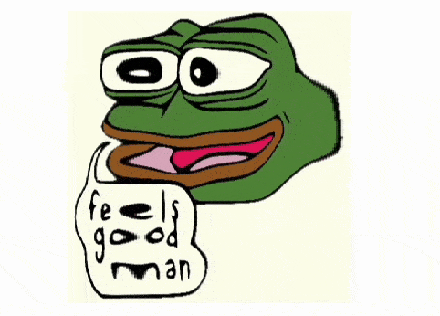

:::warning
Raster graphics is not well optimized on WLJS Notebook for now. Consider to use it as rarely as possible.
:::

All raster graphics is rendered using [Image](frontend/Reference/Image/Image.md) expression, which also supports dynamic updates using [Offload](frontend/Reference/Interpreter/Offload.md) expression.

Let us start from the practical example - __image distortion__


*Yandex Open Source Jam 2024*

or this one


*[Stackoverflow](https://stackoverflow.com/questions/36174431/how-to-make-a-wave-warp-effect-in-shader) OpenGL*

### Implementation
Let us take an example image firstly. Drag and drop it to an editor 


and take a raw data from it as a sequence of bytes

```mathematica
img = ImageData[(* image *), "Byte"];
```

Now we can apply map function to it, which stretches and shrinks pixels periodically

```mathematica
shader = Compile[{{img, _Integer, 3}, {phase, _Real}}, Module[{iter},
  With[{
    ysize = Length[img],
    xsize = Length[img[[1]]]
  },
    Table[
    iter = 1.0;
    Table[With[{
      yr = y,
      xr = If[# < 1, 1, If[# > xsize, xsize, #]] &@ Round[iter]
    },

      iter = iter + (1.0 + 0.7 Sin[6 Pi x / xsize + phase]);

      img[[yr, xr]]
      
      
    ],  {x, xsize}], {y, ysize}] 
  ]
]];
```

Here we use `Compile` to speed the process up, since there are only real arrays are involved. We do not apply any antialiasing filters, it does it in the nearest neighbors approximation. Let's check the result using the original `Byte` encoding

```mathematica
Image[NumericArray[shader[img, 0], "UnsignedInteger8"], "Byte"] 
```


:::tip
Always provide a typed numeric array as a first argument to [Image](frontend/Reference/Image/Image.md). By the default it assumes `Real` format of pixels data. Therefore we explicitly tell the encoding by sending `Byte` as a second argument.

The most efficient way is to use
- `UnsignedInteger8` : `Byte`

:::

Since a performance is it great with raster graphics, we can rely on fixed time intervals while animating or a straight `Do` loop

```mathematica title="cell 1"
imageFrame = NumericArray[img, "UnsignedInteger8"];
Image[imageFrame // Offload, "Byte"]
```

```mathematica title="cell 2"
Do[
  imageFrame = NumericArray[shader[img, angle], "UnsignedInteger8"];
, {angle, 0, 4Pi, 2Pi/30.0}]
```

The resulting animation


