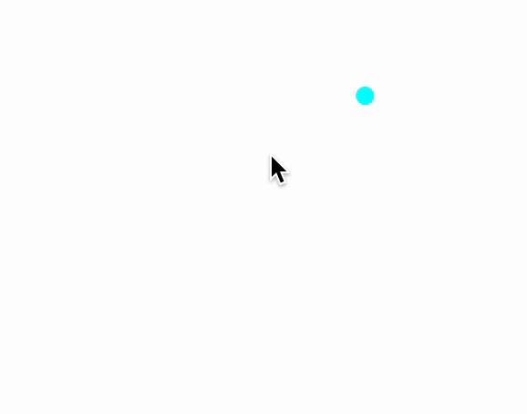

In this section, we discuss ways in which a user can interact with dynamic elements, providing different types of input.

## UI Elements
A core package [wljs-inputs](https://github.com/JerryI/wljs-inputs/) provides a set of basic UI elements used for creating buttons, sliders, text-fields and etc. 

:::info
If you need a custom element, you can create it right from the notebook using [WLX](frontend/Cell%20types/WLX.md) or [Javascript](frontend/Cell%20types/Javascript.md) cell types. Please see the guide [Emitting events](frontend/Advanced/Javascript/Communication.md#Emitting%20events)
:::

The following elements are available from out of the box:

- [InputButton](frontend/Reference/GUI/InputButton.md)
- [InputRange](frontend/Reference/GUI/InputRange.md)
- [InputText](frontend/Reference/GUI/InputText.md)
- [InputSelect](frontend/Reference/GUI/InputSelect.md)
- [InputTable](frontend/Reference/GUI/InputTable.md)
- [InputFile](frontend/Reference/GUI/InputFile.md)
- [InputCheckbox](frontend/Reference/GUI/InputCheckbox.md)
- [InputEditor](frontend/Reference/GUI/InputEditor.md)
- [InputJoystick](frontend/Reference/GUI/InputJoystick.md)

and for grouping elements

- [InputGroup](frontend/Reference/GUI/InputGroup.md)

#### Examples
Each standard input element is [`EventObject`](frontend/Reference/Misc/Events.md#`EventObject`), to which you can assign any handler function. You don't necessarily  need to assign it to a variable, i.e. (see [InputButton](frontend/Reference/GUI/InputButton.md))

```mathematica
EventHandler[InputButton["Click"], Beep]
```

is fine as well as

```mathematica
btn = InputButton["Click"];
EventHandler[btn, Beep];

btn
```

Here is some other examples

```mathematica
EventHandler[InputRange[0,1,0.1], Function[value, radius = value]]
% // EventFire; (* just to initialize `radius` *)

Graphics[{LightBlue, Disk[], Pink, Disk[{0,0}, radius // Offload]}]
```


:::tip
Apply `EventFire` on any `EventObject` to manually fire an event with a default value to initialize your variables (if needed).
:::

You can also add a label to a [InputRange](frontend/Reference/GUI/InputRange.md) 

```mathematica
InputRange[0,1,0.1, "Label"->"Radius"]
```

and initial value as a third argument

```mathematica
InputRange[0,1,0.1, 0.7, "Label"->"Radius"]
```

Here is an example on [InputSelect](frontend/Reference/GUI/InputSelect.md)

```mathematica
angle = 45 Degree;
EventHandler[InputSelect[{Pi/2 -> "90",  Pi/4 -> "45",  0 -> "0"}, Pi/4], Function[value, angle = value]]

Graphics[{Rotate[Rectangle[{0,0}, {1,1}], angle // Offload]}]
```


Here is a simple text-input

```mathematica
text = "Example";
EventHandler[InputText[], Function[value, text = value]]

Graphics[Table[{
  Hue[i/10., 1.,1.], Rotate[Text[Style[text // Offload, FontSize->RandomInteger[{12,24}]], RandomReal[{-1,1}, 2]], RandomChoice[{Pi, Pi/4, Pi/2, 0}]]
}, {i, 10}]]
```


#### Grouping input elements
If you need to make just visually, then consider to use [Grid](frontend/Reference/Decorations/Grid.md), [[Row]] or [Column](frontend/Reference/Decorations/Column.md), i.e.

```mathematica
slider = InputRange[0,1,0.1]; 
button = InputButton[];

{slider, button} // Column 
```


There is another way of grouping on the level of events using [InputGroup](frontend/Reference/GUI/InputGroup.md)

```mathematica
slider = InputRange[0,1,0.1]; 
button = InputButton[];

joined = InputGroup[<|"Button"->button, "Slider"->slider|>, "Label"->"Group"];
EventHandler[joined, Print]
```


It merges an association (as in example above) or list of `EventObjects` into a new one. You do not need to assign separate `EventHandler` for each, instead __you need only one__ `joined`. It fires an event keeping the original form of used association or list 

```mathematica title="payload"
<|"Slider"->0.5, "Button"->True|>
```


#### Join different events
One can also merge event objects underneath of UI elements using `Join`. Let us have a look at the simples example

```mathematica
button = InputButton[]
slider = InputRange[0,1,0.1]

EventHandler[Join[button, slider], Function[data,
	Print[data]
]];
```

As a result you will get something like this

```mathematica
True
```
 
 or
 
```mathematica
0.5
```

depending which element it generated. In order to resolve this issue, one can utilize patterns (or topics see [`EventObject`](frontend/Reference/Misc/Events.md#`EventObject`))

```mathematica
button = InputButton["Topic"->"Button"]
slider = InputRange[0,1,0.1, "Topic"->"Slider"]

EventHandler[Join[button, slider], {type_ :> Function[data,
	Print[type<>":"<>ToString[data]]
]}];
```

or capture them individually

```mathematica
button = InputButton["Topic"->"Button"]
slider = InputRange[0,1,0.1, "Topic"->"Slider"]

EventHandler[Join[button, slider], {
	"Button" -> Beep,
	"Slider" -> Print
}];
```

A slider will print a message, while a button will make *beep* sound.

#### Chaining events
Most of GUI elements do support chaining, when each of them reuse the same `EventObject`. It comes as a first argument

```mathematica
ev = EventObject[];

InputButton[ev, "Topic"->"Button"]
InputRange[ev, 0,1,0.1, "Topic"->"Slider"]

EventHandler[ev, {
	"Button" -> Beep,
	"Slider" -> Print
}];
```

In such case, there is no need in creating new events and joining them. In the end this approach leaves less footprint as well as less overhead to the system.


## 2D Graphics
Some of the primitives as well as entire canvas support `EventHandler` method. Let us start with `Graphics` itself

### Graphics as an event generator
You can attach event handlers to `Graphics` expression, which represents the given SVG container of your 2D graph

It has some benefits compared to [Primitives](#Primitives), namely `"mousemove"` or `"click"` will be captured even if there are some objects on the front. The following patterns (topics of [`EventHandler`](frontend/Reference/Misc/Events.md#`EventHandler`)) are supported

- `"keydown"` will capture the focus of the window once a user click on it
- `"capturekeydown"` will capture the focus of the window and prevent page scrolling
- `"mousemove"` will capture a mouse position
- `"click"` captures clicks and sends the position (no alt key pressed)
- `"altclick"` captures clicks (with held alt key)

For example

```mathematica
pt = {};
EventHandler[
	Graphics[{
		PointSize[0.05], Blue, Opacity[0.5],
		Point[pt // Offload]
	}, PlotRange->{{-1,1}, {-1,1}}]
,
	{
		"mousemove" -> Function[xy, pt = Append[pt, xy]]
	}
]
```


#### Alternative way
There is an alternative way of assigning a handler

```mathematica
pt = {};
Graphics[{
	PointSize[0.05], Blue, Opacity[0.5],
	Point[pt // Offload],
	EventHandler[Null, {
		"mousemove" -> Function[xy, pt = Append[pt, xy]]
	}]
}, PlotRange->{{-1,1}, {-1,1}}]
```

When `EventHandler` has `Null` argument it forces it to connect to the nearest parent. In a the similar fashion one can attach it using `Epilog` or `Prolog`

### Primitives
For some of graphics primitives it is possible to attach `EventHandler` as well. The following symbols are supported

- [Point](frontend/Reference/Graphics/Point.md)
- [Disk](frontend/Reference/Graphics/Disk.md)
- [Rectangle](frontend/Reference/Graphics/Rectangle.md)

which can accept the following pattern to capture events

- `"drag"` make a primitive draggable and sends coordinates
- `"dragall"` the same as previous, but submits events, when dragging was initiated and finished as well
- `"click"` sends coordinates, where a click was captured (no held Alt key)
- `"altclick"` the same as previous, but with held Alt key
- `"mousedown"` captured event on press and sends the coordinates
- `"mouseup"` captures event on release
- `"mousemove"` captures mouse position
- `"mouseover"` captures mouse position once it is entered the element's area
- `"zoom"` captures mouse wheel

For example, combining `"zoom"` and `"drag"`, one perform a manual fitting of some gaussian curves

```mathematica @
getGauss[x0_, A_, width_] := (
  Table[{x, A (*SpB[*)Power[E(*|*),(*|*)-(*FB[*)(((*SpB[*)Power[(x-x0)(*|*),(*|*)2](*]SpB*))(*,*)/(*,*)(2 ((*SpB[*)Power[width(*|*),(*|*)2](*]SpB*))))(*]FB*)](*]SpB*) }, {x,-1,1,0.01}] // Quiet
);
getGauss[{x0_, A_}, width_] := getGauss[x0, A, width];
getGauss[{x0_, A_, width_}] := getGauss[x0, A, width];
```

```mathematica @
LeakyModule[{line, initial},
 initial = {-0.2,0.8,0.1};
 line = getGauss[initial];

 Graphics[{
   Red, PointSize[0.1], 
   EventHandler[
     Point[initial[[1;;2]]]
   , {
      "drag"->Function[c, initial[[1;;2]] = c; line = getGauss[initial]],
      
      "zoom"->Function[k, initial[[3]] = k/10.0; line = getGauss[initial]]
     }],
  
   Cyan, Line[line // Offload]
 }, PlotRange->{{-1,1},{0,1}}, Axes->{True, False}]
]
```

*try to move a mouse wheel on a red dot and then drag it*


In principle using a large white rectangle with `mousemove` pattern, once can build a simple mouse follower

```mathematica
pt = {0,0};
Graphics[{
	White,
	EventHandler[
		Rectangle[{-2,-2}, {2,2}],
		{"mousemove"->Function[xy, pt = xy]}
	],
	PointSize[0.05], Cyan,
	Point[pt // Offload]
}]
```

*a mouse follower*




## 3D Graphics
For now event listeners in [Graphics3D](frontend/Reference/Graphics3D/Graphics3D.md) are quite limited. 

### Primitives
The following primitives support `EventHandler` methods

- [Sphere](frontend/Reference/Graphics3D/Sphere.md)

which can be used with patterns

- `"transform"` makes an object draggable and sends an association with `"position"` field

For example it comes handy while working with dynamic lighting system

```mathematica
point = {1,1,1};

Graphics3D[{Shadows[True], 
  Polygon[{{-5, 5, -1}, {5, 5, -1}, {5, -5, -1}, {-5, -5, -1}}], White, 
  Cuboid[{-1, -1, -1}, {1, 1, 1}], Shadows[False], 
  PointLight[Red, {1.5075, 4.1557, 2.6129}, 100], 
  Shadows[True], SpotLight[Cyan, point // Offload]
  
  EventHandler[Sphere[point, 0.1], {
    "transform" -> Function[assoc, point = assoc["position"]]
  }] 
  
}, "Lighting" -> None]
```


