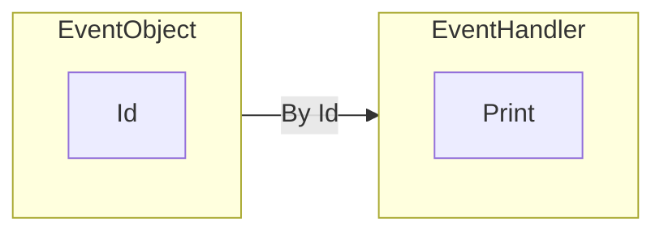
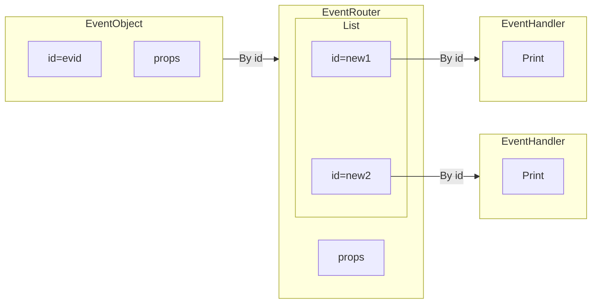
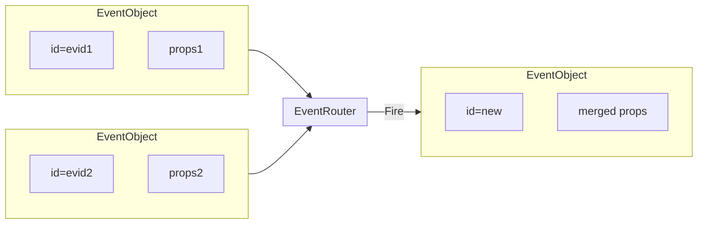

# Event System

### Where You Can Use Event Handlers

- On `Graphics2D` elements to listen for user interactions:
  - `drag`, `click`, `zoom`, `mousemove`, ...
- On `Graphics3D` elements:
  - `transform`
- On any `EventObject` or its string equivalent
- Many more — see [Mouse and Keyboard](frontend/Advanced/Events%20system/Mouse%20and%20keyboard.md)

The event-driven approach is inspired by JavaScript and NodeJS, where one can subscribe to changes in any object. Here, it is expanded to utilize the full power of Wolfram Language's pattern-matching features.

:::tip
See the reference section: [Events](frontend/Reference/Misc/Events.md)
:::

## Thumb Rule
**One event object** — **one handler function**

```mathematica
ev = EventObject[]
EventHandler[ev, Print]
```

i.e.



To fire the event:
```mathematica
EventFire[ev, "Hello World!"];
```

To remove the handler from the event object, use:
```mathematica
Delete[ev]
```
Or the more universal:
```mathematica
EventRemove[ev]
```
This deletes the handler function but not the `EventObject`.

:::tip
To assign more event handlers, you need to **clone the event object** or use a different pattern on the same event object (see [Pattern Matching](#pattern-matching)).
:::

### String Equivalent
Since binding is based solely on the `"Id"` field, one can omit the `EventObject` head:

```mathematica
ev = "evid";
EventHandler[ev, Print]
```
Is equivalent to:
```mathematica
ev = EventObject[<|"Id" -> "evid"|>]
EventHandler[ev, Print]
```

## Pattern Matching
An event can carry additional information using Wolfram Language patterns. This allows messages to be distributed across different handler functions based on the type of event fired. Using standard pattern-matching syntax with `Rule` and `RuleDelayed`, you can write more specific handler functions:

```mathematica
EventHandler["evid", {
	"Topic" -> Function[data,
		Echo["Topic::"];
		Echo[data];
	],
	any_String :> Function[data,
		Echo[StringJoin[any, "::"]];
		Echo[data];
	]	
}];
```

To fire an event for a specific pattern, add an extra argument:
```mathematica
EventFire["evid", "Topic", "Hi!"];
EventFire["evid", "Whatever", "Hi!"];
```

Pattern matching is not limited to strings:
```mathematica
EventHandler["evid", {
	_Abrakadabra -> Function[Null,
		Echo["Got it!"];
	],
	_ -> Function[Null,
		Echo["Wrong one"];
	]
}];

EventFire["evid", Abrakadabra[], Null]
```

Note that the following are effectively the same:
```mathematica
EventHandler[ev, Print]
EventHandler[ev, {_ -> Print}]
```
And:
```mathematica
EventFire[ev, data]
EventFire[ev, "Default", data]
```

## Cloning Events
If you want multiple handlers per pattern, clone the `EventObject` or its string equivalent:

```mathematica
ev = EventObject[<|"Id" -> "evid"|>]
(* First handler *)
EventHandler[ev, Print]; 

(* Second handler *)
cloned = EventClone[ev];
EventHandler[cloned, Print];
```

This creates an event router subscribed to the original event object, which is then connected to multiple new event objects:



Operations on `cloned` will not affect the original event:
```mathematica
Delete[cloned] or EventRemove[cloned]
```

:::info
Cloned objects inherit all properties (e.g., initial data) from the original object.
:::

:::tip
If you're sure two `EventHandler` functions won't conflict, you can attach them to the same event object without cloning:

```mathematica
EventHandler[ev, {
	"Pattern 1" -> func1
}];
EventHandler[ev, {
	"Pattern 2" -> func2
}];

EventFire[ev, ..., data];
```

The patterns will be merged.
:::

## Return Value
Each handler function can return a value, allowing you to pass information back:

```mathematica
EventHandler[ev, Function[Null,
	Now
]];

EventFire[ev, Null] // Echo
```

The `Echo` will print the current date. This works with a chain of cloned events too:

```mathematica
EventHandler[ev, Function[Null, Now]];
EventHandler[EventClone[ev], Function[Null, Now]];
EventHandler[EventClone[ev], Function[Null, Now]];

EventFire[ev, Null] // Echo
```

The returned value will be a list of three nearly identical timestamps.

:::tip
Use return values to pass [Promise](frontend/Reference/Misc/Promise.md) objects when chained handlers need to wait for a deferred event (see [`Then`](frontend/Reference/Misc/Promise.md#`Then`)).
:::

## Merging Events
To update the state based on two independently occurring events:

```mathematica
ev1 = EventObject[<|"Id" -> "evid1"|>]
ev2 = EventObject[<|"Id" -> "evid2"|>]

joined = Join[ev1, ev2]
```

:::tip
You don't need to clone events before joining — `Join` does this automatically and preserves all other connections.
:::



## Properties
`EventObject` can include additional keys. However, it is not a classical OOP object — handler functions can't access these properties. Only the `"Id"` is globally stored.

### Inheritable
The `"Initial"` property specifies data to ship when the event is fired. When you apply `Join` or `EventClone`, the final initial values are merged:

```mathematica
ev1 = EventObject[<|"Id" -> "ev1", "Initial" -> <|"x" -> 1|>|>]
ev2 = EventObject[<|"Id" -> "ev1", "Initial" -> <|"y" -> 2|>|>]

Join[ev1, ev2]
```
Results in:
```mathematica
EventObject[<|"Id" -> "generatedId", "Initial" -> <|"x" -> 1, "y" -> 2|>|>]
```
If no data is passed to `EventFire`, the `"Initial"` value is used:
```mathematica
EventFire[ev]
```
Is equivalent to:
```mathematica
EventFire[ev, ev[[1]]["Initial"]]
```

### Non-Inheritable
The `"View"` property is useful in GUIs:
```mathematica
EventObject[<|"Id" -> "evid", "View" -> Graphics3D[Sphere[]]|>]
```
It renders the graphic when displayed, instead of showing the raw `EventObject`.

## Integration with Server/Client
The [WLJSTransport](https://jerryi.github.io/wlx-docs/docs/Reference/Misc/WLJSTransport) framework lets JavaScript code trigger events. Use the global `server` object:

```js
server.kernel.io.fire('evid', 'message');
// or
server.kernel.io.fire('evid', 'message', 'pattern');
```
On the server side, handle it as usual:
```mathematica
EventHandler["evid", Print]
```
