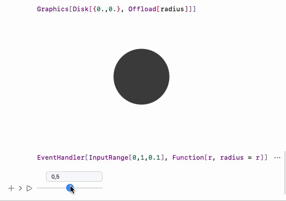

Let us start from the simplest stuff

## Quick and Dirty
Create a new cell, then, define a function inside `core` [context](interpreter/Advanced/architecture.md)

```js
.js
core.MyFunction = async (args, env) => {
	const data = await interpretate(args[0], env);
	alert(data);
}
```

then, to call it directly from Wolfram Kernel use

```mathematica
MyFunction["Hello World!"] // FrontSubmit;
```

or in the cell's output

```mathematica
CreateFrontEndObject[MyFunction["Hello World!"]]
```

it should produce a pop-up message with a given text.

## Deeper look
Firstly one need to understand the way how it was called. There are a few different ways

- direct calls as it is
- indirect using containers

The first one is rather straightforward, where basically most UI functions and core built-in functions are written.

### Simple direct call
As simple as that


A called function has no persistent memory (call and forget) except from the `env` variable, which can share the data with other functions from the subtree - see more in [architecture](interpreter/Advanced/architecture.md) (Meta Data). 

__Any defined functions must return javascript object or nothing__
While in the arguments `args` it is always Wolfram Expression, therefore use `interpretate` on them to convert anything into javascript data type.

For example, `env` comes very handy working with graphics

```js
core.RGBColor = async (args, env) => {
	const r = await interpretate(args[0], env);
	const g = await interpretate(args[1], env);
	const b = await interpretate(args[2], env);
	//modify env
	env.color = new whatever.Color(r, g, b);

	//return for the case if it is used directly
	return env.color 
};
```

where `core.RGBColor` can be called somewhere in the list

```mathematica
{Blue[], {Red[], Sphere[] (*i am red*)}, Cuboid[] (*i am blue*)} // Graphics3D
```

Then in the parent function

```js
core.Graphics3D = async (args, env) => {
	...
	var scene = {};
	await interpretate(args[0], {...env, scene: scene});
	//go to subthree
	rendered.add(scene) //all objects are there!
}

core.Sphere = async (args, env) => {
	...
	env.scene.add(new sphere(color: env.color));
}
```

Therefore the desired data will anyway ended up in the scene. This is a power of pointers. 

##### 🎡 Example 1: Game of Life
To get more fun, let us firstly define some supporting structures

Create a new cell with the following code
```js title="cell 1"
.js
//create js canvas
const canvas = document.createElement("canvas");
canvas.width = 400;
canvas.height = 400;

let context = canvas.getContext("2d");
context.fillStyle = "lightgray";
context.fillRect(0, 0, 500, 500);

//an array to store the previous state
let old = new Array(40);
for (let i = 0; i < old.length; i++) {
  old[i] = new Array(40).fill(0); 
}

//a function to draw on it
core.MyFunction = async (args, env) => {
  const data = await interpretate(args[0], env);

  //draw our boxes
  for(let i=0; i<40; ++i) {
    for (let j=0; j<40; ++j) {
      //old pixels will leave blue traces
      if (old[i][j] > 0) {
        context.fillStyle = "rgba(0,0,255,0.2)"; 
        context.fillRect(i*10 + 2, j*10 + 2, 6, 6);
      }
      //new pixels
      if (data[i][j] > 0) {
        context.fillStyle = "rgba(255,0,0,0.4)"; 
        context.fillRect(i*10 + 1, j*10 + 1, 8, 8);
      } else {
        context.fillStyle = "rgba(255,255,255,0.4)"; 
        context.fillRect(i*10 + 1, j*10 + 1, 8, 8);
      }
      
      //store the previous frame
      old[i][j] = data[i][j];
    }
  }
}

return canvas
```

This function will draw a 40x40 array of 1 and 0 pixels inside the page. Let us try to it out on some typical cellular automata like Game of Life

```mathematica title="cell 2"
gameOfLife = {224, {2, {{2, 2, 2}, {2, 1, 2}, {2, 2, 2}}}, {1, 1}};
board = RandomInteger[1, {40, 40}];
Do[
	board = CellularAutomaton[gameOfLife, board, {{0, 1}}] // Last;
	MyFunction[board] // FrontSubmit;
	Pause[0.1];
, {i,1,100}]
```

What it does is shown on the gif below, however you can try it by yourself by openning `GOL.wln` from the examples folder.

:::note
See more about JS cells in [Cell types](Cell%20types.md)
:::

Of course this is not the best example of making animations, better will be to let js run the animation on its own and wait for a new data or ask for a new data using system of events.

#### A remark about sub symbols | Methods
Sometimes a function or a tree of them is called as a responce on some event. Then this information is stored in `env.method` - see also [symbols](../../../../interpreter/Advanced/symbols.md)

If there is an update of a data, i.e. `env.method = 'update'`, then interpreter will try to find a sub-symbols or a function (read more about how interpreter handles them [WLJS Interpreter](https://github.com/JerryI/wljs-interpreter)). 


Imagine if any defined function was a class declaration with a constructor and methods (subsymbols)

```js
core.MyFunction = (args, env) => {}

core.MyFunction.update = (args, env) => {}
core.MyFunction.destroy = (args, env) => {}
core.MyFunction.whatever = (args, env) => {}
```

Then, can we want to specify it during the evaluation of a symbol

```js
core.OurParentFunction = (args, env) => {
	const data = interpetate(args[0], {...env, method:'update');
	...
}
```

It is extremely useful, when it comes to the updates of some graph, plot. There is no need to redraw everything, but perform some lightweight operations

```js
core.ListLinePlotly = (args, env) => {
	//create element...draw axes and etc...SLOW
	Plotly.newPlot(...);
}
core.ListLinePlotly.update = (args, env) => {
	//quickly redraw changed elements
	Plotly.animate(...) or extend...
}
```

__Destroy and update methods are usually features of [Containers](#Containers%20Executables)__

#### Contexts
To prevent the mess of duplicated function names and etc, you can specify the context or let's say library of symbols using

```js
var library = {};
library.name = "It is important to write a name"
interpretate.extendContext(library);

library.Symbol = (args, env) => {/*...*/}
```

The interpreter will check all available contexts and __use the first match__. However, you **can prioritize the context** providing the information in `env` object

```js
core.GrantSymbol = (args, env) => {
	const data = interpretate(args, {...env, context: library});
	//...
	//first match should be in `library` object
}
```

If you have multiple prioritized contexts, you __can pass them as an array__

```js
core.GrantSymbol = (args, env) => {
	const data = interpretate(args, {...env, context: [library1, library2]});
	//...
	//first match should be in `library1` object, if not
	//then in `library2`, if not, then in `core` context
}
```

### Containers | Virtualization
Each time interpreter faces a container it creates an unique object, that scopes `env` variable and provides local memory for all tree of Wolfram Expressions located inside the container. 

An interpreter can automatically create a container for any WLJS symbols, when it sees a special property defined

```js
core.MySymbol.virtual = true
```

then `MySymbol` takes all benefits of containers even if it was called anonymously from [FrontSubmit](frontend/Reference/Frontend%20IO/FrontSubmit.md). However, it can also be done manually using [FrontEndVirtual](frontend/Reference/Interpreter/FrontEndVirtual.md) wrapper

Most importantly containers or executables can be destroyed or updated (see [A remark about sub symbols Methods](#A%20remark%20about%20sub%20symbols%20Methods)) unlike expressions under normal evaluation. 

Another feature is that it automatically binds to a child container, which allows to reevaluate expressions from the parent container once a change was made to a child. 

The last one is a fundament for [Dynamics](frontend/Dynamics.md)

#### Properties
Containerized execution provides much more flexibility since each call creates a separate instance with its local memory.

For the convenience all extra features are provided in `env` variable

```js
core.MyFunction = (args, env) => {
	env.local  = {} //pointer to the local memory of the instance
	env.global      //pointer to the global memory of the call tree
	env.exposed     //pointer to the memory outside the instance
	env //sharable memory within the instance
}
```

Global memory is created at each widget creating in the cell editor or scope of [FrontSubmit](frontend/Reference/Frontend%20IO/FrontSubmit.md). Local memory is scoped for each instance.

Depending, where it is supposed to be executed, one can have an access to various page elements. For instance, if it is called from the editor it provides `env.element` - an access to DOM placeholder in the editor or a DOM placeholder on a [Slide](frontend/Cell%20types/Slides.md)

__Let's make an example that can demonstrate local memory usage__

For example [Sphere](frontend/Reference/Graphics3D/Sphere.md), [Line](frontend/Reference/Graphics/Line.md) are virtual function or symbols, since for each instance of a `Sphere` we need to store its data, position in order to be able to update them correctly and couple to dynamic symbols.

##### 🎡 Example 2: Clocks

```js
.js
core.PlaceholderClock = async (args, env) => {
	//store the handler object in the local memory
	env.local.start = new Date();
	env.local.clock = setInterval(()=>{
		const d = (new Date() - env.local.start);
		env.element.innerHTML = d;
	}, 10);
}
//when our instance is about to be destoryed - clear timer
core.PlaceholderClock.destroy = async (args, env) => {
	window.clearInterval(env.local.clock);
	const passed = (new Date() - env.local.start);
	alert(passed+' passed');
}

core.PlaceholderClock.virtual = true
```

Then we can execute in inside on the frontend using [ViewBox](frontend/Reference/Formatting/Low-level/ViewBox.md) or  [CreateFrontEndObject](frontend/Reference/Frontend%20Objects/CreateFrontEndObject.md)

```mathematica
CreateFrontEndObject[PlaceholderClock[]]
```

Try to copy and paste them into the same or different cells (from the output cell)


This examples intersects with the section [Default methods](#Default%20methods), since it involves `destroy` subsymbol, which is fired when one deletes a widget from the editor.

It comes very handy, when, for example we are working with `Graphics3D`, where every 1/60 of a second a rendering function is called. Imagine, it would be a disaster if one deleted a widget, but the rendering function __would still continue to work__. 

Therefore `env.local` helps a lot

```js
core.Graphics3D.destroy = async (args, env) => {
	cancelAnimationFrame(env.local.aid);
	//to cancel the animation
}
```

One can improve an example above by defining [StandardForm](frontend/Reference/Formatting/StandardForm.md) for our clocks

```mathematica
PlaceholderClock /: MakeBoxes[m_PlaceholderClock, StandardForm] := With[{
	o = CreateFrontEndObject[m]
},
	MakeBoxes[o, StandardForm]
]
```

```mathematica
PlaceholderClock[] (* no need in CreateFrontEndObject anymore *)
```

or __even better__ with less overhead coming from `CreateFrontEndObject`

```mathematica title="better solution"
PlaceholderClock /: MakeBoxes[m_PlaceholderClock, StandardForm] := ViewBox[m, m]
```

This approach will keep the original expression as well


#### Default methods
In principle user can define its own methods (or subsymbols) and provide them in `env.method` as a string. The general infromation was already mentioned before in [A remark about sub symbols Methods](#A%20remark%20about%20sub%20symbols%20Methods).

For the containers *you should define two most important methods* for you functions
- `.destory` - when a widget was destoryed. It acts from top to bottom
- `.update` - when the data was changed. It bubbles up and goes from the nearest parent of the call-tree

Otherwise if you even delete your widget from the editor (or just remove the cell) it wil cause an error. If you do not to mess with this, keep them empty

```js
core.MyFunction.update = async (args, env) => {}
core.MyFunction.destroy = async (args, env) => {}
```

#### A remark on Packed and Numeric arrays
Be aware, if you send some large chunks of numerical data Wolfram Kernel might use `PackedArray` instead of a plain `List` (even if you does not explicitly wrap it into `NumericArray`). Both of them are directly translated into `NumericArrayObject` in Javascript, which is a wrapper of `TypedArray`.

Therefore you should always check for this type

```js
const data = await interpretate(args[0], env); //get it

if (data instance of NumericArrayObject) {
	... process Typed Array
} else {
	... process normal Javascript Array
}
```

One can take advantage of `TypedArray` s since they are basically raw and flat memory regions, which is easy to process and store for Javascript or send it further to canvas or to a GPU (WebGL, WebGPU). A class wrapper contains several fields

```ts
class NumericArrayObject {
	dims : Array //dimensions of data
	buffer : TypedArray //actual data

	normal() : Array<Any> //converts back to a normal JS array
}
```

Typed arrays are widely used in [Graphics3D](frontend/Reference/Graphics3D/Graphics3D.md) primitives, [Image](frontend/Reference/Image/Image.md), [Audio](frontend/Reference/Sound/Audio.md) players and etc.

However, if you just want a normal `Array`, you can always convert simply by calling 

```js
let data = await interpretate(args[0], env); //get it

if (data instance of NumericArrayObject) {
	data = data.normal()
}

//works as usual
```

##### 🎡 Example 3: Game of Life (improvements)
Let us define our constructor 
```js
.js
//constructor
core.MyFunction = async (args, env) => {
  //just to make second object to be aware of the previous one
  //and fetch initial data
  let data = await interpretate(args[0], env);
  if (data instance of NumericArrayObject) {
	data = data.normal()
  }

  //create js canvas
  const canvas = document.createElement("canvas");
  canvas.width = 400;
  canvas.height = 400;

  let context = canvas.getContext("2d");
  context.fillStyle = "lightgray";
  context.fillRect(0, 0, 500, 500);

  //an array to store the previous state
  let old = new Array(40);
  for (let i = 0; i < old.length; i++) {
    old[i] = new Array(40).fill(0); 
  }

  env.element.appendChild(canvas);
  env.local.old = old;
  env.local.ctx = context;
}

core.MyFunction.virtual = true //enable containers
```

here this line

```js
const data = await interpretate(args[0], env);
```

is very important, even if we wont use `data` variable, to make the call-tree aware of the presence of other symbols to which we need to call at least `await interpretate(args[0], env);`.

Now we can store all data in `env.local`, that belongs to our instance.

The next thing - a method, that allows us to update the canvas

```js
.js
core.MyFunction.update = async (args, env) => {
  //get a new data
  let data = await interpretate(args[0], env);
  if (data instance of NumericArrayObject) {
	data = data.normal()
  }
  //get the canvas from the local memeory
  const context = env.local.ctx;
  //draw our boxes
  for(let i=0; i<40; ++i) {
    for (let j=0; j<40; ++j) {
      //old pixels will leave blue traces
      if (env.local.old[i][j] > 0) {
        context.fillStyle = "rgba(0,0,255,0.2)"; 
        context.fillRect(i*10 + 2, j*10 + 2, 6, 6);
      }
      //new pixels
      if (data[i][j] > 0) {
        context.fillStyle = "rgba(255,0,0,0.4)"; 
        context.fillRect(i*10 + 1, j*10 + 1, 8, 8);
      } else {
        context.fillStyle = "rgba(255,255,255,0.4)"; 
        context.fillRect(i*10 + 1, j*10 + 1, 8, 8);
      }
    }
  }
  //store the previous frame
  env.local.old = data;
}
```

and the destructor

```js
.js
core.MyFunction.destroy = (args, env) => {}
```


Then we can use our function with some dynamic symbols using [Offload](frontend/Reference/Interpreter/Offload.md) wrapper

```mathematica
gameOfLife = {224, {2, {{2, 2, 2}, {2, 1, 2}, {2, 2, 2}}}, {1, 1}};
board = RandomInteger[1, {40, 40}];

MyFunction[board] // CreateFrontEndObject
```

The output will look like this


Now this is separate object, __you can copy and paste it as a symbol__! 

By updating `board` symbol we cause `.update` method to be called

```mathematica
Do[
  board = CellularAutomaton[gameOfLife, board, {{0, 1}}] // Last;
  Pause[0.1];
, {i,1,100}]
```

Then you will see a nice animation and each instance you copied will be updated as well


#### Dynamic symbols
Any defined Wolfram Language symbol with `OwnValue` like

```mathematica
radius = 1;
```

being wrapped into [Offload](frontend/Reference/Interpreter/Offload.md) automatically creates `core.radius` __virtual symbol__

```mathematica
Graphics[Disk[{0.,0.}, Offload[radius]]]
```

::info
Wolfram Kernel __tracks any changes of own-values__.
::

Since [Disk](frontend/Reference/Graphics/Disk.md) is also a __virtual symbol__, then two instances created for `Disk` and `radius` will be coupled together, i.e.

```mathematica
EventHandler[InputRange[0,1,0.1], Function[r, radius = r]]
```

will cause `.update` method to be called on `Disk` at any changes of `radius`




### Injection into the container's instance/env
Can be very handy if one want to append new objects to a 2D or 3D scene without reevaluating anything. This is anyway a somewhat `env.scene` object, that it principle can be populated with new graphics in realtime. 

For that one need to attach to some particular instance and evaluate inside it the desired expression with new data. This can be done using [FrontInstanceReference](frontend/Reference/Frontend%20IO/FrontInstanceReference.md) and [FrontSubmit](frontend/Reference/Frontend%20IO/FrontSubmit.md)

#### 🎡 Example with lines
Let us define some typical plot and add new object on it

```mathematica
ref = FrontInstanceReference[];
Plot[x, {x,0,1}, Epilog->{ref}]
```

This will generate `Graphics` object and place an invisible reference on it, which will store the instance `uid` of this frontend object.

Now we can apply a selector query and place a new expression (or lets say - evaluate in-place) inside the given container

```mathematica
FrontSubmit[Line[{{0.2,0.6},{0.1,0.5}}], ref]
```

:::tip
Consider to read [FrontSubmit](frontend/Reference/Frontend%20IO/FrontSubmit.md) and [FrontInstanceReference](frontend/Reference/Frontend%20IO/FrontInstanceReference.md)
:::

