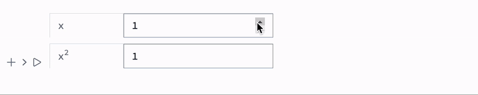

Here we will highlight a few methods for communication with Javascript

:::note
See also [WLJS Functions](frontend/Advanced/Frontend%20interpretation/WLJS%20Functions.md)
:::

## Direct call
Let us define our dummy function

```js title="cell 1"
.js
core.MyFunction = async (args, env) => {
  const data = await interpretate(args[0], env);
  alert(data);
}
```

then the fastest and most direct way of calling it is using [FrontSubmit](frontend/Reference/Frontend%20IO/FrontSubmit.md)

```mathematica title="cell 2"
FrontSubmit[MyFunction["Hello World!"]]
```

or chaining it with some other WLJS function

```mathematica
FrontSubmit[MyFunction[ReadClipboard[]]]
```

## Execution in a cell
So-called [FrontEndExecutable](frontend/Reference/Frontend%20Objects/FrontEndExecutable.md) gives a DOM element our function because of their [StandardForm](frontend/Reference/Formatting/StandardForm.md) is defined like that. This is the easiest way

```js title="cell 1"
.js

core.MyFunction2 = async (args, env) => {
  const data = await interpretate(args[0], env);
  env.element.innerHTML = `<span style="color:red">${data}</span>`;
}
```

Now we can call it from our cell

```mathematica title="cell 2"
CreateFrontEndObject[MyFunction2["Hello World!"]]
```

it behaves like a symbol.

:::tip
You don't have to always use [CreateFrontEndObject](frontend/Reference/Frontend%20Objects/CreateFrontEndObject.md). It is possible to force Wolfram Kernel to apply it automatically on output using [MakeBoxes](frontend/Reference/Formatting/MakeBoxes.md) or use [ViewBox](frontend/Reference/Formatting/Low-level/ViewBox.md) directly i.e.

```mathematica
MyFunction2 /: MakeBoxes[m_MyFunction2, StandardForm] := (
	ViewBox[m, m]
)
```
:::

__This is basically how [Graphics](frontend/Reference/Graphics/Graphics.md) and others are implemented.__

## Data fetching
A back communication is also possible

```js title="cell 1"
.js

core.MyFunction3 = async (args, env) => {
  return [1,2,3,4,5,6];
}
```

and to read it synchronously

```mathematica title="cell 2"
FrontFetch[MyFunction3[]]
```

or asynchronously

```mathematica title="cell 2"
Then[FrontFetchAsync[MyFunction3[]], Function[data, Print[data]]]
```

## Server IO
We can call any WL function using [Events](frontend/Reference/Misc/Events.md) system

### API
#### Standard way with payload
We use this pattern 90% of the time for many UI blocks

```js title="cell 1"
.js

const button = document.createElement('button');
button.innerText = "Press me";

button.addEventListener('click', () => {
  server.kernel.io.fire('eventUid', true);
});

return button;
```

Now we can capture it using

```mathematica title="cell 2"
EventHandler["eventUid", Print]
```

Or for a specific pattern

```js title="cell 1"
.js

const button = document.createElement('button');
button.innerText = "Press me";

button.addEventListener('click', () => {
  server.kernel.io.fire('eventUid', true, 'pattern 1');
});

return button;
```

```mathematica title="cell 2"
EventHandler["eventUid", {"pattern 1" -> Print}]
```


#### Fastest way no payload
If you need just to fire an event without a payload, there is a special way

```js title="cell 1"
.js

const button = document.createElement('button');
button.innerText = "Press me";

button.addEventListener('click', () => {
  server.kernel.io.poke('eventUid');
});

return button;
```

```mathematica title="cell 2"
EventHandler["eventUid", Print]
```

#### Fetch a symbol
Firstly define a symbol

```mathematica title="cell 1"
GetTime := TextString[Now];
```

now we fetch it and display

```js
.js

const dom = document.createElement('span');

server.kernel.io.fetch('GetTime').then(async (res) => {
  dom.innerHTML = await interpretate(res, {});
})

return dom;
```

:::info
Return `Promise` object to defer *io* fetch request, i.e.

```mathematica
GetTime := With[{p = Promise[]},
	(* do something or set a scheldule, call external *)
	p 
]
```

:::

#### Fire event and fetch the result
WLJS event system provides extra features to mimic full-duplex architecture. If one fires and event, it is possible to read the results of all subscribed listeners (if provided) or their handler functions

```mathematica
EventHandler[ev, Function[dataA,
	(* do something *)
	Return[dataB] (* <--- here *)
]]

EventHandler[ev // EventClone, Function[dataA,
	(* do something *)
	Return[dataC] (* <--- here *)
]]


EventFire[ev, ...] (* ---> {dataB, dataC} *)
```

Here is an example with Javascript

```js title="cell 1"
.js

const button = document.createElement('button');
button.innerText = "Press me";
button.style.background = "pink";
button.style.padding = "1rem";

button.addEventListener('click', async () => {
  const data = await server.kernel.io.request('eventUid', true);
  button.innerHTML = await interpretate(data, {});
});

return button;
```

```mathematica title="cell 2"
EventHandler["eventUid", Function[Null,
  RandomWord[]
]]
```

:::note
Return `Promise` if you need to do some deferred calculations. 
:::

## Custom UI component
Using JS one can craft its own UI components. For example

```js title="cell 1"
.js

core.MyCustomComponent = async (args, env) => {
  const label = await interpretate(args[0], env);
  const ev = await interpretate(args[1], env);
  
  const button = document.createElement('button');
  button.innerText = label;
  button.style.backgroundColor = "lightblue";

  button.addEventListener('click', () => {
    server.kernel.io.fire(ev, true);
  });

  env.element.appendChild(button);
}
```

Now we can make boxes for it

```mathematica title="cell 2"
MyCustomComponent /: MakeBoxes[m_MyCustomComponent, StandardForm] := With[{},
  ViewBox[m, m]
]
```

In action

```mathematica title="cell 3"
MyCustomComponent["Click me pls", "event1"]
EventHandler["event1", Print];
```

### Integrating with standard inputs
It is much easier to work with [`EventObject`](frontend/Reference/Misc/Events.md#`EventObject`)

```mathematica title="cell 3"
ClearAll[MyCustomComponent]

MyCustomInput[label_String] := With[{uid = CreateUUID[]},
  EventObject[<|"Id"->uid, "View"->MyCustomComponent[label, uid]|>]
]
```

in action it behaves similar to [InputRange](frontend/Reference/GUI/InputRange.md) and etc

```mathematica title="cell 4"
EventHandler[MyCustomInput["Click me"], Print]
```

### Using WLX
It is much easier to write markup in [WLX](frontend/Cell%20types/WLX.md) compared to JS

```jsx title="cell 1"
.wlx

MyCustomComponent2[OptionsPattern[]] := With[{
  Event = OptionValue["Event"],
  Label = OptionValue["Label"],
  Uid = CreateUUID[]
},
  <div>
    <button id="{Uid}" style="background: lightblue" class="p-1">
      <Label/>
    </button>
    <script type="module">
      document.getElementById('<Uid/>').addEventListener('click', () => {

          server.kernel.io.fire('<Event/>', true);
      })
    </script>
  </div>
]

Options[MyCustomComponent2] = {"Event" -> "", "Label" -> "Click me"};
```

In action

```mathematica title="cell 2"
MyCustomComponent2["Event"->"test", "Label"->"Hello World!"] // WLXEmbed
EventHandler["test", Print];
```

or combining with a previous technic 

```mathematica title="cell 2"
MyCustomInput2[label_String] := With[{uid = CreateUUID[]},
  EventObject[<|"Id"->uid, "View"-> HTMLView[MyCustomComponent2["Label"->label, "Event"->uid]]|>]
]
```

You can use it as a normal input element

```mathematica title="cell 3"
EventHandler[MyCustomInput2["Click me"], Print]
```

#### Side effects
To call another function __after an elements was drawn__ see [HTMLView](frontend/Reference/GUI/HTMLView.md) page. See below


### Using WLX + 2 ways binding
It is also possible to combine your custom input element with traditional [Dynamics](frontend/Dynamics.md). For instance you want to create multiple input fields, which are synchronised  with each other. Therefore you need a [WLJS Functions](frontend/Advanced/Frontend%20interpretation/WLJS%20Functions.md) with `update` methods defined. One can generate those on-fly for each input element within a WLX script

```jsx
.wlx

CustomInput[sym_, OptionsPattern[]] := Module[{
  Label = OptionValue["Label"],
  Ev = OptionValue["Event"],
  Pattern = OptionValue["Pattern"],
  Handler
},

  With[{Template = 
    <div class="mt-2 flex">
      <div style="width: 7rem" class="flex shrink-0 items-center rounded-l-md bg-white px-3 text-base text-gray-500 outline outline-1 -outline-offset-1 outline-gray-300 sm:text-sm/6"><Label/></div>
      <input type="number" step="1" class="-ml-px block w-full grow rounded-r-md bg-white px-3 py-1.5 text-base text-gray-900 outline outline-1 -outline-offset-1 outline-gray-300 placeholder:text-gray-400 focus:outline focus:outline-2 focus:-outline-offset-2 focus:outline-indigo-600 sm:text-sm/6" placeholder="0.0"/>
    <script type="module">
      core['<Handler/>'] = async (args, env) => {
        const input = env.element.getElementsByTagName('input')[0];


        const data = await interpretate(args[0], env);
        input.value = +data.toFixed(4);
        env.local.input = input;

        input.addEventListener('change', () => {
          
          console.warn(input.value);
          env.local.skip = true;
          server.kernel.io.fire('<Ev/>', Number(input.value), '<Pattern/>');
        });        
      }

      core['<Handler/>'].update = async (args, env) => {
        if (env.local.skip) {
          env.local.skip = false;
          return;
        }
        
        console.log('Update');
        env.local.input.value = +(await interpretate(args[0], env)).toFixed(4);
      }

      core['<Handler/>'].destroy = () => {
        delete core['<Handler/>'];
      }

      core['<Handler/>'].virtual = true;
    </script>
  </div>
  },
    HTMLView[Template, Epilog->(Handler[sym])]
  ]
]

Options[CustomInput] = {"Label"->"", "Event"->"", "Pattern"->"Default"};
```

what happens here:

1. we define a template for our custom input field
2. we define a support script with a generated `Handler` function, which reads and updates this input field
3. we pack in into [HTMLView](frontend/Reference/GUI/HTMLView.md), which calls our `Handler` on a provided argument after this component has been mounted

Let's see it in action

```mathematica @
values = {1,1};

event = CreateUUID[];

EventHandler[event, {
  "x" -> Function[val,
    values = {val, (*SpB[*)Power[val(*|*),(*|*)2](*]SpB*)} // N;
  ],

  "x2" -> Function[val,
    values = {(*SqB[*)Sqrt[val](*]SqB*), val} // N // Re;
  ]
}]

{
  CustomInput[values[[1]] // Offload, "Event"->event, "Pattern"->"x", "Label"->"x"],
  CustomInput[values[[2]] // Offload, "Event"->event, "Pattern"->"x2", "Label"->"x<sup>2</sup>"]
} // Column
```



### Emit event from WLJS
One can fire an event also using frontend's function `EventFire`, which is effectively acts like `server.kernel.io.fire` being called from the WLJS Interpreter (i.e. using [FrontSubmit](frontend/Reference/Frontend%20IO/FrontSubmit.md) or other and wrapped in [Offload](frontend/Reference/Interpreter/Offload.md))

:::danger
Not implemented! PR
:::

```mathematica
EventHandler["internalEvent", Print];
FrontSubmit[EventFire["internalEvent", ReadClipboard[]] // Offload]
```

It will send an expression to be executed on the frontend, that reads a clipboard and fires back an event with a fetched data.

