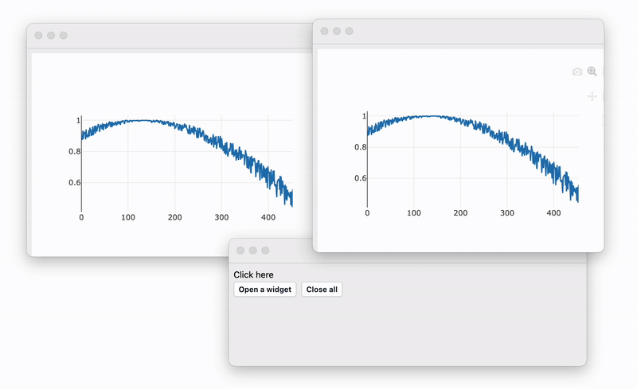

# Multi-window App

import { WLJSHTML, WLJSEditor, WLJSStore } from "@site/src/components/wljs-notebook-react";

:::note
See more about the structure of mini-apps at [Mini Apps](frontend/Exporting/Mini%20Apps.md) page. 
:::

In this example, we create a simple multi-window app that tracks and broadcasts data to its child windows.

As an example, we use `Plotly` to display rapidly changing data in each opened window. For flexibility, we use the WLX type of cell to have more flexible styling options.

<WLJSHTML>{`%3Cdetails%20%3E%3Csummary%20%3EAs%20a%20reminder%3C%2Fsummary%3E%0A%0A%20%20When%20you%20export%20a%20notebook%20as%20mini-app%20and%20run%20it%3A%0A%0A%20%201.%20Only%20initialization%20cells%20will%20be%20evaluated%0A%20%202.%20Default%20context%20is%20randomly%20generated%0A%20%203.%20The%20last%20input%20cell%20will%20be%20evaluated%20and%20the%20result%20will%20become%20the%20first%20window%20of%20an%20app%0A%3C%2Fdetails%3E`}</WLJSHTML><WLJSHTML>{`%3Cbr%20%2F%3E`}</WLJSHTML>

### App Logic

We simulate a process by creating a timer that generates a noisy sinusoidal signal.

<WLJSStore json={require('./attachments/7985ca69-abc8-4429-83a5-86b12828f55f.txt').default} notebook={require('./attachments/notebook-798.wln').default}/>

<WLJSEditor display={"codemirror"} nid={"7985ca69-abc8-4429-83a5-86b12828f55f"} id={"bcb5f118-438b-41ba-9a8b-8a827b9f2564"} type={"Input"} opts={{"InitGroup":true}} >{`generator%20%3A%3D%20Sin%5B0.1%20AbsoluteTime%5B%5D%20%2B%200.1%20RandomReal%5B%7B-1%2C1%7D%5D%5D%3B%0A%0Astate%20%3D%20%7B%7D%3B%0AIf%5BScheduledTaskActiveQ%5Btask%5D%2C%20TaskRemove%5Btask%5D%5D%3B%0A%0Atask%20%3D%20SetInterval%5B%0A%20%20With%5B%7Bitem%20%3D%20generator%7D%2C%0A%20%20%20%20AppendTo%5Bstate%2C%20item%5D%3B%0A%20%20%20%20handler%5Bstate%5D%3B%0A%20%20%5D%3B%0A%2C%2030%5D%3B`}</WLJSEditor>

Now we define a handler function, which uses a pool of active `PlotlyInstance` objects and broadcasts new data points to all.

<WLJSEditor display={"codemirror"} nid={"7985ca69-abc8-4429-83a5-86b12828f55f"} id={"530b3f6d-3fd1-47c1-9082-20e0a7dee047"} type={"Input"} opts={{"InitGroup":true}} >{`pool%5B%22Data%22%5D%20%3D%20%7B%7D%3B%0Apool%5B%22Push%22%2C%20el_%5D%20%3A%3D%20pool%5B%22Data%22%5D%20%3D%20Append%5Bpool%5B%22Data%22%5D%2C%20el%5D%3B%0Apool%5B%22Remove%22%2C%20el_%5D%20%3A%3D%20pool%5B%22Data%22%5D%20%3D%20pool%5B%22Data%22%5D%20%2F.%20el%20-%3E%20Nothing%3B%0A%0Ahandler%5Bstate_%5D%20%3A%3D%20PlotlyExtendTraces%5B%23%2C%20%0A%20%20%20%20%3C%7C%22y%22%20-%3E%20%7B%7Bstate%20%2F%2F%20Last%7D%7D%7C%3E%2C%20%7B0%7D%0A%5D%20%26%2F%40%20pool%5B%22Data%22%5D%3B%0A%0Awindows%20%3D%20%7B%7D%3B`}</WLJSEditor>

Now let's design our child window. It will an extremely basic layout with a single `Plotly` inset. We return both:

- template
- `PlotlyInstance`

<WLJSEditor display={"codemirror"} nid={"7985ca69-abc8-4429-83a5-86b12828f55f"} id={"d1ad8015-52ed-45f2-9304-c5aa2808f208"} type={"Input"} opts={{"InitGroup":true}} >{`.wlx%0A%0ASecondWidget%5Binitial_%5D%20%3A%3D%20With%5B%7B%0A%20%20PlotlyInstance%20%3D%20Plotly%5B%3C%7C%0A%20%20%20%20%22y%22%20-%3E%20initial%2C%20%0A%09%22type%22%20-%3E%20%22line%22%20%0A%20%20%7C%3E%5D%0A%7D%2C%0A%0A%20%3C%7C%0A%20%20%22View%22%20-%3E%20%28%0A%20%20%20%20%3Cdiv%20class%3D%22px-2%20py-2%22%3E%0A%20%20%20%20%20%20%3CPlotlyInstance%2F%3E%0A%20%20%20%20%3C%2Fdiv%3E%0A%20%20%29%2C%0A%20%20%22Plotly%22%20-%3E%20PlotlyInstance%0A%20%7C%3E%0A%5D`}</WLJSEditor>

## Main Window

To create a new window, we use `CellPrint`. Yes, it's a function that prints cell content with an option to print outside the notebook to a new window. The architecture of windows and cells is quite similar; therefore, we decided not to invent new abstractions.

It is important to note that you need to provide the `Notebook` object to a `CellPrint` function, since it is evaluated externally by a button click (lambda-like call). In this sense, it is no longer connected with the evaluation context of an app.

<WLJSEditor display={"codemirror"} nid={"7985ca69-abc8-4429-83a5-86b12828f55f"} id={"739e1642-fba3-4330-b66b-f7ca2424f869"} type={"Input"} opts={{}} >{`CellPrint%5B%22Hey%21%22%2C%20%22Display%22-%3E%22html%22%2C%20%22Target%22-%3E_%5D`}</WLJSEditor>

The main window contains only two buttons:
- One creates a window.
- The second closes all.

We subscribe to the `RemoteWindowObj` returned by `CellPrint` to track opened and closed windows and add or remove our Plotly instances from the pool.

*This cell has to be the last one in the notebook*
<WLJSEditor display={"codemirror"} nid={"7985ca69-abc8-4429-83a5-86b12828f55f"} id={"72698059-117f-4b5b-88c3-109f34affc78"} type={"Input"} opts={{}} >{`.wlx%0A%0AWith%5B%7B%0A%20%20Btn1%20%3D%20InputButton%5B%22Open%20a%20widget%22%5D%2C%0A%20%20Btn2%20%3D%20InputButton%5B%22Close%20all%22%5D%2C%0A%20%20notebook%20%3D%20EvaluationNotebook%5B%5D%0A%7D%2C%0A%0A%20%20EventHandler%5BCurrentWindow%5B%5D%2C%20%7B%22Closed%22%20-%3E%20Function%5BNull%2C%0A%20%20%20%20TaskRemove%5Btask%5D%3B%0A%20%20%5D%7D%5D%3B%0A%0A%20%20EventHandler%5BBtn2%2C%20Function%5BNull%2C%0A%20%20%20%20Delete%20%2F%40%20windows%3B%0A%20%20%20%20windows%20%3D%20%7B%7D%3B%0A%20%20%5D%5D%3B%0A%0A%20%20EventHandler%5BBtn1%2C%20Function%5BNull%2C%0A%20%20%20%20With%5B%7Binstance%20%3D%20SecondWidget%5Bstate%5D%7D%2C%0A%20%20%20%20%20%20With%5B%7Bwindow%20%3D%20CellPrint%5Binstance%5B%22View%22%5D%2C%20%22Display%22-%3E%22wlx%22%2C%20%22Notebook%22-%3Enotebook%2C%20%22Target%22-%3E_%2C%20ImageSize-%3E%7B600%2C400%7D%5D%7D%2C%0A%0A%20%20%20%20%20%20%20%20AppendTo%5Bwindows%2C%20window%5D%3B%0A%0A%20%20%20%20%20%20%20%20EventHandler%5Bwindow%2C%20%7B%0A%20%20%20%20%20%20%20%20%20%20%22Mounted%22%20-%3E%20Function%5BNull%2C%0A%20%20%20%20%20%20%20%20%20%20%20%20%20%20pool%5B%22Push%22%2C%20instance%5B%22Plotly%22%5D%5D%3B%0A%20%20%20%20%20%20%20%20%20%20%5D%2C%0A%0A%20%20%20%20%20%20%20%20%20%20%22Closed%22%20-%3E%20Function%5BNull%2C%0A%20%20%20%20%20%20%20%20%20%20%20%20%20%20pool%5B%22Remove%22%2C%20instance%5B%22Plotly%22%5D%5D%3B%0A%20%20%20%20%20%20%20%20%20%20%5D%0A%20%20%20%20%20%20%20%20%7D%5D%0A%20%20%20%20%20%20%5D%0A%20%20%20%20%5D%0A%20%20%5D%5D%3B%0A%0A%20%20%3Cdiv%20class%3D%22px-2%20py-2%20flex%20flex-col%22%3E%0A%20%20%20%20%3Cp%20class%3D%22text-sm%22%3EClick%20here%3C%2Fp%3E%0A%20%20%20%20%3Cdiv%20class%3D%22flex%20flex-row%20gap-x-2%22%3E%3CBtn1%2F%3E%3CBtn2%2F%3E%3C%2Fdiv%3E%0A%20%20%3C%2Fdiv%3E%0A%5D`}</WLJSEditor>

## Final result
Here is a link to download an exported app

[download](./../../../../Multiwindow-example.wlw)

The result:

