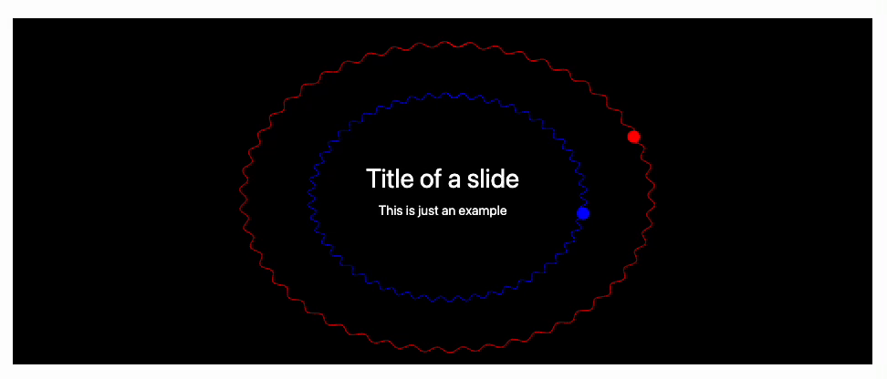

There is a few way on how you can put a background image for your slides

## Global settings
You can apply it for all slides by redefining `.reveal` class name

```html title="cell 1"
.wlx

<style>
  .reveal {
    background: black;
    color: white;
  }
</style>
```

now the default background is black

```jsx title="cell 2"
.slide

# Hey, I am Black!
```

:::warning
It will not work to a projected output cell
:::

## Local control
Using RevealJS data attributes, one can specify the background for each slide individually

```jsx
.slide

<!-- .slide: data-background-color="black" -->
<!-- .slide: style="color:white" -->

# Hey, I am black
```


## Dynamic background
One can put a giant [Graphics](frontend/Reference/Graphics/Graphics.md) or [Graphics3D](frontend/Reference/Graphics3D/Graphics3D.md) or [Image](frontend/Reference/Image/Image.md) element to the background of your slide. For this reason you need to add some CSS in order to position them properly with a content

:::note
The standard size of a slide is `960x700`
:::

Let us firstly make a draft

```mathematica title="cell 1"
BackImageDynamic := Graphics[{
  Black, Rectangle[{0,0}, {1,1}], Red,
  curveDynamicGenerator[{0.5,0.5}, 0.8], Blue,
  curveDynamicGenerator[{0.5,0.5}, 0.3]
}, Controls->False, ImagePadding->0, ImageSize->{960,700}, PlotRange->{{0,1}, {0,1}}];
```

here `curveDynamicGenerator` will be our animated fragment

```mathematica title="cell 2"
curveDynamicGenerator[center_, radius_] := With[{cell = ResultCell[]}, LeakyModule[{
  pts = Table[Norm[center - radius] {Sin[i], Cos[i]} +
         center, {i, 0, 2 Pi + 0.1, 0.1}],
         
  disk = {10,10},
  modulation = 0.,
  phase = 0.,
  initial = 12. RandomInteger[{0,10}],
  task
},
  task = SetInterval[
      pts = Table[(
        Norm[center - radius] 
        + 0.02 modulation Sin[50. i + 30 phase]
      ) {Sin[i], Cos[i]} + center
      , {i, 0, 2 Pi + 0.1, 0.01}];

      disk = With[{i = 3. phase + initial},
        (Norm[center - radius] 
        + 0.01 modulation Sin[50. i + 30 phase]
        ) {Sin[i], Cos[i]} + center
      ];

      phase = phase + 0.02;
      modulation = Sin[phase/2];
  , 50];

  (* remove task if cell has been destroyed *)
  EventHandler[cell, {"Destroy" -> Function[Null, Print["Removed"]; TaskRemove[task]]}];
  
  {Line[pts // Offload], Disk[disk // Offload, 0.013]}
]]
```

Since our animation is quite simple, therefore we use [`SetInterval`](frontend/Reference/Misc/Async.md#`SetInterval`) instead of frame-by-frame animation via [AnimationFrameListener](frontend/Reference/Graphics/AnimationFrameListener.md)

:::tip
To make sure that the slide heigh is `100%` of the window, add the attribute
```html
.slide

<!-- .slide: style="height:100%" -->
```
:::

In order to put it under the content, we need to use an absolute positioning 

```jsx
.slide

<!-- .element: data-background-color="black" -->
<!-- .slide: style="height:100%" -->

<div class="w-full h-full flex flex-col text-white">
  <div class="absolute w-full h-full" style="scale: 1.1; left:-30px; z-index:-100"><BackImageDynamic/></div>

<div class="mt-auto mb-auto">
    
  
# Title of a slide

This is just an example

</div>

</div>
```

The demonstration




